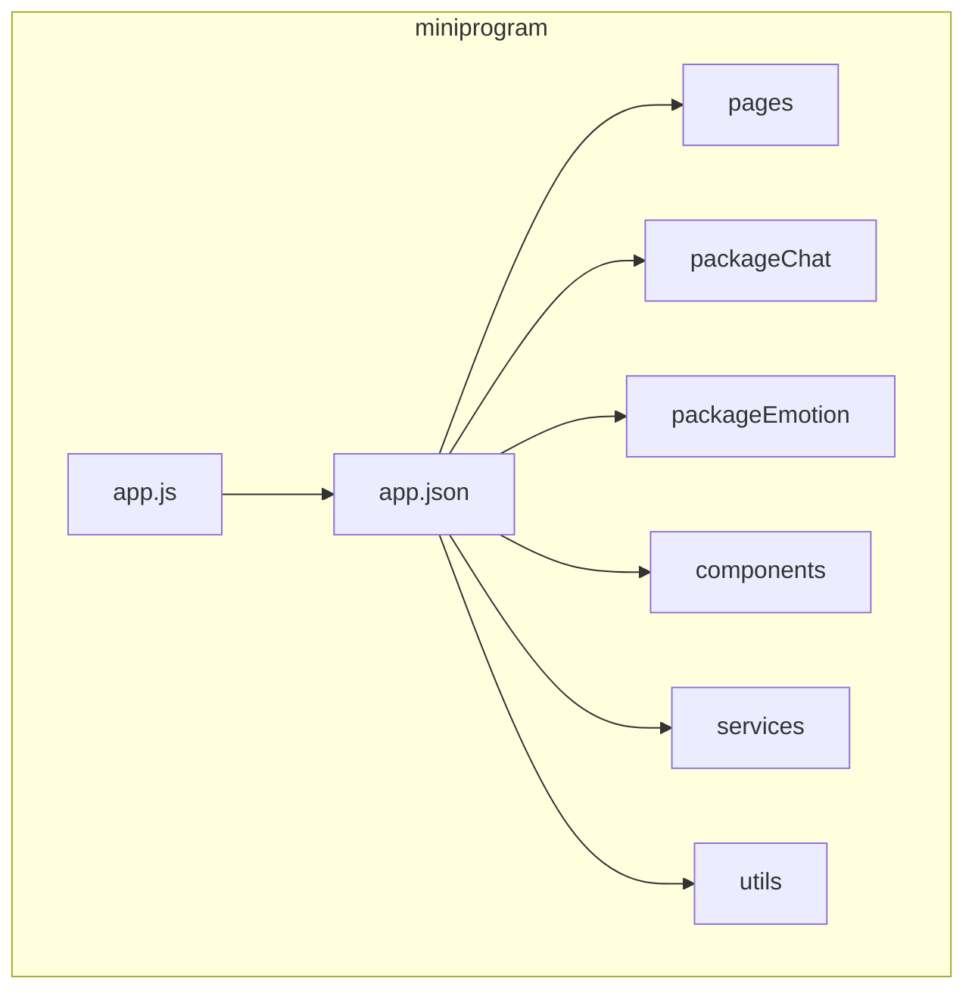
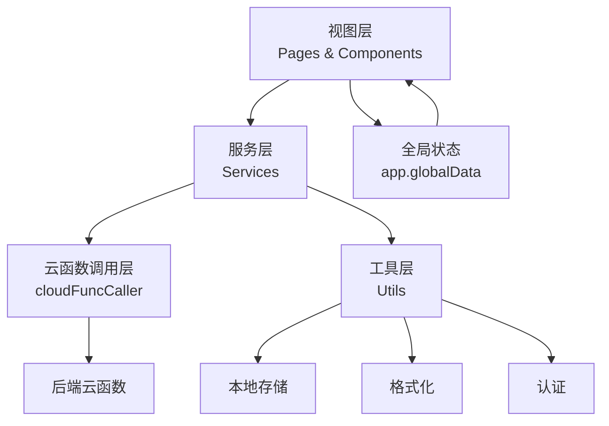
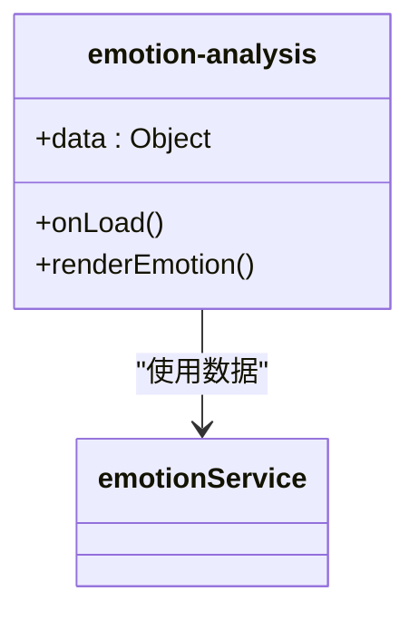
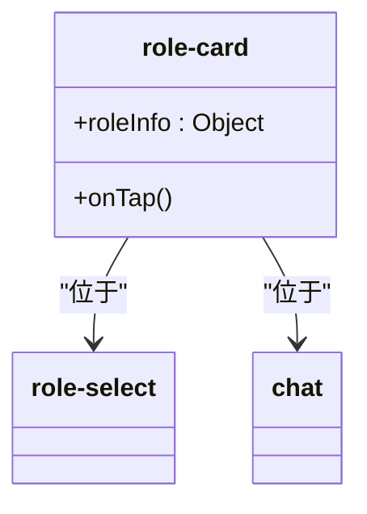
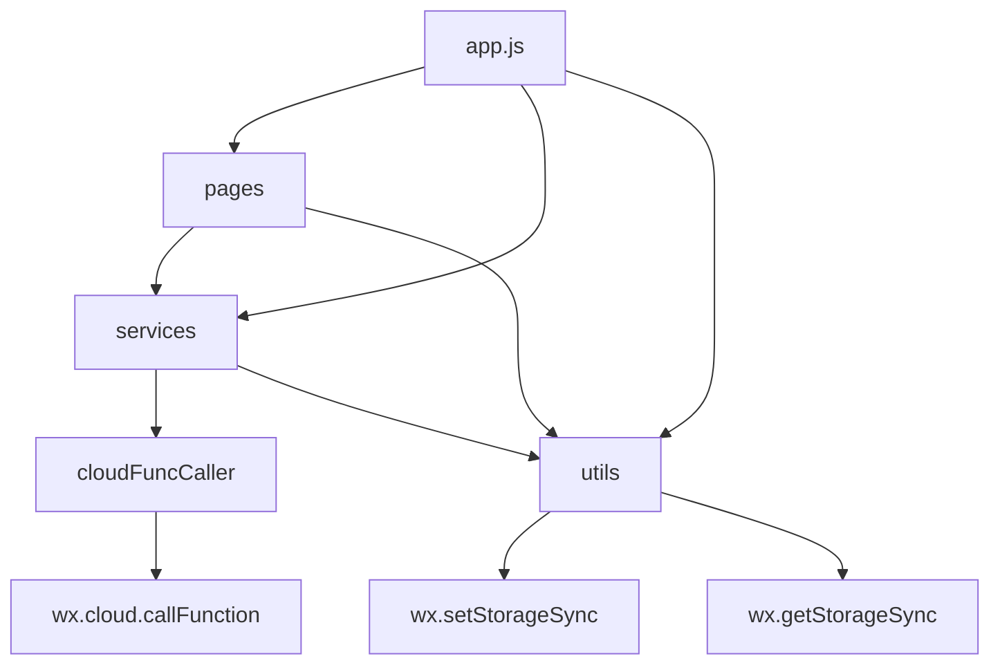

# 前端架构

<cite>
**本文档引用文件**  
- [app.js](file://miniprogram/app.js)
- [app.json](file://miniprogram/app.json)
- [cloudFuncCaller.js](file://miniprogram/services/cloudFuncCaller.js)
- [chatCacheService.js](file://miniprogram/services/chatCacheService.js)
- [emotionService.js](file://miniprogram/services/emotionService.js)
- [auth.js](file://miniprogram/utils/auth.js)
- [storage.js](file://miniprogram/utils/storage.js)
- [format.js](file://miniprogram/utils/format.js)
- [date.js](file://miniprogram/utils/date.js)
- [emotion-analysis.json](file://miniprogram/components/emotion-analysis/emotion-analysis.json)
- [role-card.json](file://miniprogram/components/role-card/role-card.json)
</cite>

## 目录
1. [简介](#简介)
2. [项目结构](#项目结构)
3. [核心组件](#核心组件)
4. [架构概览](#架构概览)
5. [详细组件分析](#详细组件分析)
6. [依赖分析](#依赖分析)
7. [性能考量](#性能考量)
8. [故障排除指南](#故障排除指南)
9. [结论](#结论)

## 简介
HeartChat 是一款专注于情绪陪伴与心理支持的小程序，其前端架构采用微信小程序原生框架，结合云开发能力，构建了模块化、可扩展的前端系统。本架构文档旨在全面解析其前端设计，涵盖页面路由、组件化模式、服务层抽象、工具类支持及数据流机制，帮助开发者深入理解系统运作原理。

## 项目结构
HeartChat 前端项目遵循清晰的分层结构，主要分为 `miniprogram` 根目录下的核心模块：
- **`pages`**: 主包页面，包含欢迎页、首页、角色选择页、用户页等核心功能。
- **`packageChat`**: 聊天功能分包，包含聊天主界面和情绪分析页面。
- **`packageEmotion`**: 情绪功能分包，包含每日心情报告和情绪历史页面。
- **`components`**: 全局可复用组件库，如 `emotion-analysis`、`role-card` 等。
- **`services`**: 服务层，封装业务逻辑，统一调用后端接口。
- **`utils`**: 工具类库，提供格式化、存储、认证等通用功能。
- **`config`**: 配置文件，集中管理环境变量。
- **`app.js` 和 `app.json`**: 小程序全局逻辑和配置文件。

这种分包策略有效控制了主包体积，实现了功能模块的解耦。

**图源**
- [app.json](file://miniprogram/app.json#L0-L85)

**本节来源**
- [app.json](file://miniprogram/app.json#L0-L85)

## 核心组件
HeartChat 的前端架构围绕核心组件和服务构建，实现了高内聚、低耦合的设计。
- **页面组件 (Pages)**: 负责用户界面展示和用户交互，通过数据绑定驱动视图更新。
- **UI 组件 (Components)**: 如 `emotion-analysis` 和 `role-card`，提供可复用的 UI 元素，通过 `properties` 接收外部数据，通过 `events` 向外抛出事件。
- **服务层 (Services)**: `chatCacheService`、`emotionService` 等，封装了与后端（云函数）的通信逻辑和本地数据处理，是业务逻辑的核心。
- **工具类 (Utils)**: `auth.js`、`storage.js` 等，提供跨模块的通用功能支持。

**本节来源**
- [app.js](file://miniprogram/app.js#L0-L39)
- [cloudFuncCaller.js](file://miniprogram/services/cloudFuncCaller.js#L0-L179)
- [chatCacheService.js](file://miniprogram/services/chatCacheService.js#L0-L298)

## 架构概览
HeartChat 前端采用典型的分层架构，从上至下分为视图层、服务层和工具层。视图层由页面和组件构成，通过事件与服务层交互。服务层作为中间枢纽，调用 `cloudFuncCaller` 统一与后端云函数通信，并利用 `utils` 提供的工具进行数据处理和状态管理。全局状态（如用户登录信息）通过 `app.js` 的 `globalData` 进行管理。

**图源**
- [app.js](file://miniprogram/app.js#L0-L39)
- [cloudFuncCaller.js](file://miniprogram/services/cloudFuncCaller.js#L0-L179)

## 详细组件分析
本节深入分析关键组件的实现与使用方式。

### UI 组件体系
HeartChat 的 UI 组件体系旨在提升开发效率和界面一致性。

#### emotion-analysis 组件
`emotion-analysis` 组件用于展示情绪分析结果。它通过 `properties` 接收分析数据（如情绪类型、强度、关键词），并渲染出相应的视觉元素（如颜色、图标、文字描述）。该组件不直接调用服务，其数据由父页面（如聊天页）通过服务层获取后传入。

**图源**
- [emotion-analysis.json](file://miniprogram/components/emotion-analysis/emotion-analysis.json#L0-L3)
- [emotionService.js](file://miniprogram/services/emotionService.js#L0-L799)

#### role-card 组件
`role-card` 组件用于展示角色信息卡片。它接收角色对象（`roleInfo`）作为 `properties`，并展示角色头像、名称、描述和性格标签。该组件通常用于角色选择页和聊天页，支持点击事件，用于选择或切换角色。

**图源**
- [role-card.json](file://miniprogram/components/role-card/role-card.json#L0-L3)

**本节来源**
- [role-card.json](file://miniprogram/components/role-card/role-card.json#L0-L3)

### 服务层抽象
服务层是 HeartChat 前端业务逻辑的核心，实现了与后端的解耦。

#### chatCacheService 服务
`chatCacheService` 负责聊天记录的本地缓存管理。它提供 `saveMessagesToCache` 和 `loadMessagesFromCache` 方法，实现消息的持久化存储和读取。该服务定义了缓存前缀 `CACHE_PREFIX` 和分页大小 `PAGE_SIZE`，并实现了 `cleanupOldCache` 机制，当缓存数量超过 `MAX_CACHED_CHATS` 时自动清理最旧的聊天记录，防止本地存储溢出。

**本节来源**
- [chatCacheService.js](file://miniprogram/services/chatCacheService.js#L0-L298)

#### emotionService 服务
`emotionService` 封装了所有与情绪分析相关的业务逻辑。其核心方法 `analyzeEmotion` 负责调用后端的 `analysis` 云函数进行文本分析。该服务还提供了 `getEmotionHistory` 方法用于获取历史记录，并实现了 `matchRoleByEmotion` 和 `checkEmotionChangeAndSuggestRoleSwitch` 等高级功能，根据用户情绪变化智能推荐或建议切换角色。

**本节来源**
- [emotionService.js](file://miniprogram/services/emotionService.js#L0-L799)

### 工具类支持
`utils` 目录下的工具类为整个应用提供基础支持。

#### 格式化与存储
`format.js` 提供了 `datetime`、`relativeTime`、`fileSize` 等静态方法，用于统一格式化日期、时间和文件大小。`storage.js` 封装了 `wx.setStorageSync` 和 `wx.getStorageSync`，提供了带过期时间的 `set` 和 `get` 方法，增强了本地存储的易用性和健壮性。

**本节来源**
- [format.js](file://miniprogram/utils/format.js#L0-L148)
- [storage.js](file://miniprogram/utils/storage.js#L0-L111)

#### 认证与日期
`auth.js` 管理用户的登录状态，通过 `saveLoginInfo`、`getLoginInfo` 和 `clearLoginInfo` 方法操作本地存储中的 `token` 和 `userInfo`。`checkLogin` 方法用于判断用户是否已登录。`date.js` 则提供了一系列日期处理函数，如 `formatDate`、`getRelativeDate` 和 `getDateRange`，简化了日期相关的逻辑。

**本节来源**
- [auth.js](file://miniprogram/utils/auth.js#L0-L68)
- [date.js](file://miniprogram/utils/date.js#L0-L165)

### 云函数调用统一接口
`cloudFuncCaller.js` 是前端与后端通信的统一入口。它封装了 `wx.cloud.callFunction`，提供了 `callCloudFunc` 和 `batchCallCloudFunc` 两个核心方法。该服务统一处理了加载提示（`showLoading`）、错误提示（`showError`）和日志记录（`isDev` 模式），并实现了异常捕获和返回值标准化，极大地简化了各业务模块调用云函数的复杂度，保证了调用的一致性和健壮性。

**本节来源**
- [cloudFuncCaller.js](file://miniprogram/services/cloudFuncCaller.js#L0-L179)

## 依赖分析
HeartChat 前端各模块间依赖关系清晰，遵循了良好的分层原则。

**图源**
- [app.js](file://miniprogram/app.js#L0-L39)
- [cloudFuncCaller.js](file://miniprogram/services/cloudFuncCaller.js#L0-L179)

**本节来源**
- [app.js](file://miniprogram/app.js#L0-L39)
- [cloudFuncCaller.js](file://miniprogram/services/cloudFuncCaller.js#L0-L179)

## 性能考量
- **分包加载**: 通过将 `packageChat` 和 `packageEmotion` 设置为分包，减少了主包体积，加快了小程序的首次启动速度。
- **本地缓存**: `chatCacheService` 和 `storage.js` 充分利用本地存储，减少了对后端的频繁请求，提升了聊天记录加载和用户状态恢复的速度。
- **云函数调用优化**: `cloudFuncCaller` 支持批量调用 (`batchCallCloudFunc`)，可以合并多个请求，减少网络开销。

## 故障排除指南
- **登录失败**: 检查 `auth.js` 中的 `TOKEN_KEY` 和 `USER_INFO_KEY` 是否正确，确认 `app.js` 中的 `login` 方法是否成功调用云函数 `login`。
- **聊天记录不显示**: 检查 `chatCacheService` 的 `CACHE_PREFIX` 是否正确，确认 `saveMessagesToCache` 和 `loadMessagesFromCache` 方法的调用时机和参数。
- **情绪分析无响应**: 确认 `emotionService` 的 `analyzeEmotion` 方法是否正确传递了 `text` 参数，并检查 `cloudFuncCaller` 是否成功调用了 `analysis` 云函数。
- **本地存储异常**: 检查 `storage.js` 的 `set` 和 `get` 方法是否正确处理了过期时间，确认 `wx.getStorageInfoSync()` 是否返回了预期的存储信息。

**本节来源**
- [auth.js](file://miniprogram/utils/auth.js#L0-L68)
- [chatCacheService.js](file://miniprogram/services/chatCacheService.js#L0-L298)
- [emotionService.js](file://miniprogram/services/emotionService.js#L0-L799)
- [storage.js](file://miniprogram/utils/storage.js#L0-L111)

## 结论
HeartChat 的前端架构设计合理，层次分明。通过组件化开发模式实现了 UI 的复用，通过服务层抽象将业务逻辑与视图解耦，通过统一的 `cloudFuncCaller` 简化了后端交互。`utils` 工具库提供了坚实的基础支持。整体架构具备良好的可维护性、可扩展性和性能表现，为构建一个稳定、高效的情绪陪伴应用奠定了坚实的基础。