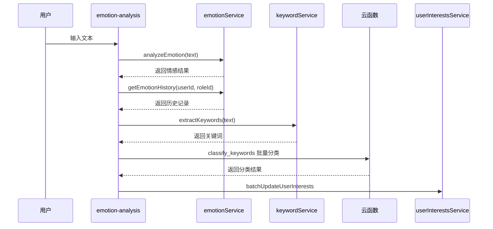
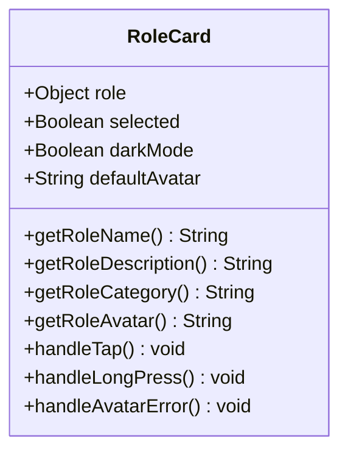
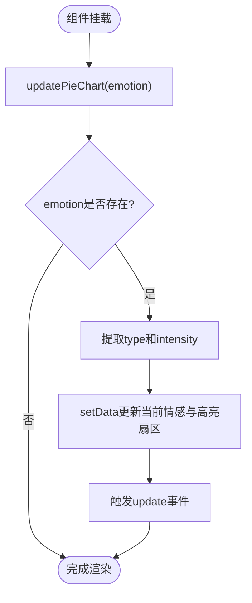
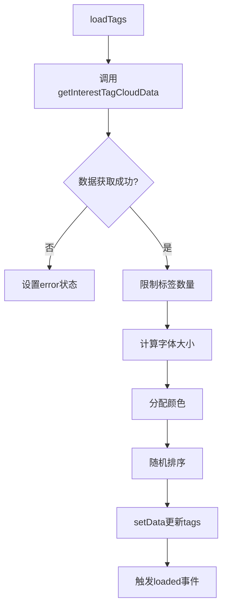
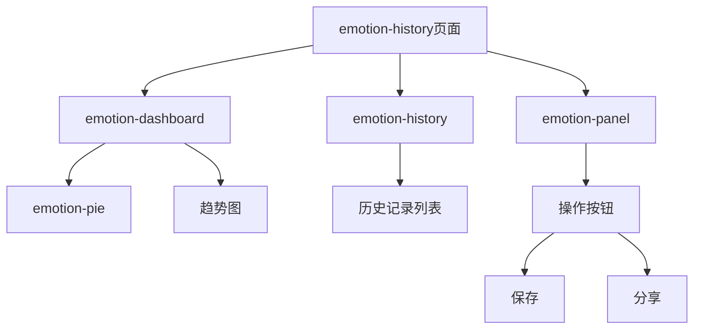
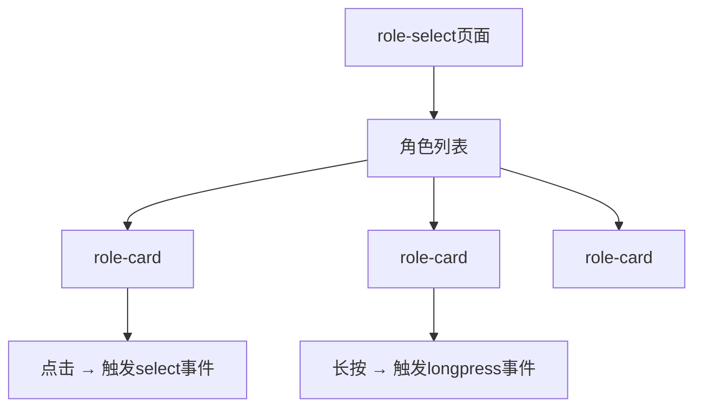
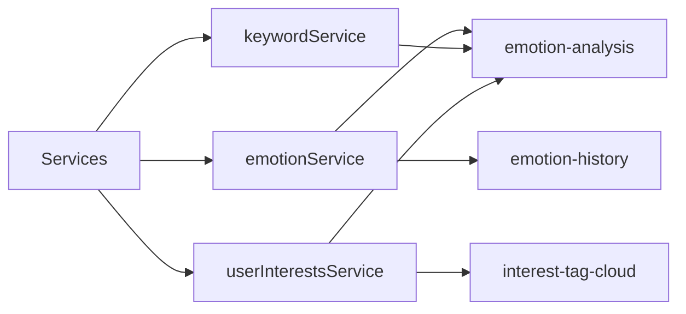

# 前端组件体系

<cite>
**本文档引用文件**  
- [emotion-analysis.js](file://miniprogram/components/emotion-analysis/emotion-analysis.js)
- [role-card.js](file://miniprogram/components/role-card/role-card.js)
- [emotion-pie.js](file://miniprogram/components/emotion-pie/emotion-pie.js)
- [interest-tag-cloud.js](file://miniprogram/components/interest-tag-cloud/interest-tag-cloud.js)
- [ec-canvas.js](file://miniprogram/components/ec-canvas/ec-canvas.js)
- [emotion-history.js](file://miniprogram/components/emotion-history/emotion-history.js)
- [role-select.js](file://miniprogram/pages/role-select/role-select.js)
</cite>

## 目录
1. [简介](#简介)
2. [核心组件分析](#核心组件分析)
3. [组件组合使用示例](#组件组合使用示例)
4. [逻辑复用与行为机制](#逻辑复用与行为机制)
5. [暗黑模式适配策略](#暗黑模式适配策略)
6. [总结](#总结)

## 简介
HeartChat 前端采用微信小程序原生组件化架构，构建了一套可复用、高内聚的UI组件体系。本系统围绕情绪分析、角色交互、数据可视化三大核心功能，设计了多个独立组件，通过属性（properties）、事件（events）和数据绑定机制实现灵活交互。组件间通过事件总线和云函数服务进行通信，支持动态数据更新与用户行为响应。

## 核心组件分析

### emotion-analysis 组件：情绪分析界面的交互逻辑与数据绑定

该组件实现完整的情绪分析流程，包含文本输入分析、历史数据加载、图表初始化与关键词提取等功能。

**属性（properties）**
- `userId`: 用户ID，用于标识当前用户
- `roleId`: 角色ID，用于关联角色上下文
- `emotion`: 当前情感分析结果对象
- `show`: 控制组件是否显示
- `darkMode`: 暗黑模式开关，影响图表主题

**事件（events）**
- `save`: 触发保存当前心情事件
- `share`: 触发分享情感结果事件
- `close`: 关闭分析面板事件

**交互逻辑**
组件通过 `observer` 监听 `emotion` 属性变化，自动调用 `initCharts()` 初始化图表。在 `lifetimes.attached` 阶段加载用户情感历史记录，并通过 `emotionService.getEmotionHistory()` 获取最近10条数据。当用户输入文本时，`analyzeText()` 方法调用情感分析服务并提取关键词，进一步通过 `classifyAndUpdateKeywords()` 将关键词分类后更新至用户兴趣数据库。

**数据绑定机制**
使用 `setData()` 实现数据驱动视图更新。例如，在情感分析完成后，将强度值格式化为百分比字符串并更新 `intensityFormatted` 字段，触发UI重新渲染。

**Diagram sources**  
- [emotion-analysis.js](file://miniprogram/components/emotion-analysis/emotion-analysis.js#L1-L420)

**Section sources**  
- [emotion-analysis.js](file://miniprogram/components/emotion-analysis/emotion-analysis.js#L1-L420)

### role-card 组件：角色信息展示与选择行为

该组件用于展示单个角色的信息卡片，并支持点击选择和长按编辑操作。

**属性（properties）**
- `role`: 角色对象，包含名称、描述、分类、头像等信息
- `selected`: 是否被选中状态
- `darkMode`: 暗黑模式标识

**事件（events）**
- `select`: 点击卡片时触发，携带角色数据
- `longpress`: 长按卡片时触发，用于进入编辑模式

**功能实现**
通过 `getRoleName()`、`getRoleDescription()` 等方法从 `role` 对象中提取显示信息，兼容新旧字段命名（如 `name` / `role_name`）。头像加载失败时通过 `handleAvatarError()` 回退到默认头像。

**Diagram sources**  
- [role-card.js](file://miniprogram/components/role-card/role-card.js#L1-L92)

**Section sources**  
- [role-card.js](file://miniprogram/components/role-card/role-card.js#L1-L92)

### emotion-pie 组件：基于ECharts的情绪分布饼图渲染

该组件封装了情绪分布的饼图可视化功能，支持动态更新和主题切换。

**属性（properties）**
- `emotion`: 情感对象，含类型和强度
- `darkMode`: 是否启用暗黑模式

**事件（events）**
- `update`: 图表更新时触发
- `select`: 用户点击某情感扇区时触发

**渲染机制**
组件内部维护 `colors`、`labels`、`sectors` 等映射表，根据情感类型（如 joy、sadness）确定颜色与角度范围。`updatePieChart()` 方法解析情感数据并更新 `currentEmotion` 和 `intensity`，同时高亮对应扇区。`lifetimes.attached` 阶段自动初始化图表。

**Diagram sources**  
- [emotion-pie.js](file://miniprogram/components/emotion-pie/emotion-pie.js#L1-L172)

**Section sources**  
- [emotion-pie.js](file://miniprogram/components/emotion-pie/emotion-pie.js#L1-L172)

### interest-tag-cloud 组件：用户兴趣标签云动态生成

该组件根据用户兴趣数据动态生成可视化标签云，字体大小反映兴趣强度。

**属性（properties）**
- `userId`: 用户ID
- `maxTags`: 最大显示标签数
- `minFontSize` / `maxFontSize`: 字体大小范围
- `colorMap` / `darkModeColorMap`: 分类颜色映射
- `useCategories`: 是否使用分类数据而非关键词

**事件（events）**
- `loaded`: 数据加载完成事件
- `error`: 加载失败事件
- `tagclick`: 标签点击事件
- `refresh`: 刷新事件

**动态生成逻辑**
`loadTags()` 方法调用 `userInterestsService.getInterestTagCloudData()` 获取数据，计算各标签的字体大小（基于最小-最大归一化），并根据分类或标签名分配颜色。`getRandomColor()` 使用标签名字符码作为种子，确保同一标签颜色一致。

**Diagram sources**  
- [interest-tag-cloud.js](file://miniprogram/components/interest-tag-cloud/interest-tag-cloud.js#L1-L256)

**Section sources**  
- [interest-tag-cloud.js](file://miniprogram/components/interest-tag-cloud/interest-tag-cloud.js#L1-L256)

### ec-canvas 组件：ECharts 微信小程序适配封装

该组件是对 ECharts 的微信小程序平台适配层，解决原生 canvas 在小程序中的兼容性问题。

**封装原理**
- 使用 `wx-canvas.js` 作为底层画布适配器
- `wx-echarts.js` 提供 ECharts 实例的初始化与渲染控制
- `ec-canvas.js` 作为组件入口，暴露 `ec` 属性接收图表配置
- 通过 `init()` 方法延迟初始化图表，确保节点就绪

**关键机制**
- 支持按需引入 ECharts 模块以减小体积
- 提供 `onInit` 回调供外部传入图表配置
- 处理小程序生命周期与图表渲染的同步问题

**Section sources**  
- [ec-canvas.js](file://miniprogram/components/ec-canvas/ec-canvas.js#L1-L300)

## 组件组合使用示例

### emotion-history 页面：情绪历史记录展示

该页面整合多个组件实现情绪历史的综合展示。

**交互流程**
1. 页面加载时获取用户近期情感数据
2. `emotion-dashboard` 显示当前情绪饼图与趋势分析
3. `emotion-history` 列表展示过往记录
4. 点击某条记录触发 `select` 事件，更新主视图

**Section sources**  
- [emotion-history.js](file://miniprogram/components/emotion-history/emotion-history.js#L1-L200)

### role-select 页面：角色选择界面

该页面使用 `role-card` 组件列表展示可选角色。

用户点击角色卡片后，页面监听 `select` 事件并跳转至聊天界面，传递所选角色信息。

**Section sources**  
- [role-select.js](file://miniprogram/pages/role-select/role-select.js#L1-L150)

## 逻辑复用与行为机制

### behaviors 与 mixins 的使用

项目中通过 `require` 引入服务模块实现逻辑复用，例如：
- `emotionService` 被 `emotion-analysis` 和 `emotion-history` 共享
- `userInterestsService` 被 `interest-tag-cloud` 和 `analysis` 云函数调用

虽然未显式使用 behaviors，但通过模块化服务实现了跨组件逻辑复用。

**Section sources**  
- [services/emotionService.js](file://miniprogram/services/emotionService.js)
- [services/userInterestsService.js](file://miniprogram/services/userInterestsService.js)

## 暗黑模式适配策略

所有组件均通过 `darkMode` 属性响应主题切换：

- `emotion-analysis`: 监听 `darkMode` 变化并重新初始化图表
- `emotion-pie`: 在 `updateTheme()` 中切换颜色映射表
- `interest-tag-cloud`: 根据 `darkMode` 选择 `colorMap` 或 `darkModeColorMap`
- `role-card`: 无直接样式变化，依赖外部容器主题

主题状态由全局配置管理，在 `theme.json` 中定义，并通过页面传递至各组件。

**Section sources**  
- [theme.json](file://miniprogram/theme.json)
- [emotion-pie.js](file://miniprogram/components/emotion-pie/emotion-pie.js#L100-L130)

## 总结

HeartChat 前端组件体系结构清晰、职责分明，具备良好的可维护性与扩展性。通过属性与事件机制实现松耦合交互，利用服务层实现业务逻辑复用，结合 ECharts 提供高质量数据可视化。各组件均支持暗黑模式，用户体验一致。建议未来可引入 behaviors 统一管理公共逻辑，进一步提升代码复用率。