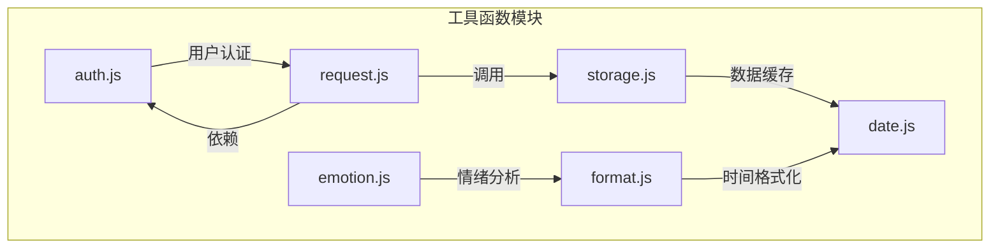
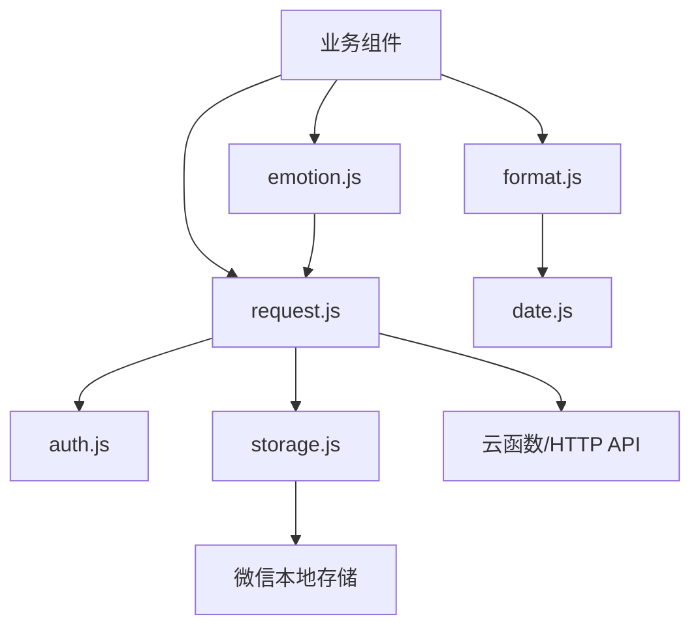
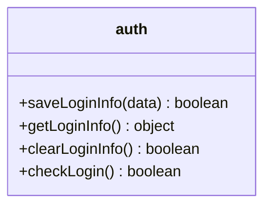
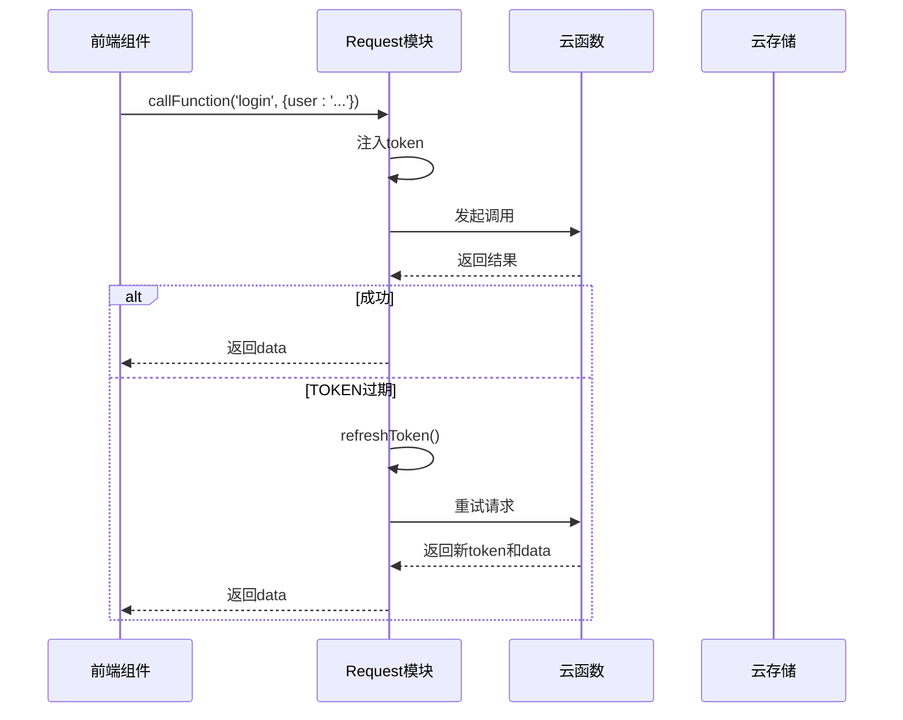
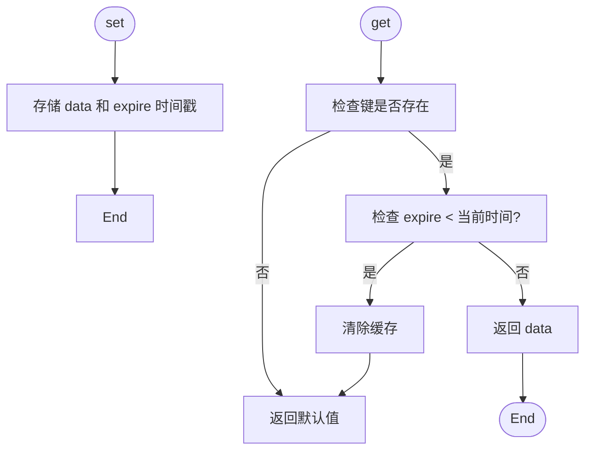
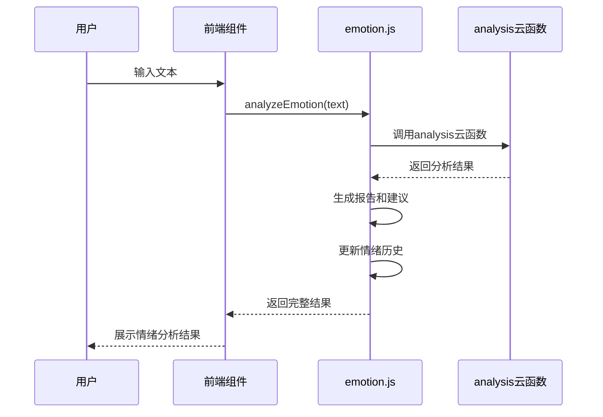
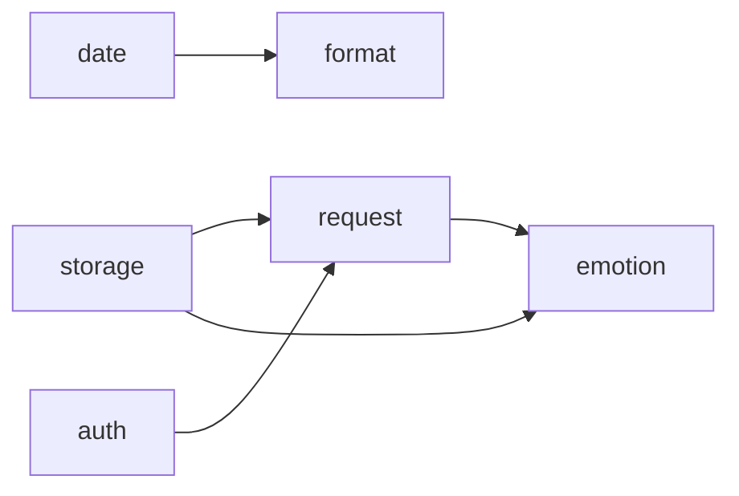

# 工具函数

<cite>
**本文档中引用的文件**  
- [auth.js](file://miniprogram/utils/auth.js)
- [request.js](file://miniprogram/utils/request.js)
- [storage.js](file://miniprogram/utils/storage.js)
- [date.js](file://miniprogram/utils/date.js)
- [emotion.js](file://miniprogram/utils/emotion.js)
- [format.js](file://miniprogram/utils/format.js)
</cite>

## 目录
1. [简介](#简介)
2. [项目结构](#项目结构)
3. [核心组件](#核心组件)
4. [架构概览](#架构概览)
5. [详细组件分析](#详细组件分析)
6. [依赖分析](#依赖分析)
7. [性能考量](#性能考量)
8. [故障排除指南](#故障排除指南)
9. [结论](#结论)

## 简介
本文档为 HeartChat 小程序中的前端工具函数库提供完整参考，涵盖认证、网络请求、本地存储、日期处理、情绪分析与数据格式化等核心模块。每个工具函数均提供参数签名、返回值说明、使用场景、边界条件处理及实际调用示例。同时，文档阐述这些工具如何协同支持用户会话管理、缓存策略、时间戳转换和数据持久化等全局功能，并强调其纯度、可测试性、性能优化及跨平台兼容性问题。

## 项目结构
`miniprogram/utils` 目录下集中存放了所有前端工具函数模块，采用模块化设计，各司其职且低耦合。该目录结构清晰，便于维护和扩展。

**图示来源**  
- [auth.js](file://miniprogram/utils/auth.js)
- [request.js](file://miniprogram/utils/request.js)
- [storage.js](file://miniprogram/utils/storage.js)
- [date.js](file://miniprogram/utils/date.js)
- [emotion.js](file://miniprogram/utils/emotion.js)
- [format.js](file://miniprogram/utils/format.js)

**本节来源**  
- [miniprogram/utils](file://miniprogram/utils)

## 核心组件
本工具库包含六大核心模块：`auth`（认证）、`request`（请求）、`storage`（存储）、`date`（日期）、`emotion`（情绪）和 `format`（格式化）。它们共同构成了小程序的基础设施层，为上层业务逻辑提供稳定、高效的支持。

**本节来源**  
- [auth.js](file://miniprogram/utils/auth.js)
- [request.js](file://miniprogram/utils/request.js)
- [storage.js](file://miniprogram/utils/storage.js)
- [date.js](file://miniprogram/utils/date.js)
- [emotion.js](file://miniprogram/utils/emotion.js)
- [format.js](file://miniprogram/utils/format.js)

## 架构概览
整个工具函数库采用分层架构，`storage` 和 `auth` 作为数据层，`request` 作为通信层，`date` 和 `format` 作为表现层辅助工具，`emotion` 则作为业务逻辑层的特定功能模块。各模块通过明确的接口进行交互，确保了系统的可维护性和可扩展性。

**图示来源**  
- [auth.js](file://miniprogram/utils/auth.js)
- [request.js](file://miniprogram/utils/request.js)
- [storage.js](file://miniprogram/utils/storage.js)
- [date.js](file://miniprogram/utils/date.js)
- [emotion.js](file://miniprogram/utils/emotion.js)
- [format.js](file://miniprogram/utils/format.js)

## 详细组件分析
本节对每个工具模块进行深入分析，包括其功能、API、使用场景及内部实现机制。

### 认证模块 (auth.js) 分析
`auth.js` 模块负责管理用户的登录会话状态，是用户身份验证的核心。

#### 功能与API
该模块提供四个主要函数：
- `saveLoginInfo(data)`: 保存用户的 token 和 userInfo 到本地存储。
- `getLoginInfo()`: 从本地存储中读取用户的登录信息。
- `clearLoginInfo()`: 清除本地存储中的登录信息，实现登出功能。
- `checkLogin()`: 检查用户是否已登录，通过验证 token 和 userInfo 是否同时存在。

**图示来源**  
- [auth.js](file://miniprogram/utils/auth.js#L1-L68)

**本节来源**  
- [auth.js](file://miniprogram/utils/auth.js#L1-L68)

### 网络请求模块 (request.js) 分析
`request.js` 模块封装了对微信云函数和HTTP请求的调用，提供了统一、健壮的网络通信接口。

#### 功能与API
该模块是一个 `Request` 类，实例化后导出为单例。其主要功能包括：
- `callFunction(name, data, options)`: 调用云函数，自动注入 token，并内置重试和 token 刷新机制。
- `get(url, data)` 和 `post(url, data)`: 发起标准的 HTTP GET/POST 请求。
- 静态方法 `uploadFile`, `downloadFile`, `deleteFile`, `getTempFileURLs`: 封装了对云存储文件操作的完整流程，包含错误处理和重试逻辑。

**图示来源**  
- [request.js](file://miniprogram/utils/request.js#L1-L284)

**本节来源**  
- [request.js](file://miniprogram/utils/request.js#L1-L284)

### 存储模块 (storage.js) 分析
`storage.js` 模块是对微信本地存储 API 的增强封装，支持数据过期机制。

#### 功能与API
该模块是一个静态类，提供以下方法：
- `set(key, data, expire)`: 存储数据，并可设置毫秒级的过期时间。
- `get(key, defaultValue)`: 获取数据，自动检查是否过期，过期则清除并返回默认值。
- `remove(key)` 和 `clear()`: 移除或清空指定键或所有缓存。
- `info()`: 获取当前存储的统计信息。
- `has(key)`: 检查指定键的缓存是否存在且未过期。

**图示来源**  
- [storage.js](file://miniprogram/utils/storage.js#L1-L111)

**本节来源**  
- [storage.js](file://miniprogram/utils/storage.js#L1-L111)

### 日期处理模块 (date.js) 分析
`date.js` 模块提供了一系列日期和时间的格式化与计算工具。

#### 功能与API
该模块导出多个独立函数：
- `formatDate`, `formatTime`, `formatDateTime`: 将 `Date` 对象格式化为 'YYYY-MM-DD'、'HH:MM' 等字符串。
- `getRelativeDate`: 将日期转换为“今天”、“昨天”等相对描述。
- `getDateRange`: 获取以某天为结束的连续日期范围。
- `parseDate`: 将字符串解析为 `Date` 对象。
- `getDaysBetween`: 计算两个日期之间的天数差。
- `getDaysInMonth`: 获取指定月份的总天数。

**本节来源**  
- [date.js](file://miniprogram/utils/date.js#L1-L165)

### 情绪分析模块 (emotion.js) 分析
`emotion.js` 模块是业务核心，负责分析用户文本情绪并生成反馈。

#### 功能与API
该模块提供以下功能：
- `analyzeEmotion(text)`: 主要方法，调用云函数进行AI情感分析，返回情绪类型、强度、报告和建议。
- `analyzeEmotionLocal(text)`: 本地降级方案，基于关键词匹配进行简单情绪判断。
- `getEmotionHistory()`: 获取本地存储的情绪历史记录。
- `updateEmotionHistory(history, newEmotion)`: 更新并持久化情绪历史。
- `getEmotionLabel`, `getEmotionColor`: 根据情绪类型获取中文标签和颜色。
- 内置 `EmotionTypes` 枚举，定义了喜悦、伤感、愤怒、焦虑、平静五种情绪。

**图示来源**  
- [emotion.js](file://miniprogram/utils/emotion.js#L1-L363)

**本节来源**  
- [emotion.js](file://miniprogram/utils/emotion.js#L1-L363)

### 数据格式化模块 (format.js) 分析
`format.js` 模块提供通用的数据格式化功能。

#### 功能与API
该模块是一个静态类，包含：
- `datetime(timestamp, format)`: 按模板格式化时间戳。
- `relativeTime(timestamp)`: 将时间戳转换为“X分钟前”等相对时间。
- `fileSize(bytes)`: 将字节数格式化为 KB、MB 等。
- `number(num)`, `currency(amount)`, `percentage(value)`: 格式化数字、金额和百分比。
- `phone`, `idCard`, `bankCard`: 格式化敏感信息，进行脱敏处理。
- `textLength(text, maxLength)`: 截取文本长度并添加省略号。

**本节来源**  
- [format.js](file://miniprogram/utils/format.js#L1-L148)

## 依赖分析
各工具模块之间存在明确的依赖关系。`request.js` 依赖 `auth.js` 来获取 token，并可能使用 `storage.js` 进行请求缓存。`emotion.js` 依赖 `request.js` 调用云函数，同时也依赖 `storage.js` 来持久化情绪历史。`format.js` 可能被 `date.js` 或其他需要格式化的模块所使用。这种依赖关系清晰，避免了循环依赖。

**图示来源**  
- [auth.js](file://miniprogram/utils/auth.js)
- [request.js](file://miniprogram/utils/request.js)
- [storage.js](file://miniprogram/utils/storage.js)
- [date.js](file://miniprogram/utils/date.js)
- [emotion.js](file://miniprogram/utils/emotion.js)
- [format.js](file://miniprogram/utils/format.js)

**本节来源**  
- [auth.js](file://miniprogram/utils/auth.js)
- [request.js](file://miniprogram/utils/request.js)
- [storage.js](file://miniprogram/utils/storage.js)
- [date.js](file://miniprogram/utils/date.js)
- [emotion.js](file://miniprogram/utils/emotion.js)
- [format.js](file://miniprogram/utils/format.js)

## 性能考量
- **缓存策略**：`storage.js` 模块的过期机制有效减少了重复计算和网络请求。
- **重试机制**：`request.js` 在网络不稳定时提供重试，提升了用户体验。
- **降级方案**：`emotion.js` 在云函数不可用时提供本地分析，保证了核心功能的可用性。
- **同步调用**：所有模块均使用微信的同步存储 API，避免了异步回调的复杂性，但需注意阻塞风险。

## 故障排除指南
- **登录状态丢失**：检查 `auth.js` 中的 `TOKEN_KEY` 和 `USER_INFO_KEY` 是否正确，确认 `clearLoginInfo` 是否被意外调用。
- **请求频繁失败**：查看 `request.js` 的日志，确认 token 是否过期，网络是否正常。
- **缓存数据不更新**：检查 `storage.js` 的 `expire` 参数设置，确认是否因过期而被清除。
- **情绪分析无响应**：确认 `analysis` 云函数已正确部署，检查网络连接。
- **日期显示错误**：在 `date.js` 中验证输入的 `dateStr` 格式是否正确。

**本节来源**  
- [auth.js](file://miniprogram/utils/auth.js)
- [request.js](file://miniprogram/utils/request.js)
- [storage.js](file://miniprogram/utils/storage.js)
- [emotion.js](file://miniprogram/utils/emotion.js)

## 结论
HeartChat 的前端工具函数库设计合理，职责清晰，为小程序的稳定运行提供了坚实基础。各模块在保证功能完整性的同时，充分考虑了错误处理、用户体验和性能优化。通过统一的接口和良好的文档，极大地提升了开发效率和代码可维护性。未来可进一步增强类型定义（如使用 TypeScript）和单元测试覆盖率。