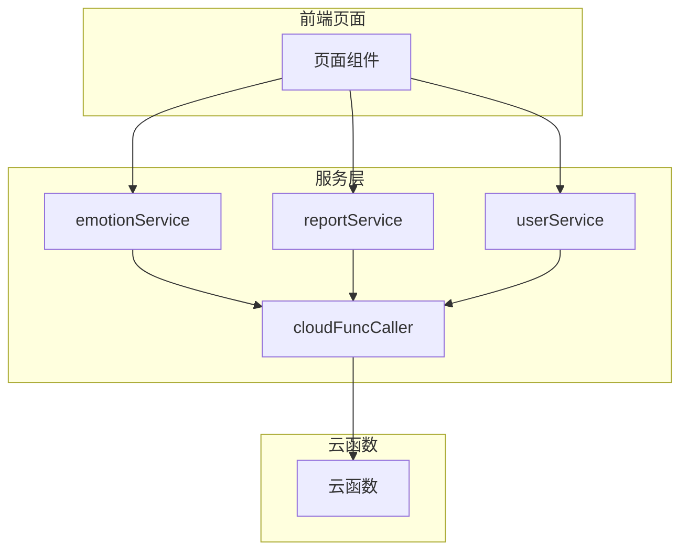
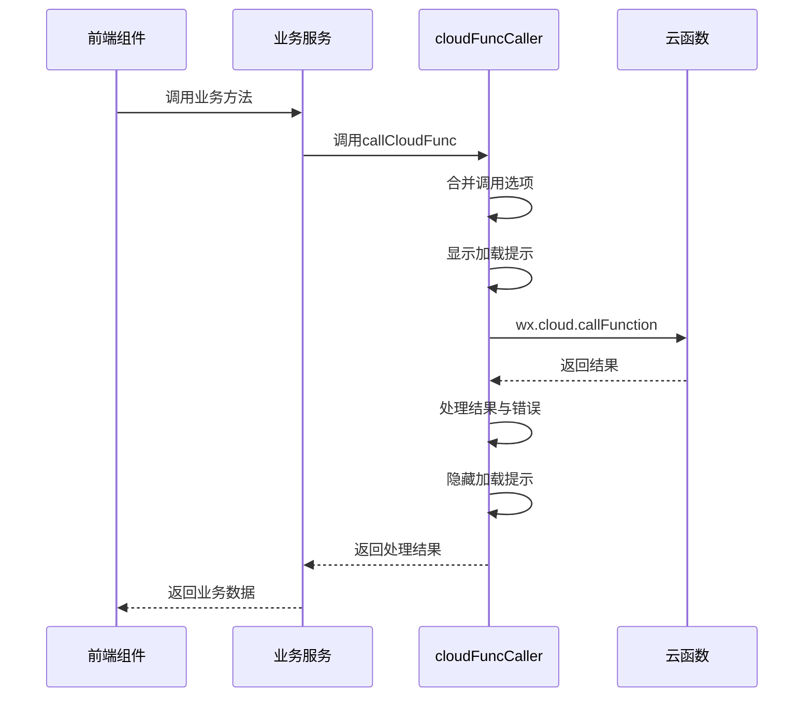
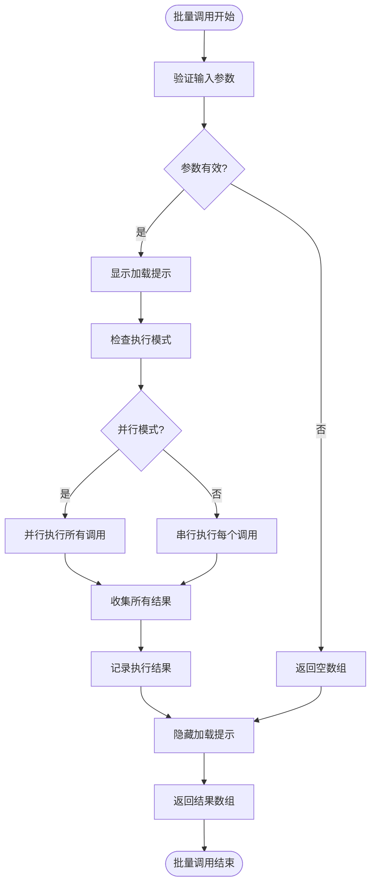
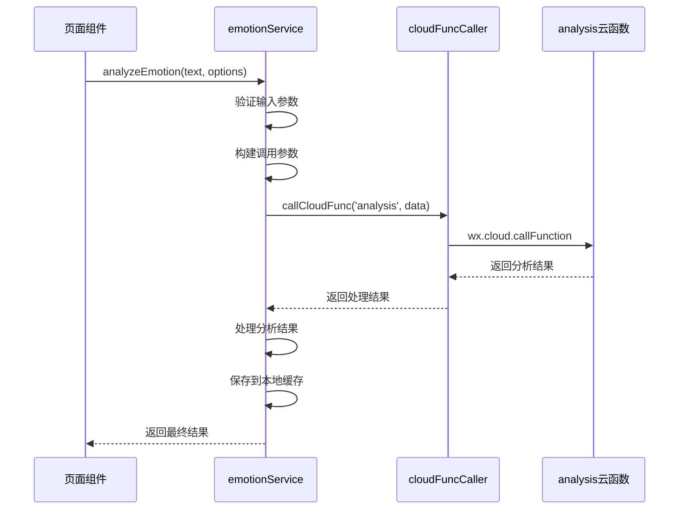
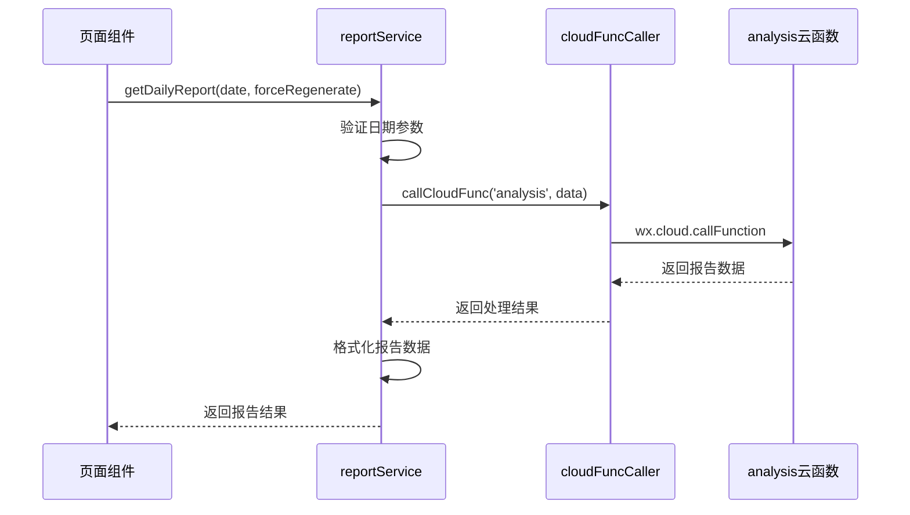
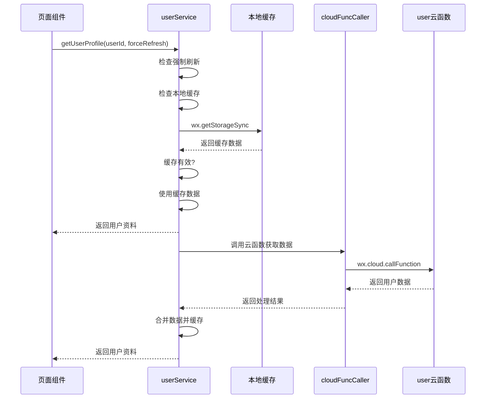
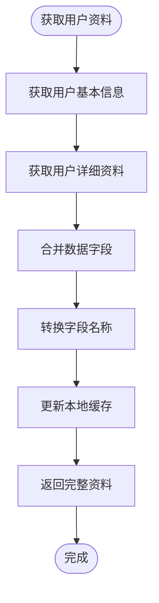
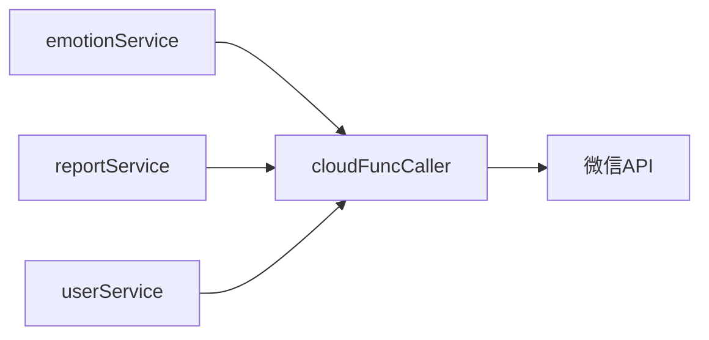

# 服务层设计

<cite>
**本文档引用的文件**
- [cloudFuncCaller.js](file://miniprogram/services/cloudFuncCaller.js)
- [emotionService.js](file://miniprogram/services/emotionService.js)
- [reportService.js](file://miniprogram/services/reportService.js)
- [userService.js](file://miniprogram/services/userService.js)
</cite>

## 目录
1. [引言](#引言)
2. [服务层架构概览](#服务层架构概览)
3. [核心服务模块职责划分](#核心服务模块职责划分)
4. [云函数调用抽象层实现](#云函数调用抽象层实现)
5. [业务服务接口与调用流程](#业务服务接口与调用流程)
6. [数据转换与结果处理](#数据转换与结果处理)
7. [服务注入与依赖管理](#服务注入与依赖管理)
8. [异步操作与异常处理](#异步操作与异常处理)
9. [最佳实践与使用建议](#最佳实践与使用建议)
10. [结论](#结论)

## 引言

服务层是前端应用与云函数之间的关键抽象层，承担着封装复杂性、统一接口规范和提升开发效率的重要职责。在本项目中，服务层通过`cloudFuncCaller`、`emotionService`、`reportService`和`userService`等模块，实现了对微信小程序云函数调用的统一管理。这些服务不仅封装了`wx.cloud.callFunction`的底层细节，还提供了参数预处理、错误重试、超时控制、日志记录等增强功能，为上层业务逻辑提供了稳定可靠的数据访问接口。

## 服务层架构概览

服务层采用分层架构设计，将通用调用逻辑与业务逻辑分离。`cloudFuncCaller`作为基础调用工具，提供统一的云函数调用接口；各业务服务模块（如`emotionService`、`reportService`等）则基于此工具构建，专注于特定业务领域的功能实现。



**图示来源**
- [cloudFuncCaller.js](file://miniprogram/services/cloudFuncCaller.js)
- [emotionService.js](file://miniprogram/services/emotionService.js)
- [reportService.js](file://miniprogram/services/reportService.js)
- [userService.js](file://miniprogram/services/userService.js)

## 核心服务模块职责划分

服务层各模块遵循单一职责原则，明确划分了各自的业务边界和功能范围。

### 情感分析服务（emotionService）

`emotionService`模块负责处理所有与情感分析相关的业务逻辑，包括文本情感分析、情感历史记录获取、情绪波动指数计算等。该服务封装了对`analysis`和`getEmotionRecords`等云函数的调用，为前端提供了统一的情感分析接口。

**模块职责**
- 文本情感分析与结果解析
- 情感历史记录的查询与格式化
- 情绪波动指数的计算与评估
- 情感类型与角色匹配算法
- 本地缓存管理与数据持久化

### 报告服务（reportService）

`reportService`模块专注于用户每日心情报告的生成与管理。该服务通过调用`analysis`云函数获取报告内容，并提供报告列表查询、报告状态更新等功能。

**模块职责**
- 每日心情报告的获取与生成
- 历史报告列表的查询
- 报告阅读状态的更新
- 用户兴趣数据的获取

### 用户服务（userService）

`userService`模块负责用户资料的管理，包括用户信息的获取、保存和缓存管理。该服务整合了多个数据源，为前端提供了统一的用户资料访问接口。

**模块职责**
- 用户资料的获取与缓存
- 用户资料的保存与更新
- 用户标识符（userId、openid）的提取
- 本地用户信息的同步更新
- 缓存策略的实现与管理

### 云函数调用器（cloudFuncCaller）

`cloudFuncCaller`是服务层的基础工具模块，为所有业务服务提供统一的云函数调用能力。该模块封装了`wx.cloud.callFunction`的调用细节，提供了加载提示、错误处理、日志记录等通用功能。

**模块职责**
- 云函数调用的统一接口
- 加载状态的显示与隐藏
- 错误信息的捕获与提示
- 开发环境的日志输出
- 批量云函数调用的支持

**本节来源**
- [emotionService.js](file://miniprogram/services/emotionService.js)
- [reportService.js](file://miniprogram/services/reportService.js)
- [userService.js](file://miniprogram/services/userService.js)
- [cloudFuncCaller.js](file://miniprogram/services/cloudFuncCaller.js)

## 云函数调用抽象层实现

`cloudFuncCaller`模块作为服务层的核心基础设施，实现了对云函数调用的全面封装和抽象。

### 统一调用接口

`callCloudFunc`函数提供了统一的云函数调用接口，接受云函数名称、参数数据和调用选项三个参数。通过默认选项与用户选项的合并，实现了灵活的调用配置。



**图示来源**
- [cloudFuncCaller.js](file://miniprogram/services/cloudFuncCaller.js#L15-L179)

### 调用选项与配置

调用选项系统提供了灵活的配置能力，支持加载提示、错误提示等用户界面反馈。默认选项确保了基本的用户体验，而自定义选项则允许特定场景下的特殊处理。

**调用选项配置**
- `showLoading`: 是否显示加载提示
- `loadingText`: 加载提示文本内容
- `showError`: 是否显示错误提示
- `parallel`: 批量调用时是否并行执行

### 批量调用支持

`batchCallCloudFunc`函数提供了批量云函数调用的能力，支持并行和串行两种执行模式。这一功能在需要同时获取多个数据源的场景下尤为有用，可以显著提升数据加载效率。



**图示来源**
- [cloudFuncCaller.js](file://miniprogram/services/cloudFuncCaller.js#L100-L179)

**本节来源**
- [cloudFuncCaller.js](file://miniprogram/services/cloudFuncCaller.js)

## 业务服务接口与调用流程

各业务服务模块基于`cloudFuncCaller`构建，实现了特定领域的功能接口。

### 情感分析服务接口

`analyzeEmotion`函数是情感分析服务的核心接口，负责将用户输入的文本发送到云函数进行情感分析。



**图示来源**
- [emotionService.js](file://miniprogram/services/emotionService.js#L100-L200)

### 报告服务接口

`getDailyReport`函数提供了获取用户每日心情报告的能力，支持指定日期和强制重新生成选项。



**图示来源**
- [reportService.js](file://miniprogram/services/reportService.js#L10-L50)

### 用户服务接口

`getUserProfile`函数提供了获取用户资料的能力，实现了缓存优先的策略，优化了数据访问性能。



**图示来源**
- [userService.js](file://miniprogram/services/userService.js#L50-L100)

**本节来源**
- [emotionService.js](file://miniprogram/services/emotionService.js)
- [reportService.js](file://miniprogram/services/reportService.js)
- [userService.js](file://miniprogram/services/userService.js)

## 数据转换与结果处理

服务层在接收到云函数返回的原始数据后，会进行一系列的数据转换和结果处理，以提供更符合前端需求的数据格式。

### 情感分析结果处理

`emotionService`模块对云函数返回的情感分析结果进行了标准化处理，确保了数据格式的一致性。

**数据转换流程**
1. 验证云函数返回结果的有效性
2. 提取核心分析数据
3. 补充时间戳等元数据
4. 格式化情感类型与颜色映射
5. 保存到本地缓存

### 报告数据格式化

`reportService`模块对获取的报告数据进行了封装，添加了`success`状态标识和`isNew`标志，便于前端进行状态判断和UI更新。

### 用户资料合并

`userService`模块实现了多数据源的合并策略，将用户基本信息和详细资料从不同集合中获取并合并为统一的对象结构。



**图示来源**
- [userService.js](file://miniprogram/services/userService.js#L150-L200)

**本节来源**
- [emotionService.js](file://miniprogram/services/emotionService.js)
- [reportService.js](file://miniprogram/services/reportService.js)
- [userService.js](file://miniprogram/services/userService.js)

## 服务注入与依赖管理

服务层通过模块化设计和依赖注入机制，实现了松耦合的架构。

### 模块依赖关系

各业务服务模块通过`require`语句引入所需的依赖模块，形成了清晰的依赖关系图。



### 依赖注入实践

`userService`模块通过`require('./cloudFuncCaller')`的方式注入了云函数调用能力，这种显式的依赖声明使得代码的可测试性和可维护性得到了提升。

**依赖管理优势**
- 明确的依赖关系
- 便于单元测试
- 支持模块替换
- 提高代码可读性

**本节来源**
- [userService.js](file://miniprogram/services/userService.js#L10)

## 异步操作与异常处理

服务层全面采用了Promise异步编程模型，确保了非阻塞的操作执行和优雅的错误处理。

### Promise链式调用

所有服务方法均返回Promise对象，支持链式调用和async/await语法，使异步代码的编写更加直观和简洁。

```javascript
// 示例：链式调用
emotionService.analyzeEmotion(text)
  .then(result => {
    // 处理分析结果
  })
  .catch(error => {
    // 处理错误
  });

// 示例：async/await
async function handleEmotionAnalysis() {
  try {
    const result = await emotionService.analyzeEmotion(text);
    // 处理分析结果
  } catch (error) {
    // 处理错误
  }
}
```

### 全面的异常捕获

服务层在多个层级实现了异常捕获机制，确保了应用的稳定性和用户体验。

**异常处理层级**
1. 云函数调用层：捕获网络异常和调用错误
2. 业务服务层：处理业务逻辑错误和数据验证
3. 结果处理层：应对数据格式错误和解析异常

### 错误提示与日志

`cloudFuncCaller`模块统一处理了错误提示，通过`wx.showToast`向用户展示友好的错误信息，同时在开发环境下通过`console.error`输出详细的错误日志，便于问题排查。

**本节来源**
- [cloudFuncCaller.js](file://miniprogram/services/cloudFuncCaller.js)
- [emotionService.js](file://miniprogram/services/emotionService.js)
- [reportService.js](file://miniprogram/services/reportService.js)
- [userService.js](file://miniprogram/services/userService.js)

## 最佳实践与使用建议

### 服务使用规范

1. **优先使用业务服务**：应优先调用`emotionService`、`reportService`等业务服务，而非直接调用`cloudFuncCaller`
2. **合理使用缓存**：利用`userService`的缓存机制减少不必要的云函数调用
3. **处理异步结果**：始终使用`.then()`或`async/await`处理Promise返回值
4. **错误处理**：在调用服务方法时，务必添加错误处理逻辑

### 性能优化建议

1. **批量调用**：在需要获取多个数据时，考虑使用`batchCallCloudFunc`进行批量调用
2. **缓存策略**：合理设置缓存过期时间，平衡数据新鲜度和性能
3. **按需加载**：避免一次性加载过多数据，采用分页或懒加载策略

### 扩展性考虑

1. **新增服务**：遵循现有模式创建新的业务服务模块
2. **统一接口**：保持服务接口的一致性，便于维护和使用
3. **日志记录**：在开发环境下保持详细的日志输出，便于调试

## 结论

服务层作为前端与云函数之间的桥梁，通过`cloudFuncCaller`、`emotionService`、`reportService`和`userService`等模块的协同工作，实现了对复杂云函数调用的优雅抽象。这一设计不仅提升了代码的可维护性和可测试性，还为前端开发提供了稳定、一致的API接口。通过统一的错误处理、加载提示和日志记录机制，服务层显著改善了用户体验和开发效率。未来，可以在此基础上进一步完善监控、性能分析和自动化测试等能力，持续提升服务层的健壮性和可靠性。