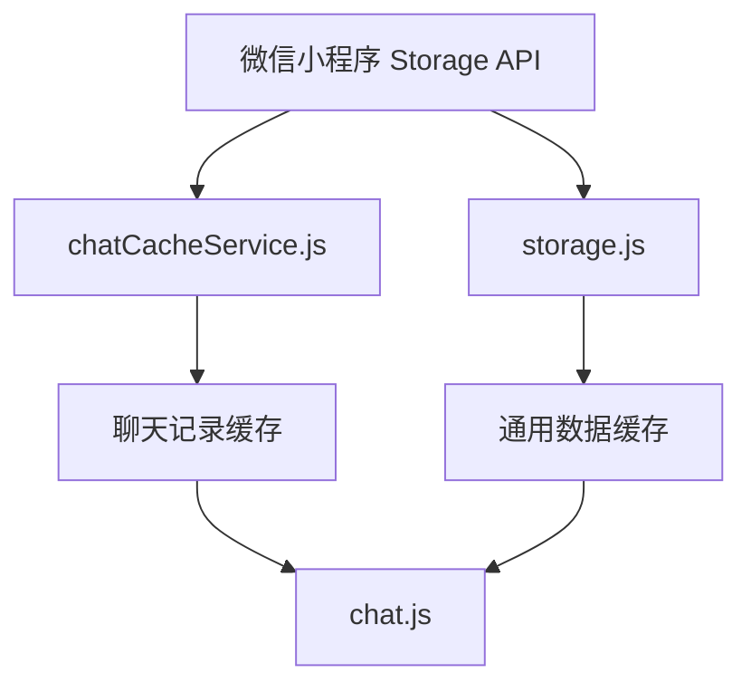
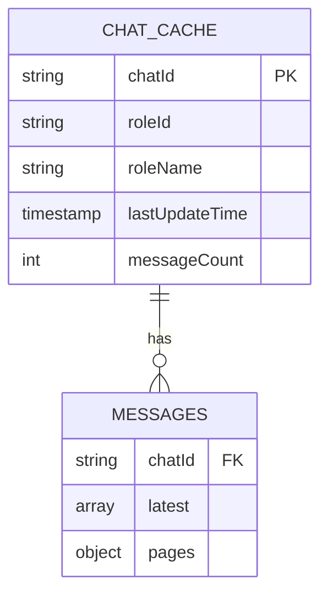
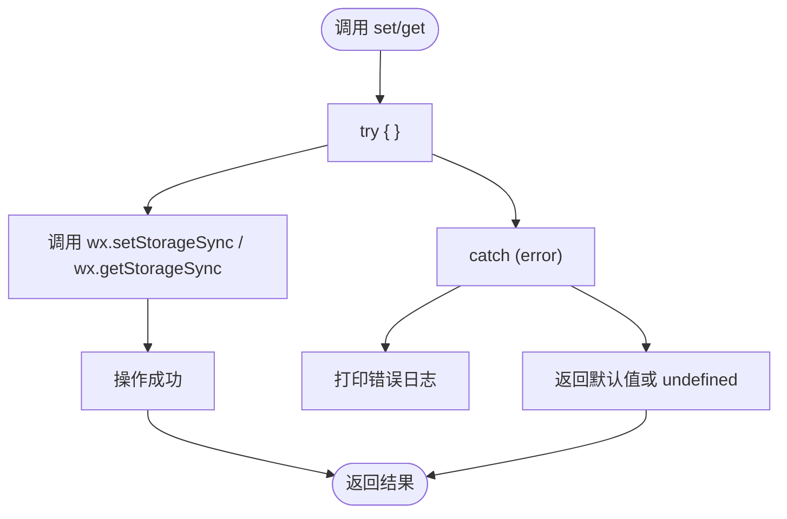
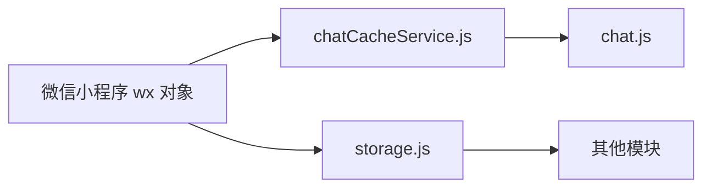

# 本地缓存策略

<cite>
**本文档引用文件**  
- [chatCacheService.js](file://miniprogram/services/chatCacheService.js)
- [storage.js](file://miniprogram/utils/storage.js)
- [chat.js](file://miniprogram/packageChat/pages/chat/chat.js)
- [聊天记录本地缓存与下拉加载功能说明.md](file://doc/使用文档/聊天记录本地缓存与下拉加载功能说明.md)
</cite>

## 目录
1. [引言](#引言)
2. [项目结构](#项目结构)
3. [核心组件](#核心组件)
4. [架构概述](#架构概述)
5. [详细组件分析](#详细组件分析)
6. [依赖分析](#依赖分析)
7. [性能考量](#性能考量)
8. [故障排除指南](#故障排除指南)
9. [结论](#结论)

## 引言
本专项文档旨在深入分析 HeartChat 微信小程序中 `chatCacheService` 模块如何利用微信小程序的 Storage API 实现聊天记录的高效本地缓存与快速检索。文档将详细阐述缓存数据结构的设计原理、容量控制机制、过期策略以及与云端的同步机制。同时，将探讨缓存读写操作对用户体验的积极影响，如提升历史消息加载速度和增强离线访问能力。结合 `storage` 工具模块，本文将解释数据序列化、异步读写与错误处理的最佳实践，并提供缓存性能监控与清理工具的使用指南，以确保内存使用的高效性。

## 项目结构
HeartChat 项目的本地缓存功能主要集中在 `miniprogram` 目录下，其核心服务与工具模块组织清晰。`services` 目录中的 `chatCacheService.js` 是实现聊天缓存逻辑的核心，而 `utils` 目录下的 `storage.js` 提供了对微信 Storage API 的通用封装。聊天页面的业务逻辑则在 `packageChat/pages/chat/chat.js` 中实现，该文件直接调用缓存服务。相关的设计与使用说明文档位于 `doc/使用文档` 目录下。

```mermaid
graph TB
subgraph "核心服务"
CCS[chatCacheService.js]
ST[storage.js]
end
subgraph "业务逻辑"
CJ[chat.js]
end
subgraph "文档"
DOC[聊天记录本地缓存与下拉加载功能说明.md]
end
CJ --> CCS : "依赖"
CCS --> ST : "内部使用"
DOC --> CCS : "说明"
DOC --> CJ : "说明"
```

**Diagram sources**
- [chatCacheService.js](file://miniprogram/services/chatCacheService.js)
- [storage.js](file://miniprogram/utils/storage.js)
- [chat.js](file://miniprogram/packageChat/pages/chat/chat.js)

**Section sources**
- [chatCacheService.js](file://miniprogram/services/chatCacheService.js)
- [storage.js](file://miniprogram/utils/storage.js)
- [chat.js](file://miniprogram/packageChat/pages/chat/chat.js)

## 核心组件
`chatCacheService` 是负责管理聊天记录生命周期的核心服务。它提供了一套完整的 API，用于保存、加载、更新和清理聊天缓存。该服务直接与微信小程序的同步 Storage API 交互，确保了操作的即时性。`storage` 工具类则为整个应用提供了带过期时间的通用缓存功能，虽然 `chatCacheService` 采用了自定义的持久化结构，但 `storage` 类的设计理念为理解整个缓存体系提供了重要参考。

**Section sources**
- [chatCacheService.js](file://miniprogram/services/chatCacheService.js)
- [storage.js](file://miniprogram/utils/storage.js)

## 架构概述
HeartChat 的本地缓存架构采用分层设计。最底层是微信小程序的 Storage API，它提供了数据持久化的基础。中间层是 `storage.js` 工具类，它为简单的键值对数据提供了带过期时间的封装。最上层是专为聊天场景设计的 `chatCacheService.js`，它定义了复杂的缓存数据结构，实现了分页存储、容量控制和自动清理等高级功能。聊天页面 (`chat.js`) 作为业务层，协调网络请求与本地缓存，优先从缓存读取数据以提升用户体验，并在适当时机将数据写回缓存。



**Diagram sources**
- [storage.js](file://miniprogram/utils/storage.js)
- [chatCacheService.js](file://miniprogram/services/chatCacheService.js)
- [chat.js](file://miniprogram/packageChat/pages/chat/chat.js)

## 详细组件分析

### chatCacheService 分析
`chatCacheService` 模块通过精心设计的数据结构和策略，实现了高效且可靠的聊天记录缓存。

#### 缓存数据结构设计
该服务为每个聊天会话 (`chatId`) 创建一个独立的缓存项，键名为 `chat_<chatId>`。缓存值是一个包含 `basic` 和 `messages` 两个主要部分的 JSON 对象。
- **`basic` 部分**：存储聊天的基本元信息，包括关联的角色ID (`roleId`)、角色名称 (`roleName`)、最后更新时间戳 (`lastUpdateTime`) 和消息总数 (`messageCount`)。这些信息对于快速展示聊天列表至关重要。
- **`messages` 部分**：存储实际的聊天消息，分为 `latest` 和 `pages` 两个子结构。
  - `latest`：一个数组，存储最新的 `PAGE_SIZE * 2` 条消息（默认为40条）。这个设计确保了在聊天页面首次加载时，能立即展示足够多的最新消息，无需等待网络请求。
  - `pages`：一个对象，其键为 `page_<页码>`，值为对应页码的消息数组。历史消息按页存储，实现了分页加载，避免了单次加载过多数据。



**Diagram sources**
- [chatCacheService.js](file://miniprogram/services/chatCacheService.js)

#### 容量控制与过期策略
- **容量控制**：服务通过常量 `MAX_CACHED_CHATS` (默认为10) 限制了最大缓存的聊天会话数量。当缓存的会话数超过此限制时，`cleanupOldCache` 函数会被触发。该函数会获取所有以 `chat_` 开头的缓存键，根据每个会话的 `lastUpdateTime` 进行排序，并删除最旧的会话，直到数量符合限制。这有效防止了应用因缓存过多数据而占用过多存储空间。
- **过期策略**：与 `storage.js` 不同，`chatCacheService` 本身**不直接实现基于时间的过期策略**。它的“过期”更多体现在容量控制上，即旧的聊天会话会被新会话挤出。然而，数据的“新鲜度”由业务逻辑保证：在 `chat.js` 中，页面加载时会优先显示缓存数据，然后立即发起网络请求获取最新数据并更新缓存，从而确保用户看到的是最新信息。

#### 同步机制
`chatCacheService` 主要负责本地缓存的读写，而与云端的同步由 `chat.js` 页面逻辑驱动，形成了一种“读时同步”和“写时同步”的混合模式。
- **读时同步**：在 `onLoad` 和 `loadChatHistory` 函数中，页面会先尝试从 `chatCacheService` 加载缓存数据以实现快速展示，然后立即调用云函数 `chat` 的 `getChatHistory` 接口获取最新数据。一旦网络请求成功，新数据会通过 `saveMessagesToCache` 更新到本地缓存中。
- **写时同步**：当用户发送新消息或页面卸载时，`chat.js` 会调用 `saveChatHistory` 云函数将数据保存到云端，同时也会调用 `chatCacheService.saveMessagesToCache` 将数据保存到本地缓存。

**Section sources**
- [chatCacheService.js](file://miniprogram/services/chatCacheService.js#L1-L298)
- [chat.js](file://miniprogram/packageChat/pages/chat/chat.js#L1-L799)

### storage 工具模块分析
`storage.js` 提供了一个更通用的缓存解决方案，其设计为应用的其他部分提供了便利。

#### 数据序列化与异步读写
- **数据序列化**：`storage.js` 在 `set` 方法中，将原始数据 `data` 和过期时间 `expire` 包装成一个对象 `{ data, expire }`，然后通过 `wx.setStorageSync` 存储。微信小程序的 Storage API 会自动将这个对象序列化为 JSON 字符串。
- **异步读写**：尽管 `storage.js` 使用了同步 API (`wx.setStorageSync`, `wx.getStorageSync`)，但其设计模式是同步的。对于需要异步操作的场景，开发者需要自行封装。`chatCacheService` 也采用了同步 API，这保证了在关键路径（如页面加载）上的操作是阻塞且可靠的。

#### 错误处理最佳实践
`storage.js` 的每个方法都使用了 `try...catch` 块来捕获可能的异常。当 `wx.setStorageSync` 或 `wx.getStorageSync` 调用失败时（例如，存储空间已满），它会捕获错误并打印日志，但不会将错误抛出给调用者，而是返回一个安全的默认值（如 `get` 方法返回 `defaultValue`）。这种“静默失败”策略保证了应用的健壮性，即使缓存功能暂时不可用，也不会导致主流程崩溃。



**Diagram sources**
- [storage.js](file://miniprogram/utils/storage.js#L1-L111)

**Section sources**
- [storage.js](file://miniprogram/utils/storage.js#L1-L111)

## 依赖分析
`chatCacheService` 是一个相对独立的服务，它直接依赖于微信小程序的全局 `wx` 对象来调用 Storage API。`chat.js` 页面是 `chatCacheService` 的主要使用者，两者之间存在强依赖关系。`storage.js` 作为一个通用工具，与 `chatCacheService` 并无直接依赖，但两者在设计理念上相互呼应，共同构成了应用的缓存体系。



**Diagram sources**
- [chatCacheService.js](file://miniprogram/services/chatCacheService.js)
- [storage.js](file://miniprogram/utils/storage.js)
- [chat.js](file://miniprogram/packageChat/pages/chat/chat.js)

**Section sources**
- [chatCacheService.js](file://miniprogram/services/chatCacheService.js)
- [storage.js](file://miniprogram/utils/storage.js)
- [chat.js](file://miniprogram/packageChat/pages/chat/chat.js)

## 性能考量
`chatCacheService` 的设计充分考虑了性能和用户体验。
- **用户体验**：通过在 `onLoad` 时优先加载缓存数据，实现了历史消息的“秒开”效果，极大地提升了用户体验。即使在网络状况不佳时，用户也能立即看到之前的聊天记录，保证了离线访问能力。
- **内存使用效率**：通过分页存储 (`pages`) 和限制单个会话的缓存大小 (`latest` 数组限制)，避免了单次加载过多消息导致的内存压力。通过 `cleanupOldCache` 机制，主动管理缓存总量，防止存储空间耗尽。
- **性能监控与清理**：虽然文档中未直接提供监控工具，但 `getAllCachedChats` 函数可以获取所有缓存会话的元信息，`clearChatCache` 函数可以清除指定会话的缓存，`cleanupOldCache` 函数则负责自动清理。开发者可以基于这些 API 构建一个缓存管理界面，用于监控缓存大小和手动清理。

## 故障排除指南
- **问题：缓存数据未更新**
  - **检查点**：确认 `chat.js` 中的 `loadChatHistory` 函数在从服务器获取数据后，是否调用了 `chatCacheService.saveMessagesToCache`。
- **问题：缓存数据加载缓慢或失败**
  - **检查点**：检查 `chatCacheService` 中的 `try...catch` 块，查看控制台是否有 "保存聊天记录到缓存失败" 或 "获取所有缓存聊天失败" 等错误日志。这可能是存储空间已满的信号。
- **问题：旧聊天记录未被清理**
  - **检查点**：确认 `MAX_CACHED_CHATS` 常量的值是否合理，并检查 `cleanupOldCache` 函数是否在 `saveMessagesToCache` 的异常处理中被正确调用。

**Section sources**
- [chatCacheService.js](file://miniprogram/services/chatCacheService.js)
- [chat.js](file://miniprogram/packageChat/pages/chat/chat.js)

## 结论
HeartChat 的本地缓存策略通过 `chatCacheService` 模块得到了有效实施。该策略通过合理的数据结构设计、严格的容量控制和与业务逻辑紧密结合的同步机制，成功实现了聊天记录的高效缓存与快速检索。这不仅显著提升了历史消息的加载速度和离线访问能力，优化了用户体验，同时也通过自动清理机制保障了内存使用的效率。`storage.js` 工具模块则为应用的其他缓存需求提供了坚实的基础。整体设计体现了对微信小程序平台特性的深刻理解和对用户体验的高度重视。