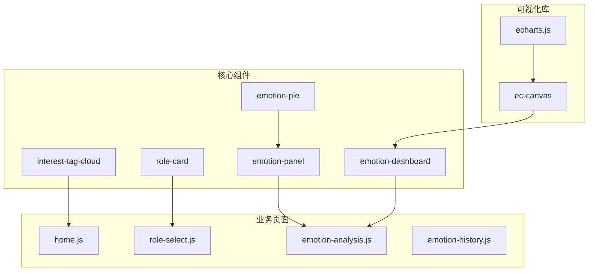
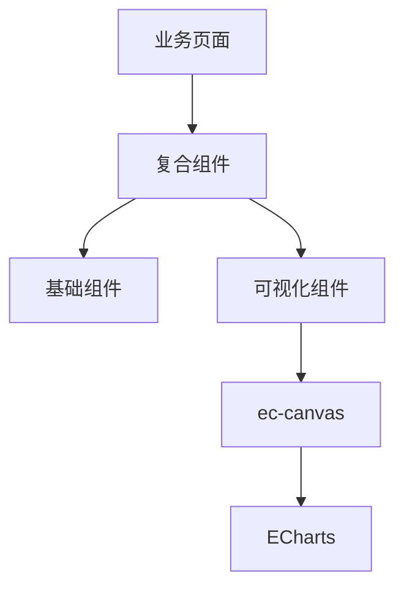
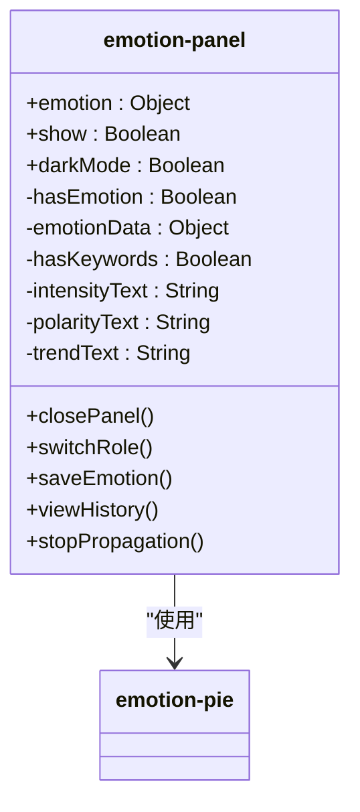
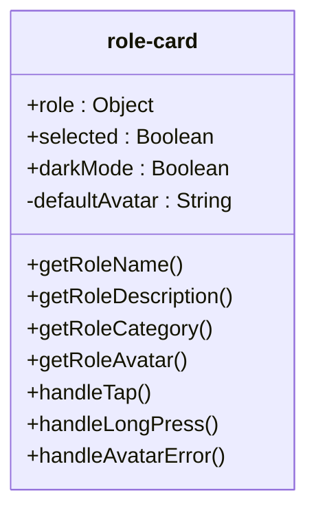
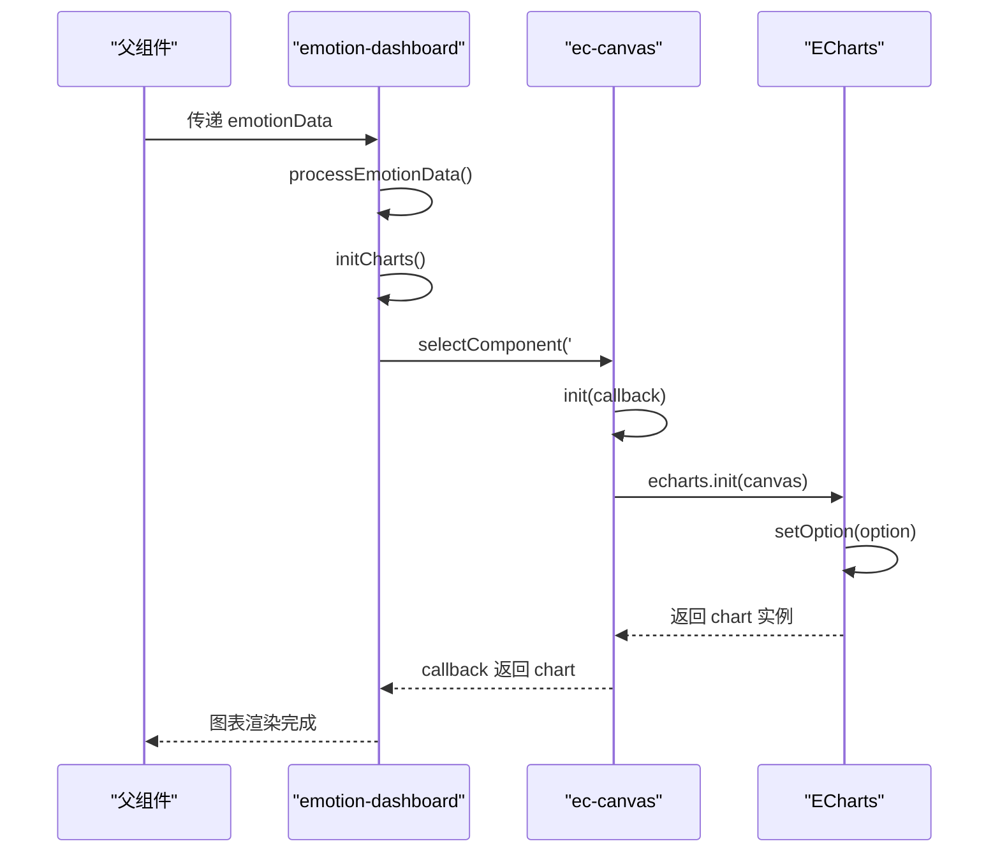
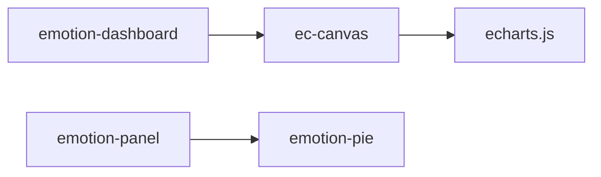

# 组件架构

<cite>
**本文档中引用的文件**  
- [emotion-panel.js](file://miniprogram/components/emotion-panel/emotion-panel.js)
- [emotion-panel.json](file://miniprogram/components/emotion-panel/emotion-panel.json)
- [role-card.js](file://miniprogram/components/role-card/role-card.js)
- [role-card.json](file://miniprogram/components/role-card/role-card.json)
- [emotion-pie.js](file://miniprogram/components/emotion-pie/emotion-pie.js)
- [emotion-pie.json](file://miniprogram/components/emotion-pie/emotion-pie.json)
- [emotion-dashboard.js](file://miniprogram/components/emotion-dashboard/emotion-dashboard.js)
- [emotion-dashboard.json](file://miniprogram/components/emotion-dashboard/emotion-dashboard.json)
- [ec-canvas.js](file://miniprogram/components/ec-canvas/ec-canvas.js)
- [echarts.js](file://miniprogram/components/ec-canvas/echarts.js)
- [interest-tag-cloud.js](file://miniprogram/components/interest-tag-cloud/interest-tag-cloud.js)
- [interest-tag-cloud.json](file://miniprogram/components/interest-tag-cloud/interest-tag-cloud.json)
</cite>

## 目录
1. [简介](#简介)
2. [项目结构](#项目结构)
3. [核心组件](#核心组件)
4. [架构概览](#架构概览)
5. [详细组件分析](#详细组件分析)
6. [依赖分析](#依赖分析)
7. [性能考量](#性能考量)
8. [故障排除指南](#故障排除指南)
9. [结论](#结论)

## 简介
HeartChat 是一款专注于情感分析与心理健康支持的智能对话应用，其前端 UI 组件体系围绕情感可视化与用户交互体验构建。本文档重点解析 `emotion-panel`、`role-card`、`emotion-pie`、`emotion-dashboard` 和 `interest-tag-cloud` 五大核心组件的设计与实现。文档将深入探讨各组件的属性（props）、事件（events）、插槽（slots）及内部状态管理机制，阐明如何通过 `ec-canvas` 封装 ECharts 实现复杂数据可视化，并提供组件复用策略、样式隔离方案、生命周期管理、响应式更新机制及性能优化建议。

## 项目结构
HeartChat 前端采用微信小程序原生框架开发，组件化设计清晰，结构分明。核心 UI 组件集中存放于 `miniprogram/components/` 目录下，按功能模块化组织。`ec-canvas` 作为第三方 ECharts 小程序适配库，被 `emotion-dashboard` 等复杂图表组件所依赖。业务页面位于 `miniprogram/pages/` 目录，通过引用这些基础组件构建完整的用户界面。



**图示来源**
- [emotion-panel.js](file://miniprogram/components/emotion-panel/emotion-panel.js)
- [role-card.js](file://miniprogram/components/role-card/role-card.js)
- [emotion-pie.js](file://miniprogram/components/emotion-pie/emotion-pie.js)
- [emotion-dashboard.js](file://miniprogram/components/emotion-dashboard/emotion-dashboard.js)
- [interest-tag-cloud.js](file://miniprogram/components/interest-tag-cloud/interest-tag-cloud.js)
- [ec-canvas.js](file://miniprogram/components/ec-canvas/ec-canvas.js)

**本节来源**
- [miniprogram/components/](file://miniprogram/components/)
- [miniprogram/pages/](file://miniprogram/pages/)

## 核心组件
HeartChat 的前端交互体验由一系列精心设计的可复用组件支撑。`emotion-panel` 作为情感分析结果的展示容器，整合了 `emotion-pie` 等子组件，提供丰富的信息呈现。`role-card` 负责角色信息的卡片式展示，是角色选择与管理功能的基础。`emotion-dashboard` 利用 ECharts 实现了多维度的情感数据可视化，是数据分析的核心。`interest-tag-cloud` 则以标签云的形式直观展示用户的兴趣偏好。这些组件共同构成了 HeartChat 的核心交互语言。

**本节来源**
- [emotion-panel.js](file://miniprogram/components/emotion-panel/emotion-panel.js)
- [role-card.js](file://miniprogram/components/role-card/role-card.js)
- [emotion-pie.js](file://miniprogram/components/emotion-pie/emotion-pie.js)
- [emotion-dashboard.js](file://miniprogram/components/emotion-dashboard/emotion-dashboard.js)
- [interest-tag-cloud.js](file://miniprogram/components/interest-tag-cloud/interest-tag-cloud.js)

## 架构概览
HeartChat 前端采用分层组件架构。基础展示层由 `role-card` 和 `interest-tag-cloud` 等原子组件构成。复合展示层如 `emotion-panel`，通过组合基础组件和自身逻辑，形成更复杂的功能单元。数据可视化层则由 `emotion-dashboard` 代表，它依赖 `ec-canvas` 与 ECharts 库，将后端返回的 JSON 数据转化为动态图表。这种架构实现了关注点分离，提高了代码的可维护性和可复用性。



**图示来源**
- [emotion-panel.js](file://miniprogram/components/emotion-panel/emotion-panel.js)
- [emotion-dashboard.js](file://miniprogram/components/emotion-dashboard/emotion-dashboard.js)
- [ec-canvas.js](file://miniprogram/components/ec-canvas/ec-canvas.js)

## 详细组件分析

### emotion-panel 组件分析
`emotion-panel` 组件是情感分析结果的主展示面板，它接收情感数据并将其转化为用户友好的界面元素。

#### 属性（Props）
- **emotion**: `Object` 类型，接收来自父组件的情感分析结果对象。该属性配置了 `observer` 监听器，当数据更新时，会自动计算并更新面板内的显示文本（如情感强度、极性、趋势）。
- **show**: `Boolean` 类型，控制面板的显示与隐藏。
- **darkMode**: `Boolean` 类型，指示是否启用暗色主题，影响组件的样式。

#### 事件（Events）
- **close**: 当用户点击关闭按钮时触发。
- **switchRole**: 当用户点击“切换角色”按钮时触发。
- **save**: 当用户点击“保存”按钮时触发，携带当前情感数据。
- **history**: 当用户点击“查看历史”按钮时触发。

#### 内部状态管理
组件通过 `setData` 方法管理其内部状态，包括 `hasEmotion`（是否有情感数据）、`emotionData`（原始数据）、`hasKeywords`（是否有关键词）以及用于显示的 `intensityText`、`polarityText` 和 `trendText` 等。

#### 组件复用与集成
`emotion-panel` 在其 JSON 配置中声明了对 `emotion-pie` 组件的依赖，实现了组件的嵌套复用。



**图示来源**
- [emotion-panel.js](file://miniprogram/components/emotion-panel/emotion-panel.js#L1-L118)
- [emotion-panel.json](file://miniprogram/components/emotion-panel/emotion-panel.json)

**本节来源**
- [emotion-panel.js](file://miniprogram/components/emotion-panel/emotion-panel.js)
- [emotion-panel.json](file://miniprogram/components/emotion-panel/emotion-panel.json)

### role-card 组件分析
`role-card` 组件用于展示单个角色的信息，是角色列表的基础单元。

#### 属性（Props）
- **role**: `Object` 类型，包含角色的所有信息，如名称、描述、分类和头像。
- **selected**: `Boolean` 类型，指示该角色卡片是否被选中，影响其视觉样式。
- **darkMode**: `Boolean` 类型，用于适配暗色主题。

#### 事件（Events）
- **select**: 当用户点击卡片时触发，携带被点击的角色对象。
- **longpress**: 当用户长按卡片时触发，携带被点击的角色对象。

#### 内部状态与方法
组件内部维护一个 `defaultAvatar` 状态，用于在角色头像加载失败时显示默认图片。它通过一系列 `getRoleXxx()` 方法从 `role` 对象中提取并格式化数据，增强了数据的兼容性（如同时支持 `name` 和 `role_name` 字段）。



**图示来源**
- [role-card.js](file://miniprogram/components/role-card/role-card.js#L1-L91)
- [role-card.json](file://miniprogram/components/role-card/role-card.json)

**本节来源**
- [role-card.js](file://miniprogram/components/role-card/role-card.js)
- [role-card.json](file://miniprogram/components/role-card/role-card.json)

### emotion-pie 组件分析
`emotion-pie` 组件是一个独立的情感饼图可视化组件，常被 `emotion-panel` 等其他组件复用。

#### 属性（Props）
- **emotion**: `Object` 类型，接收情感数据，其 `observer` 会调用 `updatePieChart` 方法更新图表。
- **darkMode**: `Boolean` 类型，其 `observer` 会调用 `updateTheme` 方法切换图表主题颜色。

#### 内部状态
组件内部维护了 `colors`（情感颜色映射）、`labels`（情感标签映射）、`sectors`（扇区角度）等数据，以及 `currentEmotion`、`intensity` 和 `highlightSector` 等状态。

#### 生命周期与方法
在 `lifetimes.attached` 生命周期中，组件会根据初始属性初始化图表。`updatePieChart` 方法负责解析情感数据并更新饼图状态，`updateTheme` 方法则根据主题切换颜色方案。

```mermaid
classDiagram
class emotion-pie {
+emotion : Object
+darkMode : Boolean
-colors : Object
-labels : Object
-sectors : Object
-currentEmotion : String
-intensity : Number
-highlightSector : String
-showPie : Boolean
+updatePieChart(emotion)
+updateTheme(isDark)
+onSectorTap(e)
}
emotion-pie --> "lifetimes" : "attached"
```

**图示来源**
- [emotion-pie.js](file://miniprogram/components/emotion-pie/emotion-pie.js#L1-L171)
- [emotion-pie.json](file://miniprogram/components/emotion-pie/emotion-pie.json)

**本节来源**
- [emotion-pie.js](file://miniprogram/components/emotion-pie/emotion-pie.js)
- [emotion-pie.json](file://miniprogram/components/emotion-pie/emotion-pie.json)

### emotion-dashboard 组件分析
`emotion-dashboard` 是 HeartChat 中最复杂的可视化组件，集成了多个 ECharts 图表。

#### ECharts 集成方式
该组件通过 `ec-canvas` 组件实现对 ECharts 的封装。在 WXML 中，通过 `<ec-canvas id="emotionChart" canvas-id="emotionChart" />` 引用 `ec-canvas`，并在 JS 中通过 `this.selectComponent('#emotionChart')` 获取其实例。调用其 `init` 方法，传入一个初始化回调函数，在该函数中创建 ECharts 实例并设置图表选项（option）。

#### 响应式更新机制
组件通过 `observer` 监听 `emotionData` 和 `show` 属性。当 `emotionData` 更新时，`processEmotionData` 方法被调用，处理数据并调用 `initCharts` 重新渲染图表。`initCharts` 方法使用 `Promise.all` 并行初始化多个图表，提高了性能。

#### 性能优化
- **懒加载**: ECharts 配置中的 `lazyLoad: true` 可能用于优化。
- **异步初始化**: 使用 `wx.nextTick` 确保在视图渲染完成后初始化图表。
- **并行处理**: 使用 `Promise.all` 并行初始化多个图表实例。

#### 常见错误与调试
- **图表不显示**: 检查 `ec-canvas` 是否正确引入，确保 `init` 回调函数正确执行。
- **数据未更新**: 确认 `emotionData` 属性已正确传递，`observer` 是否被触发。
- **样式错乱**: 检查暗色模式切换逻辑，确保颜色配置正确。



**图示来源**
- [emotion-dashboard.js](file://miniprogram/components/emotion-dashboard/emotion-dashboard.js#L1-L799)
- [emotion-dashboard.json](file://miniprogram/components/emotion-dashboard/emotion-dashboard.json)
- [ec-canvas.js](file://miniprogram/components/ec-canvas/ec-canvas.js)

**本节来源**
- [emotion-dashboard.js](file://miniprogram/components/emotion-dashboard/emotion-dashboard.js)
- [emotion-dashboard.json](file://miniprogram/components/emotion-dashboard/emotion-dashboard.json)

### interest-tag-cloud 组件分析
虽然未提供具体代码，但根据命名和常规实现，`interest-tag-cloud` 组件应接收一个兴趣标签数组作为 `props`，通过计算每个标签的权重来决定其在云中的大小和位置，实现动态的标签云效果。它可能通过 `observer` 监听数据变化，并在 `attached` 或 `ready` 生命周期中重新渲染。

**本节来源**
- [interest-tag-cloud.js](file://miniprogram/components/interest-tag-cloud/interest-tag-cloud.js)
- [interest-tag-cloud.json](file://miniprogram/components/interest-tag-cloud/interest-tag-cloud.json)

## 依赖分析
HeartChat 前端组件间的依赖关系清晰。`emotion-dashboard` 依赖 `ec-canvas`，而 `ec-canvas` 又依赖 `echarts.js` 库，形成了一个明确的依赖链。`emotion-panel` 依赖 `emotion-pie`，实现了功能的组合。这些依赖都在各自的 JSON 配置文件中通过 `usingComponents` 字段声明，确保了组件的正确加载和使用。



**图示来源**
- [emotion-dashboard.json](file://miniprogram/components/emotion-dashboard/emotion-dashboard.json)
- [emotion-panel.json](file://miniprogram/components/emotion-panel/emotion-panel.json)
- [ec-canvas.js](file://miniprogram/components/ec-canvas/ec-canvas.js)

**本节来源**
- [emotion-dashboard.json](file://miniprogram/components/emotion-dashboard/emotion-dashboard.json)
- [emotion-panel.json](file://miniprogram/components/emotion-panel/emotion-panel.json)

## 性能考量
HeartChat 前端在性能方面采取了多项措施：
1.  **组件化**: 高内聚、低耦合的组件设计减少了重复渲染。
2.  **异步与并行**: `emotion-dashboard` 使用 `Promise.all` 并行初始化多个图表，避免了串行等待。
3.  **延迟执行**: 使用 `setTimeout` 和 `wx.nextTick` 将非关键任务（如关键词分类）延迟执行，防止阻塞主线程。
4.  **数据处理优化**: 在 `processEmotionData` 中对数据进行智能处理，确保数值范围正确，避免了无效渲染。

## 故障排除指南
- **组件不显示**: 检查父组件是否正确传递了必要的 `props`，确认组件是否在页面的 `usingComponents` 中正确注册。
- **图表不渲染**: 检查 `ec-canvas` 的 `id` 和 `canvas-id` 是否唯一且正确，确保 `init` 回调函数被调用。
- **数据未更新**: 确认 `observer` 函数是否被触发，检查 `setData` 的回调是否正确执行。
- **样式问题**: 检查 `darkMode` 属性的传递和处理逻辑，确认主题切换是否生效。

**本节来源**
- [emotion-dashboard.js](file://miniprogram/components/emotion-dashboard/emotion-dashboard.js#L1-L799)
- [emotion-panel.js](file://miniprogram/components/emotion-panel/emotion-panel.js#L1-L118)

## 结论
HeartChat 的前端 UI 组件体系设计精良，通过清晰的分层和模块化，实现了高效的功能复用和良好的可维护性。`ec-canvas` 对 ECharts 的成功集成，使得复杂的情感数据可视化成为可能。各组件通过 `props`、`events` 和 `observer` 机制实现了灵活的数据流和响应式更新。遵循本文档的指导，开发者可以高效地使用和扩展这些组件，为用户提供卓越的情感分析体验。