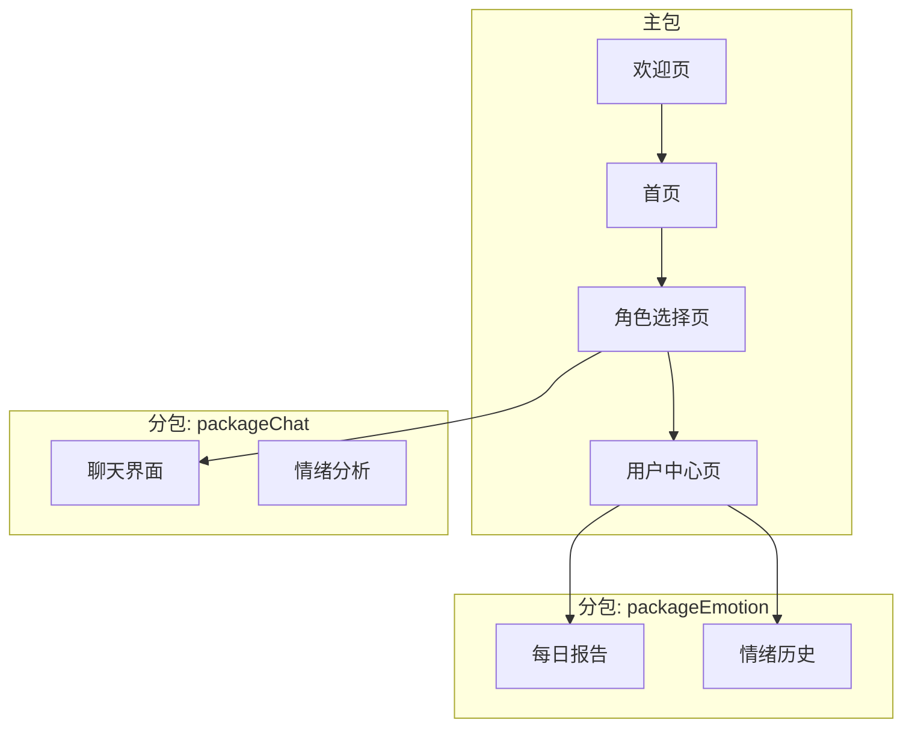
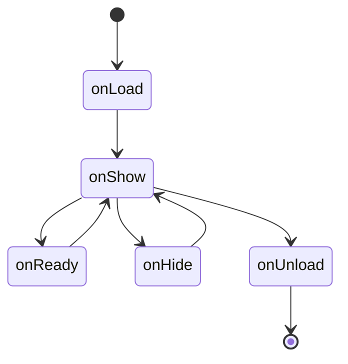
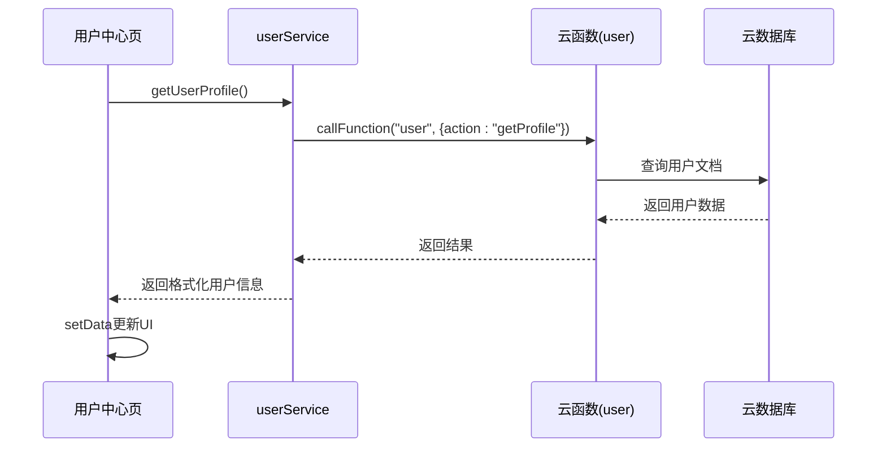

# 页面结构

<cite>
**本文档引用的文件**  
- [app.json](file://miniprogram/app.json)
- [app.js](file://miniprogram/app.js)
- [home.json](file://miniprogram/pages/home/home.json)
- [role-select.json](file://miniprogram/pages/role-select/role-select.json)
- [welcome.json](file://miniprogram/pages/welcome/welcome.json)
- [user.json](file://miniprogram/pages/user/user.json)
- [chat.json](file://miniprogram/packageChat/pages/chat/chat.json)
- [daily-report.json](file://miniprogram/packageEmotion/pages/daily-report/daily-report.json)
- [emotion-history.json](file://miniprogram/packageEmotion/pages/emotion-history/emotion-history.json)
</cite>

## 目录
1. [简介](#简介)
2. [项目结构与页面组织](#项目结构与页面组织)
3. [核心页面配置与功能](#核心页面配置与功能)
4. [分包策略与性能优化](#分包策略与性能优化)
5. [页面路由与导航机制](#页面路由与导航机制)
6. [页面生命周期与状态管理](#页面生命周期与状态管理)
7. [服务层调用与数据交互](#服务层调用与数据交互)
8. [总结](#总结)

## 简介
HeartChat小程序旨在为用户提供一个情感倾诉与心理支持的智能交互平台。本文档全面解析其页面结构设计，涵盖首页、角色选择、聊天界面、每日报告、用户中心及欢迎页等核心页面的JSON配置、WXML结构、WXSS样式和JS逻辑文件的组织方式。同时深入探讨页面路由机制、分包加载策略及其对性能的影响，阐明页面间导航模式、参数传递方法及生命周期钩子的使用场景，并结合代码示例说明页面如何调用服务层完成数据获取与状态更新。

## 项目结构与页面组织
HeartChat小程序采用模块化与分包加载相结合的架构设计，主包包含启动页、首页、角色选择页及用户中心等核心页面，同时通过独立分包`packageChat`和`packageEmotion`分别承载聊天相关功能与情绪分析相关功能，实现按需加载，提升启动性能。

主包页面路径定义于`app.json`的`pages`字段中，包括欢迎页、首页、角色选择页、用户中心页等。分包配置通过`subpackages`字段声明，明确指定各分包根目录、名称及所含页面路径。

**Section sources**
- [app.json](file://miniprogram/app.json#L1-L85)

## 核心页面配置与功能

### 首页 (home)
首页作为用户进入后的主界面，其JSON配置`home.json`设置了自定义导航栏、背景色及启用下拉刷新功能。页面不依赖额外组件，主要通过WXML构建布局，WXSS定义视觉样式，JS文件`home.js`处理轮播图、快捷入口及动态内容加载逻辑。

**Section sources**
- [home.json](file://miniprogram/pages/home/home.json#L1-L7)

### 角色选择页 (role-select)
角色选择页允许用户从预设角色中挑选对话伙伴。其JSON配置`role-select.json`启用自定义导航与下拉刷新，并引入`role-card`组件用于展示角色卡片。JS逻辑文件`role-select.js`负责从云数据库加载角色列表并绑定至WXML列表渲染。

**Section sources**
- [role-select.json](file://miniprogram/pages/role-select/role-select.json#L1-L9)

### 聊天界面 (chat)
聊天界面位于`packageChat`分包内，其JSON配置`chat.json`设置页面标题为“聊天”，并引入`chat-bubble`、`chat-input`等组件构建对话区域。JS文件`chat.js`管理消息列表、输入框状态、发送逻辑，并通过`cloudFuncCaller`调用云函数实现与AI模型的交互。

**Section sources**
- [chat.json](file://miniprogram/packageChat/pages/chat/chat.json#L1-L11)

### 每日报告页 (daily-report)
每日报告页属于`packageEmotion`分包，展示用户情绪分析的周期性总结。其JSON配置`daily-report.json`定义页面标题与组件依赖，JS文件`daily-report.js`通过调用`reportService`获取历史情绪数据，并利用`ec-canvas`组件渲染ECharts图表。

**Section sources**
- [daily-report.json](file://miniprogram/packageEmotion/pages/daily-report/daily-report.json)

### 用户中心页 (user)
用户中心页提供个人信息管理与设置功能。其JSON配置`user.json`设置标题为“个人中心”，并引入`login`、`ec-canvas`、`interest-tag-cloud`等组件。JS文件`user.js`根据登录状态动态切换视图，并调用`userService`获取用户资料与兴趣标签。

**Section sources**
- [user.json](file://miniprogram/pages/user/user.json#L1-L12)

### 欢迎页 (welcome)
欢迎页作为应用入口，承担引导与登录职责。其JSON配置`welcome.json`设置应用标题并启用自定义导航栏。JS文件`welcome.js`在`onLoad`生命周期中检查登录状态，已登录则跳转首页，未登录则展示登录引导。

**Section sources**
- [welcome.json](file://miniprogram/pages/welcome/welcome.json#L1-L6)

## 分包策略与性能优化
HeartChat采用分包加载策略以优化小程序启动速度与资源利用效率。`app.json`中定义了两个独立分包：

- **packageEmotion**：根目录为`packageEmotion`，包含“每日报告”与“情绪历史”页面，专用于情绪数据分析与可视化功能。
- **packageChat**：根目录为`packageChat`，包含“聊天”与“情绪分析”页面，承载核心对话交互逻辑。

分包机制确保主包体积最小化，仅包含必要启动资源，用户在首次访问分包页面时才触发对应资源的下载，显著降低冷启动耗时。此外，`app.json`中设置`"lazyCodeLoading": "requiredComponents"`启用组件按需注入，进一步减少初始加载量。

**Diagram sources**
- [app.json](file://miniprogram/app.json#L1-L85)

**Section sources**
- [app.json](file://miniprogram/app.json#L1-L85)

## 页面路由与导航机制
HeartChat通过`app.json`中的`pages`数组定义页面路径栈，实现页面间的路由跳转。小程序框架支持多种导航API：

- `wx.navigateTo`：用于跳转至非Tab页，如从角色选择页进入聊天界面。
- `wx.switchTab`：用于跳转至Tab页，如点击底部Tab切换首页、角色选择页或用户中心。
- `wx.redirectTo`：关闭当前页面并跳转至新页面，常用于登录后重定向。
- `wx.reLaunch`：关闭所有页面并打开至某页面，用于强制刷新或登出后返回欢迎页。

页面间参数传递通过URL查询字符串实现，例如在跳转聊天页时携带角色ID：`/packageChat/pages/chat/chat?roleId=123`，目标页面在`onLoad`函数中通过`options`参数接收。

**Section sources**
- [app.json](file://miniprogram/app.json#L1-L85)
- [role-select.js](file://miniprogram/pages/role-select/role-select.js)
- [chat.js](file://miniprogram/packageChat/pages/chat/chat.js)

## 页面生命周期与状态管理
小程序页面遵循标准生命周期钩子，HeartChat充分利用这些钩子管理页面状态：

- `onLoad(options)`：页面加载时触发，用于接收参数、初始化数据及调用服务层获取远程数据。
- `onShow()`：页面显示时触发，用于刷新数据（如用户中心下拉刷新）、更新UI状态。
- `onReady()`：页面初次渲染完成，用于执行需要DOM操作的任务（如初始化图表）。
- `onHide()`：页面隐藏时触发，用于清理定时器或临时状态。
- `onUnload()`：页面卸载时触发，用于释放资源。

全局状态管理依托`app.js`中的`globalData`对象，存储用户信息、登录状态、主题模式等跨页面共享数据。页面通过`getApp()`获取App实例进行读写，并在状态变更时调用`setData`更新视图。

**Diagram sources**
- [app.js](file://miniprogram/app.js#L0-L340)
- [home.js](file://miniprogram/pages/home/home.js)
- [user.js](file://miniprogram/pages/user/user.js)

**Section sources**
- [app.js](file://miniprogram/app.js#L0-L340)

## 服务层调用与数据交互
HeartChat将业务逻辑与数据访问封装于`services`目录下的独立服务模块，如`userService.js`、`emotionService.js`、`reportService.js`等。各页面通过引入对应服务完成数据操作。

例如，用户中心页在`onShow`中调用`userService.getUserProfile()`获取用户资料，该方法内部通过`cloudFuncCaller.call`封装的`wx.cloud.callFunction`调用`user`云函数。服务层统一处理请求参数、错误捕获与数据格式化，确保页面逻辑简洁。

**Diagram sources**
- [services/userService.js](file://miniprogram/services/userService.js)
- [cloudfunctions/user/index.js](file://cloudfunctions/user/index.js)

**Section sources**
- [services/userService.js](file://miniprogram/services/userService.js)
- [pages/user/user.js](file://miniprogram/pages/user/user.js)

## 总结
HeartChat小程序通过清晰的页面结构划分、合理的分包策略与规范的服务层设计，构建了一个高性能、易维护的情感交互应用。核心页面各司其职，通过统一的路由机制与生命周期管理实现流畅导航，依托服务层与云函数完成数据驱动，为用户提供稳定可靠的使用体验。未来可进一步优化分包粒度与预加载策略，提升复杂场景下的响应速度。