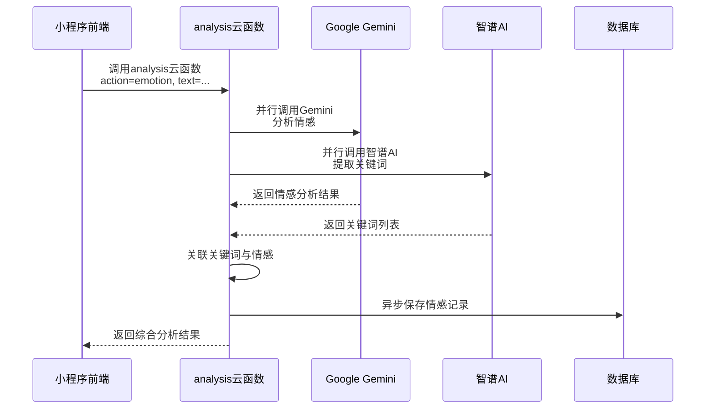

# API接口文档

<cite>
**本文档引用的文件**  
- [login/index.js](file://cloudfunctions/login/index.js)
- [chat/index.js](file://cloudfunctions/chat/index.js)
- [analysis/index.js](file://cloudfunctions/analysis/index.js)
- [getEmotionRecords/index.js](file://cloudfunctions/getEmotionRecords/index.js)
- [doc/开发文档/cloudfunctions/login.md](file://doc/开发文档/cloudfunctions/login.md)
- [doc/开发文档/cloudfunctions/chat.md](file://doc/开发文档/cloudfunctions/chat.md)
- [doc/开发文档/cloudfunctions/analysis.md](file://doc/开发文档/cloudfunctions/analysis.md)
- [doc/开发文档/cloudfunctions/getEmotionRecords.md](file://doc/开发文档/cloudfunctions/getEmotionRecords.md)
- [miniprogram/services/cloudFuncCaller.js](file://miniprogram/services/cloudFuncCaller.js)
</cite>

## 目录
1. [简介](#简介)
2. [云函数调用方式](#云函数调用方式)
3. [核心云函数接口说明](#核心云函数接口说明)
   - [login 云函数](#login-云函数)
   - [chat 云函数](#chat-云函数)
   - [analysis 云函数](#analysis-云函数)
   - [getEmotionRecords 云函数](#getemotionrecords-云函数)
4. [调试与日志](#调试与日志)

## 简介

本文档为HeartChat后端所有云函数API的完整接口参考文档。详细列出了每个可调用云函数的名称、用途、请求参数结构、返回值格式及可能的错误码。文档说明了前端如何通过`wx.cloud.callFunction`发起调用，并提供了JavaScript代码示例。针对复杂接口如`analysis`云函数，阐明了其内部AI服务编排逻辑。同时包含调试提示，指导开发者如何在开发者工具中查看云函数调用日志与性能指标。

## 云函数调用方式

前端通过微信小程序的`wx.cloud.callFunction` API来调用云函数。推荐使用封装好的`cloudFuncCaller.js`工具进行调用，以实现统一的错误处理和加载提示。

### 基本调用语法
```javascript
wx.cloud.callFunction({
  name: '云函数名称',
  data: {
    // 请求参数
  }
}).then(res => {
  // 处理成功响应
}).catch(err => {
  // 处理错误
});
```

### 使用封装工具调用
```javascript
// 引入云函数调用工具
const cloudFuncCaller = require('../../services/cloudFuncCaller.js');

// 调用云函数
async function myFunction() {
  const result = await cloudFuncCaller.callCloudFunc('login', {
    userInfo: { nickName: '用户', avatarUrl: '头像URL' }
  }, {
    showLoading: true,
    loadingText: '登录中...'
  });

  if (result.success) {
    // 处理成功
  } else {
    // 处理失败，错误信息已自动提示
  }
}
```

**Section sources**
- [miniprogram/services/cloudFuncCaller.js](file://miniprogram/services/cloudFuncCaller.js)

## 核心云函数接口说明

### login 云函数

`login`云函数用于处理用户登录认证，生成JWT令牌，并管理用户信息。

#### 功能
- 处理微信用户登录
- 为新用户创建账户
- 更新现有用户信息
- 生成7天有效期的JWT访问令牌
- 记录登录日志

#### 请求参数
| 参数名 | 类型 | 必需 | 说明 |
| :--- | :--- | :--- | :--- |
| `userInfo` | Object | 是 | 微信用户信息对象 |
| `userInfo.nickName` | string | 是 | 用户昵称 |
| `userInfo.avatarUrl` | string | 是 | 头像URL |
| `userInfo.clientIP` | string | 否 | 客户端IP地址 |
| `userInfo.userAgent` | string | 否 | 用户代理字符串 |

#### 返回值格式（成功）
```json
{
  "success": true,
  "data": {
    "token": "JWT访问令牌",
    "isNewUser": false,
    "userInfo": {
      "userId": "1234567",
      "username": "用户名",
      "avatarUrl": "头像URL",
      "userType": 1,
      "status": 1,
      "stats": {
        "stats_id": "统计ID",
        "user_id": "用户ID",
        "chat_count": 5,
        "solved_count": 0,
        "rating_avg": 0,
        "active_days": 3,
        "last_active": "2025-05-05T10:30:00.000Z"
      }
    }
  }
}
```

#### 返回值格式（失败）
```json
{
  "success": false,
  "error": "缺少必要参数"
}
```

#### 错误码
| 错误码 | 说明 |
| :--- | :--- |
| `缺少必要参数` | 请求中缺少`userInfo`参数 |
| `登录失败` | 系统内部错误导致登录失败 |

#### JavaScript调用示例
```javascript
wx.cloud.callFunction({
  name: 'login',
  data: {
    userInfo: {
      nickName: '张三',
      avatarUrl: 'https://example.com/avatar.jpg'
    }
  }
}).then(res => {
  if (res.result.success) {
    const token = res.result.data.token;
    const isNewUser = res.result.data.isNewUser;
    // 存储token，跳转页面
  } else {
    console.error('登录失败:', res.result.error);
  }
});
```

**Section sources**
- [login/index.js](file://cloudfunctions/login/index.js)
- [doc/开发文档/cloudfunctions/login.md](file://doc/开发文档/cloudfunctions/login.md)

### chat 云函数

`chat`云函数提供用户与AI角色的实时对话服务，支持多种AI模型和智能消息分段。

#### 功能
- 发送用户消息并获取AI回复
- 获取聊天历史记录
- 智能分段长AI回复，模拟真实聊天节奏
- 支持多种AI模型（智谱AI、Google Gemini等）
- 管理聊天会话和统计数据

#### 支持的操作类型
| 操作类型 (`action`) | 说明 |
| :--- | :--- |
| `sendMessage` | 发送消息并获取AI回复 |
| `getChatHistory` | 获取聊天历史记录 |
| `saveChatHistory` | 保存聊天记录 |

#### `sendMessage` 请求参数
| 参数名 | 类型 | 必需 | 说明 |
| :--- | :--- | :--- | :--- |
| `action` | string | 是 | 固定为`sendMessage` |
| `roleId` | string | 是 | AI角色ID |
| `content` | string | 是 | 用户发送的消息内容 |
| `chatId` | string | 否 | 聊天会话ID，为空时自动创建 |
| `systemPrompt` | string | 否 | 自定义系统提示词（用于用户画像） |
| `modelType` | string | 否 | AI模型类型，默认`gemini` |
| `modelName` | string | 否 | 具体模型名称 |
| `modelParams` | Object | 否 | 模型参数（温度、最大token等） |
| `chatMemoryLength` | number | 否 | 对话记忆长度，默认20条 |

#### `sendMessage` 返回值格式（成功）
```json
{
  "success": true,
  "content": "完整的AI回复内容",
  "segments": ["分段1", "分段2", "分段3"],
  "emotionAnalysis": {
    "type": "积极",
    "intensity": 0.8,
    "suggestions": ["继续保持"]
  },
  "usage": {
    "prompt_tokens": 100,
    "completion_tokens": 50,
    "total_tokens": 150
  },
  "modelType": "gemini",
  "timestamp": 1746457800000
}
```

#### JavaScript调用示例
```javascript
wx.cloud.callFunction({
  name: 'chat',
  data: {
    action: 'sendMessage',
    roleId: 'role_001',
    content: '今天感觉有点累，怎么办？',
    modelType: 'gemini'
  }
}).then(res => {
  if (res.result.success) {
    const segments = res.result.segments;
    // 逐条显示分段消息
    segments.forEach(segment => {
      // 显示消息
    });
  }
});
```

**Section sources**
- [chat/index.js](file://cloudfunctions/chat/index.js)
- [doc/开发文档/cloudfunctions/chat.md](file://doc/开发文档/cloudfunctions/chat.md)

### analysis 云函数

`analysis`云函数提供情感分析、关键词提取、用户兴趣分析和每日报告生成等高级AI分析功能。

#### 功能
- 文本情感分析
- 关键词提取与分类
- 用户兴趣与关注点分析
- 生成用户每日心情报告
- 调用多种AI模型进行分析

#### 支持的操作类型
| 操作类型 (`action`) | 说明 |
| :--- | :--- |
| `emotion` | 情感分析 |
| `keywords` | 关键词提取 |
| `user_interests` | 用户兴趣分析 |
| `daily_report` | 生成每日报告 |

#### `emotion` 操作请求参数
| 参数名 | 类型 | 必需 | 说明 |
| :--- | :--- | :--- | :--- |
| `action` | string | 是 | 固定为`emotion` |
| `text` | string | 是 | 需要分析的文本 |
| `history` | Array | 否 | 对话历史记录 |
| `saveRecord` | boolean | 否 | 是否将结果保存到数据库 |
| `roleId` | string | 否 | 关联的角色ID |
| `chatId` | string | 否 | 关联的聊天ID |
| `extractKeywords` | boolean | 否 | 是否同时提取关键词 |
| `linkKeywords` | boolean | 否 | 是否关联关键词与情感 |
| `modelType` | string | 否 | AI模型类型，默认`gemini` |

#### `emotion` 操作返回值格式（成功）
```json
{
  "success": true,
  "result": {
    "type": "主要情感类型",
    "intensity": 0.8,
    "valence": 0.5,
    "arousal": 0.6,
    "trend": "上升",
    "primary_emotion": "主要情感",
    "secondary_emotions": ["次要情感1", "次要情感2"],
    "attention_level": "高",
    "radar_dimensions": {
      "trust": 0.7,
      "openness": 0.6,
      "resistance": 0.3,
      "stress": 0.4,
      "control": 0.8
    },
    "topic_keywords": ["关键词1", "关键词2"],
    "emotion_triggers": ["触发词1", "触发词2"],
    "suggestions": ["建议1", "建议2"],
    "summary": "情感总结"
  },
  "recordId": "数据库记录ID",
  "keywords": ["关键词1", "关键词2"]
}
```

#### `daily_report` 操作请求参数
| 参数名 | 类型 | 必需 | 说明 |
| :--- | :--- | :--- | :--- |
| `action` | string | 是 | 固定为`daily_report` |
| `userId` | string | 否 | 用户ID，不传则使用当前用户 |
| `date` | Date | 否 | 报告日期，默认为今天 |
| `forceRegenerate` | boolean | 否 | 是否强制重新生成报告 |

#### `daily_report` 操作返回值格式（成功）
```json
{
  "success": true,
  "reportId": "报告ID",
  "report": {
    "userId": "用户ID",
    "date": "2025-05-05T00:00:00.000Z",
    "emotionSummary": "情感总结",
    "insights": ["洞察1", "洞察2", "洞察3"],
    "suggestions": ["建议1", "建议2", "建议3"],
    "fortune": {
      "good": ["宜做事项1", "宜做事项2"],
      "bad": ["忌做事项1", "忌做事项2"]
    },
    "encouragement": "鼓励语",
    "keywords": [
      { "word": "关键词", "weight": 2.0 }
    ],
    "emotionalVolatility": 65,
    "primaryEmotion": "主要情感",
    "emotionCount": 15,
    "chartData": {
      "emotionDistribution": [...],
      "intensityTrend": [...],
      "focusDistribution": [...]
    },
    "focusPoints": [...],
    "categoryWeights": [...],
    "emotionalInsights": {...},
    "generatedAt": "2025-05-05T10:30:00.000Z",
    "isRead": false
  },
  "isNew": true
}
```

#### 多模型分析流程时序图


**Diagram sources**
- [analysis/index.js](file://cloudfunctions/analysis/index.js)
- [doc/开发文档/cloudfunctions/analysis.md](file://doc/开发文档/cloudfunctions/analysis.md)

**Section sources**
- [analysis/index.js](file://cloudfunctions/analysis/index.js)
- [doc/开发文档/cloudfunctions/analysis.md](file://doc/开发文档/cloudfunctions/analysis.md)

### getEmotionRecords 云函数

`getEmotionRecords`云函数用于查询用户的情绪记录，支持分页查询。

#### 功能
- 根据用户ID查询情绪记录
- 支持按角色ID过滤
- 提供分页功能
- 采用降级查询策略提高兼容性

#### 请求参数
| 参数名 | 类型 | 必需 | 说明 |
| :--- | :--- | :--- | :--- |
| `userId` | string | 是 | 用户ID |
| `roleId` | string | 否 | 角色ID，用于过滤特定角色的记录 |
| `limit` | number | 否 | 查询数量限制，默认20条 |

#### 返回值格式（成功）
```json
{
  "success": true,
  "data": [
    {
      "_id": "记录ID",
      "userId": "用户ID",
      "roleId": "角色ID",
      "analysis": {
        "type": "情感类型",
        "intensity": 0.8,
        "primary_emotion": "主要情感",
        "suggestions": ["建议1", "建议2"],
        "summary": "情感总结"
      },
      "originalText": "原始文本",
      "createTime": "2025-05-05T10:30:00.000Z"
    }
  ],
  "openid": "用户openid",
  "appid": "小程序appid",
  "unionid": "用户unionid"
}
```

#### 返回值格式（失败）
```json
{
  "success": false,
  "error": {
    "stringQueryError": "字符串查询错误信息",
    "objectQueryError": "对象查询错误信息"
  },
  "openid": "用户openid",
  "appid": "小程序appid",
  "unionid": "用户unionid"
}
```

#### JavaScript调用示例
```javascript
wx.cloud.callFunction({
  name: 'getEmotionRecords',
  data: {
    userId: 'user_123',
    limit: 10
  }
}).then(res => {
  if (res.result.success) {
    const records = res.result.data;
    // 处理情绪记录
  } else {
    console.error('查询失败:', res.result.error);
  }
});
```

**Section sources**
- [getEmotionRecords/index.js](file://cloudfunctions/getEmotionRecords/index.js)
- [doc/开发文档/cloudfunctions/getEmotionRecords.md](file://doc/开发文档/cloudfunctions/getEmotionRecords.md)

## 调试与日志

### 查看云函数调用日志
1. 打开微信开发者工具。
2. 在左侧菜单栏选择“云开发”。
3. 进入“云函数”标签页。
4. 找到目标云函数（如`login`），点击其名称。
5. 在云函数详情页，切换到“日志”标签页。
6. 可以查看该云函数的所有调用日志，包括输入参数、执行时间、返回结果和`console.log`输出。

### 查看性能指标
1. 在云函数详情页，切换到“监控”标签页。
2. 可以查看以下性能指标：
   - **调用次数**：云函数被调用的总次数。
   - **执行时间**：每次调用的执行耗时，包括冷启动时间。
   - **错误率**：调用失败的比例。
   - **资源消耗**：内存使用情况。
3. 利用这些指标可以分析云函数的性能瓶颈和稳定性。

### 调试技巧
- **开启详细日志**：在云函数代码中设置`const isDev = true;`，可以输出更详细的`console.log`信息。
- **使用封装工具**：使用`cloudFuncCaller.js`可以统一处理错误和加载状态，便于调试。
- **检查网络请求**：在开发者工具的“网络”标签页中，可以查看`wx.cloud.callFunction`发出的HTTPS请求和响应。
- **模拟参数**：在云开发控制台可以直接输入参数并测试云函数，无需通过小程序前端。

**Section sources**
- [miniprogram/services/cloudFuncCaller.js](file://miniprogram/services/cloudFuncCaller.js)