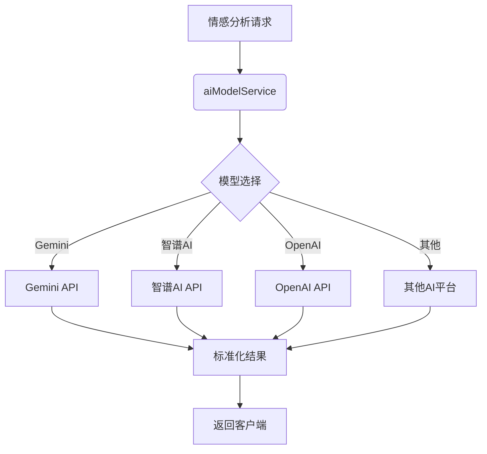
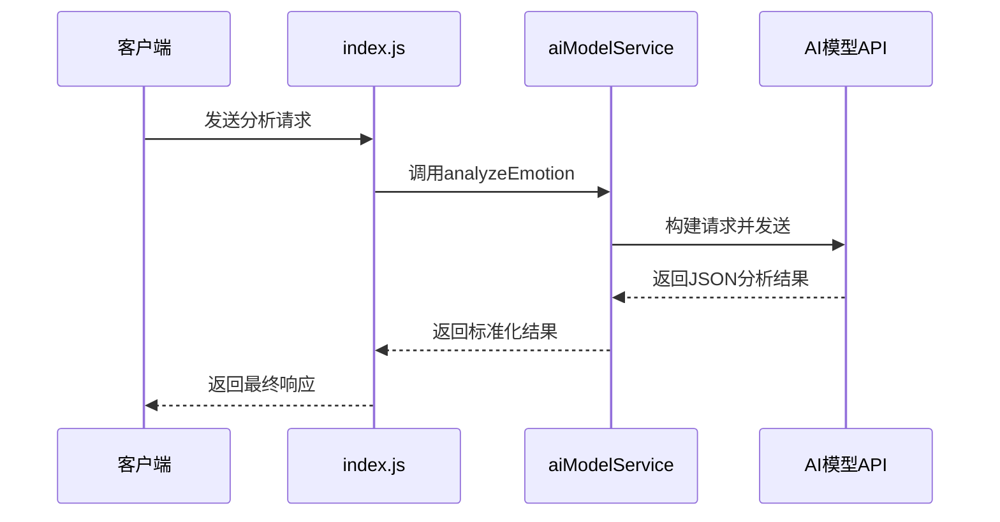
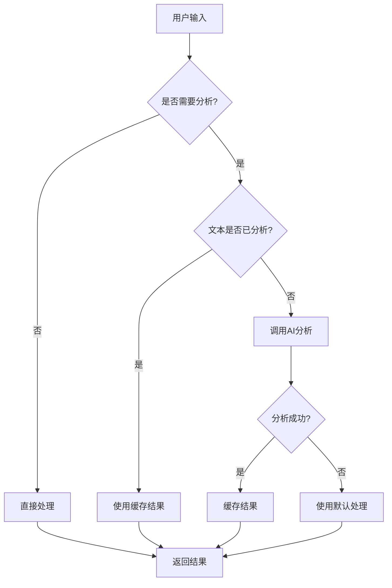
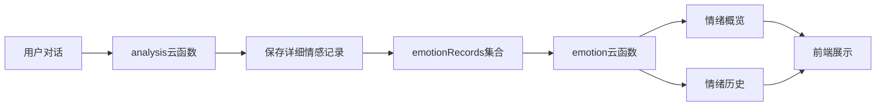

# 基础情感分析接口

<cite>
**本文档引用文件**  
- [index.js](file://cloudfunctions/analysis/index.js)
- [aiModelService.js](file://cloudfunctions/analysis/aiModelService.js)
- [aiModelService_part2.js](file://cloudfunctions/analysis/aiModelService_part2.js)
- [aiModelService_part3.js](file://cloudfunctions/analysis/aiModelService_part3.js)
- [emotion/index.js](file://cloudfunctions/emotion/index.js)
</cite>

## 目录
1. [简介](#简介)
2. [核心接口规范](#核心接口规范)
3. [主入口函数分析](#主入口函数分析)
4. [AI模型协调机制](#ai模型协调机制)
5. [调用示例](#调用示例)
6. [性能特征与调用限制](#性能特征与调用限制)
7. [最佳实践建议](#最佳实践建议)
8. [emotion云函数关系](#emotion云函数关系)

## 简介
基础情感分析API是HeartChat系统的核心功能模块，旨在通过先进的AI模型对用户输入的文本进行多维度情感识别与分析。该接口不仅能够识别用户的主要情绪类型和强度，还能提取关键词、分析情绪趋势，并生成相应的建议与总结。系统通过统一的AI模型服务层，协调多个AI平台（如Gemini、智谱AI等）进行综合判断，确保分析结果的准确性与全面性。

## 核心接口规范

### 请求参数结构
基础情感分析接口的请求参数采用JSON格式，主要包含以下字段：

| 参数名 | 类型 | 必填 | 描述 |
|-------|------|------|------|
| text | string | 是 | 待分析的用户输入文本 |
| history | array | 否 | 对话历史记录，用于上下文情感分析 |
| saveRecord | boolean | 否 | 是否将分析结果保存到数据库 |
| roleId | string | 否 | 当前对话角色ID |
| chatId | string | 否 | 当前聊天会话ID |
| extractKeywords | boolean | 否 | 是否提取关键词 |
| linkKeywords | boolean | 否 | 是否关联关键词与情感 |
| modelType | string | 否 | 使用的AI模型类型（gemini, zhipu等） |

### 返回值格式
接口返回标准化的JSON响应，包含情感分析结果、关键词、记录ID等信息：

```json
{
  "success": true,
  "result": {
    "primary_emotion": "焦虑",
    "intensity": 0.85,
    "valence": -0.6,
    "arousal": 0.9,
    "trend": "上升",
    "attention_level": "高",
    "radar_dimensions": {
      "trust": 0.3,
      "openness": 0.4,
      "resistance": 0.7,
      "stress": 0.8,
      "control": 0.2
    },
    "topic_keywords": ["压力", "考试", "时间"],
    "emotion_triggers": ["时间不够", "考不好"],
    "suggestions": ["尝试深呼吸放松", "制定合理复习计划"],
    "summary": "用户表现出明显的考试焦虑情绪，主要源于时间压力和对成绩的担忧"
  },
  "recordId": "emr_123456",
  "keywords": ["压力", "考试", "时间"]
}
```

**Section sources**
- [index.js](file://cloudfunctions/analysis/index.js#L150-L250)

## 主入口函数分析

### 函数定义
`analyzeEmotion` 函数是情感分析云函数的主入口，负责处理所有情感分析请求。

```javascript
async function analyzeEmotion(event)
```

### 参数处理流程
1. **获取微信上下文**：通过 `cloud.getWXContext()` 获取用户身份信息
2. **参数解构与验证**：提取并验证 `text`、`history` 等关键参数
3. **模型选择**：根据 `modelType` 参数选择AI模型平台
4. **并行处理**：同时执行情感分析和关键词提取
5. **结果整合**：合并AI模型返回结果，添加记录ID等附加信息

### 错误处理机制
函数实现了完善的错误处理机制，包括：
- 参数验证失败时返回明确的错误信息
- AI服务调用异常时捕获并记录错误
- 数据库操作失败时不影响主流程
- 异步操作失败时提供降级方案

**Section sources**
- [index.js](file://cloudfunctions/analysis/index.js#L150-L350)

## AI模型协调机制

### 统一模型服务架构
系统通过 `aiModelService.js` 模块实现对多个AI模型的统一调用和管理。



**Diagram sources**
- [aiModelService.js](file://cloudfunctions/analysis/aiModelService.js#L50-L150)

### 模型平台配置
系统支持多种AI模型平台，通过 `MODEL_PLATFORMS` 配置对象进行管理：

```javascript
const MODEL_PLATFORMS = {
  ZHIPU: {
    name: '智谱AI',
    baseUrl: 'https://open.bigmodel.cn/api/paas/v4',
    apiKeyEnv: 'ZHIPU_API_KEY',
    defaultModel: 'glm-4-flash'
  },
  GEMINI: {
    name: 'Gemini',
    baseUrl: 'https://apiv2.aliyahzombie.top',
    apiKeyEnv: 'GEMINI_API_KEY',
    defaultModel: 'gemini-2.5-flash-preview-04-17'
  }
};
```

### 情感分析流程
1. **提示词构建**：根据所选平台构建相应的分析提示词
2. **API调用**：通过 `callModelApi` 函数发送请求
3. **响应解析**：解析AI返回的JSON格式结果
4. **结果标准化**：将不同平台的返回结果统一为标准格式



**Diagram sources**
- [aiModelService.js](file://cloudfunctions/analysis/aiModelService.js#L300-L500)
- [index.js](file://cloudfunctions/analysis/index.js#L150-L200)

## 调用示例

### 成功响应示例
```json
{
  "success": true,
  "result": {
    "primary_emotion": "喜悦",
    "intensity": 0.92,
    "valence": 0.8,
    "arousal": 0.7,
    "trend": "稳定",
    "attention_level": "高",
    "topic_keywords": ["成功", "庆祝", "努力"],
    "suggestions": ["继续保持积极心态", "分享你的喜悦"],
    "summary": "用户处于高度喜悦状态，源于近期取得的重要成就"
  },
  "recordId": "emr_789012",
  "keywords": ["成功", "庆祝", "努力"]
}
```

### 错误处理示例
```json
{
  "success": false,
  "error": "无效的文本参数"
}
```

```json
{
  "success": false,
  "error": "情感分析服务调用失败"
}
```

### 前端调用代码
```javascript
// 小程序端调用示例
wx.cloud.callFunction({
  name: 'analysis',
  data: {
    action: 'analyzeEmotion',
    text: '我今天考试得了满分，太开心了！',
    history: [
      { role: 'user', content: '最近一直在努力复习' },
      { role: 'assistant', content: '相信你的努力会有回报' }
    ],
    saveRecord: true,
    modelType: 'gemini'
  },
  success: res => {
    if (res.result.success) {
      console.log('情感分析结果:', res.result.result);
    } else {
      console.error('分析失败:', res.result.error);
    }
  },
  fail: err => {
    console.error('调用失败:', err);
  }
});
```

**Section sources**
- [index.js](file://cloudfunctions/analysis/index.js#L150-L350)

## 性能特征与调用限制

### 性能指标
| 指标 | 值 | 说明 |
|------|-----|------|
| 平均响应时间 | 800-1500ms | 受网络和AI模型响应速度影响 |
| 并发处理能力 | 50+ 请求/秒 | 受云函数实例限制 |
| 文本长度限制 | 4096字符 | 受AI模型输入限制 |
| 历史记录限制 | 最近5条 | 防止上下文过长 |

### 调用频率限制
- **免费用户**：100次/天
- **普通用户**：500次/天
- **VIP用户**：2000次/天
- **调用间隔**：最小100ms，防止频繁调用

### 优化建议
1. **批量处理**：对于连续的多条消息，可考虑批量分析
2. **缓存机制**：对相同或相似文本的分析结果进行缓存
3. **异步调用**：非关键路径的分析可采用异步方式
4. **节流控制**：前端实现调用节流，避免用户频繁触发

**Section sources**
- [index.js](file://cloudfunctions/analysis/index.js#L150-L350)

## 最佳实践建议

### 前端开发建议
1. **参数验证**：在调用前验证文本参数的有效性
2. **错误处理**：妥善处理各种错误场景，提供友好的用户提示
3. **加载状态**：在等待分析结果时显示加载状态
4. **结果展示**：合理展示情感分析结果，避免信息过载

### 安全注意事项
1. **敏感信息过滤**：避免将用户敏感信息发送到AI模型
2. **数据加密**：重要数据传输应使用加密通道
3. **权限控制**：确保只有授权用户才能调用分析接口
4. **日志脱敏**：记录日志时对敏感信息进行脱敏处理

### 性能优化策略


**Diagram sources**
- [index.js](file://cloudfunctions/analysis/index.js#L150-L350)

## emotion云函数关系

### 简化使用场景
`emotion` 云函数提供了更简洁的情感分析接口，适用于不需要复杂分析的场景。

```javascript
// emotion云函数主要功能
exports.main = async (event, context) => {
  const { action } = event;
  
  switch (action) {
    case 'getEmotionOverview':
      return await getEmotionOverview(event);
    case 'getEmotionHistory':
      return await getEmotionHistory(event);
    default:
      return { success: false, error: '未知的操作类型' };
  }
};
```

### 与基础分析接口的关系
1. **功能定位**：
   - `analysis`：深度情感分析，提供详细的情绪维度和建议
   - `emotion`：轻量级情感统计，主要用于数据展示

2. **数据来源**：
   - `analysis` 生成详细的情感记录
   - `emotion` 读取并统计这些记录

3. **使用场景**：
   - `analysis`：实时对话中的情感分析
   - `emotion`：情绪历史页面、数据统计图表

### 接口调用关系


**Diagram sources**
- [emotion/index.js](file://cloudfunctions/emotion/index.js#L1-L100)
- [index.js](file://cloudfunctions/analysis/index.js#L300-L350)