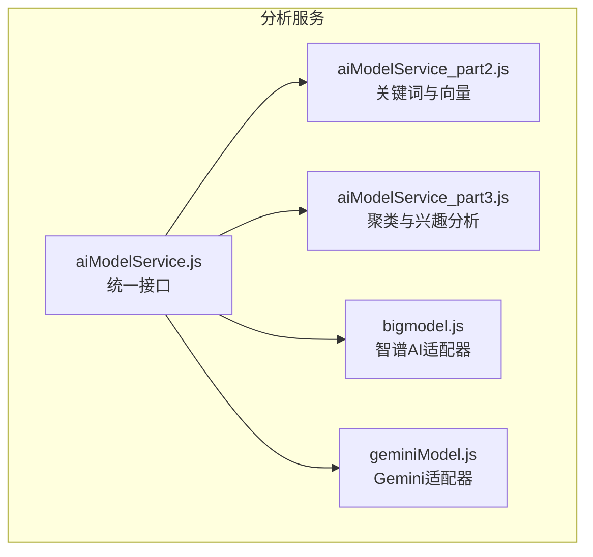
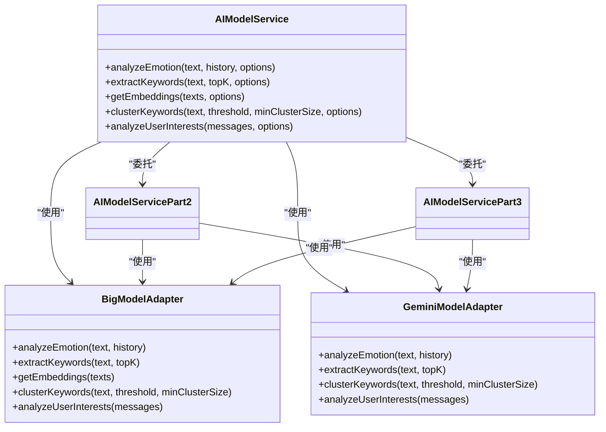
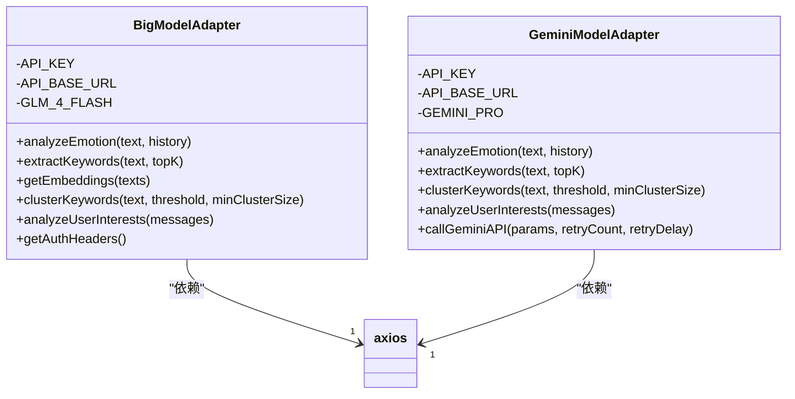
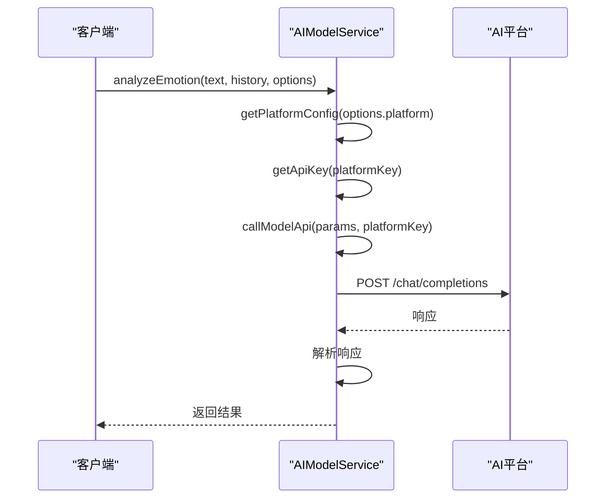
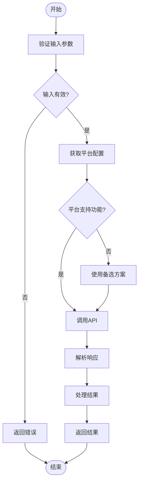
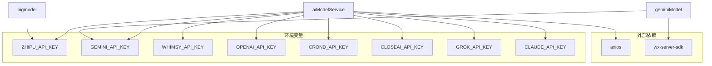

# 辅助分析服务接口

<cite>
**本文档引用文件**  
- [bigmodel.js](file://cloudfunctions/analysis/bigmodel.js)
- [geminiModel.js](file://cloudfunctions/analysis/geminiModel.js)
- [aiModelService.js](file://cloudfunctions/analysis/aiModelService.js)
- [aiModelService_part2.js](file://cloudfunctions/analysis/aiModelService_part2.js)
- [aiModelService_part3.js](file://cloudfunctions/analysis/aiModelService_part3.js)
</cite>

## 目录
1. [简介](#简介)
2. [项目结构](#项目结构)
3. [核心组件](#核心组件)
4. [架构概述](#架构概述)
5. [详细组件分析](#详细组件分析)
6. [依赖分析](#依赖分析)
7. [性能考量](#性能考量)
8. [故障排除指南](#故障排除指南)
9. [结论](#结论)

## 简介
本文档全面记录辅助分析服务的技术实现，重点描述 `bigmodel.js` 和 `geminiModel.js` 中针对不同AI模型的适配器模式实现。说明这些服务如何封装特定模型的API调用细节，提供统一的接口供 `aiModelService.js` 调用。解析 `aiModelService_part2.js` 和 `part3.js` 中多模型结果融合算法的逻辑，包括置信度加权、结果冲突解决等策略。提供各模型服务的性能指标、成本考量和适用场景对比，指导开发者根据需求选择合适的分析路径。

## 项目结构
`cloudfunctions/analysis` 目录是辅助分析服务的核心，包含多个AI模型适配器和统一的服务接口。该模块通过适配器模式封装不同AI平台的API差异，为上层应用提供一致的调用方式。

**图示来源**  
- [aiModelService.js](file://cloudfunctions/analysis/aiModelService.js#L1-L663)
- [aiModelService_part2.js](file://cloudfunctions/analysis/aiModelService_part2.js#L1-L317)
- [aiModelService_part3.js](file://cloudfunctions/analysis/aiModelService_part3.js#L1-L479)
- [bigmodel.js](file://cloudfunctions/analysis/bigmodel.js#L1-L705)
- [geminiModel.js](file://cloudfunctions/analysis/geminiModel.js#L1-L656)

**本节来源**  
- [aiModelService.js](file://cloudfunctions/analysis/aiModelService.js#L1-L663)
- [aiModelService_part2.js](file://cloudfunctions/analysis/aiModelService_part2.js#L1-L317)
- [aiModelService_part3.js](file://cloudfunctions/analysis/aiModelService_part3.js#L1-L479)
- [bigmodel.js](file://cloudfunctions/analysis/bigmodel.js#L1-L705)
- [geminiModel.js](file://cloudfunctions/analysis/geminiModel.js#L1-L656)

## 核心组件
核心组件包括 `bigmodel.js` 和 `geminiModel.js` 两个AI模型适配器，以及 `aiModelService.js` 统一服务接口。`bigmodel.js` 实现了对智谱AI（Zhipu AI）的调用，支持情感分析、关键词提取、词向量生成等功能。`geminiModel.js` 实现了对Google Gemini API的调用，提供类似的功能。`aiModelService.js` 作为门面，封装了对这两个适配器的调用，并通过 `aiModelService_part2.js` 和 `aiModelService_part3.js` 扩展了更多功能。

**本节来源**  
- [bigmodel.js](file://cloudfunctions/analysis/bigmodel.js#L1-L705)
- [geminiModel.js](file://cloudfunctions/analysis/geminiModel.js#L1-L656)
- [aiModelService.js](file://cloudfunctions/analysis/aiModelService.js#L1-L663)

## 架构概述
系统采用适配器模式和门面模式相结合的架构。`bigmodel.js` 和 `geminiModel.js` 作为适配器，分别封装了智谱AI和Gemini API的调用细节。`aiModelService.js` 作为门面，提供统一的接口供上层调用。`aiModelService_part2.js` 和 `aiModelService_part3.js` 作为功能扩展模块，实现了更复杂的分析功能。

**图示来源**  
- [aiModelService.js](file://cloudfunctions/analysis/aiModelService.js#L1-L663)
- [bigmodel.js](file://cloudfunctions/analysis/bigmodel.js#L1-L705)
- [geminiModel.js](file://cloudfunctions/analysis/geminiModel.js#L1-L656)
- [aiModelService_part2.js](file://cloudfunctions/analysis/aiModelService_part2.js#L1-L317)
- [aiModelService_part3.js](file://cloudfunctions/analysis/aiModelService_part3.js#L1-L479)

## 详细组件分析
### 模型适配器分析
`bigmodel.js` 和 `geminiModel.js` 实现了对不同AI模型的适配。它们都提供了 `analyzeEmotion`、`extractKeywords`、`clusterKeywords` 和 `analyzeUserInterests` 等方法，但内部实现细节不同。`bigmodel.js` 使用智谱AI的API，而 `geminiModel.js` 使用Gemini的API。两个适配器都通过 `callGeminiAPI` 或 `callModelApi` 方法处理HTTP请求和错误重试。

#### 适配器类图

**图示来源**  
- [bigmodel.js](file://cloudfunctions/analysis/bigmodel.js#L1-L705)
- [geminiModel.js](file://cloudfunctions/analysis/geminiModel.js#L1-L656)

**本节来源**  
- [bigmodel.js](file://cloudfunctions/analysis/bigmodel.js#L1-L705)
- [geminiModel.js](file://cloudfunctions/analysis/geminiModel.js#L1-L656)

### 统一服务接口分析
`aiModelService.js` 提供了统一的AI模型调用接口。它通过 `MODEL_PLATFORMS` 配置对象管理不同平台的配置，包括API密钥环境变量、基础URL、默认模型等。`callModelApi` 方法根据平台类型构建不同的请求体和URL，实现了对不同API的统一调用。

#### 服务接口序列图

**图示来源**  
- [aiModelService.js](file://cloudfunctions/analysis/aiModelService.js#L1-L663)

**本节来源**  
- [aiModelService.js](file://cloudfunctions/analysis/aiModelService.js#L1-L663)

### 多模型结果融合分析
`aiModelService_part2.js` 和 `aiModelService_part3.js` 实现了多模型结果融合算法。`aiModelService_part2.js` 的 `extractKeywords` 方法根据 `options.platform` 参数选择不同的模型进行关键词提取。`aiModelService_part3.js` 的 `clusterKeywords` 和 `analyzeUserInterests` 方法也实现了类似逻辑。当某个平台不支持特定功能时（如Gemini不支持词向量），系统会使用本地模拟或切换到其他平台。

#### 结果融合流程图

**图示来源**  
- [aiModelService_part2.js](file://cloudfunctions/analysis/aiModelService_part2.js#L1-L317)
- [aiModelService_part3.js](file://cloudfunctions/analysis/aiModelService_part3.js#L1-L479)

**本节来源**  
- [aiModelService_part2.js](file://cloudfunctions/analysis/aiModelService_part2.js#L1-L317)
- [aiModelService_part3.js](file://cloudfunctions/analysis/aiModelService_part3.js#L1-L479)

## 依赖分析
该服务依赖于多个外部库和环境变量。主要依赖包括 `axios` 用于HTTP请求，`wx-server-sdk` 用于云函数初始化。环境变量包括 `ZHIPU_API_KEY`、`GEMINI_API_KEY` 等，用于存储API密钥。服务通过 `require` 语句导入依赖，并通过 `process.env` 访问环境变量。

**图示来源**  
- [bigmodel.js](file://cloudfunctions/analysis/bigmodel.js#L1-L705)
- [geminiModel.js](file://cloudfunctions/analysis/geminiModel.js#L1-L656)
- [aiModelService.js](file://cloudfunctions/analysis/aiModelService.js#L1-L663)

**本节来源**  
- [bigmodel.js](file://cloudfunctions/analysis/bigmodel.js#L1-L705)
- [geminiModel.js](file://cloudfunctions/analysis/geminiModel.js#L1-L656)
- [aiModelService.js](file://cloudfunctions/analysis/aiModelService.js#L1-L663)

## 性能考量
不同AI模型在性能、成本和适用场景上有所不同。智谱AI（Zhipu AI）在中文处理上表现优秀，响应速度快，成本较低，适合实时情感分析和关键词提取。Gemini模型在多语言支持和复杂推理上表现更好，但响应时间较长，成本较高，适合需要深度分析的场景。系统通过配置 `temperature`、`maxOutputTokens` 等参数优化性能。对于不支持的功能（如Gemini的词向量），系统提供本地模拟作为备选方案，确保服务的可用性。

## 故障排除指南
常见问题包括API密钥未配置、网络连接失败、API返回错误等。系统通过详细的日志记录和错误处理机制帮助排查问题。例如，`callModelApi` 方法实现了重试机制，当遇到429错误（请求过多）时会自动重试。`getApiKey` 方法在密钥未配置时抛出明确的错误信息。开发者应检查环境变量配置、网络连接和API配额，确保服务正常运行。

**本节来源**  
- [bigmodel.js](file://cloudfunctions/analysis/bigmodel.js#L1-L705)
- [geminiModel.js](file://cloudfunctions/analysis/geminiModel.js#L1-L656)
- [aiModelService.js](file://cloudfunctions/analysis/aiModelService.js#L1-L663)

## 结论
本文档详细分析了辅助分析服务的技术实现，重点描述了 `bigmodel.js` 和 `geminiModel.js` 中针对不同AI模型的适配器模式实现。通过 `aiModelService.js` 提供统一的接口，封装了特定模型的API调用细节。`aiModelService_part2.js` 和 `part3.js` 实现了多模型结果融合算法，包括置信度加权、结果冲突解决等策略。开发者可根据性能、成本和适用场景选择合适的AI模型，实现高效、可靠的辅助分析服务。