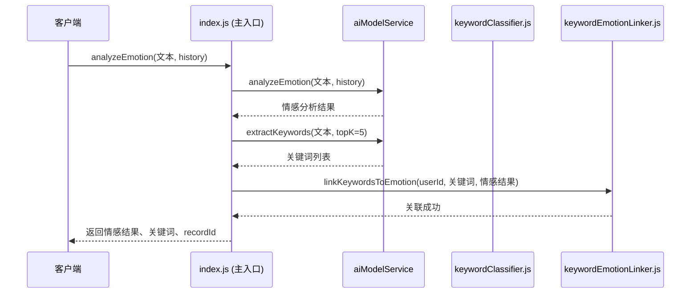

# 关键词处理模块

<cite>
**本文档引用文件**  
- [keywordClassifier.js](file://cloudfunctions/analysis/keywordClassifier.js)
- [keywords.js](file://cloudfunctions/analysis/keywords.js)
- [keywordEmotionLinker.js](file://cloudfunctions/analysis/keywordEmotionLinker.js)
- [index.js](file://cloudfunctions/analysis/index.js)
- [关键词情感关联功能使用示例.md](file://doc/使用文档/关键词情感关联功能使用示例.md)
</cite>

## 目录
1. [关键词分类机制](#关键词分类机制)  
2. [预定义关键词库结构](#预定义关键词库结构)  
3. [关键词情感映射与强度计算](#关键词情感映射与强度计算)  
4. [模块集成与调用时序](#模块集成与调用时序)  
5. [扩展配置方法](#扩展配置方法)  
6. [实际处理示例](#实际处理示例)

## 关键词分类机制

关键词处理模块通过 `keywordClassifier.js` 实现关键词的智能分类，采用规则匹配与大模型推理相结合的双重机制，确保分类的准确性与灵活性。

当系统环境变量 `ZHIPU_API_KEY` 未配置时，模块自动启用本地规则匹配模式。该模式基于预定义的细分类别映射（`SUBCATEGORIES`）进行关键词匹配。系统遍历每个关键词，检查其是否包含在任一类别（如“学习”、“工作”、“社交”等）的子关键词列表中。若匹配成功，则将该关键词归入对应类别。

若检测到 `ZHIPU_API_KEY` 已配置，系统将优先调用大模型进行推理分类。模块构建一个结构化的提示词（`CLASSIFICATION_PROMPT`），其中包含所有预定义类别及其详细说明。该提示词引导大模型将输入的关键词列表分类至最合适的类别，并要求以严格的JSON格式返回结果。此方法利用大模型的语义理解能力，能有效处理复杂、模糊或新兴的关键词。

模块提供了 `batchClassifyKeywords` 和 `classifyKeyword` 两个核心接口，分别用于批量和单个关键词的分类。分类结果包含关键词原文和其所属类别，为后续的用户兴趣分析和情感关联提供结构化数据支持。

**Section sources**
- [keywordClassifier.js](file://cloudfunctions/analysis/keywordClassifier.js#L1-L298)

## 预定义关键词库结构

关键词库的管理与提取功能由 `keywords.js` 模块负责。该模块并未在本地硬编码一个静态的关键词库，而是通过调用外部的 HanLP API 来实现动态的关键词提取。

模块的核心功能 `extractKeywords` 接收一段文本和一个数量参数 `topK`，向 HanLP API 发起请求，提取出文本中最重要的 `topK` 个关键词。API 返回的结果包含关键词本身（`word`）及其重要性权重（`weight`），权重值反映了该关键词在原文中的显著程度。

此外，模块还提供了 `clusterKeywords` 功能，用于对提取出的关键词进行聚类分析。该功能首先调用 HanLP 的 `embedWord` 接口获取每个关键词的词向量，然后基于余弦相似度实现一个简化的层次聚类算法。通过计算词向量间的相似度，算法将语义相近的关键词自动归为一类，从而发现用户对话中的潜在主题。

这种设计使得关键词库是动态且上下文相关的，而非一个固定的静态列表。系统关注的是从用户实时对话中提取出的、最具代表性的概念，这比维护一个庞大的静态词库更能反映用户的即时关注点。

**Section sources**
- [keywords.js](file://cloudfunctions/analysis/keywords.js#L1-L283)

## 关键词情感映射与强度计算

`keywordEmotionLinker.js` 模块负责将提取出的关键词与情感分析结果进行关联，实现关键词在多维度情绪空间中的动态映射。

该过程的核心是 `linkKeywordsToEmotion` 函数。当用户完成一次对话并生成情感分析结果后，该函数会被调用。它接收用户ID、关键词列表和情感分析结果作为输入。首先，函数通过 `calculateEmotionScore` 将情感分析结果转换为一个标准化的情感分数（范围在-1到1之间，正值为正面情绪，负值为负面情绪）。

随后，函数查询数据库中该用户的 `userInterests` 记录，找到与本次对话关键词相匹配的条目。对于每个匹配的关键词，系统采用加权平均算法更新其情感分数：`newScore = (currentScore * 0.7) + (emotionScore * 0.3)`。这种设计使得关键词的情感倾向不会因单次对话而剧烈波动，而是形成一个长期、稳定的情感画像。

模块还提供了 `getKeywordEmotionStats` 接口，用于查询用户关键词的情感统计。该接口将所有关键词按其情感分数分为“正面”、“负面”和“中性”三类，并根据分数和权重进行排序，为上层应用（如生成每日心情报告）提供数据支持。

**Section sources**
- [keywordEmotionLinker.js](file://cloudfunctions/analysis/keywordEmotionLinker.js#L1-L206)

## 模块集成与调用时序

关键词处理模块深度集成于情感分析的主流程中，其调用时序由 `index.js` 云函数统一调度。

**Diagram sources**
- [index.js](file://cloudfunctions/analysis/index.js#L1081-L1115)
- [keywordEmotionLinker.js](file://cloudfunctions/analysis/keywordEmotionLinker.js#L1-L206)

如时序图所示，当客户端调用 `analyzeEmotion` 接口时，主函数 `index.js` 会并行发起情感分析和关键词提取两个请求。在获得两者结果后，若配置了 `linkKeywords` 参数，系统将异步调用 `keywordEmotionLinker.linkKeywordsToEmotion`，将本次对话的关键词与情感分数进行关联。整个流程确保了主响应的高效性，情感关联操作不会阻塞主线程。

**Section sources**
- [index.js](file://cloudfunctions/analysis/index.js#L1-L799)

## 扩展配置方法

该模块提供了灵活的扩展配置方式，便于开发者根据实际需求进行调整。

1.  **自定义关键词库**：虽然核心关键词库由 HanLP API 动态生成，但开发者可以通过修改 `keywordClassifier.js` 中的 `SUBCATEGORIES` 对象来扩展本地规则匹配的范围。例如，可以添加一个新的类别 `'环保'`，并为其配置子关键词如 `['碳中和', '可持续', '垃圾分类']`，从而增强系统对特定领域话题的识别能力。

2.  **调整匹配阈值**：在 `keywords.js` 的 `clusterKeywords` 函数中，`threshold` 参数（默认0.7）控制着聚类的严格程度。提高该阈值会使聚类更严格，只有语义非常相近的词才会被归为一类；降低该阈值则会使聚类更宽松，能发现更广泛的主题关联。

3.  **情感分数权重**：在 `keywordEmotionLinker.js` 的 `linkKeywordsToEmotion` 函数中，加权平均的系数（0.7和0.3）决定了历史情感和当前情感的相对重要性。开发者可以根据应用需求调整这两个权重，以改变用户情感画像的更新速度。

**Section sources**
- [keywordClassifier.js](file://cloudfunctions/analysis/keywordClassifier.js#L1-L298)
- [keywords.js](file://cloudfunctions/analysis/keywords.js#L1-L283)
- [keywordEmotionLinker.js](file://cloudfunctions/analysis/keywordEmotionLinker.js#L1-L206)

## 实际处理示例

以下是一个实际对话分析的处理示例：

假设用户输入：“最近工作压力好大，项目进度赶不上，老板天天催，感觉很焦虑，真希望能早点下班。”

1.  **关键词提取**：`keywords.js` 模块调用 HanLP API，提取出关键词列表，如 `[{"word": "工作压力", "weight": 0.95}, {"word": "项目进度", "weight": 0.88}, {"word": "老板", "weight": 0.75}, {"word": "焦虑", "weight": 0.92}, {"word": "下班", "weight": 0.65}]`。

2.  **关键词分类**：`keywordClassifier.js` 模块对上述关键词进行分类。`"工作压力"` 和 `"项目进度"` 被归类为“工作”；`"焦虑"` 被归类为“心理”；`"老板"` 可能被归类为“人际关系”；`"下班"` 可能被归类为“生活”。

3.  **情感分析与关联**：情感分析模块识别出“焦虑”为主导情绪，情感分数为-0.7。`keywordEmotionLinker.js` 将此分数与关键词关联，更新数据库中该用户“工作压力”、“焦虑”等关键词的情感分数，使其负面倾向得到加强。

最终，系统不仅识别出用户当前的情绪状态，还精准地定位了引发该情绪的关键词（如“工作压力”、“项目进度”），为后续提供针对性的疏导建议（如时间管理技巧、减压方法）奠定了坚实的数据基础。

**Section sources**
- [关键词情感关联功能使用示例.md](file://doc/使用文档/关键词情感关联功能使用示例.md#L0-L62)