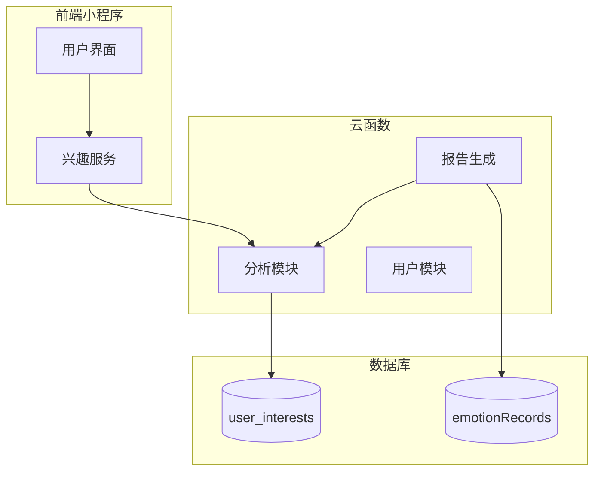
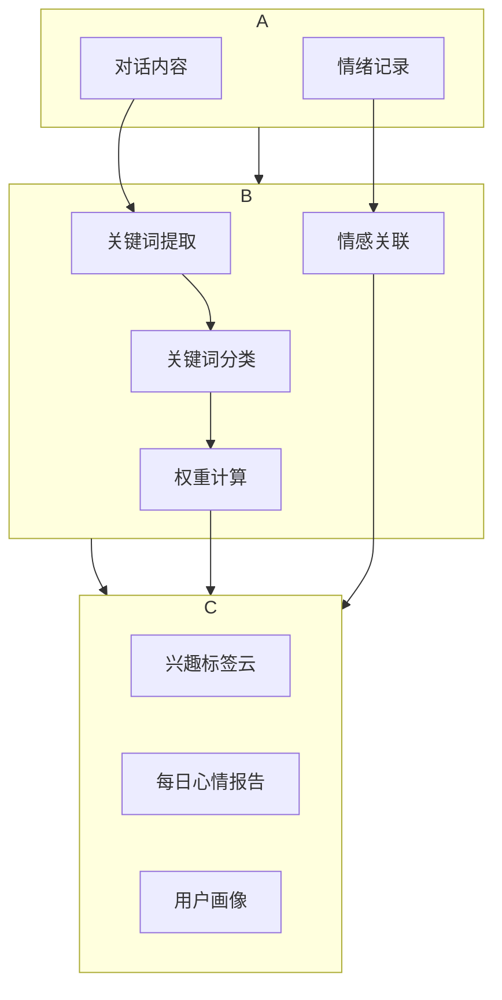
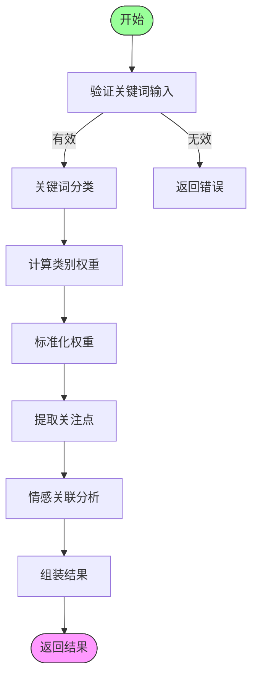
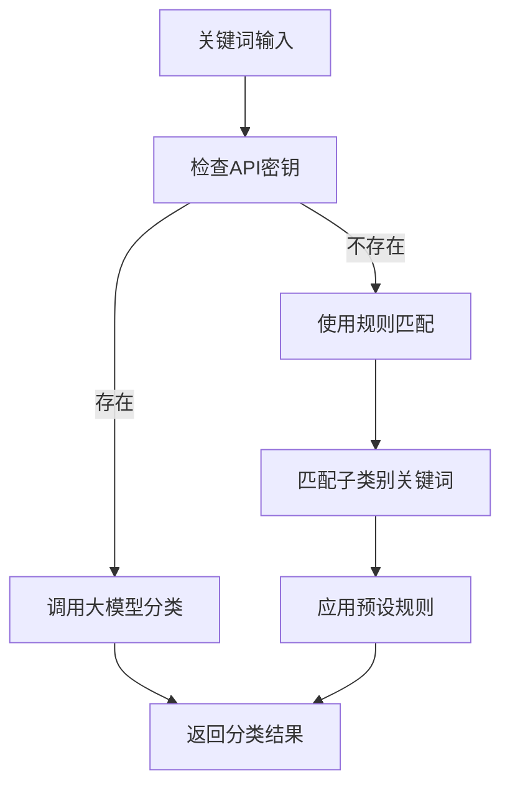
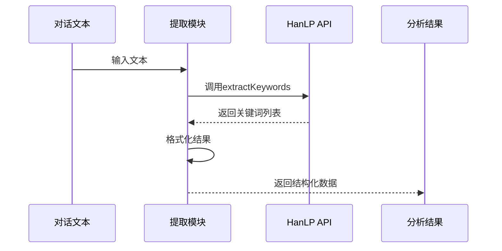
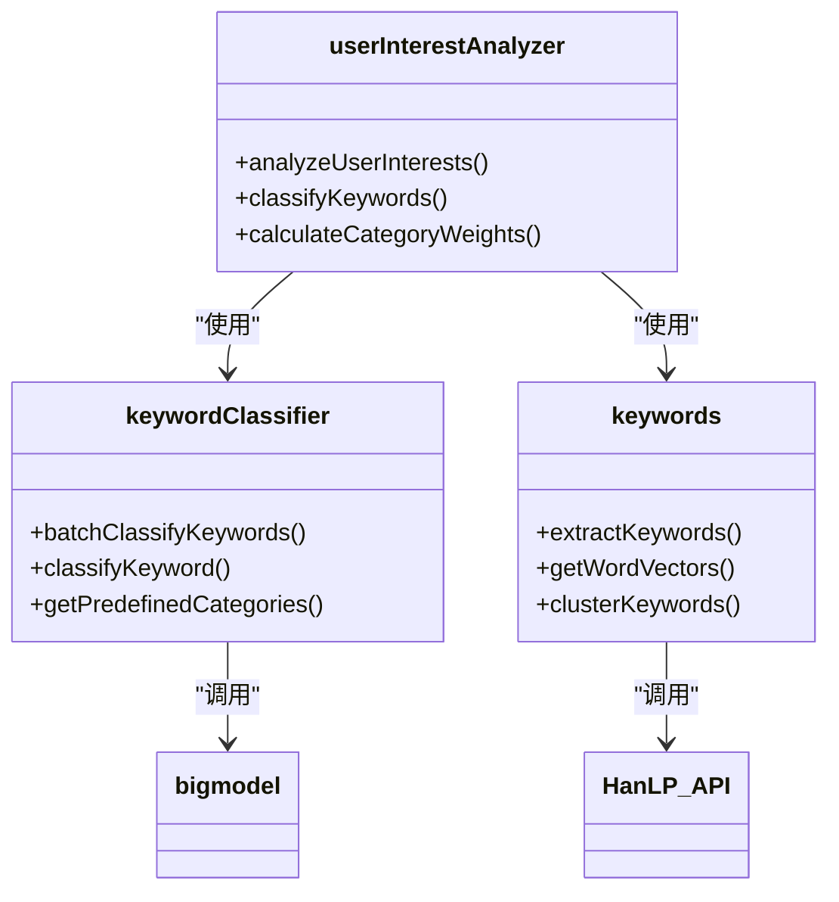

# 用户兴趣分析

<cite>
**本文档引用文件**  
- [userInterestAnalyzer.js](file://cloudfunctions/analysis/userInterestAnalyzer.js)
- [keywords.js](file://cloudfunctions/analysis/keywords.js)
- [keywordClassifier.js](file://cloudfunctions/analysis/keywordClassifier.js)
- [index.js](file://cloudfunctions/generateDailyReports/index.js)
- [userInterests.md](file://doc/开发文档/database/userInterests.md)
- [用户兴趣分类功能说明.md](file://doc/使用文档/用户兴趣分类功能说明.md)
- [userInterestsService.js](file://miniprogram/services/userInterestsService.js)
</cite>

## 目录
1. [简介](#简介)
2. [项目结构](#项目结构)
3. [核心组件](#核心组件)
4. [架构概述](#架构概述)
5. [详细组件分析](#详细组件分析)
6. [依赖分析](#依赖分析)
7. [性能考虑](#性能考虑)
8. [故障排除指南](#故障排除指南)
9. [结论](#结论)

## 简介
本系统通过分析用户历史对话内容，构建多维度的用户兴趣画像。系统采用关键词提取、话题聚类和表达倾向性分析等技术，结合情感数据进行综合判断，实现对用户兴趣领域的精准识别与动态更新。该功能广泛应用于每日心情报告生成、个性化推荐等场景，为用户提供深度的自我认知服务。

## 项目结构
系统主要由云函数模块、前端服务和数据库三大部分构成。核心兴趣分析功能位于`cloudfunctions/analysis`目录下，包含关键词提取、分类和兴趣建模等关键组件。

**图示来源**  
- [userInterestAnalyzer.js](file://cloudfunctions/analysis/userInterestAnalyzer.js#L1-L288)
- [userInterestsService.js](file://miniprogram/services/userInterestsService.js#L479-L574)

**本节来源**  
- [userInterestAnalyzer.js](file://cloudfunctions/analysis/userInterestAnalyzer.js#L1-L288)
- [project_structure](file://.)

## 核心组件
系统核心组件包括用户兴趣分析器、关键词分类器和关键词提取模块。这些组件协同工作，完成从原始对话到兴趣画像的完整转换过程。兴趣分析器负责整体流程控制，分类器实现领域识别，提取模块提供基础数据支持。

**本节来源**  
- [userInterestAnalyzer.js](file://cloudfunctions/analysis/userInterestAnalyzer.js#L1-L288)
- [keywordClassifier.js](file://cloudfunctions/analysis/keywordClassifier.js#L1-L298)

## 架构概述
系统采用分层架构设计，包含数据采集层、分析处理层和应用服务层。各层之间通过清晰的接口进行通信，确保系统的可维护性和扩展性。

**图示来源**  
- [userInterestAnalyzer.js](file://cloudfunctions/analysis/userInterestAnalyzer.js#L36-L73)
- [keywords.js](file://cloudfunctions/analysis/keywords.js#L10-L45)

## 详细组件分析

### 用户兴趣分析器分析
用户兴趣分析器是系统的核心处理单元，负责整合关键词和情绪数据，生成完整的兴趣画像。

#### 算法流程

**图示来源**  
- [userInterestAnalyzer.js](file://cloudfunctions/analysis/userInterestAnalyzer.js#L36-L73)

#### 核心方法
- `analyzeUserInterests`: 主分析入口，协调各子模块工作流程
- `classifyKeywords`: 调用分类器对关键词进行领域归类
- `calculateCategoryWeights`: 统计各类别关键词权重总和
- `normalizeWeights`: 将权重转换为百分比形式
- `extractFocusPoints`: 识别用户主要关注领域
- `analyzeEmotionalAssociations`: 分析关键词与情绪的关联性

**本节来源**  
- [userInterestAnalyzer.js](file://cloudfunctions/analysis/userInterestAnalyzer.js#L1-L288)

### 关键词分类器分析
关键词分类器负责将提取的关键词映射到预定义的兴趣领域，是实现兴趣画像的基础。

#### 分类策略

**图示来源**  
- [keywordClassifier.js](file://cloudfunctions/analysis/keywordClassifier.js#L150-L250)

#### 预定义分类体系
系统预定义了25个主要兴趣类别，涵盖学习、工作、娱乐等多个维度。每个类别配有详细的说明和代表性关键词，确保分类的准确性和一致性。

**本节来源**  
- [keywordClassifier.js](file://cloudfunctions/analysis/keywordClassifier.js#L15-L45)
- [用户兴趣分类功能说明.md](file://doc/使用文档/用户兴趣分类功能说明.md#L1-L236)

### 关键词提取模块分析
关键词提取模块基于HanLP自然语言处理技术，从用户对话中识别重要词汇。

#### 处理流程

**图示来源**  
- [keywords.js](file://cloudfunctions/analysis/keywords.js#L10-L45)

**本节来源**  
- [keywords.js](file://cloudfunctions/analysis/keywords.js#L1-L283)

## 依赖分析
系统各组件之间存在明确的依赖关系，形成了完整的处理链条。

**图示来源**  
- [userInterestAnalyzer.js](file://cloudfunctions/analysis/userInterestAnalyzer.js#L4-L5)
- [keywordClassifier.js](file://cloudfunctions/analysis/keywordClassifier.js#L4-L5)

**本节来源**  
- [userInterestAnalyzer.js](file://cloudfunctions/analysis/userInterestAnalyzer.js#L1-L288)
- [keywordClassifier.js](file://cloudfunctions/analysis/keywordClassifier.js#L1-L298)
- [keywords.js](file://cloudfunctions/analysis/keywords.js#L1-L283)

## 性能考虑
系统在设计时充分考虑了性能因素，采用多种优化策略确保高效运行。关键词提取和分类过程均支持批量处理，减少API调用次数。结果数据采用缓存机制，避免重复计算。对于大规模数据处理，系统实现了分页和限流控制，保证服务稳定性。

## 故障排除指南
常见问题及解决方案：
- **关键词提取失败**：检查HanLP API密钥配置和网络连接
- **分类结果不准确**：确认大模型API密钥设置，或检查本地规则匹配逻辑
- **数据更新延迟**：检查数据库写入权限和索引配置
- **性能瓶颈**：监控API调用频率，考虑增加缓存层

**本节来源**  
- [用户兴趣分类功能说明.md](file://doc/使用文档/用户兴趣分类功能说明.md#L150-L200)
- [userInterests.md](file://doc/开发文档/database/userInterests.md#L117-L121)

## 结论
用户兴趣分析系统通过多层次的技术手段，实现了对用户兴趣的精准刻画。系统不仅能够识别用户的显性兴趣，还能通过情感关联分析发现潜在的兴趣倾向。该功能为个性化服务提供了坚实的数据基础，是提升用户体验的关键技术组件。