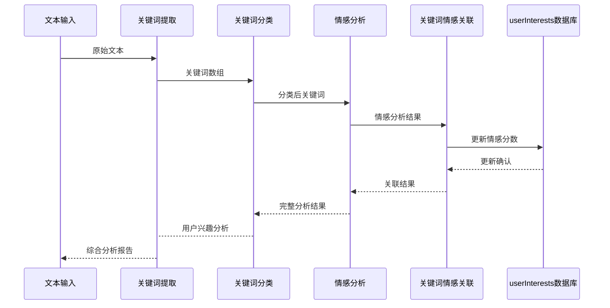

# 高级情感分析功能

<cite>
**本文档引用的文件**  
- [keywordClassifier.js](file://cloudfunctions/analysis/keywordClassifier.js)
- [keywordEmotionLinker.js](file://cloudfunctions/analysis/keywordEmotionLinker.js)
- [keywords.js](file://cloudfunctions/analysis/keywords.js)
- [userInterestAnalyzer.js](file://cloudfunctions/analysis/userInterestAnalyzer.js)
- [userInterests.md](file://doc/开发文档/database/userInterests.md)
- [关键词情感关联功能使用示例.md](file://doc/使用文档/关键词情感关联功能使用示例.md)
</cite>

## 目录
1. [高级情感分析功能](#高级情感分析功能)
2. [关键词分类机制](#关键词分类机制)
3. [关键词情感关联实现](#关键词情感关联实现)
4. [预定义关键词库结构](#预定义关键词库结构)
5. [用户兴趣偏好分析](#用户兴趣偏好分析)
6. [功能调用时序与数据流转](#功能调用时序与数据流转)
7. [配置选项与扩展方法](#配置选项与扩展方法)

## 关键词分类机制

关键词分类器（keywordClassifier.js）负责将提取的关键词自动归类到预定义的类别中。系统采用双重分类策略：当智谱AI API密钥可用时，通过大模型进行智能分类；否则使用本地规则进行分类。

分类过程首先对关键词去重，然后构建包含所有预定义类别及其说明的提示词，发送给大模型进行JSON格式的分类结果返回。本地分类则基于细分类别映射和关键词包含规则实现，优先匹配SUBCATEGORIES中的关键词，若未匹配成功则根据关键词中包含的特定字符进行分类。

**Section sources**
- [keywordClassifier.js](file://cloudfunctions/analysis/keywordClassifier.js#L1-L298)

## 关键词情感关联实现

关键词情感关联模块（keywordEmotionLinker.js）负责将关键词与情感分析结果进行关联。该模块通过计算情感分数并更新用户兴趣数据库中的关键词情感得分来实现这一功能。

情感分数计算采用加权平均算法，将新情感分数的30%与现有分数的70%结合，确保情感倾向的稳定性。情感分数范围为-1到1，正值表示正面情绪，负值表示负面情绪。系统通过查询userInterests集合获取用户兴趣数据，并更新相关关键词的情感分数和最后更新时间。

**Section sources**
- [keywordEmotionLinker.js](file://cloudfunctions/analysis/keywordEmotionLinker.js#L1-L206)

## 预定义关键词库结构

预定义关键词库（keywords.js）基于HanLP API实现关键词提取、词向量获取和聚类分析功能。系统通过调用HanLP的extractKeywords接口从文本中提取关键词，并返回包含词语和权重的对象数组。

关键词提取支持topK参数控制返回数量，默认为10个。聚类分析功能通过词向量的余弦相似度实现层次聚类，将语义相近的关键词归为一类。系统使用简单的聚类算法，通过计算词向量的相似度来合并簇，最终返回满足最小簇大小要求的聚类结果。

**Section sources**
- [keywords.js](file://cloudfunctions/analysis/keywords.js#L1-L283)

## 用户兴趣偏好分析

用户兴趣分析器（userInterestAnalyzer.js）整合关键词分类和情感分析结果，提供全面的用户兴趣分析功能。分析流程包括五个主要步骤：关键词分类、类别权重计算、权重标准化、关注点提取和情感关联分析。

系统首先调用关键词分类器对关键词进行分类，然后计算每个类别的权重总和，将权重标准化为百分比形式。关注点提取基于权重前五的类别，为每个类别选取最具代表性的三个关键词。情感关联分析通过统计关键词在不同情绪记录中的出现频率，识别与积极或消极情绪高度相关的关键词。

**Section sources**
- [userInterestAnalyzer.js](file://cloudfunctions/analysis/userInterestAnalyzer.js#L1-L288)

## 功能调用时序与数据流转

**Diagram sources**
- [keywords.js](file://cloudfunctions/analysis/keywords.js#L1-L283)
- [keywordClassifier.js](file://cloudfunctions/analysis/keywordClassifier.js#L1-L298)
- [keywordEmotionLinker.js](file://cloudfunctions/analysis/keywordEmotionLinker.js#L1-L206)
- [userInterestAnalyzer.js](file://cloudfunctions/analysis/userInterestAnalyzer.js#L1-L288)

## 配置选项与扩展方法

系统提供多种配置选项和扩展方法以适应不同需求。关键词提取可通过topK参数控制返回数量，聚类分析支持threshold和minClusterSize参数调整聚类敏感度。情感分数计算可自定义情感类型映射表，支持添加新的情感类型和对应的分数。

扩展方法包括：添加新的兴趣类别到INTEREST_CATEGORIES数组，扩展SUBCATEGORIES中的细分类别，修改情感极性映射表以调整情绪分类标准，以及自定义聚类算法以提高语义相似度计算的准确性。系统设计支持模块化扩展，各功能组件可独立升级和替换。

**Section sources**
- [keywordClassifier.js](file://cloudfunctions/analysis/keywordClassifier.js#L1-L298)
- [keywordEmotionLinker.js](file://cloudfunctions/analysis/keywordEmotionLinker.js#L1-L206)
- [keywords.js](file://cloudfunctions/analysis/keywords.js#L1-L283)
- [userInterestAnalyzer.js](file://cloudfunctions/analysis/userInterestAnalyzer.js#L1-L288)
- [userInterests.md](file://doc/开发文档/database/userInterests.md#L1-L121)
- [关键词情感关联功能使用示例.md](file://doc/使用文档/关键词情感关联功能使用示例.md#L1-L62)