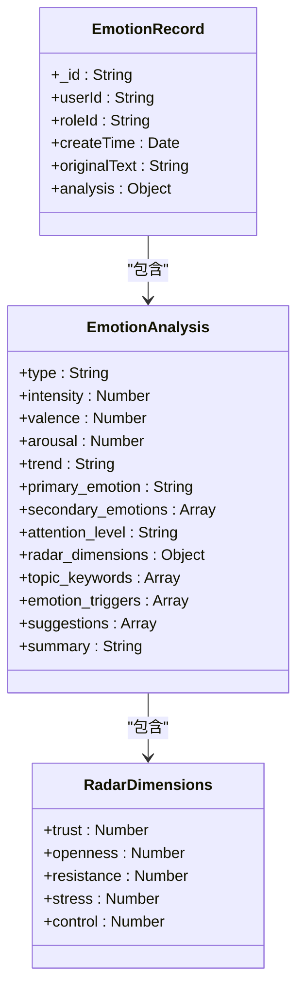
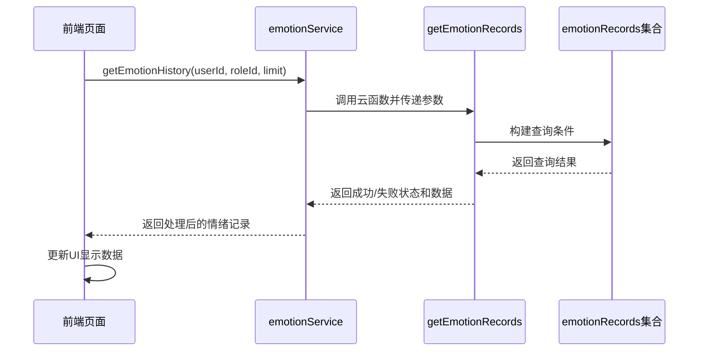
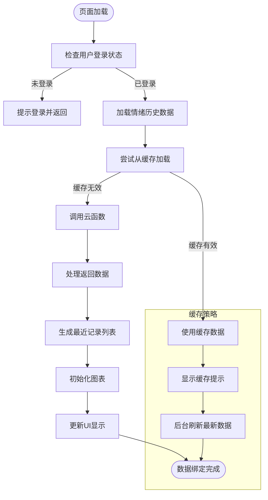
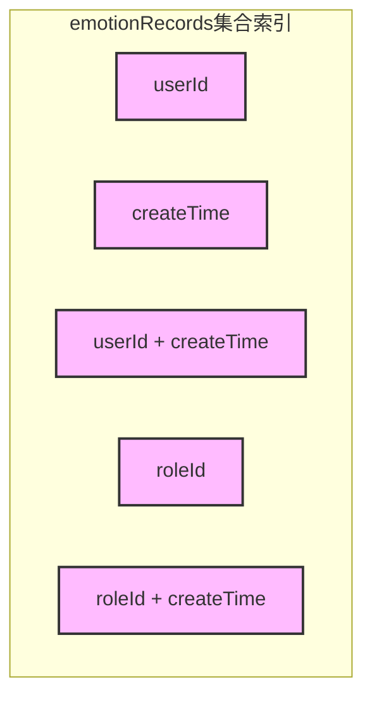
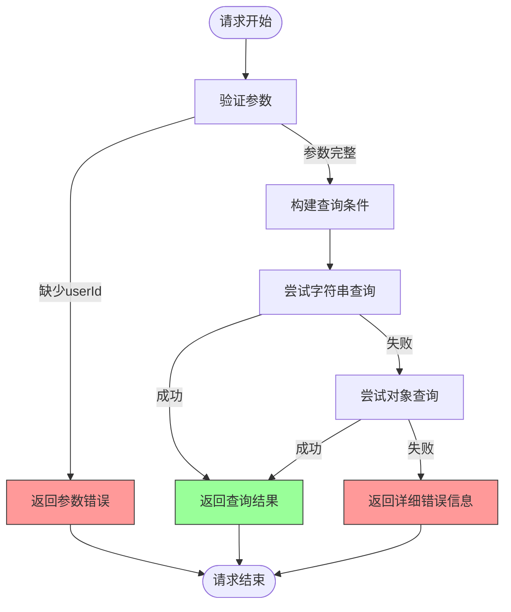

# 情绪历史接口

<cite>
**本文档引用文件**   
- [index.js](file://cloudfunctions/getEmotionRecords/index.js)
- [getEmotionRecords.md](file://doc/开发文档/cloudfunctions/getEmotionRecords.md)
- [emotionService.js](file://miniprogram/services/emotionService.js)
- [emotion-history.js](file://miniprogram/packageEmotion/pages/emotion-history/emotion-history.js)
- [emotionRecords.md](file://doc/开发文档/database/emotionRecords.md)
</cite>

## 目录
1. [API设计](#api设计)
2. [数据结构说明](#数据结构说明)
3. [分页查询示例](#分页查询示例)
4. [前端数据绑定](#前端数据绑定)
5. [性能优化建议](#性能优化建议)
6. [错误处理机制](#错误处理机制)

## API设计

情绪历史接口提供基于用户ID和角色ID的情绪记录查询功能，支持灵活的查询参数配置。

### HTTP请求方法
- **方法**: POST
- **端点**: `getEmotionRecords`

### 认证机制
- 基于微信云开发的上下文认证
- 自动获取`openid`、`appid`和`unionid`
- 通过`cloud.getWXContext()`获取用户身份信息

### 查询参数
| 参数名 | 类型 | 必需 | 默认值 | 说明 |
| :--- | :--- | :--- | :--- | :--- |
| `userId` | string | 是 | 无 | 用户唯一标识，用于定位情绪记录 |
| `roleId` | string | 否 | null | 角色ID，用于过滤特定角色交互记录 |
| `limit` | number | 否 | 20 | 返回记录数量限制 |

**Section sources**
- [index.js](file://cloudfunctions/getEmotionRecords/index.js#L15-L25)

## 数据结构说明

返回数据包含情绪分析的详细信息，各字段含义如下：

### 情绪标签
- **`type`**: 主要情感类型（如：喜悦、悲伤、焦虑）
- **`primary_emotion`**: 主要情感标签
- **`secondary_emotions`**: 次要情感列表（数组）

### 强度值
- **`intensity`**: 情感强度（0-1范围）
- **`valence`**: 情感效价（-1到1，负值表示消极）
- **`arousal`**: 情感唤醒度（0-1）

### 时间戳
- **`createTime`**: 记录创建时间（数据库服务器时间格式）
- **`timestamp`**: 记录时间戳（毫秒级）

### 情感维度
- **`radar_dimensions`**: 情感维度雷达图数据
  - `trust`: 信任度（0-1）
  - `openness`: 开放度（0-1）
  - `resistance`: 抵抗度（0-1）
  - `stress`: 压力度（0-1）
  - `control`: 控制度（0-1）

### 关键信息
- **`topic_keywords`**: 话题关键词列表
- **`emotion_triggers`**: 情感触发词
- **`suggestions`**: 情感改善建议
- **`summary`**: 情感状态总结

**Diagram sources**
- [emotionRecords.md](file://doc/开发文档/database/emotionRecords.md#L7-L61)
- [getEmotionRecords.md](file://doc/开发文档/cloudfunctions/getEmotionRecords.md#L45-L60)

## 分页查询示例

以下代码示例展示如何实现大数据集的渐进加载：

**Diagram sources**
- [emotionService.js](file://miniprogram/services/emotionService.js#L354-L380)
- [index.js](file://cloudfunctions/getEmotionRecords/index.js#L30-L110)

## 前端数据绑定

### emotion-history页面数据绑定逻辑

情绪历史页面通过以下流程实现数据绑定：

1. **页面加载时**：
   - 检查用户登录状态
   - 获取用户ID（优先使用openId）
   - 加载情绪历史数据

2. **数据处理流程**：
   - 从本地缓存尝试加载数据
   - 缓存不存在或过期时调用云函数
   - 处理返回的情绪数据
   - 生成最近记录列表

3. **图表初始化**：
   - 初始化情绪趋势图
   - 初始化情绪分布图
   - 初始化情绪波动指数图

4. **交互功能**：
   - 时间范围切换
   - 下拉刷新
   - 缓存管理

**Diagram sources**
- [emotion-history.js](file://miniprogram/packageEmotion/pages/emotion-history/emotion-history.js#L100-L200)
- [emotionService.js](file://miniprogram/services/emotionService.js#L354-L400)

## 性能优化建议

### 索引使用
为提高查询性能，建议在数据库中创建以下索引：

**复合索引建议**：
- `userId + createTime`（降序）：优化用户情绪历史查询
- `roleId + createTime`：优化角色交互记录查询

**Section sources**
- [emotionRecords.md](file://doc/开发文档/database/emotionRecords.md#L63-L70)

### 缓存策略
1. **本地缓存**：
   - 使用`wx.setStorageSync`存储查询结果
   - 缓存键格式：`emotionHistory_${userId}_${timeRange}`
   - 设置30分钟过期时间

2. **缓存更新机制**：
   - 下拉刷新时清除缓存
   - 后台异步更新最新数据
   - 显示"当前显示缓存数据"提示

3. **缓存失效处理**：
   - 检查缓存时间戳
   - 超过30分钟视为过期
   - 自动触发重新查询

### 错误处理机制
云函数实现多层错误处理机制：

**错误处理特点**：
- 参数验证：检查必需参数`userId`
- 降级机制：字符串查询失败自动降级到对象查询
- 详细日志：记录各种查询方式的错误详情
- 友好提示：向用户返回清晰的错误信息

**Section sources**
- [index.js](file://cloudfunctions/getEmotionRecords/index.js#L25-L110)