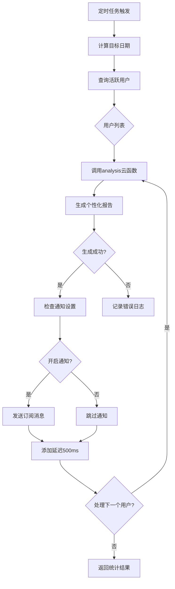
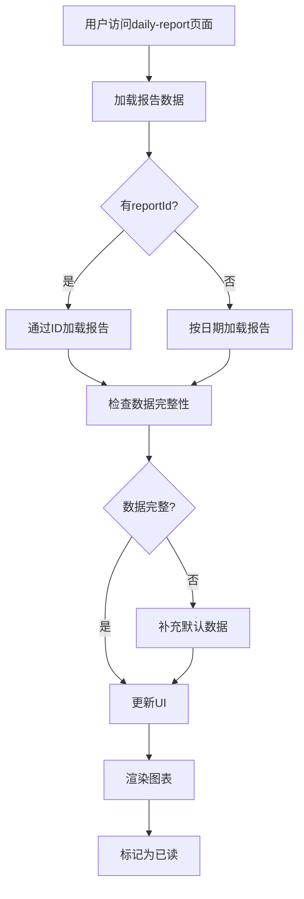

# 报告生成接口

<cite>
**本文档引用文件**  
- [generateDailyReports/index.js](file://cloudfunctions/generateDailyReports/index.js)
- [analysis/index.js](file://cloudfunctions/analysis/index.js)
- [userReports.md](file://doc/开发文档/database/userReports.md)
- [daily-report.js](file://miniprogram/packageEmotion/pages/daily-report/daily-report.js)
- [reportService.js](file://miniprogram/services/reportService.js)
- [generateDailyReports.md](file://doc/开发文档/cloudfunctions/generateDailyReports.md)
- [analysis.md](file://doc/开发文档/cloudfunctions/analysis.md)
</cite>

## 目录
1. [调用方式与触发机制](#调用方式与触发机制)
2. [输入参数结构](#输入参数结构)
3. [报告生成逻辑](#报告生成逻辑)
4. [报告数据模型](#报告数据模型)
5. [前端调用与渲染](#前端调用与渲染)
6. [最佳实践](#最佳实践)
7. [附录：核心流程图](#附录核心流程图)

## 调用方式与触发机制

`generateDailyReports` 云函数主要通过定时任务自动触发，用于批量为活跃用户生成前一天的个性化心情报告。该函数不直接接受前端调用，而是作为后台服务由系统定时执行。

云函数的触发机制如下：
- **触发时间**：每日凌晨2点自动执行
- **触发条件**：系统自动调用，无需手动干预
- **执行逻辑**：查询前一天有情感记录的用户，为每个用户生成报告

该函数通过调用 `analysis` 云函数来完成具体的报告内容生成，并在生成成功后根据用户设置发送订阅消息通知。

**Section sources**
- [generateDailyReports/index.js](file://cloudfunctions/generateDailyReports/index.js#L1-L201)
- [generateDailyReports.md](file://doc/开发文档/cloudfunctions/generateDailyReports.md#L1-L61)

## 输入参数结构

`generateDailyReports` 云函数本身不接受外部输入参数，其执行是基于系统内部逻辑自动完成的。然而，它在内部调用 `analysis` 云函数时会传递以下参数：

- **type**: `string` - 操作类型，固定为 `'daily_report'`
- **userId**: `string` - 用户唯一标识
- **date**: `Date` - 需要生成报告的目标日期
- **forceRegenerate**: `boolean` - 是否强制重新生成报告（可选）

这些参数由 `generateDailyReports` 函数根据前一天的活跃用户列表自动生成并传递。

**Section sources**
- [generateDailyReports/index.js](file://cloudfunctions/generateDailyReports/index.js#L47-L85)
- [analysis/index.js](file://cloudfunctions/analysis/index.js#L452-L499)

## 报告生成逻辑

报告生成逻辑分为两个层级：批量调度层和单个报告生成层。

### 批量调度逻辑
`generateDailyReports` 函数首先查询前一天有情感记录的活跃用户，然后为每个用户调用 `analysis` 云函数生成报告。处理过程中包含以下关键步骤：
1. 计算目标日期（前一天）
2. 聚合查询有情感记录的用户
3. 遍历用户列表，逐个生成报告
4. 检查用户通知设置
5. 为成功生成报告的用户发送订阅消息
6. 添加500ms延迟，避免API调用过于频繁

### 个性化报告生成逻辑
`analysis` 云函数负责具体的报告内容生成，其核心逻辑包括：
1. **数据聚合**：从 `emotionRecords` 集合中查询用户当天的所有情感记录
2. **情感统计**：分析情绪分布、主要情绪类型和情绪波动指数
3. **关键词提取**：从情感记录中提取关键词并计算权重
4. **AI内容生成**：调用智谱AI或Google Gemini生成情感总结、洞察、建议和鼓励语
5. **关注点分析**：通过 `userInterestAnalyzer` 模块分析用户关注点和兴趣领域
6. **数据存储**：将生成的报告保存到 `userReports` 集合中

**Section sources**
- [generateDailyReports/index.js](file://cloudfunctions/generateDailyReports/index.js#L1-L201)
- [analysis/index.js](file://cloudfunctions/analysis/index.js#L691-L746)

## 报告数据模型

生成的报告数据存储在 `userReports` 集合中，包含完整的个性化分析内容。

### 核心字段定义

**Table: 报告核心字段**

| 字段名 | 类型 | 描述 |
|-------|------|------|
| `emotionSummary` | string | 情感总结，200字以内的情感状态分析 |
| `insights` | array | 3-5条关于用户情绪模式的洞察 |
| `suggestions` | array | 3条针对用户情绪状态的具体建议 |
| `fortune` | object | 今日运势，包含"good"（宜）和"bad"（忌）各2项 |
| `encouragement` | string | 一句积极的鼓励话语 |
| `keywords` | array | 重要关键词列表，包含词和权重 |
| `emotionalVolatility` | number | 情绪波动指数（0-100） |
| `primaryEmotion` | string | 当日主要情绪类型 |
| `emotionCount` | number | 情感记录数量 |

### 图表数据结构

**Table: 图表数据字段**

| 字段名 | 类型 | 描述 |
|-------|------|------|
| `chartData.emotionDistribution` | array | 情绪分布数据，包含类型、数量和百分比 |
| `chartData.intensityTrend` | array | 情绪强度趋势数据，包含时间戳和强度值 |
| `chartData.focusDistribution` | array | 关注点分布数据，包含分类和权重 |

### 关注点与洞察

**Table: 关注点与洞察字段**

| 字段名 | 类型 | 描述 |
|-------|------|------|
| `focusPoints` | array | 主要关注点，包含分类、百分比、权重和相关关键词 |
| `categoryWeights` | array | 分类权重统计，用于展示用户兴趣分布 |
| `emotionalInsights` | object | 情感关联分析，包含积极和消极关联的关键词 |

**Section sources**
- [userReports.md](file://doc/开发文档/database/userReports.md#L1-L177)
- [analysis/index.js](file://cloudfunctions/analysis/index.js#L691-L746)

## 前端调用与渲染

前端通过 `daily-report` 页面展示生成的报告内容，主要涉及 `daily-report.js` 和 `reportService.js` 两个文件。

### 前端调用示例

```javascript
// 通过 reportService 调用获取报告
const result = await reportService.getDailyReport(date, forceRegenerate);

if (result.success) {
  this.setData({
    report: result.report,
    loading: false
  });
  this.renderCharts();
}
```

### 页面渲染流程

1. **页面加载**：`onLoad` 函数获取系统信息、检测暗黑模式，并加载报告数据
2. **数据加载**：调用 `loadReport` 或 `loadReportById` 方法获取报告
3. **图表渲染**：`renderCharts` 方法初始化ECharts图表组件
4. **UI更新**：根据报告数据更新页面显示

### 图表渲染

页面使用ECharts渲染多种图表：
- **情绪分布饼图**：展示各类情绪的占比
- **情绪强度趋势图**：展示一天中情绪强度的变化曲线
- **关键词云**：直观展示用户关注的话题和概念

```javascript
// 初始化图表组件
this.initChart('emotionPieChart', (chart) => {
  const option = {
    // 图表配置
  };
  chart.setOption(option);
});
```

**Section sources**
- [daily-report.js](file://miniprogram/packageEmotion/pages/daily-report/daily-report.js#L0-L1080)
- [reportService.js](file://miniprogram/services/reportService.js#L47-L148)

## 最佳实践

### 生成频率控制

- **自动批量生成**：系统每天凌晨2点自动为有情感记录的用户生成报告
- **避免重复生成**：每个用户每天只生成一份报告，通过 `userId + date` 复合唯一索引确保
- **手动重新生成**：用户可点击"重新生成"按钮强制刷新报告内容

### 数据新鲜度保证

- **实时数据源**：报告基于当天 `emotionRecords` 集合中的最新情感记录
- **强制刷新机制**：支持 `forceRegenerate` 参数，可重新分析原始数据生成报告
- **缓存策略**：前端在加载报告后进行本地缓存，但允许用户手动刷新获取最新内容

### 异常情况处理

- **无数据处理**：当用户当天无情感记录时，返回明确错误信息，不生成报告
- **AI服务降级**：当AI服务不可用时，使用预设的默认内容模板
- **通知容错**：发送订阅消息失败时不中断主流程，仅记录错误日志
- **数据完整性**：对关键字段（如 `fortune`）进行完整性检查，缺失时使用默认值

**Section sources**
- [generateDailyReports/index.js](file://cloudfunctions/generateDailyReports/index.js#L82-L134)
- [analysis/index.js](file://cloudfunctions/analysis/index.js#L452-L499)
- [daily-report.js](file://miniprogram/packageEmotion/pages/daily-report/daily-report.js#L276-L316)

## 附录：核心流程图



**Diagram sources**
- [generateDailyReports/index.js](file://cloudfunctions/generateDailyReports/index.js#L1-L201)



**Diagram sources**
- [daily-report.js](file://miniprogram/packageEmotion/pages/daily-report/daily-report.js#L0-L1080)