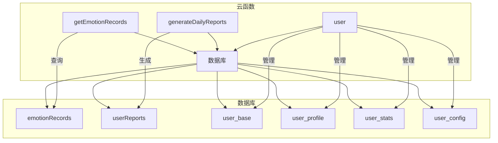
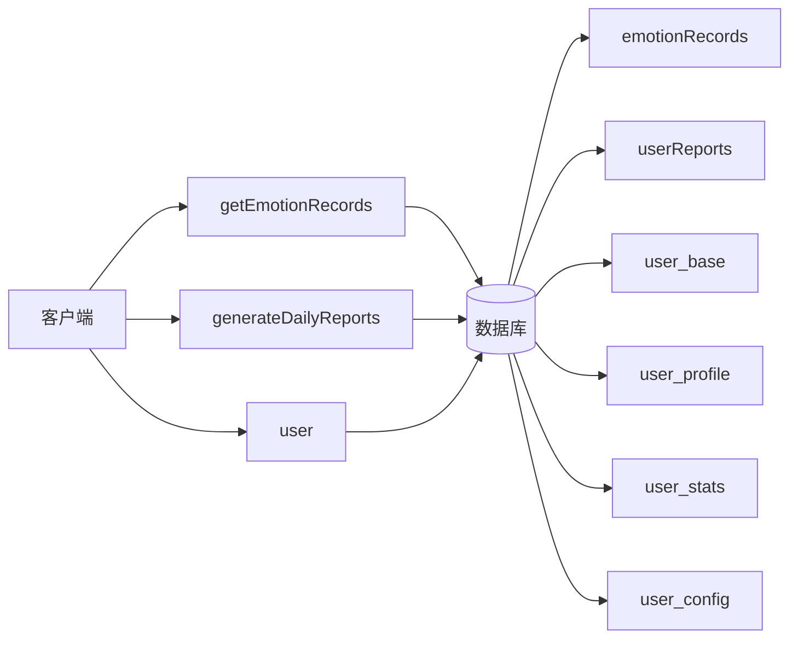
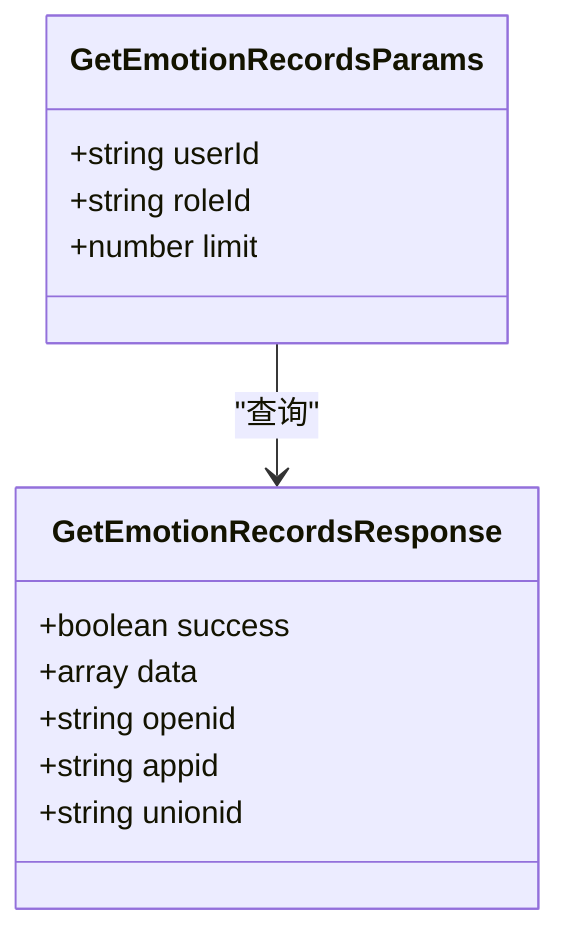
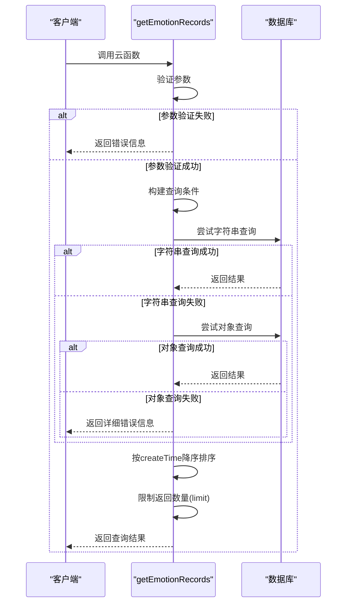
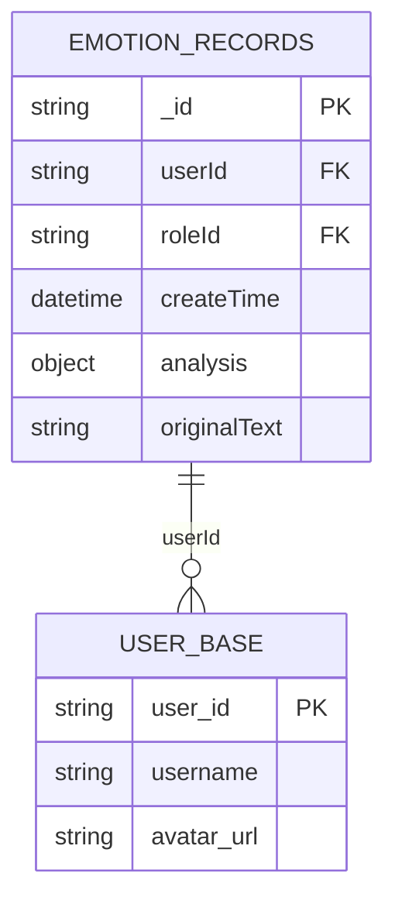
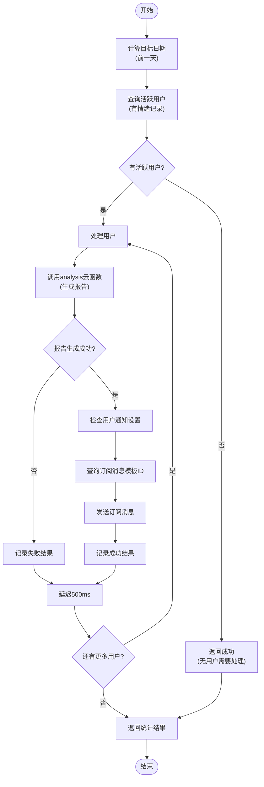
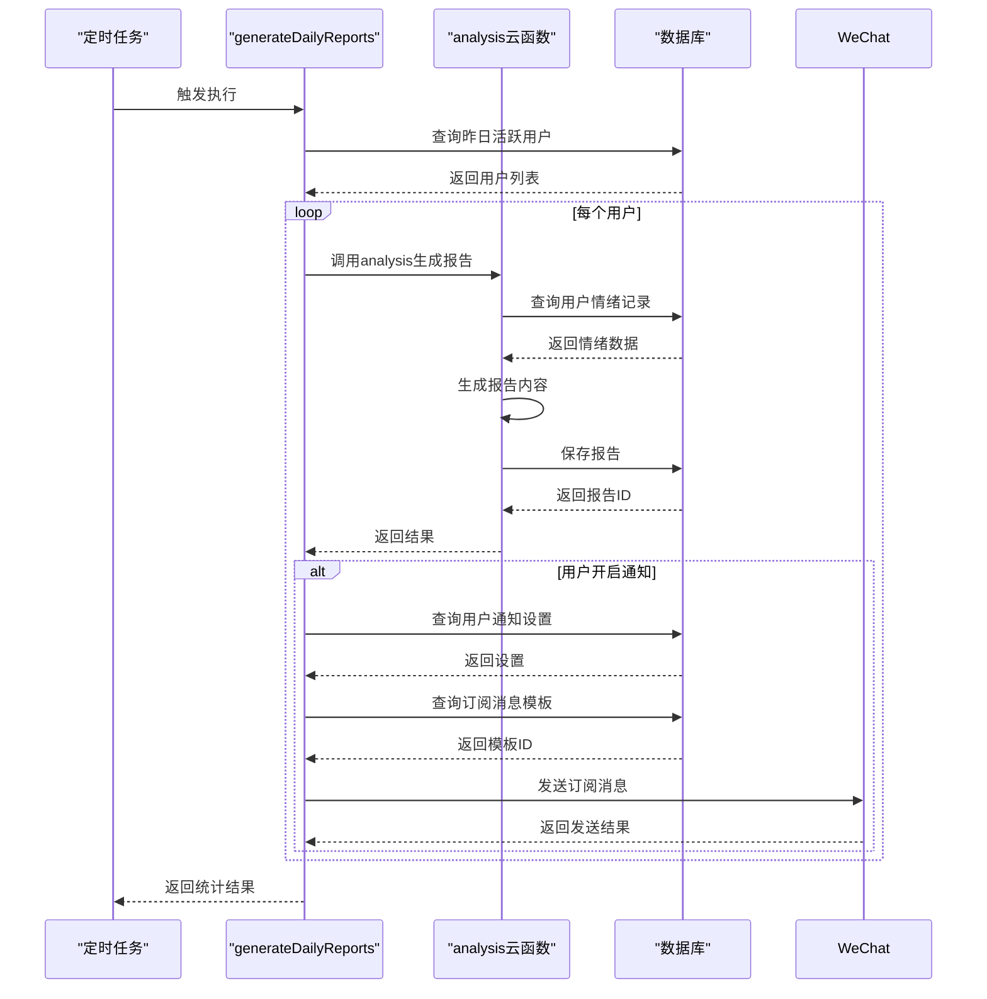
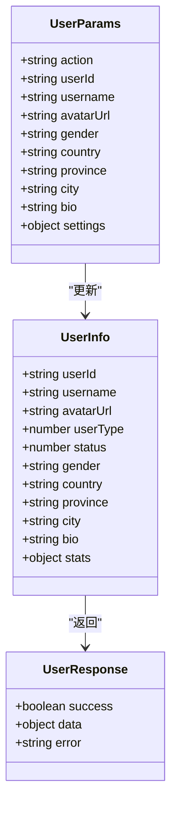
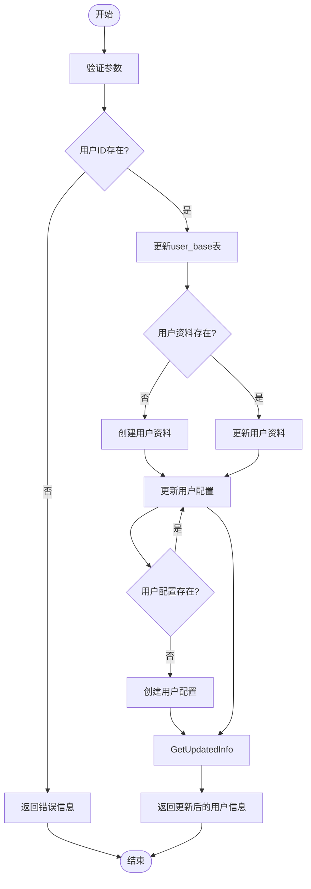
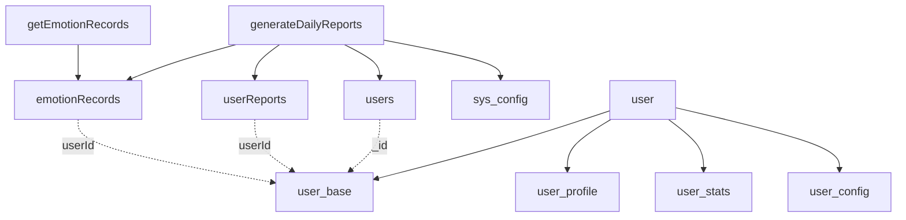

# 用户数据API

<cite>
**本文档引用的文件**
- [getEmotionRecords/index.js](file://cloudfunctions/getEmotionRecords/index.js)
- [generateDailyReports/index.js](file://cloudfunctions/generateDailyReports/index.js)
- [user/index.js](file://cloudfunctions/user/index.js)
- [doc/开发文档/cloudfunctions/getEmotionRecords.md](file://doc/开发文档/cloudfunctions/getEmotionRecords.md)
- [doc/开发文档/cloudfunctions/generateDailyReports.md](file://doc/开发文档/cloudfunctions/generateDailyReports.md)
- [doc/开发文档/cloudfunctions/user.md](file://doc/开发文档/cloudfunctions/user.md)
- [doc/开发文档/database/emotionRecords.md](file://doc/开发文档/database/emotionRecords.md)
- [doc/开发文档/database/userReports.md](file://doc/开发文档/database/userReports.md)
- [doc/开发文档/database/user_base.md](file://doc/开发文档/database/user_base.md)
</cite>

## 目录
1. [简介](#简介)
2. [项目结构](#项目结构)
3. [核心组件](#核心组件)
4. [架构概述](#架构概述)
5. [详细组件分析](#详细组件分析)
6. [依赖分析](#依赖分析)
7. [性能考虑](#性能考虑)
8. [故障排除指南](#故障排除指南)
9. [结论](#结论)

## 简介
本文档全面记录了用户相关数据服务的API集合，包括用户资料管理、情绪历史查询和每日报告生成。详细描述了`getEmotionRecords`云函数的分页查询参数设计（如时间范围、分页大小等）和返回的数据结构。说明了`generateDailyReports`云函数如何基于历史数据生成个性化报告的逻辑。解释了`user`云函数提供的用户基础信息操作接口。提供了综合使用这些API构建用户中心页面的代码示例，展示数据关联查询的最佳实践。包含性能建议，如大数据量下的分页策略和缓存机制。

## 项目结构
用户数据服务API主要由三个核心云函数组成：`getEmotionRecords`用于查询情绪记录，`generateDailyReports`用于生成每日报告，`user`用于管理用户基础信息。这些函数通过云数据库进行数据交互，形成了完整的用户数据服务体系。

**图表来源**
- [cloudfunctions/getEmotionRecords/index.js](file://cloudfunctions/getEmotionRecords/index.js)
- [cloudfunctions/generateDailyReports/index.js](file://cloudfunctions/generateDailyReports/index.js)
- [cloudfunctions/user/index.js](file://cloudfunctions/user/index.js)

**章节来源**
- [cloudfunctions/getEmotionRecords/index.js](file://cloudfunctions/getEmotionRecords/index.js)
- [cloudfunctions/generateDailyReports/index.js](file://cloudfunctions/generateDailyReports/index.js)
- [cloudfunctions/user/index.js](file://cloudfunctions/user/index.js)

## 核心组件
用户数据API的核心组件包括三个主要云函数：`getEmotionRecords`提供情绪历史记录查询服务，`generateDailyReports`实现每日心情报告的批量生成，`user`管理用户基础信息和配置。这些组件共同构成了用户中心的数据服务基础。

**章节来源**
- [cloudfunctions/getEmotionRecords/index.js](file://cloudfunctions/getEmotionRecords/index.js)
- [cloudfunctions/generateDailyReports/index.js](file://cloudfunctions/generateDailyReports/index.js)
- [cloudfunctions/user/index.js](file://cloudfunctions/user/index.js)

## 架构概述
用户数据API采用微服务架构，每个云函数独立处理特定业务逻辑。`getEmotionRecords`负责情绪记录的查询，`generateDailyReports`负责报告的生成和通知，`user`负责用户信息的管理。这些服务通过统一的数据库接口进行数据交互，确保了数据的一致性和完整性。

**图表来源**
- [cloudfunctions/getEmotionRecords/index.js](file://cloudfunctions/getEmotionRecords/index.js)
- [cloudfunctions/generateDailyReports/index.js](file://cloudfunctions/generateDailyReports/index.js)
- [cloudfunctions/user/index.js](file://cloudfunctions/user/index.js)

## 详细组件分析

### getEmotionRecords云函数分析
`getEmotionRecords`云函数提供情绪记录查询服务，支持根据用户ID和角色ID进行查询，并具有降级查询机制以提高兼容性。

#### 查询参数设计

**图表来源**
- [cloudfunctions/getEmotionRecords/index.js](file://cloudfunctions/getEmotionRecords/index.js)

#### 分页查询流程

**图表来源**
- [cloudfunctions/getEmotionRecords/index.js](file://cloudfunctions/getEmotionRecords/index.js)

#### 返回数据结构

**图表来源**
- [doc/开发文档/database/emotionRecords.md](file://doc/开发文档/database/emotionRecords.md)

**章节来源**
- [cloudfunctions/getEmotionRecords/index.js](file://cloudfunctions/getEmotionRecords/index.js)
- [doc/开发文档/cloudfunctions/getEmotionRecords.md](file://doc/开发文档/cloudfunctions/getEmotionRecords.md)

### generateDailyReports云函数分析
`generateDailyReports`云函数负责批量生成用户的每日心情报告，并支持订阅消息通知功能。

#### 报告生成逻辑

**图表来源**
- [cloudfunctions/generateDailyReports/index.js](file://cloudfunctions/generateDailyReports/index.js)

#### 数据处理流程

**图表来源**
- [cloudfunctions/generateDailyReports/index.js](file://cloudfunctions/generateDailyReports/index.js)

**章节来源**
- [cloudfunctions/generateDailyReports/index.js](file://cloudfunctions/generateDailyReports/index.js)
- [doc/开发文档/cloudfunctions/generateDailyReports.md](file://doc/开发文档/cloudfunctions/generateDailyReports.md)

### user云函数分析
`user`云函数提供用户基础信息操作接口，支持用户资料的获取和更新。

#### 用户信息操作

**图表来源**
- [cloudfunctions/user/index.js](file://cloudfunctions/user/index.js)

#### 用户资料更新流程

**图表来源**
- [cloudfunctions/user/index.js](file://cloudfunctions/user/index.js)

**章节来源**
- [cloudfunctions/user/index.js](file://cloudfunctions/user/index.js)
- [doc/开发文档/cloudfunctions/user.md](file://doc/开发文档/cloudfunctions/user.md)

## 依赖分析
用户数据API的各个组件之间存在明确的依赖关系，通过数据库集合进行数据交互。

**图表来源**
- [cloudfunctions/getEmotionRecords/index.js](file://cloudfunctions/getEmotionRecords/index.js)
- [cloudfunctions/generateDailyReports/index.js](file://cloudfunctions/generateDailyReports/index.js)
- [cloudfunctions/user/index.js](file://cloudfunctions/user/index.js)

**章节来源**
- [doc/开发文档/database/emotionRecords.md](file://doc/开发文档/database/emotionRecords.md)
- [doc/开发文档/database/userReports.md](file://doc/开发文档/database/userReports.md)
- [doc/开发文档/database/user_base.md](file://doc/开发文档/database/user_base.md)

## 性能考虑
在处理用户数据API时，需要考虑大数据量下的性能优化策略。

### 分页策略
对于`getEmotionRecords`云函数，采用limit参数限制返回记录数量，默认为20条，避免一次性返回过多数据影响性能。建议前端实现分页加载，每次请求获取固定数量的记录。

### 缓存机制
对于频繁访问的用户基础信息，建议在客户端进行缓存，减少云函数调用次数。对于每日报告，由于是每日生成一次，可以考虑在生成后缓存结果，避免重复计算。

### 批量处理优化
`generateDailyReports`云函数在处理大量用户时，通过限制处理用户数量（最多100个）和添加延迟（500ms）来避免API调用过于频繁，确保系统稳定性。

**章节来源**
- [cloudfunctions/getEmotionRecords/index.js](file://cloudfunctions/getEmotionRecords/index.js)
- [cloudfunctions/generateDailyReports/index.js](file://cloudfunctions/generateDailyReports/index.js)

## 故障排除指南
### 常见问题
1. **getEmotionRecords查询失败**：检查userId参数是否正确传递，确保数据库emotionRecords集合存在并设置了正确的读权限。
2. **每日报告未生成**：检查analysis云函数是否正常运行，确认sys_config集合中配置了正确的report_template_id。
3. **用户信息更新失败**：检查用户ID是否存在，确保user_base集合中有对应记录。

### 错误处理
各云函数都实现了详细的错误日志记录，包括参数验证错误、查询错误和系统错误。对于getEmotionRecords，提供了字符串查询和对象查询两种方式的错误详情，便于排查问题。

**章节来源**
- [cloudfunctions/getEmotionRecords/index.js](file://cloudfunctions/getEmotionRecords/index.js)
- [cloudfunctions/generateDailyReports/index.js](file://cloudfunctions/generateDailyReports/index.js)
- [cloudfunctions/user/index.js](file://cloudfunctions/user/index.js)

## 结论
用户数据API提供了完整的用户相关数据服务，包括情绪历史查询、每日报告生成和用户基础信息管理。通过合理的分页策略和缓存机制，确保了在大数据量下的性能表现。各组件之间通过清晰的接口和数据库设计实现了良好的解耦，便于维护和扩展。