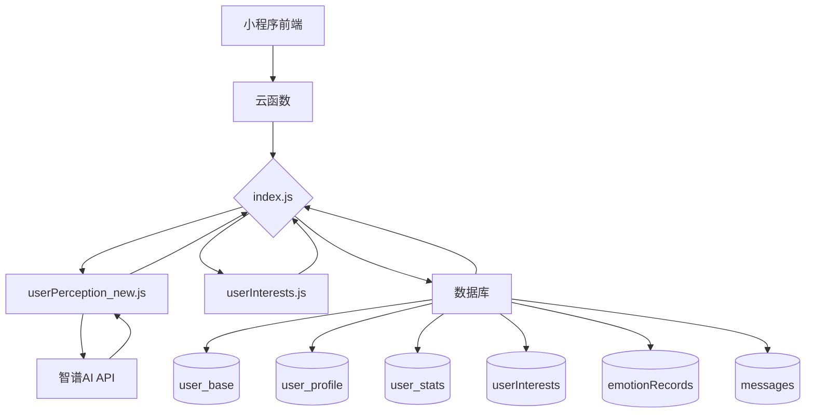
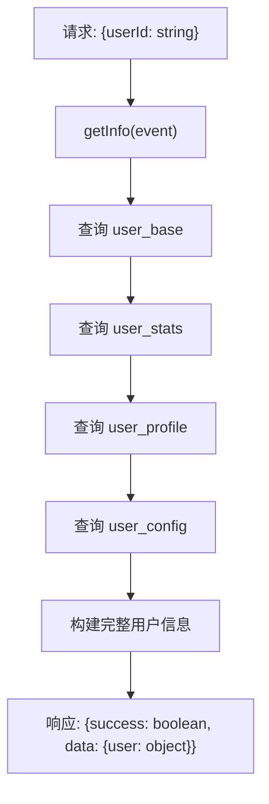
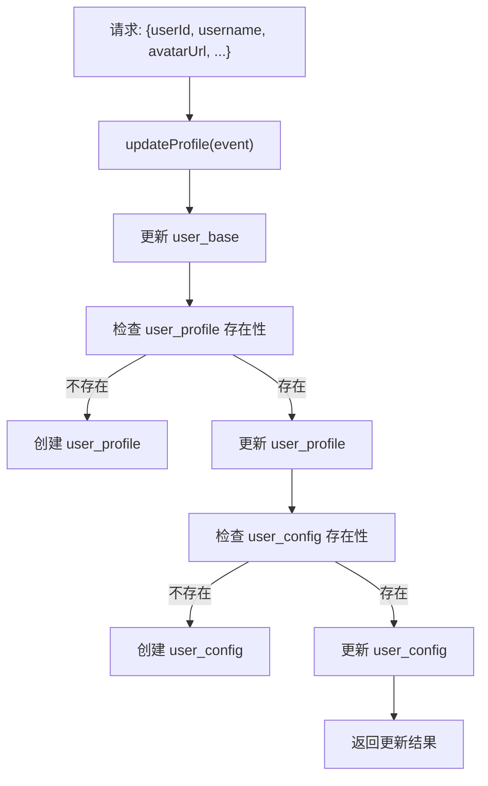
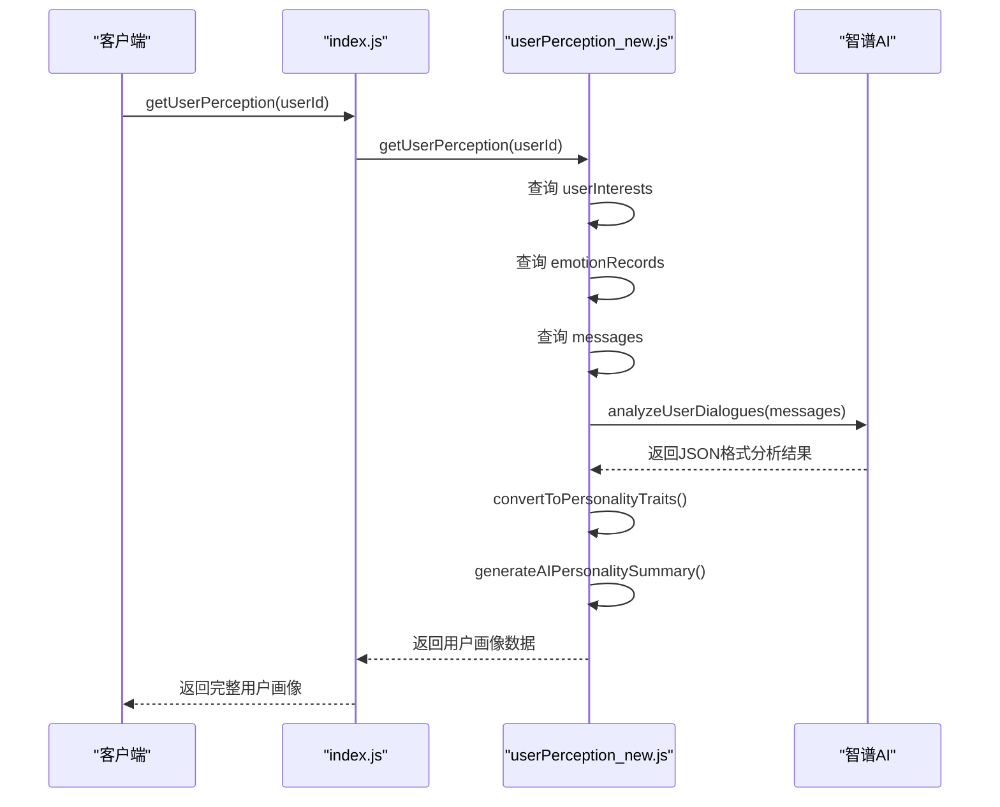
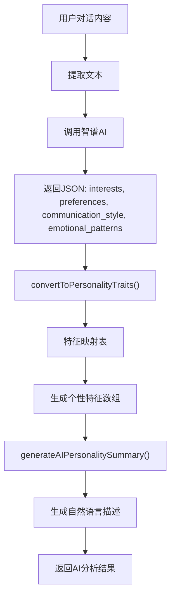
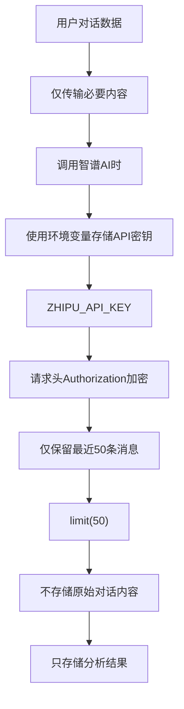
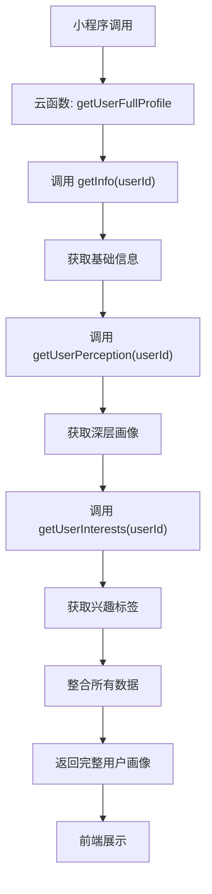
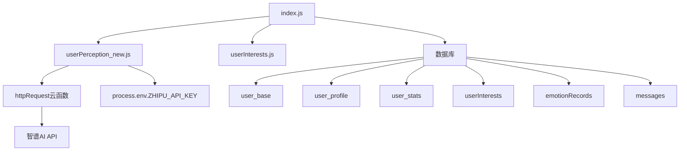

# 用户画像接口

<cite>
**本文档引用的文件**
- [index.js](file://cloudfunctions/user/index.js)
- [userPerception_new.js](file://cloudfunctions/user/userPerception_new.js)
</cite>

## 目录
1. [简介](#简介)
2. [项目结构](#项目结构)
3. [核心组件](#核心组件)
4. [架构概览](#架构概览)
5. [详细组件分析](#详细组件分析)
6. [依赖分析](#依赖分析)
7. [性能考量](#性能考量)
8. [故障排除指南](#故障排除指南)
9. [结论](#结论)

## 简介
本文档系统化地描述了用户画像相关API，涵盖用户基础信息管理（`index.js`）与深层感知分析（`userPerception_new.js`）。重点说明如何通过对话内容提取性格特征、兴趣标签和情感模式，详细描述各接口的请求响应格式、数据更新机制和隐私保护措施。提供整合调用示例，展示如何构建完整的用户画像视图，并包含数据准确性优化、模型更新策略和性能监控建议。

## 项目结构
用户画像功能主要位于 `cloudfunctions/user/` 目录下，包含基础信息管理与深层感知分析两大模块。`index.js` 作为主入口处理用户信息的获取与更新，`userPerception_new.js` 利用智谱AI进行深度用户分析，`userInterests.js` 负责兴趣标签处理。

```mermaid
graph TB
subgraph "用户画像模块"
index["index.js<br/>基础信息管理"]
userPerception["userPerception_new.js<br/>深层感知分析"]
userInterests["userInterests.js<br/>兴趣标签处理"]
end
index --> userPerception : "require"
index --> userInterests : "require"
userPerception --> httpRequest : "调用云函数"
style index fill:#f9f,stroke:#333
style userPerception fill:#bbf,stroke:#333
style userInterests fill:#f96,stroke:#333
```

**图示来源**
- [index.js](file://cloudfunctions/user/index.js#L1-L5)
- [userPerception_new.js](file://cloudfunctions/user/userPerception_new.js#L1-L5)

**本节来源**
- [index.js](file://cloudfunctions/user/index.js#L1-L10)
- [userPerception_new.js](file://cloudfunctions/user/userPerception_new.js#L1-L10)

## 核心组件
核心组件包括用户基础信息管理（`index.js`）和用户深层感知分析（`userPerception_new.js`）。前者提供用户资料的CRUD操作，后者通过AI模型从对话内容中提取性格特征、兴趣标签和情感模式。

**本节来源**
- [index.js](file://cloudfunctions/user/index.js#L1-L100)
- [userPerception_new.js](file://cloudfunctions/user/userPerception_new.js#L1-L50)

## 架构概览
系统采用分层架构，前端通过云函数调用接口，后端通过数据库存储用户数据，并利用智谱AI进行深度分析。`index.js` 作为API网关，协调基础信息与深层分析模块。



**图示来源**
- [index.js](file://cloudfunctions/user/index.js#L1-L10)
- [userPerception_new.js](file://cloudfunctions/user/userPerception_new.js#L1-L10)

## 详细组件分析

### 基础信息管理分析
`index.js` 提供了用户信息获取、资料更新、统计查询等核心功能。通过 `getInfo` 接口整合多个数据表，构建完整的用户视图。

#### 接口请求响应格式


**图示来源**
- [index.js](file://cloudfunctions/user/index.js#L15-L150)

#### 数据更新机制


**图示来源**
- [index.js](file://cloudfunctions/user/index.js#L151-L350)

**本节来源**
- [index.js](file://cloudfunctions/user/index.js#L15-L450)

### 深层感知分析分析
`userPerception_new.js` 利用智谱AI从用户对话中提取深层特征，包括性格、兴趣和情感模式。

#### 对话内容分析流程


**图示来源**
- [userPerception_new.js](file://cloudfunctions/user/userPerception_new.js#L150-L300)

#### 特征提取算法


**图示来源**
- [userPerception_new.js](file://cloudfunctions/user/userPerception_new.js#L301-L500)

#### 隐私保护措施


**图示来源**
- [userPerception_new.js](file://cloudfunctions/user/userPerception_new.js#L1-L50)

**本节来源**
- [userPerception_new.js](file://cloudfunctions/user/userPerception_new.js#L1-L636)

### 整合调用示例
展示如何通过组合调用基础信息与深层分析接口，构建完整的用户画像视图。



**图示来源**
- [index.js](file://cloudfunctions/user/index.js#L500-L600)
- [userPerception_new.js](file://cloudfunctions/user/userPerception_new.js#L1-L50)

**本节来源**
- [index.js](file://cloudfunctions/user/index.js#L500-L600)
- [userPerception_new.js](file://cloudfunctions/user/userPerception_new.js#L1-L50)

## 依赖分析
用户画像模块依赖多个内部和外部组件，形成完整的分析链条。



**图示来源**
- [index.js](file://cloudfunctions/user/index.js#L1-L10)
- [userPerception_new.js](file://cloudfunctions/user/userPerception_new.js#L1-L10)

**本节来源**
- [index.js](file://cloudfunctions/user/index.js#L1-L10)
- [userPerception_new.js](file://cloudfunctions/user/userPerception_new.js#L1-L10)

## 性能考量
### 数据准确性优化
- **多源数据融合**：结合用户兴趣、情绪记录和对话内容进行综合分析
- **AI与规则结合**：当AI分析失败时，使用备选的规则引擎生成特征
- **特征映射表**：通过预定义的映射关系提高特征提取的准确性

### 模型更新策略
- **动态API密钥**：通过环境变量管理智谱AI的API密钥，便于更新
- **降级机制**：当AI服务不可用时，自动切换到本地规则分析
- **缓存机制**：对频繁访问的用户画像数据进行缓存

### 性能监控建议
- **日志记录**：在开发模式下开启详细日志，便于问题排查
- **错误处理**：对每个关键步骤进行异常捕获和记录
- **调用统计**：通过 `updateStats` 接口跟踪API调用情况

**本节来源**
- [userPerception_new.js](file://cloudfunctions/user/userPerception_new.js#L1-L100)
- [index.js](file://cloudfunctions/user/index.js#L400-L500)

## 故障排除指南
### 常见问题
- **AI分析失败**：检查 `ZHIPU_API_KEY` 环境变量是否正确配置
- **数据不完整**：确认数据库表是否存在且有足够数据
- **响应缓慢**：检查智谱AI接口的网络连接情况

### 调试建议
- **开启开发模式**：设置 `isDev = true` 查看详细日志
- **分步调试**：先测试基础信息接口，再测试深层分析接口
- **数据验证**：确保传入AI分析的对话数据格式正确

**本节来源**
- [userPerception_new.js](file://cloudfunctions/user/userPerception_new.js#L1-L50)
- [index.js](file://cloudfunctions/user/index.js#L1-L50)

## 结论
本文档详细描述了用户画像系统的两个核心模块：基础信息管理与深层感知分析。通过 `index.js` 提供稳定的用户数据访问接口，利用 `userPerception_new.js` 中的智谱AI能力从对话内容中提取性格特征、兴趣标签和情感模式。系统设计考虑了数据准确性、隐私保护和性能优化，为构建个性化用户体验提供了坚实的基础。