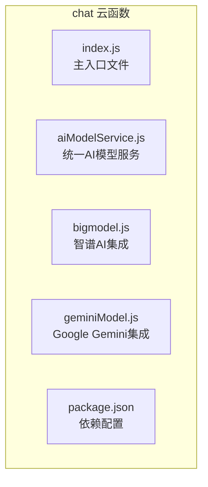
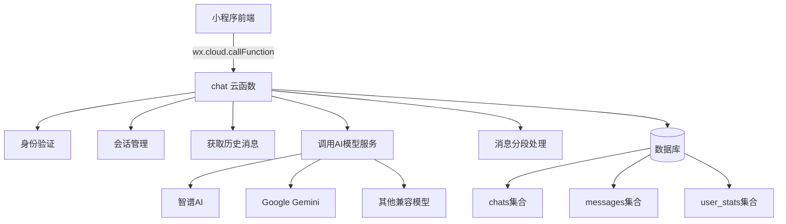
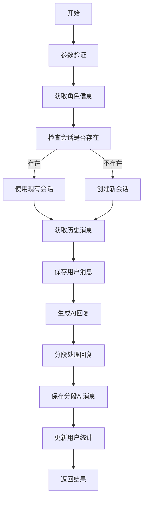
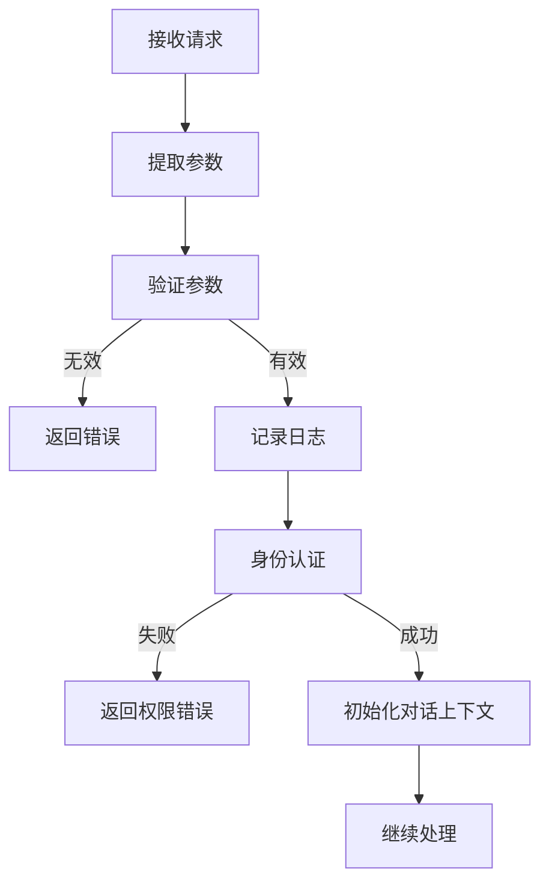
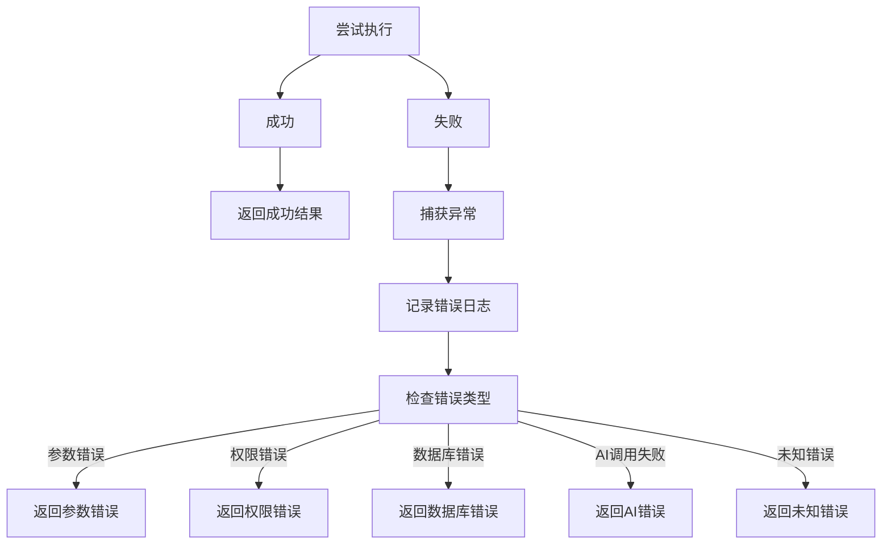
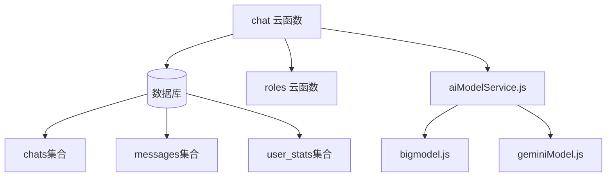

# 核心聊天接口

<cite>
**本文档引用文件**  
- [index.js](file://cloudfunctions/chat/index.js)
- [aiModelService.js](file://cloudfunctions/chat/aiModelService.js)
- [chat.md](file://doc/开发文档/cloudfunctions/chat.md)
</cite>

## 目录
1. [简介](#简介)
2. [项目结构](#项目结构)
3. [核心组件](#核心组件)
4. [架构概述](#架构概述)
5. [详细组件分析](#详细组件分析)
6. [依赖分析](#依赖分析)
7. [性能考虑](#性能考虑)
8. [故障排除指南](#故障排除指南)
9. [结论](#结论)

## 简介
本文档详细说明了 HeartChat 项目中 `chat` 云函数的核心接口设计与实现。该云函数为小程序提供完整的聊天服务，支持用户与AI角色的实时对话，并集成了智谱AI、Google Gemini等多种AI模型。

## 项目结构
`chat` 云函数位于 `cloudfunctions/chat` 目录下，是处理所有聊天相关业务逻辑的核心模块。



**图示来源**  
- [index.js](file://cloudfunctions/chat/index.js#L1-L50)
- [aiModelService.js](file://cloudfunctions/chat/aiModelService.js#L1-L50)

**本节来源**  
- [index.js](file://cloudfunctions/chat/index.js#L1-L50)

## 核心组件
`chat` 云函数的核心功能包括消息发送、历史记录获取、AI回复生成、会话管理等。它通过 `wx.cloud.callFunction` 被前端调用，处理用户身份认证、对话上下文初始化、内容安全过滤和异常处理。

**本节来源**  
- [index.js](file://cloudfunctions/chat/index.js#L25-L100)
- [chat.md](file://doc/开发文档/cloudfunctions/chat.md#L1-L50)

## 架构概述
`chat` 云函数采用模块化设计，通过统一的AI模型服务接口与不同的AI平台进行交互。



**图示来源**  
- [index.js](file://cloudfunctions/chat/index.js#L1-L100)
- [aiModelService.js](file://cloudfunctions/chat/aiModelService.js#L1-L50)

## 详细组件分析

### 消息发送与AI回复流程
当用户发送消息时，`sendMessage` 接口会执行一系列操作来生成并返回AI回复。

#### 流程图


**图示来源**  
- [index.js](file://cloudfunctions/chat/index.js#L668-L1412)

#### 请求参数
前端通过 `wx.cloud.callFunction` 调用 `chat` 云函数时，需传入以下参数：

| 参数名 | 类型 | 必填 | 说明 |
| :--- | :--- | :--- | :--- |
| `action` | string | 是 | 操作类型，如 `sendMessage` |
| `roleId` | string | 是 | AI角色的唯一标识符 |
| `content` | string | 是 | 用户输入的消息内容 |
| `chatId` | string | 否 | 聊天会话ID，用于继续对话 |
| `systemPrompt` | string | 否 | 自定义系统提示词，包含用户画像信息 |
| `modelType` | string | 否 | 使用的AI模型类型，默认为 `gemini` |
| `modelName` | string | 否 | 具体的模型名称 |
| `modelParams` | object | 否 | 模型参数，如温度、最大token数等 |
| `chatMemoryLength` | number | 否 | 对话记忆长度，默认为20 |

#### 响应格式
云函数返回标准化的JSON响应。

**成功响应示例**
```json
{
  "success": true,
  "chatId": "chat_123",
  "isNewChat": false,
  "message": {
    "_id": "msg_user_123",
    "content": "你好，今天过得怎么样？",
    "sender_type": "user",
    "createTime": "2025-05-01T10:00:00Z"
  },
  "aiMessages": [
    {
      "_id": "msg_ai_123",
      "content": "我很好，谢谢！",
      "sender_type": "ai",
      "isSegment": true,
      "segmentIndex": 0,
      "totalSegments": 1,
      "createTime": "2025-05-01T10:00:05Z"
    }
  ],
  "emotionAnalysis": null
}
```

**输入验证失败响应示例**
```json
{
  "success": false,
  "error": "消息内容不能为空"
}
```

**权限拒绝响应示例**
```json
{
  "success": false,
  "error": "无权删除该消息"
}
```

**本节来源**  
- [index.js](file://cloudfunctions/chat/index.js#L668-L1412)
- [chat.md](file://doc/开发文档/cloudfunctions/chat.md#L107-L174)

### 请求预处理与安全机制
在处理核心业务逻辑前，云函数会进行一系列预处理和安全检查。

#### 预处理流程


**本节来源**  
- [index.js](file://cloudfunctions/chat/index.js#L668-L723)

### 异常处理流程
云函数实现了全面的异常处理机制，确保服务的稳定性和用户体验。



**本节来源**  
- [index.js](file://cloudfunctions/chat/index.js#L668-L1412)

## 依赖分析
`chat` 云函数依赖于多个内部和外部组件。



**图示来源**  
- [index.js](file://cloudfunctions/chat/index.js#L1-L50)
- [aiModelService.js](file://cloudfunctions/chat/aiModelService.js#L1-L50)

**本节来源**  
- [index.js](file://cloudfunctions/chat/index.js#L1-L50)
- [aiModelService.js](file://cloudfunctions/chat/aiModelService.js#L1-L50)

## 性能考虑
为了保证服务的高性能和高可用性，`chat` 云函数采用了多种优化策略。

- **异步处理**：消息的保存和AI回复的生成采用异步方式，提高响应速度。
- **批量操作**：对数据库的多次写入操作尽可能合并，减少I/O开销。
- **历史消息限制**：通过 `chatMemoryLength` 参数控制获取的历史消息数量，避免加载过多数据。
- **智能缓存**：对频繁访问的数据（如角色信息）进行缓存，减少云函数调用次数。
- **并发处理**：能够同时处理多个用户的请求，支持高并发场景。

**本节来源**  
- [chat.md](file://doc/开发文档/cloudfunctions/chat.md#L201-L207)

## 故障排除指南
本节提供常见问题的解决方案和前端错误处理的最佳实践。

### 常见错误及解决方案
| 错误信息 | 可能原因 | 解决方案 |
| :--- | :--- | :--- |
| `角色ID不能为空` | 未传入 `roleId` 参数 | 检查前端代码，确保在调用时传入正确的 `roleId` |
| `消息内容不能为空` | `content` 参数为空或格式错误 | 检查用户输入，确保消息不为空 |
| `无权删除该消息` | 尝试删除不属于自己的消息 | 前端应禁止用户删除AI或其他用户的消息 |
| `AI回复生成失败` | AI模型服务不可用或API密钥错误 | 检查 `aiModelService.js` 中的API密钥配置 |

### 前端错误处理最佳实践
1. **优雅降级**：当AI服务暂时不可用时，向用户显示友好的提示信息，而不是直接报错。
2. **重试机制**：对于网络错误或超时，可以实现自动重试逻辑。
3. **加载状态**：在等待AI回复时，显示加载动画，提升用户体验。
4. **输入验证**：在调用云函数前，前端应进行基本的输入验证，减少无效请求。
5. **错误日志**：将重要的错误信息上报到日志系统，便于后续分析。

**本节来源**  
- [index.js](file://cloudfunctions/chat/index.js#L668-L1412)

## 结论
`chat` 云函数是 HeartChat 项目的核心，它提供了一个稳定、安全、高效的聊天服务接口。通过模块化的设计和完善的错误处理，该云函数能够支持多种AI模型，并为用户提供流畅的对话体验。开发者在使用时应遵循文档中的参数规范和最佳实践，以确保应用的稳定运行。