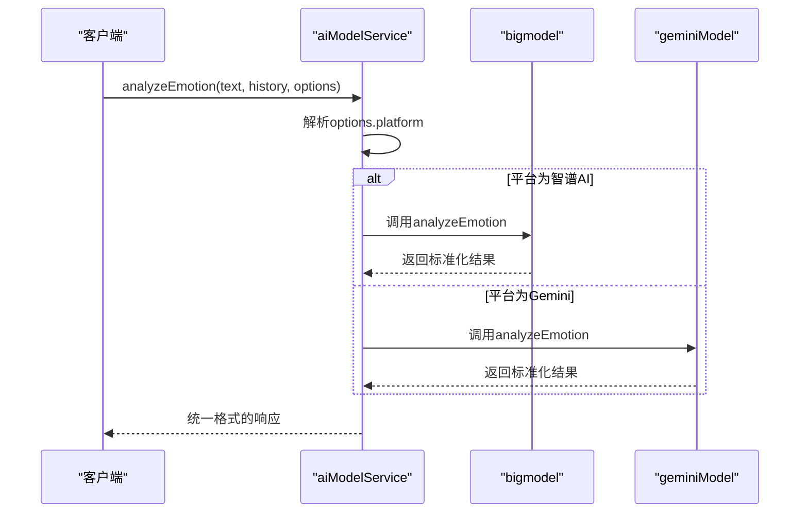
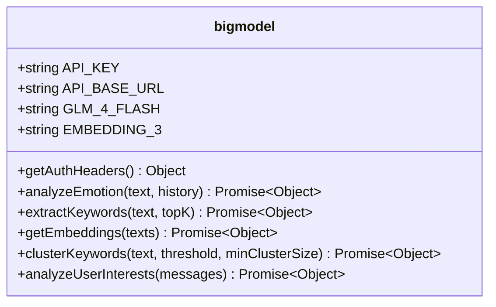
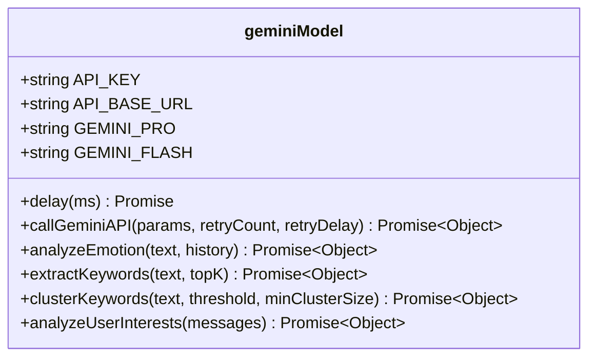
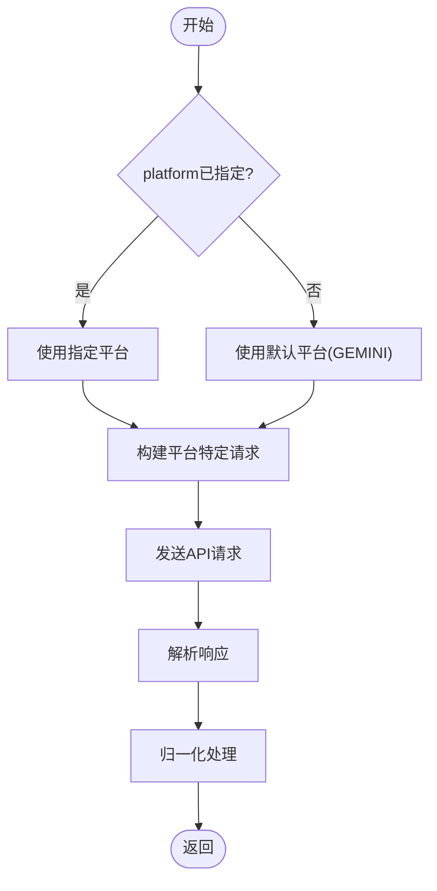
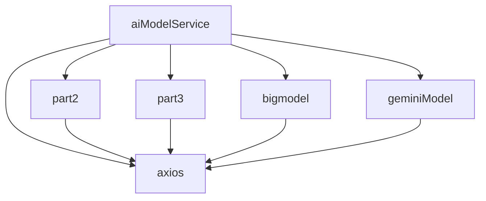

# 模型服务集成

<cite>
**本文档引用文件**  
- [aiModelService.js](file://cloudfunctions/analysis/aiModelService.js)
- [bigmodel.js](file://cloudfunctions/analysis/bigmodel.js)
- [geminiModel.js](file://cloudfunctions/analysis/geminiModel.js)
- [analysis云函数统一AI模型服务设计文档.md](file://doc/开发文档/analysis云函数统一AI模型服务设计文档.md)
</cite>

## 目录
1. [项目结构](#项目结构)
2. [核心组件](#核心组件)
3. [架构概述](#架构概述)
4. [详细组件分析](#详细组件分析)
5. [依赖分析](#依赖分析)
6. [性能考虑](#性能考虑)
7. [故障排查指南](#故障排查指南)

## 项目结构

项目中的AI模型服务模块位于`cloudfunctions/analysis/`目录下，主要由统一服务层和多个模型适配器组成。该结构实现了多AI模型的集成与统一调用。

```mermaid
graph TB
subgraph "AI模型服务模块"
aiModelService["aiModelService.js<br/>统一服务层"]
bigmodel["bigmodel.js<br/>智谱AI适配器"]
geminiModel["geminiModel.js<br/>Gemini适配器"]
part2["aiModelService_part2.js"]
part3["aiModelService_part3.js"]
end
aiModelService --> bigmodel
aiModelService --> geminiModel
aiModelService --> part2
aiModelService --> part3
```

**图示来源**  
- [aiModelService.js](file://cloudfunctions/analysis/aiModelService.js#L1-L662)
- [bigmodel.js](file://cloudfunctions/analysis/bigmodel.js#L1-L704)
- [geminiModel.js](file://cloudfunctions/analysis/geminiModel.js#L1-L655)

**本节来源**  
- [aiModelService.js](file://cloudfunctions/analysis/aiModelService.js#L1-L662)
- [bigmodel.js](file://cloudfunctions/analysis/bigmodel.js#L1-L704)
- [geminiModel.js](file://cloudfunctions/analysis/geminiModel.js#L1-L655)

## 核心组件

`aiModelService.js`作为统一服务层，协调`bigmodel.js`和`geminiModel.js`的调用。它通过`MODEL_PLATFORMS`配置对象管理不同AI平台的参数，并提供统一的接口如`analyzeEmotion`、`extractKeywords`等。该服务支持智谱AI、Google Gemini、OpenAI、Crond API和CloseAI等多种模型平台，实现了请求格式转换、响应归一化处理和模型选择策略。

**本节来源**  
- [aiModelService.js](file://cloudfunctions/analysis/aiModelService.js#L1-L662)
- [analysis云函数统一AI模型服务设计文档.md](file://doc/开发文档/analysis云函数统一AI模型服务设计文档.md#L1-L345)

## 架构概述

系统采用分层架构，`aiModelService.js`作为抽象层，封装了底层模型适配器的差异。当上层调用`analyzeEmotion`等接口时，服务根据配置选择合适的模型平台，将请求转发给相应的适配器，并对返回结果进行标准化处理。

**图示来源**  
- [aiModelService.js](file://cloudfunctions/analysis/aiModelService.js#L1-L662)
- [bigmodel.js](file://cloudfunctions/analysis/bigmodel.js#L1-L704)
- [geminiModel.js](file://cloudfunctions/analysis/geminiModel.js#L1-L655)

## 详细组件分析

### 模型适配器实现差异

不同模型适配器在请求头构造、token计算和超时配置等方面存在差异。

#### 智谱AI适配器 (bigmodel.js)

**图示来源**  
- [bigmodel.js](file://cloudfunctions/analysis/bigmodel.js#L1-L704)

#### Gemini适配器 (geminiModel.js)

**图示来源**  
- [geminiModel.js](file://cloudfunctions/analysis/geminiModel.js#L1-L655)

**本节来源**  
- [bigmodel.js](file://cloudfunctions/analysis/bigmodel.js#L1-L704)
- [geminiModel.js](file://cloudfunctions/analysis/geminiModel.js#L1-L655)

### 模型选择与配置

模型选择通过`options`参数中的`platform`字段实现。系统支持多种配置方式：

**图示来源**  
- [aiModelService.js](file://cloudfunctions/analysis/aiModelService.js#L1-L662)

**本节来源**  
- [aiModelService.js](file://cloudfunctions/analysis/aiModelService.js#L1-L662)

## 依赖分析

系统依赖关系清晰，`aiModelService.js`作为核心协调者，依赖于具体的模型适配器和辅助模块。

**图示来源**  
- [aiModelService.js](file://cloudfunctions/analysis/aiModelService.js#L1-L662)
- [bigmodel.js](file://cloudfunctions/analysis/bigmodel.js#L1-L704)
- [geminiModel.js](file://cloudfunctions/analysis/geminiModel.js#L1-L655)

**本节来源**  
- [aiModelService.js](file://cloudfunctions/analysis/aiModelService.js#L1-L662)
- [bigmodel.js](file://cloudfunctions/analysis/bigmodel.js#L1-L704)
- [geminiModel.js](file://cloudfunctions/analysis/geminiModel.js#L1-L655)

## 性能考虑

系统实现了多种性能优化和容错机制：

- **重试机制**：对429错误（请求过多）实现指数退避重试
- **错误处理**：统一的错误处理框架，包含API密钥验证、请求错误处理和响应验证
- **日志记录**：详细的日志输出，便于问题诊断
- **降级策略**：当主模型服务失败时，可配置备用模型进行调用
- **性能监控**：建议在关键路径添加埋点，监控响应时间、成功率等指标

**本节来源**  
- [aiModelService.js](file://cloudfunctions/analysis/aiModelService.js#L1-L662)
- [analysis云函数统一AI模型服务设计文档.md](file://doc/开发文档/analysis云函数统一AI模型服务设计文档.md#L1-L345)

## 故障排查指南

当模型调用失败时，可按以下步骤进行排查：

1. 检查环境变量中是否正确配置了相应的API密钥
2. 查看日志输出，确认错误类型（如429、401等）
3. 验证请求参数是否符合API要求
4. 检查网络连接是否正常
5. 确认模型服务是否可用

**本节来源**  
- [aiModelService.js](file://cloudfunctions/analysis/aiModelService.js#L1-L662)
- [bigmodel.js](file://cloudfunctions/analysis/bigmodel.js#L1-L704)
- [geminiModel.js](file://cloudfunctions/analysis/geminiModel.js#L1-L655)