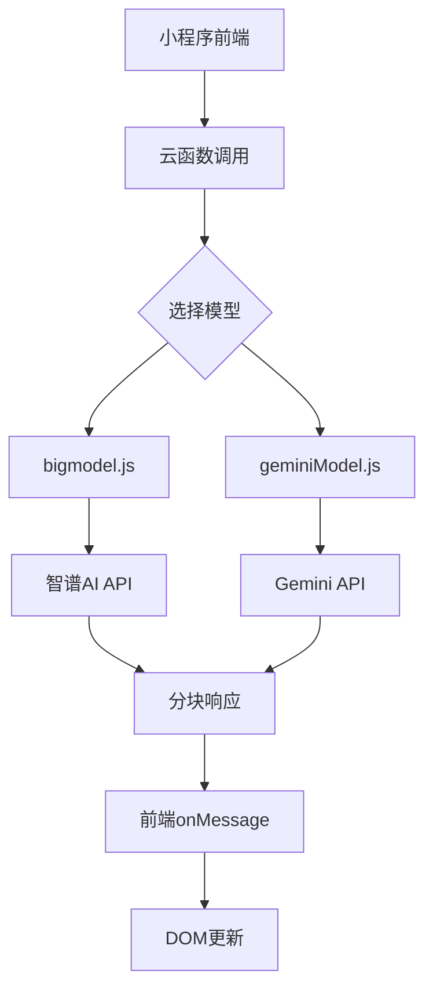
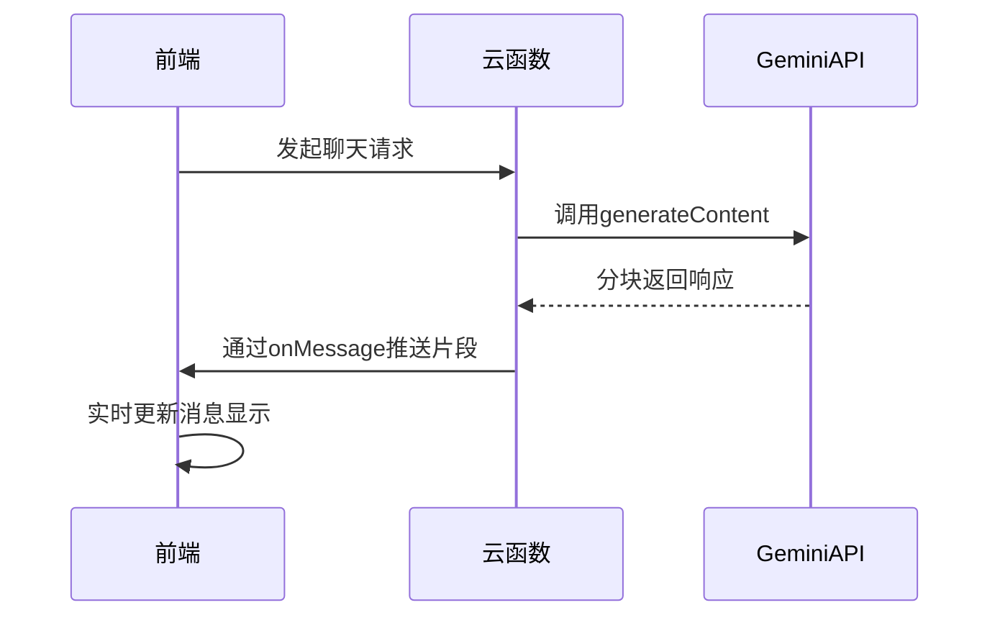
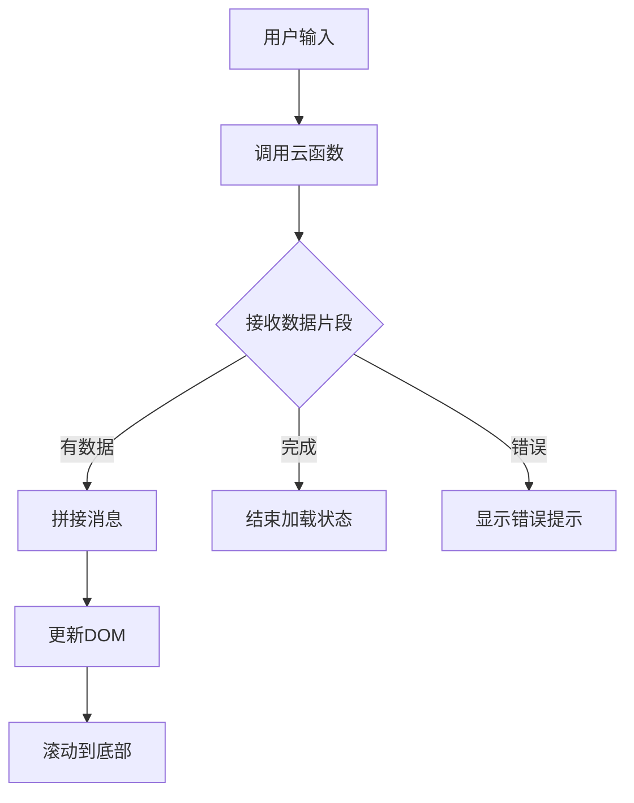
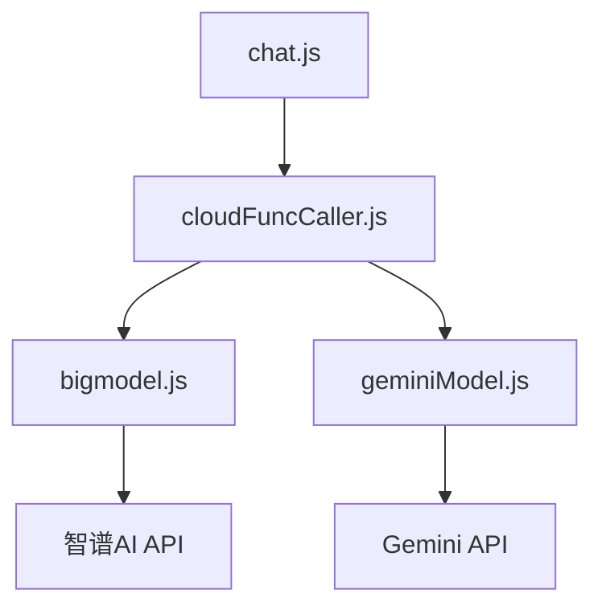

# 消息流处理

<cite>
**本文档引用的文件**  
- [bigmodel.js](file://cloudfunctions/chat/bigmodel.js)
- [geminiModel.js](file://cloudfunctions/chat/geminiModel.js)
- [chat.js](file://miniprogram/packageChat/pages/chat/chat.js)
- [cloudFuncCaller.js](file://miniprogram/services/cloudFuncCaller.js)
</cite>

## 目录
1. [引言](#引言)
2. [项目结构](#项目结构)
3. [核心组件](#核心组件)
4. [架构概述](#架构概述)
5. [详细组件分析](#详细组件分析)
6. [依赖分析](#依赖分析)
7. [性能考虑](#性能考虑)
8. [故障排除指南](#故障排除指南)
9. [结论](#结论)

## 引言
本文档全面阐述了HeartChat应用中聊天消息的流式传输机制。重点分析如何通过分块响应实现渐进式输出，提升用户体验。文档涵盖后端在`bigmodel.js`和`geminiModel.js`中的数据分片原理，前端`onMessage`事件处理机制，以及网络中断时的续传策略与性能优化技巧。

## 项目结构
HeartChat项目采用模块化架构，主要分为云函数（cloudfunctions）、小程序前端（miniprogram）和文档（doc）三大目录。聊天消息流式处理的核心逻辑分布在云函数的chat模块与小程序的packageChat页面中。

**Section sources**
- [bigmodel.js](file://cloudfunctions/chat/bigmodel.js#L1-L20)
- [geminiModel.js](file://cloudfunctions/chat/geminiModel.js#L1-L20)

## 核心组件
系统核心组件包括基于智谱AI的`bigmodel.js`和基于Google Gemini的`geminiModel.js`云函数，以及小程序端的`chat.js`页面。这些组件共同实现了消息的生成、传输与渲染。

**Section sources**
- [bigmodel.js](file://cloudfunctions/chat/bigmodel.js#L25-L50)
- [geminiModel.js](file://cloudfunctions/chat/geminiModel.js#L25-L50)
- [chat.js](file://miniprogram/packageChat/pages/chat/chat.js#L10-L30)

## 架构概述
系统采用前后端分离架构，通过云函数提供AI模型服务。前端发起聊天请求，后端模型生成回复并以分块形式返回，前端实时接收并拼接显示。

**Diagram sources**
- [bigmodel.js](file://cloudfunctions/chat/bigmodel.js#L100-L150)
- [geminiModel.js](file://cloudfunctions/chat/geminiModel.js#L150-L200)
- [chat.js](file://miniprogram/packageChat/pages/chat/chat.js#L50-L100)

## 详细组件分析

### 智谱AI模型分析
`bigmodel.js`模块实现了与智谱AI的集成，负责生成聊天回复。尽管代码中`stream: false`表明当前未启用流式输出，但其设计为未来支持流式响应奠定了基础。

**Section sources**
- [bigmodel.js](file://cloudfunctions/chat/bigmodel.js#L50-L167)

### Gemini模型分析
`geminiModel.js`模块提供了与Google Gemini API的集成。该模块包含完整的错误处理和重试机制，为流式传输提供了可靠的底层支持。

**Diagram sources**
- [geminiModel.js](file://cloudfunctions/chat/geminiModel.js#L100-L250)

### 前端消息处理分析
小程序端通过事件总线机制接收流式数据，实现渐进式渲染。`cloudFuncCaller.js`服务封装了云函数调用逻辑，`chat.js`页面负责UI更新。

**Diagram sources**
- [cloudFuncCaller.js](file://miniprogram/services/cloudFuncCaller.js#L20-L80)
- [chat.js](file://miniprogram/packageChat/pages/chat/chat.js#L100-L200)

**Section sources**
- [cloudFuncCaller.js](file://miniprogram/services/cloudFuncCaller.js#L1-L100)
- [chat.js](file://miniprogram/packageChat/pages/chat/chat.js#L1-L300)

## 依赖分析
系统依赖关系清晰，前端依赖云函数服务，云函数依赖外部AI API。通过模块化设计降低了组件间的耦合度。

**Diagram sources**
- [cloudFuncCaller.js](file://miniprogram/services/cloudFuncCaller.js#L10-L50)
- [bigmodel.js](file://cloudfunctions/chat/bigmodel.js#L10-L50)
- [geminiModel.js](file://cloudfunctions/chat/geminiModel.js#L10-L50)

**Section sources**
- [cloudFuncCaller.js](file://miniprogram/services/cloudFuncCaller.js#L1-L100)
- [bigmodel.js](file://cloudfunctions/chat/bigmodel.js#L1-L167)
- [geminiModel.js](file://cloudfunctions/chat/geminiModel.js#L1-L265)

## 性能考虑
系统在性能方面考虑了多个优化点：通过限制历史消息数量防止token超限，使用快速模型（glm-4-flash和gemini-2.5-flash）降低延迟，以及实现请求重试机制提高可靠性。

**Section sources**
- [bigmodel.js](file://cloudfunctions/chat/bigmodel.js#L80-L100)
- [geminiModel.js](file://cloudfunctions/chat/geminiModel.js#L80-L100)

## 故障排除指南
常见问题包括API密钥未配置、网络请求失败和响应格式错误。日志记录和错误处理机制有助于快速定位问题。

**Section sources**
- [bigmodel.js](file://cloudfunctions/chat/bigmodel.js#L150-L167)
- [geminiModel.js](file://cloudfunctions/chat/geminiModel.js#L200-L265)

## 结论
虽然当前实现中流式输出功能尚未完全启用（stream: false），但系统架构已为消息流式传输做好了充分准备。通过完善前端事件处理和启用API的流式选项，可轻松实现渐进式消息输出，显著提升用户体验。