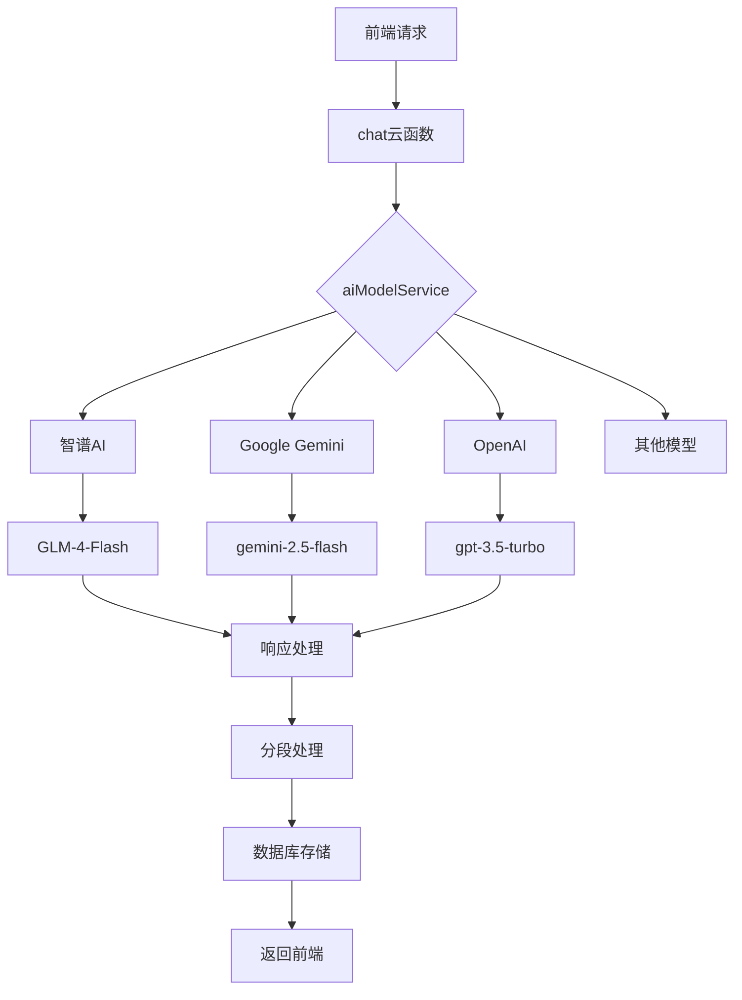
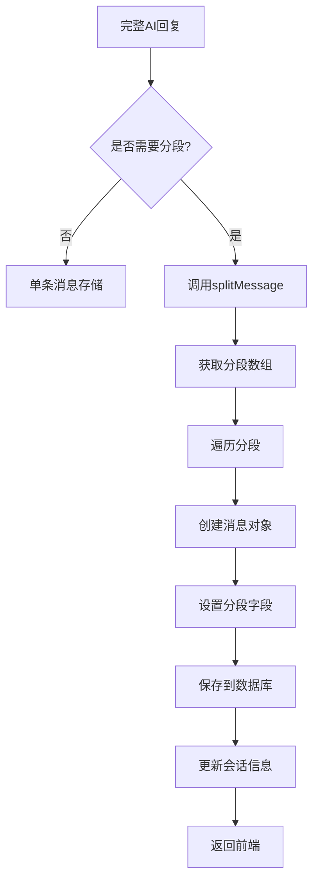
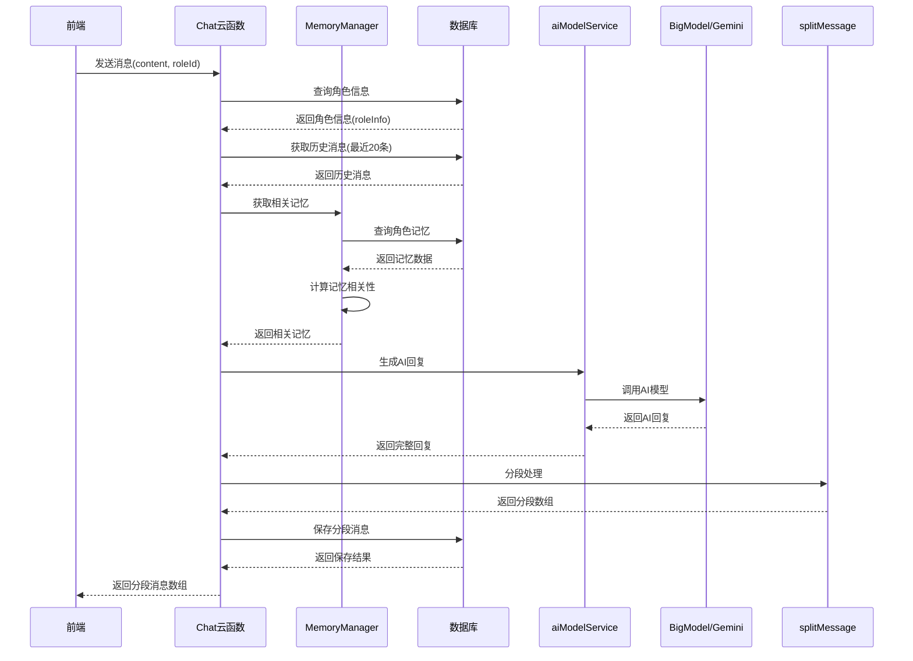
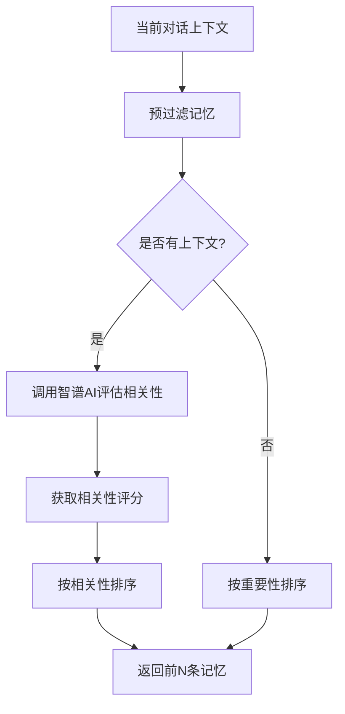
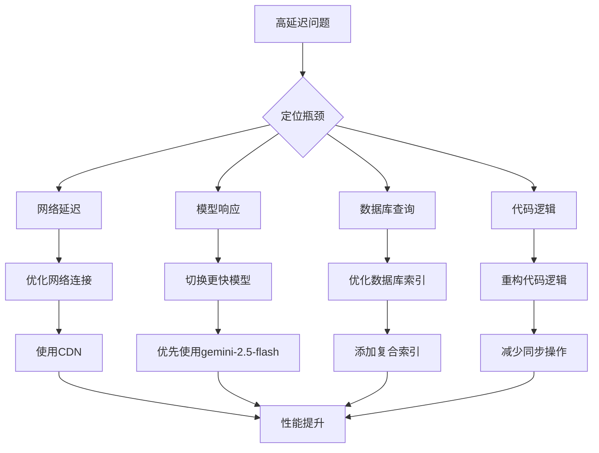

# 聊天API

<cite>
**本文档引用的文件**  
- [index.js](file://cloudfunctions/chat/index.js)
- [aiModelService.js](file://cloudfunctions/chat/aiModelService.js)
- [bigmodel.js](file://cloudfunctions/chat/bigmodel.js)
- [geminiModel.js](file://cloudfunctions/chat/geminiModel.js)
- [splitMessage](file://cloudfunctions/chat/index.js#L15-L150)
- [sendMessage](file://cloudfunctions/chat/index.js#L900-L1200)
- [generateAIReply](file://cloudfunctions/chat/index.js#L700-L800)
- [cloudFuncCaller.js](file://miniprogram/services/cloudFuncCaller.js)
- [memoryManager.js](file://cloudfunctions/roles/memoryManager.js)
- [promptGenerator.js](file://cloudfunctions/roles/promptGenerator.js)
</cite>

## 目录
1. [简介](#简介)
2. [前端消息发送机制](#前端消息发送机制)
3. [后端AI响应生成流程](#后端ai响应生成流程)
4. [流式响应与分段传输策略](#流式响应与分段传输策略)
5. [上下文管理与对话记忆机制](#上下文管理与对话记忆机制)
6. [错误处理与响应格式](#错误处理与响应格式)
7. [性能优化与监控建议](#性能优化与监控建议)

## 简介

聊天API是HeartChat系统的核心功能模块，负责处理用户与AI角色之间的实时对话。该API通过微信云函数实现，支持多模型响应生成（包括智谱AI和Google Gemini），并具备智能分段输出、上下文记忆保持和情感分析等高级功能。系统采用模块化设计，通过统一的AI模型服务接口协调不同AI平台的调用，确保了系统的灵活性和可扩展性。

## 前端消息发送机制

前端通过`wx.cloud.callFunction`方法调用`chat`云函数的`sendMessage`功能，向后端发送消息内容、角色ID、会话上下文等参数。消息发送过程由`cloudFuncCaller.js`服务封装，提供了统一的调用接口和错误处理机制。

调用参数包括：
- **chatId**：会话ID，用于关联对话上下文
- **roleId**：角色ID，指定对话的AI角色
- **content**：用户消息内容
- **systemPrompt**：自定义系统提示词（可选）
- **modelType**：指定使用的AI模型类型（gemini或zhipu）
- **modelName**：具体模型名称
- **modelParams**：模型参数配置（温度、最大token等）
- **chatMemoryLength**：对话记忆长度

```javascript
// 前端调用示例
const result = await callCloudFunc('chat', {
  action: 'sendMessage',
  chatId: 'chat123',
  roleId: 'role456',
  content: '你好，今天过得怎么样？',
  modelType: 'gemini',
  modelParams: {
    temperature: 0.7,
    maxTokens: 2048
  },
  chatMemoryLength: 20
});
```

**本节内容来源**
- [index.js](file://cloudfunctions/chat/index.js#L900-L1200)
- [cloudFuncCaller.js](file://miniprogram/services/cloudFuncCaller.js#L1-L180)

## 后端AI响应生成流程

后端通过`chat`云函数协调`bigmodel.js`和`geminiModel.js`进行多模型响应生成。系统采用统一的AI模型服务架构，通过`aiModelService.js`提供标准化的接口调用。

### AI模型服务架构



**图示来源**
- [aiModelService.js](file://cloudfunctions/chat/aiModelService.js#L1-L587)
- [bigmodel.js](file://cloudfunctions/chat/bigmodel.js#L1-L168)
- [geminiModel.js](file://cloudfunctions/chat/geminiModel.js#L1-L266)

### 模型调用流程

1. **参数验证**：检查必要参数和格式
2. **会话管理**：查询或创建聊天会话
3. **历史获取**：根据`chatMemoryLength`获取指定长度的历史消息
4. **消息保存**：将用户消息保存到数据库
5. **AI调用**：通过`aiModelService.generateChatReply`调用选择的AI模型
6. **响应处理**：解析AI回复并进行分段处理
7. **批量保存**：将分段后的AI回复保存到数据库
8. **统计更新**：更新用户和角色统计数据

### 统一模型服务接口

```mermaid
classDiagram
class AIModelService {
+MODEL_PLATFORMS : Object
+generateChatReply(userMessage, history, roleInfo, includeEmotionAnalysis, customSystemPrompt, options)
+getAvailableModels(platformKey)
+callModelApi(params, platformKey, retryCount, retryDelay)
}
class BigModel {
+generateChatReply(userMessage, history, roleInfo, includeEmotionAnalysis, customSystemPrompt)
}
class GeminiModel {
+generateChatReply(userMessage, history, roleInfo, includeEmotionAnalysis, customSystemPrompt)
+callGeminiAPI(params, retryCount, retryDelay)
+formatMessagesForGemini(history)
}
AIModelService --> BigModel : "调用"
AIModelService --> GeminiModel : "调用"
BigModel --> "智谱AI API" : "HTTP请求"
GeminiModel --> "Gemini API" : "HTTP请求"
```

**图示来源**
- [aiModelService.js](file://cloudfunctions/chat/aiModelService.js#L1-L587)
- [bigmodel.js](file://cloudfunctions/chat/bigmodel.js#L1-L168)
- [geminiModel.js](file://cloudfunctions/chat/geminiModel.js#L1-L266)

## 流式响应与分段传输策略

系统采用智能分段传输策略，将长AI回复拆分为多个消息气泡，模拟真实聊天的节奏感。分段处理在后端完成，确保了前端显示的一致性和用户体验的流畅性。

### 分段算法实现

```javascript
function splitMessage(message) {
  // 1. 清理Markdown标记
  const cleanMessage = message.replace(/\*\*([^*]+)\*\*/g, '$1');
  
  // 2. 按自然段落分割
  let segments = cleanMessage.split(/\n\s*\n/);
  
  // 3. 处理过长的段落，按句子分割
  const sentenceSegments = [];
  for (const segment of segments) {
    if (segment.length > MAX_SEGMENT_LENGTH) {
      const sentences = segment.split(/(?<=[。！？.!?])(?:\s|$)/);
      // 合并短句子，避免过度分段
      let currentSentence = '';
      for (const sentence of sentences) {
        if (currentSentence.length + sentence.length <= MAX_SEGMENT_LENGTH) {
          currentSentence += (currentSentence ? ' ' : '') + sentence;
        } else {
          if (currentSentence.length > 0) {
            sentenceSegments.push(currentSentence.trim());
          }
          currentSentence = sentence;
        }
      }
      if (currentSentence.length > 0) {
        sentenceSegments.push(currentSentence.trim());
      }
    } else {
      sentenceSegments.push(segment.trim());
    }
  }
  
  // 4. 最终处理：合并过短的段落
  const finalResult = [];
  let currentSegment = '';
  for (const segment of sentenceSegments) {
    if (currentSegment.length + segment.length + 1 <= MAX_SEGMENT_LENGTH) {
      currentSegment += (currentSegment ? ' ' : '') + segment;
    } else {
      if (currentSegment.length > 0) {
        finalResult.push(currentSegment);
      }
      currentSegment = segment;
    }
  }
  if (currentSegment.length > 0) {
    finalResult.push(currentSegment);
  }
  
  return finalResult;
}
```

### 分段消息存储结构

分段消息在数据库中通过特定字段进行关联和标识：

| 字段名 | 说明 |
| :--- | :--- |
| `isSegment` | 布尔值，标记是否为分段消息 |
| `segmentIndex` | 分段索引，从0开始 |
| `totalSegments` | 总分段数 |
| `originalMessageId` | 关联到第一条消息的ID |



**本节内容来源**
- [index.js](file://cloudfunctions/chat/index.js#L15-L150)
- [index.js](file://cloudfunctions/chat/index.js#L900-L1200)

## 上下文管理与对话记忆机制

系统通过多层次的上下文管理机制保持对话的连贯性和个性化。上下文管理包括短期对话记忆和长期角色记忆两个层面。

### 对话记忆流程



### 长期记忆管理

长期记忆由`roles`云函数的`memoryManager.js`模块管理，采用重要性评分和时间衰减算法来维护记忆的相关性。

#### 记忆评分算法

```javascript
// 记忆评分 = (重要性 * 0.7) + (时间分数 * 0.3)
// 时间衰减函数：指数衰减，30天后权重减半
timeScore = Math.exp(-daysSinceCreation / 30);
finalScore = (memory.importance * 0.7) + (timeScore * 0.3);
```

#### 记忆检索流程

1. **预过滤**：使用本地算法基于关键词匹配进行初步筛选
2. **AI相关性评估**：调用智谱AI计算记忆与当前上下文的相关性
3. **排序返回**：按相关性分数从高到低排序，返回前N条记忆



**本节内容来源**
- [memoryManager.js](file://cloudfunctions/roles/memoryManager.js#L1-L859)
- [promptGenerator.js](file://cloudfunctions/roles/promptGenerator.js#L1-L261)
- [index.js](file://cloudfunctions/chat/index.js#L900-L1200)

## 错误处理与响应格式

系统实现了全面的错误处理机制，能够应对模型调用超时、内容过滤等各种异常情况，并返回标准化的错误响应格式。

### 错误类型与处理

| 错误类型 | 响应码 | 处理策略 |
| :--- | :--- | :--- |
| 参数验证失败 | 400 | 返回具体参数错误信息 |
| API密钥无效 | 401 | 提示用户检查API密钥配置 |
| 请求频率超限 | 429 | 实现指数退避重试机制 |
| 模型调用超时 | 504 | 增加超时时间并重试 |
| 内容安全过滤 | 400 | 返回安全警告并记录日志 |
| 服务器内部错误 | 500 | 记录详细错误日志 |

### 标准化响应格式

#### 成功响应

```json
{
  "success": true,
  "chatId": "聊天会话ID",
  "isNewChat": false,
  "message": {
    "_id": "用户消息ID",
    "chatId": "聊天会话ID",
    "roleId": "角色ID",
    "content": "用户消息内容",
    "sender_type": "user",
    "createTime": "2023-04-12T12:34:56.789Z",
    "status": "sent"
  },
  "aiMessages": [
    {
      "_id": "AI消息ID",
      "chatId": "聊天会话ID",
      "roleId": "角色ID",
      "content": "AI回复分段1",
      "sender_type": "ai",
      "createTime": "2023-04-12T12:34:57.123Z",
      "status": "sent",
      "isSegment": true,
      "segmentIndex": 0,
      "totalSegments": 3,
      "originalMessageId": null
    },
    {
      "_id": "AI消息ID2",
      "chatId": "聊天会话ID",
      "roleId": "角色ID",
      "content": "AI回复分段2",
      "sender_type": "ai",
      "createTime": "2023-04-12T12:34:57.150Z",
      "status": "sent",
      "isSegment": true,
      "segmentIndex": 1,
      "totalSegments": 3,
      "originalMessageId": "AI消息ID"
    }
  ],
  "emotionAnalysis": null
}
```

#### 错误响应

```json
{
  "success": false,
  "error": "错误描述信息",
  "code": 500,
  "details": {
    "原始错误信息": "具体内容"
  }
}
```

### 超时处理机制

系统为不同模型设置了不同的超时时间，以应对模型响应速度的差异：

```javascript
// 为不同模型设置不同的超时时间
let timeoutMs = 20000; // 默认20秒超时
if (platformKey === 'CLAUDE') {
  timeoutMs = 30000; // Claude模型设置30秒超时
}
```

**本节内容来源**
- [aiModelService.js](file://cloudfunctions/chat/aiModelService.js#L389-L426)
- [index.js](file://cloudfunctions/chat/index.js#L1203-L1286)
- [geminiModel.js](file://cloudfunctions/chat/geminiModel.js#L1-L266)

## 性能优化与监控建议

系统通过多种性能优化措施确保聊天响应的及时性和稳定性，同时提供了监控建议帮助开发者进一步优化系统性能。

### 性能优化措施

1. **异步消息处理**：采用非阻塞I/O操作，提高并发处理能力
2. **批量数据库操作**：将多个数据库操作合并为批处理，减少I/O开销
3. **历史消息限制**：通过`chatMemoryLength`参数控制历史消息数量，避免token超限
4. **智能缓存策略**：缓存频繁访问的角色信息和记忆数据
5. **并发请求处理**：支持并行处理多个独立的云函数调用

### 性能监控建议

1. **响应延迟监控**：记录从用户发送消息到收到AI回复的完整耗时
2. **错误率统计**：监控各类错误的发生频率，特别是429和504错误
3. **模型性能对比**：比较不同AI模型的响应速度和成功率
4. **数据库查询优化**：监控数据库查询性能，优化索引和查询语句
5. **内存使用监控**：跟踪云函数内存使用情况，避免内存泄漏

### 响应延迟优化策略



**本节内容来源**
- [aiModelService.js](file://cloudfunctions/chat/aiModelService.js#L389-L426)
- [index.js](file://cloudfunctions/chat/index.js#L1203-L1286)
- [doc/开发文档/cloudfunctions/chat.md](file://doc/开发文档/cloudfunctions/chat.md#L201-L207)