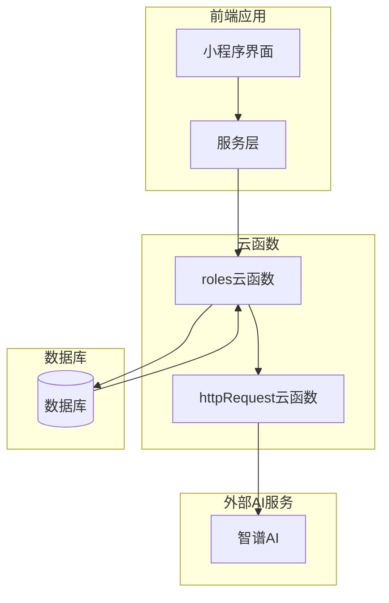
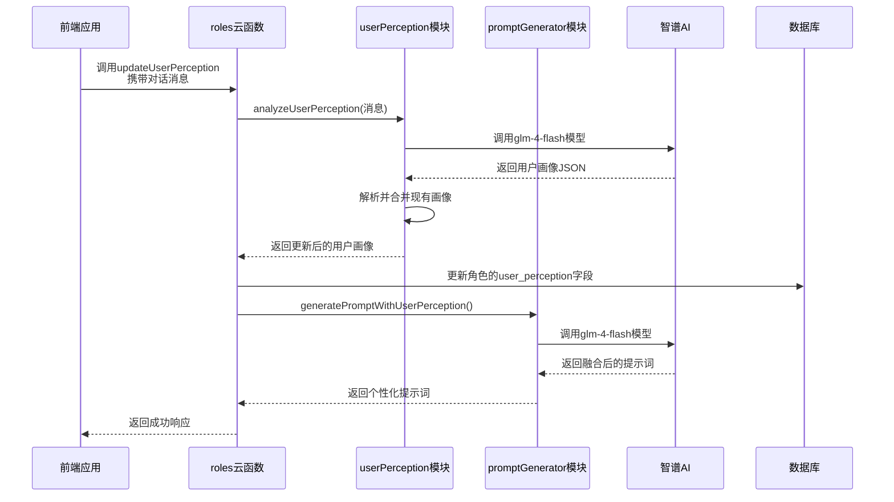
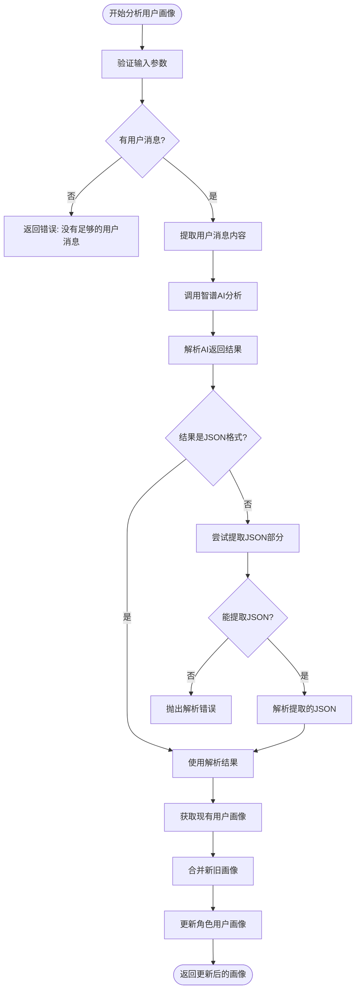
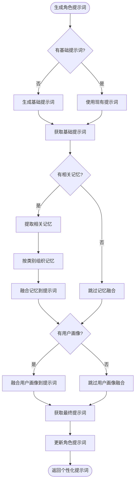

# 用户感知接口

<cite>
**本文档引用的文件**
- [userPerception.js](file://cloudfunctions/roles/userPerception.js)
- [promptGenerator.js](file://cloudfunctions/roles/promptGenerator.js)
- [index.js](file://cloudfunctions/roles/index.js)
- [userPerception模块使用文档.md](file://doc/使用文档/userPerception模块使用文档.md)
- [roles.md](file://doc/开发文档/cloudfunctions/roles.md)
</cite>

## 目录
1. [简介](#简介)
2. [项目结构](#项目结构)
3. [核心组件](#核心组件)
4. [架构概述](#架构概述)
5. [详细组件分析](#详细组件分析)
6. [依赖分析](#依赖分析)
7. [性能考虑](#性能考虑)
8. [故障排除指南](#故障排除指南)
9. [结论](#结论)

## 简介
用户感知接口是HeartChat应用中实现个性化对话体验的核心机制。该系统通过分析用户的历史交互数据，构建动态的用户画像，并利用这些信息生成个性化的对话提示词，从而实现"越聊越懂你"的自适应交互体验。本系统主要由`userPerception.js`和`promptGenerator.js`两个核心模块组成，分别负责用户画像的分析与生成，以及基于用户画像的提示词动态生成。

## 项目结构
用户感知功能主要集中在`cloudfunctions/roles`目录下，通过云函数接口对外提供服务。系统采用模块化设计，各功能组件职责分明，协同工作。



**图示来源**
- [index.js](file://cloudfunctions/roles/index.js#L1-L759)
- [userPerception.js](file://cloudfunctions/roles/userPerception.js#L1-L315)
- [promptGenerator.js](file://cloudfunctions/roles/promptGenerator.js#L1-L325)

**本节来源**
- [roles.md](file://doc/开发文档/cloudfunctions/roles.md#L1-L341)
- [项目结构](workspace://)

## 核心组件
用户感知接口的核心功能由`userPerception.js`和`promptGenerator.js`两个文件实现。`userPerception.js`负责分析用户历史交互数据，提取用户的兴趣、偏好、沟通风格和情感模式等特征，构建用户画像。`promptGenerator.js`则利用这些用户画像信息，动态生成角色专属的提示词，使角色能够根据用户的个性特征进行个性化对话。

**本节来源**
- [userPerception.js](file://cloudfunctions/roles/userPerception.js#L1-L315)
- [promptGenerator.js](file://cloudfunctions/roles/promptGenerator.js#L1-L325)

## 架构概述
用户感知接口采用分层架构设计，从数据采集到最终的个性化输出，形成了完整的处理链条。系统通过云函数`updateUserPerception`接收用户对话数据，调用`userPerception.js`模块进行画像分析，将结果存储在角色数据中，再通过`promptGenerator.js`生成个性化提示词，最终影响角色的对话策略。



**图示来源**
- [index.js](file://cloudfunctions/roles/index.js#L654-L677)
- [userPerception.js](file://cloudfunctions/roles/userPerception.js#L70-L140)
- [promptGenerator.js](file://cloudfunctions/roles/promptGenerator.js#L270-L316)

## 详细组件分析

### 用户画像分析模块
`userPerception.js`模块负责从用户的历史对话中提取用户画像。该模块通过调用智谱AI的glm-4-flash模型，分析用户消息内容，识别用户的兴趣、偏好、沟通风格和情感模式。

```mermaid
classDiagram
class userPerception {
+analyzeUserPerception(messages, userId, roleId)
+updateRoleUserPerception(roleId, userId, newPerception)
+generateUserPerceptionSummary(userPerception)
-callZhipuAI(params)
-mergeUserPerception(existingPerception, newPerception)
}
class promptGenerator {
+generateBasePrompt(roleInfo)
+generatePromptWithMemories(basePrompt, memories)
+generatePromptWithUserPerception(basePrompt, userPerception)
-callZhipuAI(params)
-organizeMemoriesByCategory(memories)
-localMergeMemoriesWithPrompt(basePrompt, memories)
}
userPerception --> promptGenerator : "通过云函数调用"
userPerception --> "智谱AI" : "调用glm-4-flash模型"
promptGenerator --> "智谱AI" : "调用glm-4-flash模型"
note right of userPerception
负责分析用户对话，
构建用户画像
end note
note left of promptGenerator
负责生成角色提示词，
融合用户画像和记忆
end note
```

**图示来源**
- [userPerception.js](file://cloudfunctions/roles/userPerception.js#L1-L315)
- [promptGenerator.js](file://cloudfunctions/roles/promptGenerator.js#L1-L325)

#### 用户画像分析流程


**图示来源**
- [userPerception.js](file://cloudfunctions/roles/userPerception.js#L70-L140)
- [userPerception.js](file://cloudfunctions/roles/userPerception.js#L143-L206)

**本节来源**
- [userPerception.js](file://cloudfunctions/roles/userPerception.js#L1-L315)
- [userPerception模块使用文档.md](file://doc/使用文档/userPerception模块使用文档.md#L1-L290)

### 提示词生成模块
`promptGenerator.js`模块负责生成角色的个性化提示词。该模块能够将用户画像自然地融入到角色提示词中，使角色能够根据用户的兴趣、偏好和沟通风格进行个性化互动。

#### 提示词生成流程


**图示来源**
- [promptGenerator.js](file://cloudfunctions/roles/promptGenerator.js#L143-L269)
- [promptGenerator.js](file://cloudfunctions/roles/promptGenerator.js#L270-L316)

**本节来源**
- [promptGenerator.js](file://cloudfunctions/roles/promptGenerator.js#L1-L325)
- [roles.md](file://doc/开发文档/cloudfunctions/roles.md#L1-L341)

## 依赖分析
用户感知接口依赖多个内部和外部组件协同工作。系统通过`httpRequest`云函数与智谱AI外部服务通信，使用数据库存储角色信息和用户画像，并通过云函数接口与前端应用交互。

```mermaid
graph TD
A[userPerception.js] --> B[智谱AI]
C[promptGenerator.js] --> B[智谱AI]
D[index.js] --> A[userPerception.js]
D[index.js] --> C[promptGenerator.js]
D[index.js] --> E[数据库]
B --> F[httpRequest云函数]
A --> F
C --> F
G[前端应用] --> D[index.js]
style A fill:#f9f,stroke:#333
style C fill:#f9f,stroke:#333
style D fill:#bbf,stroke:#333
style B fill:#f96,stroke:#333
style F fill:#6f9,stroke:#333
style E fill:#9cf,stroke:#333
style G fill:#9f9,stroke:#333
linkStyle 0 stroke:#f66;
linkStyle 1 stroke:#f66;
linkStyle 5 stroke:#f66;
linkStyle 6 stroke:#f66;
```

**图示来源**
- [index.js](file://cloudfunctions/roles/index.js#L1-L759)
- [userPerception.js](file://cloudfunctions/roles/userPerception.js#L1-L315)
- [promptGenerator.js](file://cloudfunctions/roles/promptGenerator.js#L1-L325)

**本节来源**
- [index.js](file://cloudfunctions/roles/index.js#L1-L759)
- [httpRequest云函数](file://cloudfunctions/httpRequest/index.js)

## 性能考虑
用户感知接口在设计时考虑了多项性能优化措施。系统使用glm-4-flash这一快速推理模型进行用户画像分析，确保响应速度。同时，系统实现了错误降级机制，当AI服务不可用时，能够使用本地算法进行简单合并，保证核心功能的可用性。数据库操作也经过优化，通过合理的索引和查询设计，确保数据读写效率。

## 故障排除指南
当用户感知接口出现问题时，可参考以下常见问题及解决方案：

**本节来源**
- [userPerception.js](file://cloudfunctions/roles/userPerception.js#L1-L315)
- [promptGenerator.js](file://cloudfunctions/roles/promptGenerator.js#L1-L325)
- [index.js](file://cloudfunctions/roles/index.js#L1-L759)

| 问题现象 | 可能原因 | 解决方案 |
|---------|---------|---------|
| 用户画像分析失败 | 智谱AI API密钥未配置 | 检查环境变量ZHIPU_API_KEY是否正确设置 |
| 提示词生成缓慢 | AI模型响应延迟 | 检查网络连接，确认智谱AI服务状态 |
| 用户画像未更新 | 对话消息格式不正确 | 确保传入的消息数组包含正确的sender_type字段 |
| 记忆融合失败 | 记忆数据格式错误 | 检查记忆对象是否包含content和importance字段 |
| 提示词未保存 | 数据库更新权限问题 | 检查角色创建者权限是否匹配当前用户 |

## 结论
用户感知接口通过`userPerception.js`和`promptGenerator.js`两个核心模块，实现了从用户历史交互数据中提取用户画像，并动态生成个性化提示词的完整流程。该机制使角色能够理解用户的兴趣、性格特征和情感倾向，从而调整对话策略，实现"越聊越懂你"的自适应交互体验。系统设计考虑了性能、可靠性和可维护性，为HeartChat应用提供了强大的个性化对话能力。