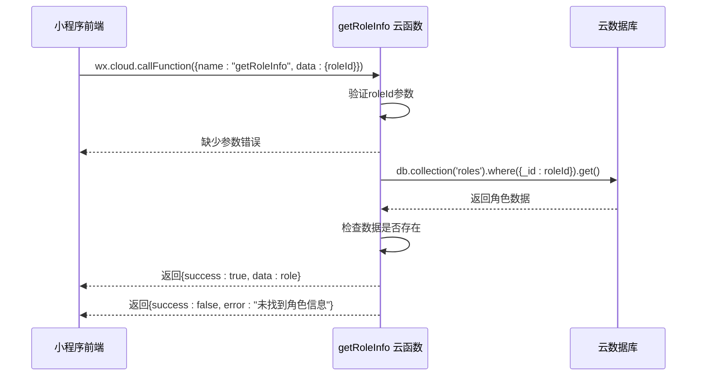
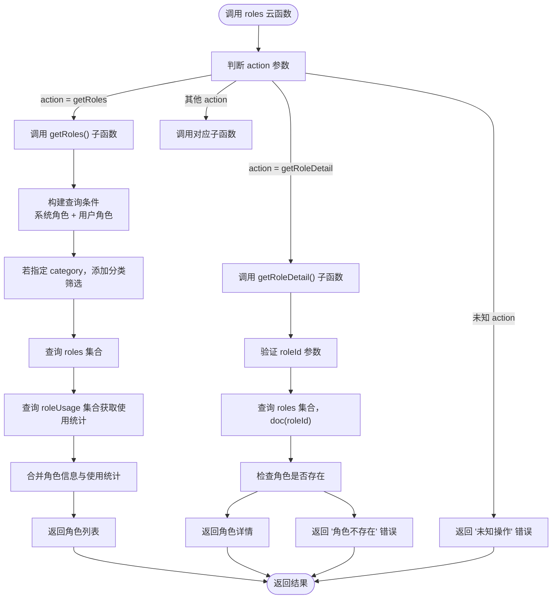
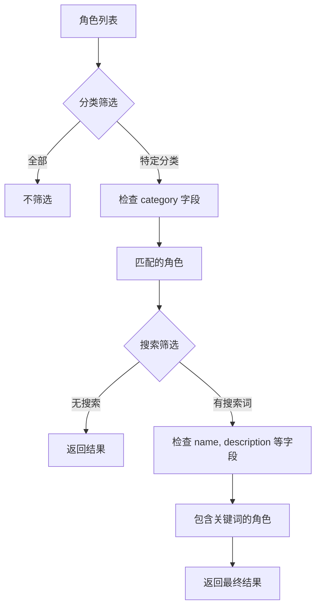

# 角色信息接口

<cite>
**本文档引用文件**  
- [getRoleInfo/index.js](file://cloudfunctions/getRoleInfo/index.js)
- [roles/index.js](file://cloudfunctions/roles/index.js)
- [roles/init-roles.js](file://cloudfunctions/roles/init-roles.js)
- [miniprogram/services/cloudFuncCaller.js](file://miniprogram/services/cloudFuncCaller.js)
- [miniprogram/pages/role-select/role-select.js](file://miniprogram/pages/role-select/role-select.js)
</cite>

## 目录
1. [简介](#简介)
2. [核心云函数说明](#核心云函数说明)
3. [角色信息查询接口](#角色信息查询接口)
4. [角色列表查询接口](#角色列表查询接口)
5. [前端调用示例](#前端调用示例)
6. [预设角色配置与初始化](#预设角色配置与初始化)
7. [角色分类与筛选机制](#角色分类与筛选机制)
8. [错误码定义](#错误码定义)
9. [总结](#总结)

## 简介
本接口文档详细说明了 `getRoleInfo` 和 `roles` 两个云函数中与角色信息查询相关的功能。通过这些接口，小程序前端可以获取角色的元数据，包括角色名称、描述、头像、提示词模板、性格设定等配置信息。文档涵盖 API 的请求参数、响应结构、错误码定义，并提供前端 `wx.cloud.callFunction` 调用示例，展示在角色选择页面和聊天页面初始化时的角色数据加载流程。同时结合 `init-roles.js` 中的预设角色数据结构，说明角色配置的来源与维护方式。

**Section sources**
- [getRoleInfo/index.js](file://cloudfunctions/getRoleInfo/index.js#L1-L51)
- [roles/index.js](file://cloudfunctions/roles/index.js#L1-L759)

## 核心云函数说明

### getRoleInfo 云函数
`getRoleInfo` 是一个轻量级云函数，专用于根据角色 ID 查询单个角色的完整信息。其主要职责是从数据库 `roles` 集合中查询指定 `_id` 的角色文档并返回。

#### 功能特点
- **单一职责**：仅支持通过 `roleId` 查询单个角色。
- **简单健壮**：包含参数校验和异常捕获机制。
- **直接返回**：查询成功后直接返回角色数据对象。



**Diagram sources**
- [getRoleInfo/index.js](file://cloudfunctions/getRoleInfo/index.js#L1-L51)

### roles 云函数
`roles` 是一个多功能聚合云函数，通过 `action` 参数区分不同的子功能。与角色查询相关的核心功能包括：
- `getRoles`：获取角色列表（支持分类筛选）
- `getRoleDetail`：获取角色详情（与 `getRoleInfo` 功能类似，但集成在多功能函数中）

该函数还支持角色创建、更新、删除、使用统计等管理功能，是角色系统的核心后端服务。



**Diagram sources**
- [roles/index.js](file://cloudfunctions/roles/index.js#L1-L759)

## 角色信息查询接口

### getRoleInfo 接口
此接口用于获取单个角色的详细信息。

#### 请求参数
- **name**: `getRoleInfo`
- **data**: 
  - `roleId` (string, 必填): 角色的唯一标识 `_id`

#### 响应结构
```json
{
  "success": true,
  "data": {
    "_id": "角色ID",
    "name": "角色名称",
    "avatar": "头像URL",
    "category": "分类",
    "description": "描述",
    "personality": ["性格标签数组"],
    "prompt": "提示词模板",
    "welcome": "欢迎语",
    "creator": "创建者标识",
    "createTime": "创建时间",
    "updateTime": "更新时间",
    "status": 1
  },
  "openid": "用户openid"
}
```

#### 错误响应
- `缺少必要参数: roleId`
- `未找到角色信息`
- 其他数据库错误

**Section sources**
- [getRoleInfo/index.js](file://cloudfunctions/getRoleInfo/index.js#L1-L51)

## 角色列表查询接口

### getRoles 接口
此接口用于获取用户可访问的角色列表，包括系统预设角色和用户自定义角色。

#### 请求参数
- **name**: `roles`
- **data**:
  - `action`: `getRoles` (必填)
  - `userId`: 用户ID (可选，通常使用 openid)
  - `category`: 分类筛选 (可选，如 `psychology`, `life`, `career`, `emotion`, `all`)
  - `limit`: 返回数量限制 (可选，默认50)
  - `skip`: 分页偏移 (可选，默认0)

#### 响应结构
```json
{
  "success": true,
  "data": [
    {
      "_id": "角色ID",
      "name": "角色名称",
      "avatar": "头像URL",
      "category": "分类",
      "description": "描述",
      "personality": ["性格标签数组"],
      "prompt": "提示词模板",
      "welcome": "欢迎语",
      "creator": "创建者标识",
      "createTime": "创建时间",
      "updateTime": "更新时间",
      "status": 1,
      "isSystem": true, // 标记是否为系统角色
      "usage": {
        "usageCount": 0, // 使用次数
        "lastUsedTime": "最后使用时间"
      }
    }
  ],
  "total": "角色总数"
}
```

#### 查询逻辑
1. **权限控制**：查询条件为 `creator` 为 `'system'` 或当前用户的 `openid`。
2. **分类筛选**：如果 `category` 参数存在且不为 `'all'`，则添加 `category` 字段的筛选条件。
3. **排序**：按 `createTime` 降序排列。
4. **使用统计**：额外查询 `roleUsage` 集合，将使用次数和最后使用时间合并到角色数据中。

**Section sources**
- [roles/index.js](file://cloudfunctions/roles/index.js#L1-L759)

## 前端调用示例

### 角色选择页面加载
在角色选择页面 (`role-select.js`) 的 `onLoad` 和 `onShow` 生命周期中，会调用 `roles` 云函数加载角色列表。

```javascript
// 示例：加载角色列表
wx.cloud.callFunction({
  name: 'roles',
  data: {
    action: 'getRoles',
    userId: userId // 用户ID
  }
})
.then(res => {
  if (res.result.success) {
    const roles = res.result.data;
    // 更新页面数据
    this.setData({
      roles: roles,
      filteredRoles: this.filterRoles(roles, this.data.activeCategory, this.data.searchValue)
    });
  } else {
    wx.showToast({ title: res.result.error, icon: 'none' });
  }
})
.catch(err => {
  console.error('获取角色列表失败:', err);
  wx.showToast({ title: '网络错误', icon: 'none' });
});
```

### 聊天页面初始化
在聊天页面初始化时，通常需要获取当前角色的详细信息，可以使用 `getRoleInfo` 云函数。

```javascript
// 示例：在聊天页面获取角色信息
Page({
  onLoad: function(options) {
    const roleId = options.roleId;
    if (roleId) {
      wx.cloud.callFunction({
        name: 'getRoleInfo',
        data: { roleId }
      })
      .then(res => {
        if (res.result.success) {
          const role = res.result.data;
          // 设置页面标题、显示欢迎语等
          wx.setNavigationBarTitle({ title: role.name });
          this.setData({ currentRole: role });
        } else {
          wx.showToast({ title: res.result.error, icon: 'none' });
        }
      })
      .catch(err => {
        console.error('获取角色信息失败:', err);
      });
    }
  }
});
```

### 使用云函数调用工具
项目中封装了 `cloudFuncCaller.js` 工具，提供统一的调用接口和错误处理。

```javascript
// 引入调用工具
const cloudFuncCaller = require('../../services/cloudFuncCaller');

// 使用工具调用
cloudFuncCaller.callCloudFunc('roles', {
  action: 'getRoles',
  userId: userId
}, {
  showLoading: true,
  loadingText: '加载中...'
}).then(result => {
  if (result.success) {
    // 处理成功结果
  }
});
```

**Section sources**
- [miniprogram/pages/role-select/role-select.js](file://miniprogram/pages/role-select/role-select.js#L1-L667)
- [miniprogram/services/cloudFuncCaller.js](file://miniprogram/services/cloudFuncCaller.js#L1-L180)

## 预设角色配置与初始化

### init-roles.js 配置文件
系统预设角色的元数据定义在 `init-roles.js` 文件中。该文件导出一个 `initialRoles` 数组，每个对象代表一个预设角色。

#### 配置项说明
- **name**: 角色名称
- **avatar**: 头像图片的云存储路径
- **category**: 角色分类
- **description**: 角色描述
- **personality**: 性格标签数组
- **prompt**: 核心提示词模板，定义了角色的对话风格和行为准则
- **welcome**: 角色的欢迎语
- **creator**: 固定为 `'system'`，用于区分系统角色和用户角色
- **createTime/updateTime**: 使用 `db.serverDate()` 确保时间一致性
- **status**: 状态（1:启用）

#### 示例配置
```javascript
{
  name: "心理咨询师",
  avatar: "cloud://cloud1-9gpfk3ie94d8630a.avatars/counselor.png",
  category: "psychology",
  description: "专业心理咨询师，可以帮助你解决心理问题。",
  personality: ["专业", "耐心", "善解人意"],
  prompt: "你是一名专业的心理咨询师，擅长倾听和提供心理支持...",
  welcome: "你好，我是你的心理咨询师。今天想聊些什么？",
  creator: "system",
  createTime: db.serverDate(),
  updateTime: db.serverDate(),
  status: 1
}
```

### 初始化流程
`initRoles` 函数在 `roles` 云函数的 `initialize` 操作中被调用。其逻辑如下：
1. 检查 `roles` 集合是否已有数据。
2. 如果集合为空，则批量插入 `initialRoles` 数组中的所有角色。
3. 记录日志并返回结果。

此机制确保了每次部署新环境时，系统都能自动初始化预设角色。

**Section sources**
- [roles/init-roles.js](file://cloudfunctions/roles/init-roles.js#L1-L104)

## 角色分类与筛选机制

### 分类体系
系统定义了多个角色分类，如 `psychology`（心理）、`life`（生活）、`career`（职业）、`emotion`（情感）等。这些分类在 `init-roles.js` 中通过 `category` 字段定义，并在前端通过 `config/index` 中的 `ROLE_CATEGORIES` 常量进行管理。

### 前端筛选实现
在 `role-select.js` 页面中，实现了基于分类和关键词的双重筛选。

#### 分类筛选
- 用户点击分类标签时，触发 `handleCategoryChange` 事件。
- 更新 `activeCategory` 状态，并调用 `filterRoles` 函数重新过滤列表。
- 特殊处理：`work` 和 `career` 被视为同一分类。

#### 搜索筛选
- 用户输入搜索关键词时，实时触发 `handleSearchInput`。
- `filterRoles` 函数会检查角色的 `name`、`description`、`relationship`、`occupation` 等字段是否包含搜索关键词。



**Section sources**
- [roles/init-roles.js](file://cloudfunctions/roles/init-roles.js#L1-L104)
- [miniprogram/pages/role-select/role-select.js](file://miniprogram/pages/role-select/role-select.js#L1-L667)

## 错误码定义

| 错误码/错误信息 | 含义 | 可能原因 | 建议处理方式 |
|----------------|------|---------|------------|
| `缺少必要参数: roleId` | 请求参数缺失 | 调用 `getRoleInfo` 时未传 `roleId` | 检查前端调用参数 |
| `未找到角色信息` | 数据库查询无结果 | 提供的 `roleId` 不存在或已被删除 | 提示用户角色不存在，刷新列表 |
| `角色ID无效` | 参数校验失败 | `roleId` 为空或格式错误 | 检查参数传递逻辑 |
| `获取角色列表失败` | 云函数执行异常 | 数据库连接问题或内部错误 | 记录日志，提示用户稍后重试 |
| `没有权限更新此角色` | 权限校验失败 | 用户尝试修改非自己创建的角色 | 提示用户无权限 |
| `角色名称已存在` | 唯一性冲突 | 创建角色时名称重复 | 提示用户更换名称 |

**Section sources**
- [getRoleInfo/index.js](file://cloudfunctions/getRoleInfo/index.js#L1-L51)
- [roles/index.js](file://cloudfunctions/roles/index.js#L1-L759)

## 总结
本文档详细阐述了 `getRoleInfo` 和 `roles` 云函数中角色信息查询相关的接口设计与实现。`getRoleInfo` 提供了简洁的单角色查询能力，而 `roles` 云函数则通过 `action` 机制提供了更丰富的列表查询和筛选功能。前端通过 `wx.cloud.callFunction` 调用这些接口，在角色选择和聊天初始化等场景下加载角色元数据。系统的预设角色由 `init-roles.js` 文件定义，并通过初始化流程自动部署。整个角色信息查询系统设计清晰，职责分明，为前端提供了稳定可靠的数据支持。