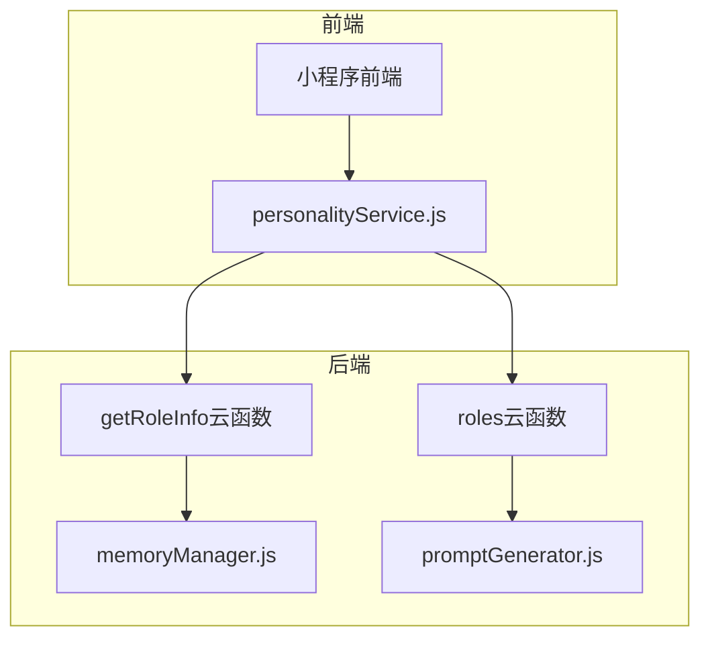
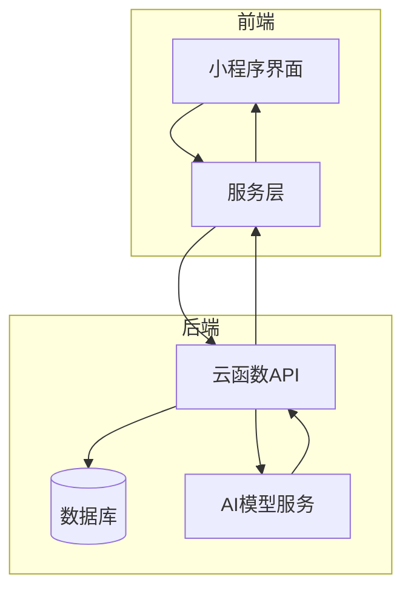
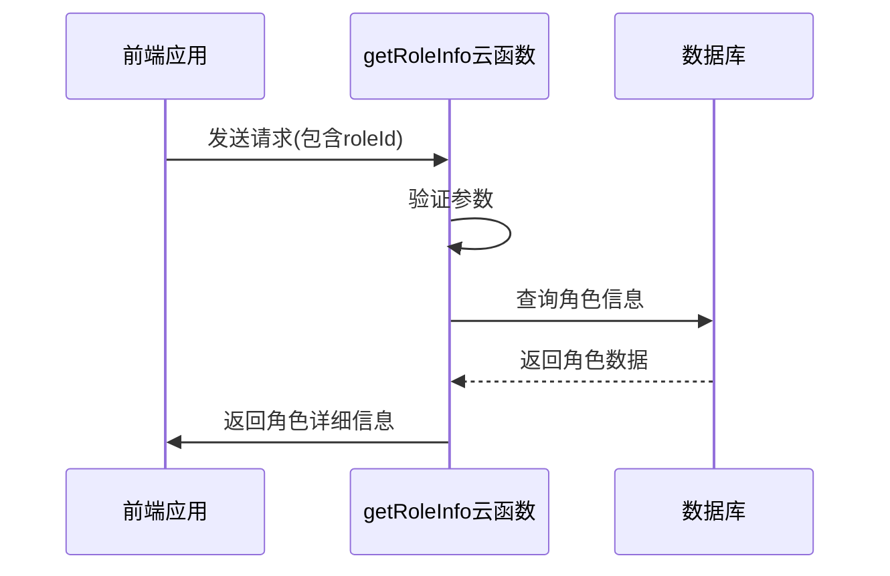
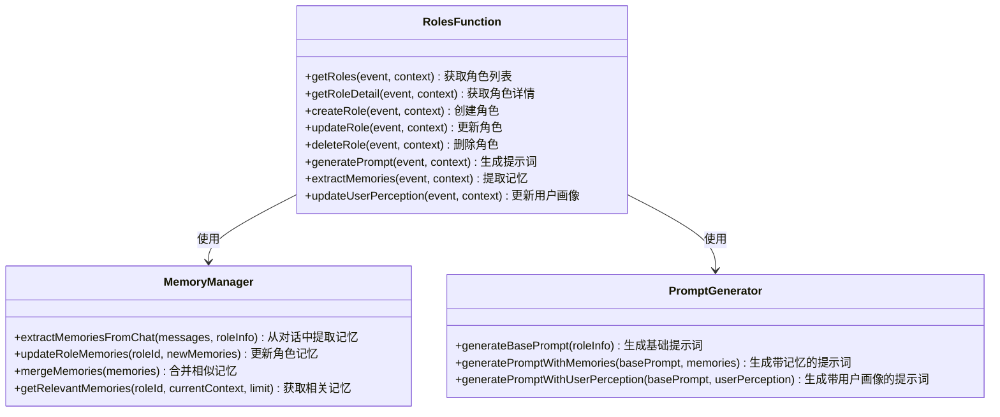
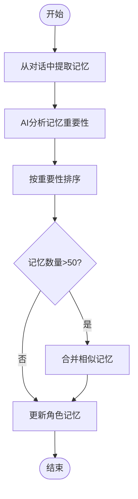
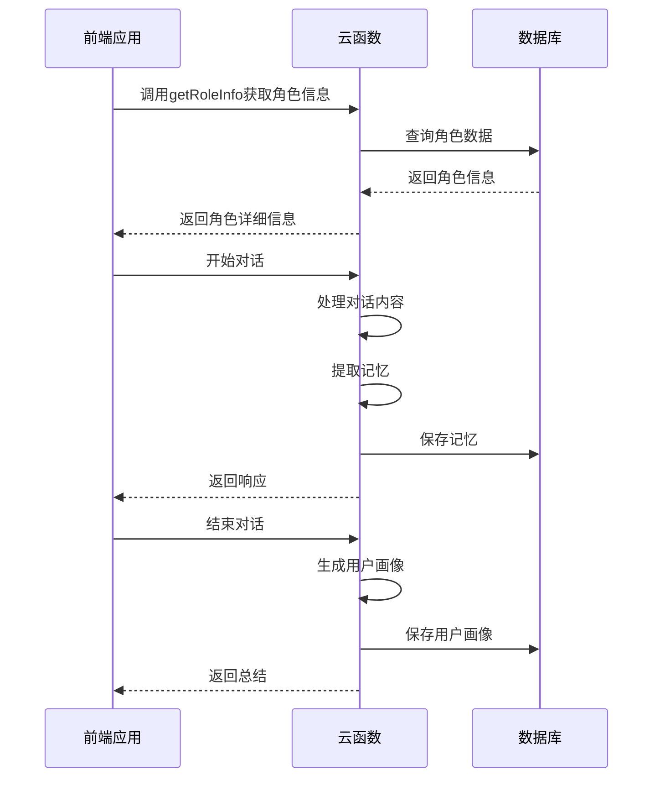
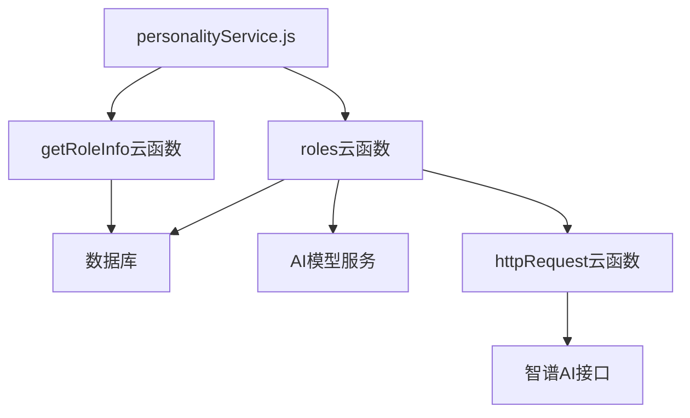

# 角色管理API

<cite>
**本文档引用的文件**
- [getRoleInfo/index.js](file://cloudfunctions/getRoleInfo/index.js)
- [roles/index.js](file://cloudfunctions/roles/index.js)
- [roles/memoryManager.js](file://cloudfunctions/roles/memoryManager.js)
- [roles/promptGenerator.js](file://cloudfunctions/roles/promptGenerator.js)
- [miniprogram/services/personalityService.js](file://miniprogram/services/personalityService.js)
</cite>

## 目录
1. [简介](#简介)
2. [项目结构](#项目结构)
3. [核心组件](#核心组件)
4. [架构概述](#架构概述)
5. [详细组件分析](#详细组件分析)
6. [依赖分析](#依赖分析)
7. [性能考虑](#性能考虑)
8. [故障排除指南](#故障排除指南)
9. [结论](#结论)

## 简介
角色管理API文档系统化地记录了角色管理系统的所有API接口，包括角色信息获取、角色状态管理、记忆持久化等功能。文档详细说明了getRoleInfo云函数如何返回角色配置、提示词模板等元数据，以及roles云函数如何处理角色交互中的上下文记忆管理。同时描述了memoryManager.js实现的长期记忆机制及其数据结构，提供了前端调用示例，展示如何初始化角色会话、保存对话记忆。此外，文档还解释了角色个性化体验的技术实现，包括提示词动态生成和用户感知模型的集成方式。

## 项目结构
角色管理系统主要由云函数和前端服务组成，云函数位于cloudfunctions目录下，前端服务位于miniprogram目录下。系统通过云函数提供API接口，前端通过调用这些接口实现角色管理功能。

**图示来源**
- [getRoleInfo/index.js](file://cloudfunctions/getRoleInfo/index.js)
- [roles/index.js](file://cloudfunctions/roles/index.js)
- [miniprogram/services/personalityService.js](file://miniprogram/services/personalityService.js)

**本节来源**
- [cloudfunctions/getRoleInfo/index.js](file://cloudfunctions/getRoleInfo/index.js)
- [cloudfunctions/roles/index.js](file://cloudfunctions/roles/index.js)
- [miniprogram/services/personalityService.js](file://miniprogram/services/personalityService.js)

## 核心组件
角色管理系统的核心组件包括getRoleInfo云函数、roles云函数、memoryManager.js和promptGenerator.js。getRoleInfo云函数负责查询角色信息，返回角色的配置、提示词等元数据。roles云函数是智能角色管理系统，提供角色的创建、读取、更新、删除功能，支持AI驱动的记忆管理、用户画像分析和个性化提示词生成。memoryManager.js实现长期记忆机制，从对话中提取重要信息作为角色记忆，并进行智能管理。promptGenerator.js负责生成个性化AI对话提示词，将角色信息、记忆和用户画像融合到提示词中。

**本节来源**
- [cloudfunctions/getRoleInfo/index.js](file://cloudfunctions/getRoleInfo/index.js)
- [cloudfunctions/roles/index.js](file://cloudfunctions/roles/index.js)
- [cloudfunctions/roles/memoryManager.js](file://cloudfunctions/roles/memoryManager.js)
- [cloudfunctions/roles/promptGenerator.js](file://cloudfunctions/roles/promptGenerator.js)

## 架构概述
角色管理系统的架构分为前端和后端两部分。前端通过小程序实现用户界面，调用云函数API进行角色管理。后端由多个云函数组成，提供角色信息查询、角色管理、记忆管理和提示词生成等功能。系统通过数据库存储角色信息、记忆和用户画像，利用AI模型进行记忆提取和用户画像分析。

**图示来源**
- [cloudfunctions/getRoleInfo/index.js](file://cloudfunctions/getRoleInfo/index.js)
- [cloudfunctions/roles/index.js](file://cloudfunctions/roles/index.js)
- [cloudfunctions/roles/memoryManager.js](file://cloudfunctions/roles/memoryManager.js)

## 详细组件分析

### getRoleInfo云函数分析
getRoleInfo云函数提供角色信息查询服务，根据角色ID查询角色详细信息，支持获取角色的基本信息、提示词和配置。

**图示来源**
- [cloudfunctions/getRoleInfo/index.js](file://cloudfunctions/getRoleInfo/index.js)

**本节来源**
- [cloudfunctions/getRoleInfo/index.js](file://cloudfunctions/getRoleInfo/index.js)

### roles云函数分析
roles云函数是智能角色管理系统的核心，提供角色的创建、读取、更新、删除功能，支持AI驱动的记忆管理、用户画像分析和个性化提示词生成。

**图示来源**
- [cloudfunctions/roles/index.js](file://cloudfunctions/roles/index.js)
- [cloudfunctions/roles/memoryManager.js](file://cloudfunctions/roles/memoryManager.js)
- [cloudfunctions/roles/promptGenerator.js](file://cloudfunctions/roles/promptGenerator.js)

**本节来源**
- [cloudfunctions/roles/index.js](file://cloudfunctions/roles/index.js)
- [cloudfunctions/roles/memoryManager.js](file://cloudfunctions/roles/memoryManager.js)
- [cloudfunctions/roles/promptGenerator.js](file://cloudfunctions/roles/promptGenerator.js)

### memoryManager.js分析
memoryManager.js实现长期记忆机制，从对话中提取重要信息作为角色记忆，并进行智能管理。系统通过AI分析对话内容，提取关键信息作为记忆，并根据重要性进行排序和管理。

**图示来源**
- [cloudfunctions/roles/memoryManager.js](file://cloudfunctions/roles/memoryManager.js)

**本节来源**
- [cloudfunctions/roles/memoryManager.js](file://cloudfunctions/roles/memoryManager.js)

### 前端调用示例
前端通过调用云函数API实现角色管理功能，包括初始化角色会话、保存对话记忆等操作。

**图示来源**
- [miniprogram/services/personalityService.js](file://miniprogram/services/personalityService.js)
- [cloudfunctions/roles/index.js](file://cloudfunctions/roles/index.js)

**本节来源**
- [miniprogram/services/personalityService.js](file://miniprogram/services/personalityService.js)
- [cloudfunctions/roles/index.js](file://cloudfunctions/roles/index.js)

## 依赖分析
角色管理系统依赖于多个组件和服务，包括数据库、AI模型服务和云函数平台。系统通过云函数调用机制实现组件间的通信，利用数据库存储角色信息、记忆和用户画像。

**图示来源**
- [cloudfunctions/getRoleInfo/index.js](file://cloudfunctions/getRoleInfo/index.js)
- [cloudfunctions/roles/index.js](file://cloudfunctions/roles/index.js)
- [miniprogram/services/personalityService.js](file://miniprogram/services/personalityService.js)

**本节来源**
- [cloudfunctions/getRoleInfo/index.js](file://cloudfunctions/getRoleInfo/index.js)
- [cloudfunctions/roles/index.js](file://cloudfunctions/roles/index.js)
- [miniprogram/services/personalityService.js](file://miniprogram/services/personalityService.js)

## 性能考虑
角色管理系统在性能方面进行了多项优化，包括缓存机制、批量查询和权限控制。系统通过直接根据ID查询角色信息，提高查询效率，避免大量数据传输。同时，系统提供了详细的错误处理机制，确保在各种情况下都能提供明确的反馈。

## 故障排除指南
当角色管理系统出现问题时，可以按照以下步骤进行排查：
1. 检查云函数是否正确部署
2. 确认数据库连接是否正常
3. 检查AI模型服务是否可用
4. 查看云函数日志，检查是否有错误信息
5. 确认前端调用参数是否正确

**本节来源**
- [cloudfunctions/roles/index.js](file://cloudfunctions/roles/index.js)
- [cloudfunctions/getRoleInfo/index.js](file://cloudfunctions/getRoleInfo/index.js)

## 结论
角色管理API提供了一套完整的角色管理系统，通过getRoleInfo云函数和roles云函数实现了角色信息查询、角色管理、记忆持久化和个性化体验等功能。系统利用AI技术实现了智能记忆管理和用户画像分析，为用户提供个性化的交互体验。前端通过调用云函数API实现角色管理功能，形成了完整的角色管理系统。