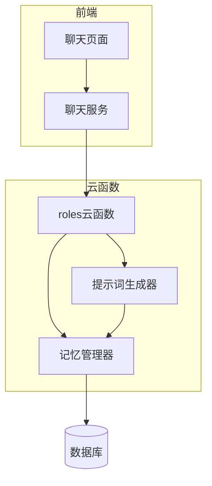
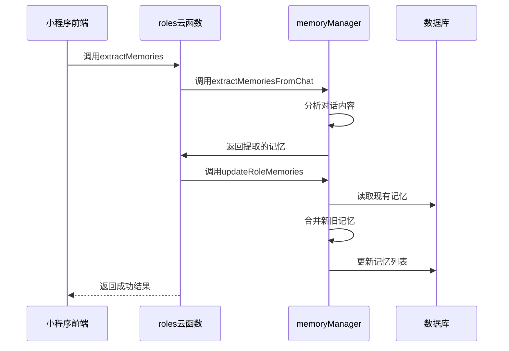
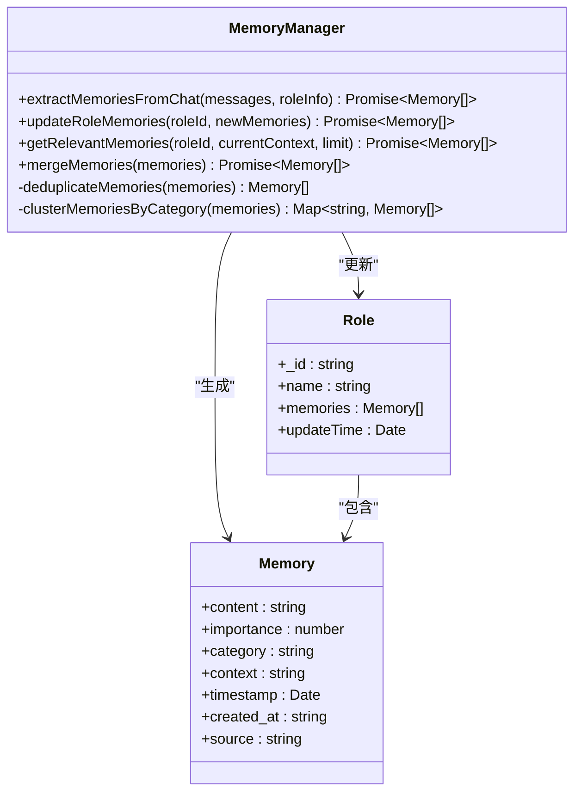
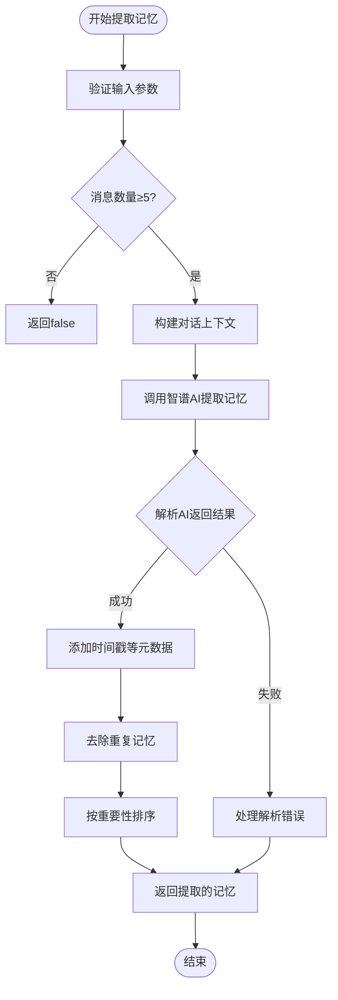
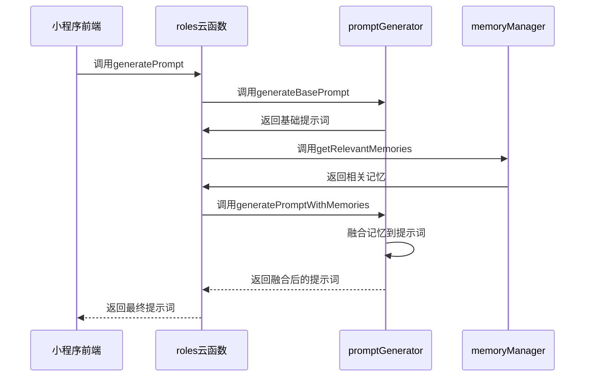
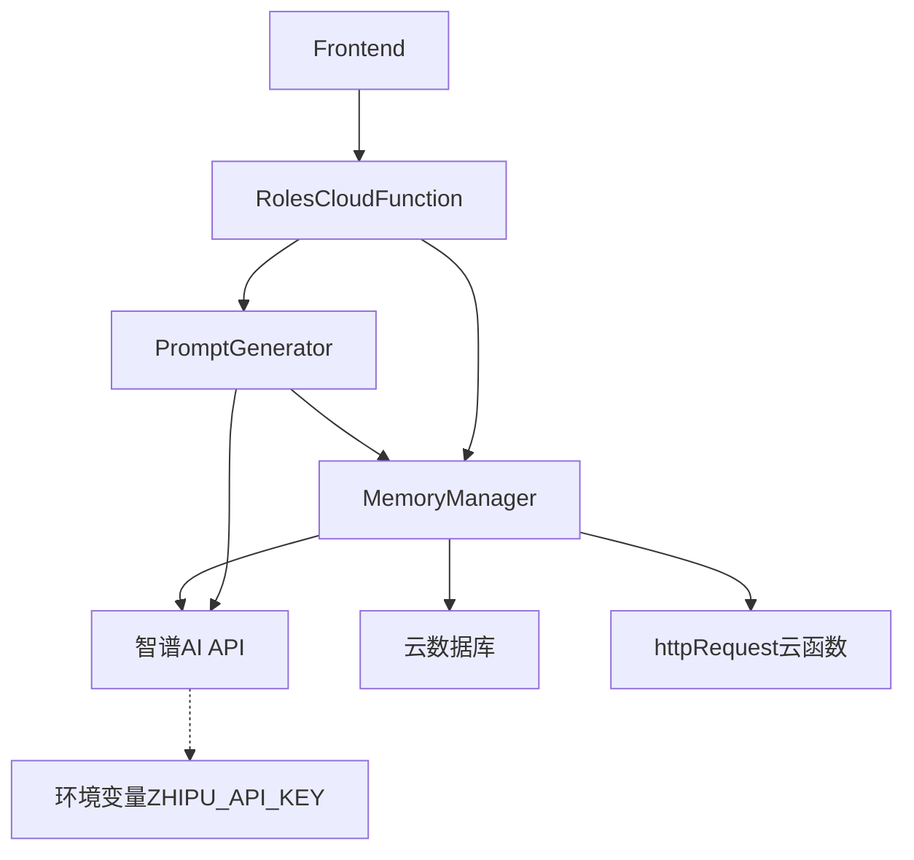

# 记忆管理接口

<cite>
**本文档引用的文件**
- [memoryManager.js](file://cloudfunctions/roles/memoryManager.js)
- [index.js](file://cloudfunctions/roles/index.js)
- [promptGenerator.js](file://cloudfunctions/roles/promptGenerator.js)
- [chat.js](file://miniprogram/packageChat/pages/chat/chat.js)
- [角色记忆机制优化.md](file://doc/使用文档/角色记忆机制优化.md)
</cite>

## 目录
1. [引言](#引言)
2. [项目结构](#项目结构)
3. [核心组件](#核心组件)
4. [架构概述](#架构概述)
5. [详细组件分析](#详细组件分析)
6. [依赖分析](#依赖分析)
7. [性能考虑](#性能考虑)
8. [故障排除指南](#故障排除指南)
9. [结论](#结论)

## 引言
记忆管理接口是HeartChat系统中的核心功能模块，旨在实现AI角色的长期记忆能力。该系统通过智能化的记忆提取、存储和检索机制，使AI角色能够记住用户的关键信息，从而提供更加连贯、个性化和人性化的对话体验。本系统不仅实现了基本的记忆CRUD操作，还通过AI技术实现了记忆的智能提取、重要性评估和自动合并，确保记忆的质量和有效性。

## 项目结构
记忆管理功能主要分布在云函数和小程序前端两个部分，形成了完整的记忆管理闭环。

**图示来源**
- [memoryManager.js](file://cloudfunctions/roles/memoryManager.js#L1-L50)
- [index.js](file://cloudfunctions/roles/index.js#L1-L50)
- [chat.js](file://miniprogram/packageChat/pages/chat/chat.js#L1-L50)

**本节来源**
- [memoryManager.js](file://cloudfunctions/roles/memoryManager.js#L1-L100)
- [index.js](file://cloudfunctions/roles/index.js#L1-L100)
- [chat.js](file://miniprogram/packageChat/pages/chat/chat.js#L1-L100)

## 核心组件
记忆管理接口的核心组件包括记忆提取、存储、检索和应用四个部分。系统通过`memoryManager.js`实现记忆的长期持久化管理，采用AI驱动的方式从对话中提取有价值的信息作为记忆。记忆数据与用户ID和角色ID紧密关联，确保每个角色都能独立维护与特定用户的记忆关系。系统实现了智能的过期策略和容量限制，当记忆数量超过50条时，会自动进行合并和优化，保留最重要的记忆。

**本节来源**
- [memoryManager.js](file://cloudfunctions/roles/memoryManager.js#L1-L100)
- [index.js](file://cloudfunctions/roles/index.js#L1-L100)

## 架构概述
记忆管理系统的架构采用分层设计，从前端触发到云函数处理再到数据库存储，形成了完整的数据流。

**图示来源**
- [memoryManager.js](file://cloudfunctions/roles/memoryManager.js#L150-L300)
- [index.js](file://cloudfunctions/roles/index.js#L500-L550)

## 详细组件分析

### 记忆提取与存储分析
记忆管理器实现了智能化的记忆提取机制，能够从对话中识别并提取有价值的信息。

#### 记忆提取类图

**图示来源**
- [memoryManager.js](file://cloudfunctions/roles/memoryManager.js#L150-L799)

#### 记忆提取流程图

**图示来源**
- [memoryManager.js](file://cloudfunctions/roles/memoryManager.js#L150-L300)

**本节来源**
- [memoryManager.js](file://cloudfunctions/roles/memoryManager.js#L150-L799)

### 记忆应用分析
记忆系统不仅实现了存储，更重要的是将记忆应用于实际对话中，提升角色的个性化体验。

#### 记忆应用序列图

**图示来源**
- [promptGenerator.js](file://cloudfunctions/roles/promptGenerator.js#L1-L324)
- [index.js](file://cloudfunctions/roles/index.js#L550-L600)

**本节来源**
- [promptGenerator.js](file://cloudfunctions/roles/promptGenerator.js#L1-L324)
- [index.js](file://cloudfunctions/roles/index.js#L550-L600)

## 依赖分析
记忆管理系统依赖于多个核心组件和外部服务，形成了复杂的依赖关系网络。

**图示来源**
- [memoryManager.js](file://cloudfunctions/roles/memoryManager.js#L10-L50)
- [promptGenerator.js](file://cloudfunctions/roles/promptGenerator.js#L10-L50)
- [index.js](file://cloudfunctions/roles/index.js#L1-L50)

**本节来源**
- [memoryManager.js](file://cloudfunctions/roles/memoryManager.js#L1-L100)
- [promptGenerator.js](file://cloudfunctions/roles/promptGenerator.js#L1-L100)
- [index.js](file://cloudfunctions/roles/index.js#L1-L100)

## 性能考虑
记忆管理系统在设计时充分考虑了性能优化，采用了多种策略确保系统的高效运行。系统通过本地聚类算法对记忆进行预处理，减少对AI服务的调用频率。当记忆数量超过50条时，系统会自动进行合并和优化，避免数据库查询性能下降。记忆检索时采用两级过滤机制，先进行本地预过滤，再调用AI进行精确匹配，有效降低了计算成本。此外，系统还实现了缓存机制，对频繁访问的记忆检索结果进行缓存，进一步提升了响应速度。

## 故障排除指南
当记忆管理功能出现问题时，可以按照以下步骤进行排查：

**本节来源**
- [memoryManager.js](file://cloudfunctions/roles/memoryManager.js#L1-L50)
- [index.js](file://cloudfunctions/roles/index.js#L1-L50)
- [角色记忆机制优化.md](file://doc/使用文档/角色记忆机制优化.md#L1-L50)

## 结论
记忆管理接口通过智能化的AI技术实现了角色的长期记忆能力，极大地提升了对话的连贯性和个性化体验。系统不仅实现了基本的记忆存储和检索功能，更重要的是通过AI驱动的方式实现了记忆的智能提取、重要性评估和自动优化。这种设计使得AI角色能够真正"记住"用户，建立起长期的互动关系，为用户提供更加温暖和个性化的服务体验。未来可以通过增加记忆分类、优先级排序和用户可管理界面等方式进一步优化记忆系统。