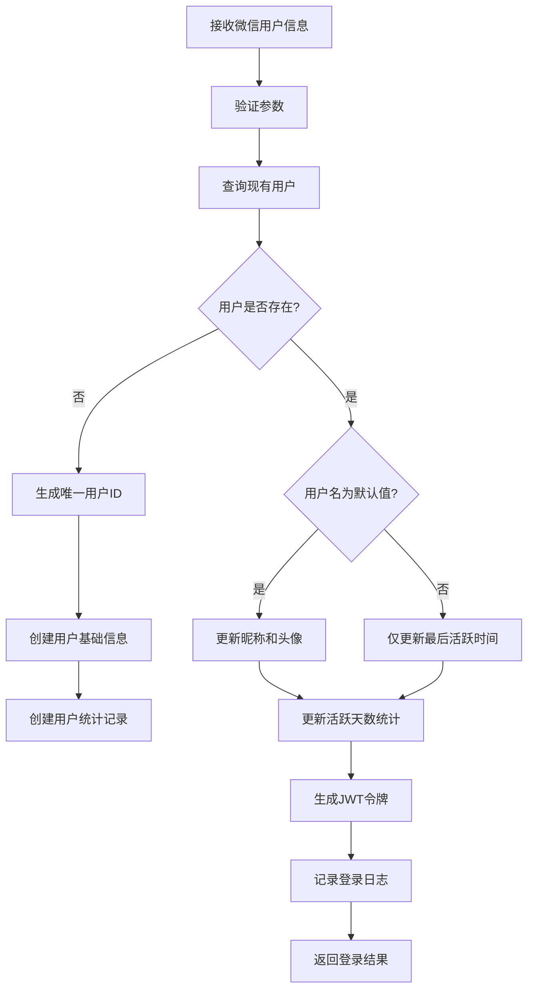
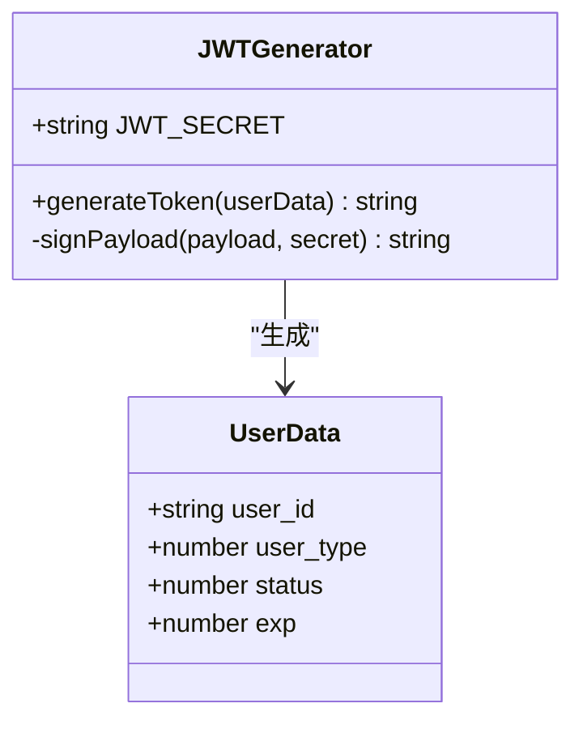
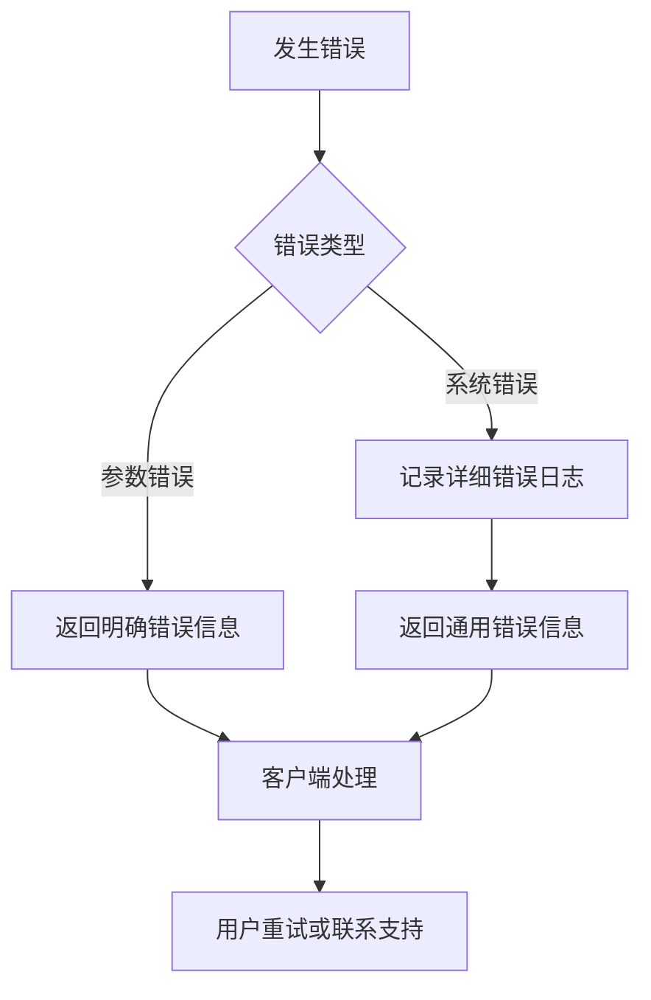

# 认证API

<cite>
**本文档引用的文件**
- [index.js](file://cloudfunctions/login/index.js)
- [login.md](file://doc/开发文档/cloudfunctions/login.md)
- [user_base.md](file://doc/开发文档/database/user_base.md)
- [auth.js](file://miniprogram/utils/auth.js)
</cite>

## 目录
1. [简介](#简介)
2. [用户登录流程](#用户登录流程)
3. [身份令牌生成与验证](#身份令牌生成与验证)
4. [会话管理策略](#会话管理策略)
5. [API调用示例](#api调用示例)
6. [错误处理机制](#错误处理机制)
7. [安全最佳实践](#安全最佳实践)
8. [调试指南](#调试指南)

## 简介
认证API是HeartChat应用的核心安全组件，负责处理用户的身份验证和会话管理。该系统通过微信云函数实现，为用户提供安全、可靠的登录认证服务。登录云函数作为主要的认证入口，实现了完整的用户生命周期管理，包括新用户注册、现有用户信息更新、JWT令牌生成和用户统计等功能。系统设计遵循微信小程序的最佳实践，确保了高性能和高可用性。

**Section sources**
- [login.md](file://doc/开发文档/cloudfunctions/login.md#L1-L20)

## 用户登录流程
用户登录流程是一个多步骤的认证过程，确保用户身份的安全验证和信息的正确管理。流程从接收微信用户信息开始，经过参数验证、用户查询、用户处理、令牌生成、日志记录到最后的响应返回。



**Diagram sources**
- [index.js](file://cloudfunctions/login/index.js#L53-L267)

**Section sources**
- [index.js](file://cloudfunctions/login/index.js#L53-L267)
- [login.md](file://doc/开发文档/cloudfunctions/login.md#L43-L109)

## 身份令牌生成与验证
身份令牌采用JWT（JSON Web Token）标准实现，提供安全的用户身份验证机制。令牌在用户成功登录后生成，包含用户的关键身份信息，并使用强加密算法进行签名，确保令牌的完整性和安全性。

### 令牌生成


令牌包含以下声明：
- **user_id**: 用户唯一标识符，7位数字格式
- **user_type**: 用户类型（1-普通用户，2-VIP用户，3-管理员）
- **status**: 账户状态（1-启用，0-禁用）
- **exp**: 过期时间戳，设置为7天后

令牌使用HS256算法和预定义的64位密钥进行签名。密钥硬编码在代码中，建议在生产环境中使用环境变量进行管理。

### 令牌验证
令牌验证在每次需要用户身份的API调用中执行。系统使用jsonwebtoken库验证令牌的签名和有效期。验证过程包括：
1. 检查令牌签名是否有效
2. 验证令牌是否在有效期内
3. 解析用户身份信息用于后续业务逻辑

**Section sources**
- [index.js](file://cloudfunctions/login/index.js#L175-L184)
- [login.md](file://doc/开发文档/cloudfunctions/login.md#L43-L109)

## 会话管理策略
会话管理策略结合了服务器端和客户端的机制，确保用户会话的安全性和持久性。系统采用无状态的JWT令牌进行会话管理，同时在客户端进行本地存储。

### 服务器端会话管理
服务器端不存储会话状态，所有会话信息都包含在JWT令牌中。这种无状态设计提高了系统的可扩展性。会话相关的关键策略包括：

- **令牌有效期**: 7天，平衡安全性和用户体验
- **登录日志记录**: 每次登录成功或失败都记录详细日志
- **活跃天数计算**: 智能判断用户是否为当天首次登录，准确统计活跃天数

### 客户端会话管理
客户端使用微信小程序的本地存储机制管理会话信息。`auth.js`工具模块提供了完整的会话管理功能：

```mermaid
classDiagram
class AuthManager {
+string TOKEN_KEY
+string USER_INFO_KEY
+saveLoginInfo(data) boolean
+getLoginInfo() object
+clearLoginInfo() boolean
+checkLogin() boolean
}
AuthManager --> "localStorage" : "使用"
```

**Diagram sources**
- [auth.js](file://miniprogram/utils/auth.js#L1-L68)

**Section sources**
- [auth.js](file://miniprogram/utils/auth.js#L1-L68)
- [index.js](file://cloudfunctions/login/index.js#L218-L267)

## API调用示例
以下示例展示了如何在小程序前端调用login云函数进行用户登录。

### JavaScript调用示例
```javascript
// 调用login云函数
wx.cloud.callFunction({
  name: 'login',
  data: {
    userInfo: {
      nickName: '用户昵称',
      avatarUrl: 'https://example.com/avatar.jpg',
      clientIP: '192.168.1.1',
      userAgent: 'Mozilla/5.0 (iPhone; CPU iPhone OS 14_0 like Mac OS X)'
    }
  }
}).then(res => {
  if (res.result.success) {
    // 登录成功，保存登录信息
    const { token, isNewUser, userInfo } = res.result.data;
    // 保存到本地存储
    require('utils/auth.js').saveLoginInfo({
      token: token,
      userInfo: userInfo
    });
    
    console.log('登录成功', {
      isNewUser: isNewUser,
      userId: userInfo.userId,
      username: userInfo.username
    });
  } else {
    // 登录失败
    console.error('登录失败:', res.result.error);
  }
}).catch(err => {
  console.error('网络请求失败:', err);
});
```

### 请求参数格式
```json
{
  "userInfo": {
    "nickName": "用户昵称",
    "avatarUrl": "头像URL",
    "clientIP": "客户端IP（可选）",
    "userAgent": "用户代理字符串（可选）"
  }
}
```

### 返回值结构
成功响应：
```json
{
  "success": true,
  "data": {
    "token": "JWT访问令牌",
    "isNewUser": true,
    "userInfo": {
      "userId": "1234567",
      "username": "用户名",
      "avatarUrl": "头像URL",
      "userType": 1,
      "status": 1,
      "stats": {
        "stats_id": "统计ID",
        "user_id": "用户ID",
        "chat_count": 0,
        "solved_count": 0,
        "rating_avg": 0,
        "active_days": 1,
        "last_active": "最后活跃时间"
      }
    }
  }
}
```

失败响应：
```json
{
  "success": false,
  "error": "登录失败的具体原因"
}
```

**Section sources**
- [login.md](file://doc/开发文档/cloudfunctions/login.md#L111-L201)
- [index.js](file://cloudfunctions/login/index.js#L53-L267)

## 错误处理机制
系统实现了全面的错误处理机制，确保在各种异常情况下都能提供清晰的反馈和可靠的日志记录。

### 错误码定义
| 错误码/类型 | 描述 | 场景 |
|-----------|------|------|
| 缺少必要参数 | 请求中缺少userInfo参数 | 客户端未提供用户信息 |
| 生成的ID格式不正确 | 用户ID生成不符合7位数字格式 | 系统内部错误 |
| 无法生成唯一的用户ID | 经过10次尝试仍无法生成唯一ID | 数据库冲突或高并发场景 |
| 数据库操作失败 | 数据库查询或写入操作失败 | 系统异常或网络问题 |
| 登录失败 | 通用登录失败错误 | 未分类的错误情况 |

### 错误处理流程


系统在捕获到任何异常时，首先记录详细的错误日志，包括错误信息、时间戳和客户端信息，然后向客户端返回适当的错误响应。对于登录失败的情况，系统会记录失败日志，包含错误原因、IP地址和设备信息，便于后续的安全审计。

**Section sources**
- [index.js](file://cloudfunctions/login/index.js#L222-L267)
- [login.md](file://doc/开发文档/cloudfunctions/login.md#L111-L201)

## 安全最佳实践
系统实施了多项安全最佳实践，保护用户数据和系统安全。

### 信息保护
- **敏感信息分离**: 用户的敏感信息（如openid）不返回给客户端，只返回必要的用户ID和基本信息
- **令牌安全**: JWT令牌使用强密钥签名，防止篡改
- **本地存储安全**: 使用微信小程序的安全存储机制，避免敏感信息泄露

### 防止重放攻击
- **时间戳验证**: JWT令牌包含过期时间，防止令牌被长期重放使用
- **短期有效期**: 7天的有效期平衡了安全性和用户体验，建议后续实现令牌刷新机制
- **登录日志监控**: 记录所有登录尝试，便于检测异常登录行为

### 其他安全措施
- **输入验证**: 严格验证所有输入参数，防止注入攻击
- **唯一性保证**: 用户ID生成有唯一性检查，防止ID冲突
- **客户端信息收集**: 收集IP地址和设备信息，用于安全审计和异常检测

**Section sources**
- [index.js](file://cloudfunctions/login/index.js#L0-L267)
- [login.md](file://doc/开发文档/cloudfunctions/login.md#L43-L109)

## 调试指南
本指南提供在云开发控制台查看登录日志和排查常见问题的方法。

### 查看登录日志
1. 登录微信云开发控制台
2. 导航到"数据库"模块
3. 选择`sys_log_login`集合
4. 使用查询条件筛选日志：
   - 按`user_id`查看特定用户的登录记录
   - 按`status`筛选成功(1)或失败(0)的登录
   - 按`created_at`按时间范围查看

### 常见问题排查
| 问题现象 | 可能原因 | 解决方案 |
|---------|--------|---------|
| 登录失败，提示"缺少必要参数" | 客户端未传递userInfo | 检查前端代码确保正确传递userInfo对象 |
| 新用户无法注册 | 用户ID生成冲突 | 检查user_base集合的索引设置，确保user_id唯一索引存在 |
| 令牌验证失败 | JWT密钥不匹配 | 确认云函数中的JWT_SECRET与验证服务使用的密钥一致 |
| 活跃天数不增加 | 时间计算逻辑问题 | 检查服务器时间和时区设置是否正确 |
| 登录日志未记录 | 数据库权限问题 | 检查云函数对sys_log_login集合的写入权限 |

### 调试技巧
- 在云函数日志中查看详细的错误堆栈
- 使用数据库的聚合功能分析登录成功率
- 监控高频率的失败登录尝试，可能表示安全攻击
- 定期检查用户ID生成的性能，避免在高并发场景下出现瓶颈

**Section sources**
- [index.js](file://cloudfunctions/login/index.js#L222-L267)
- [login.md](file://doc/开发文档/cloudfunctions/login.md#L217-L222)