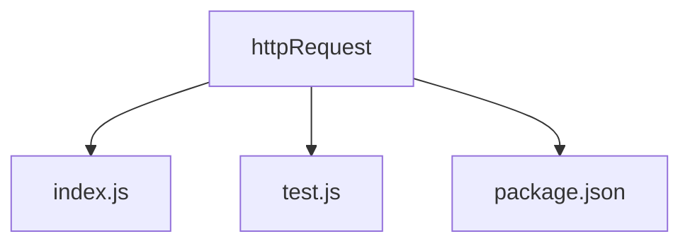
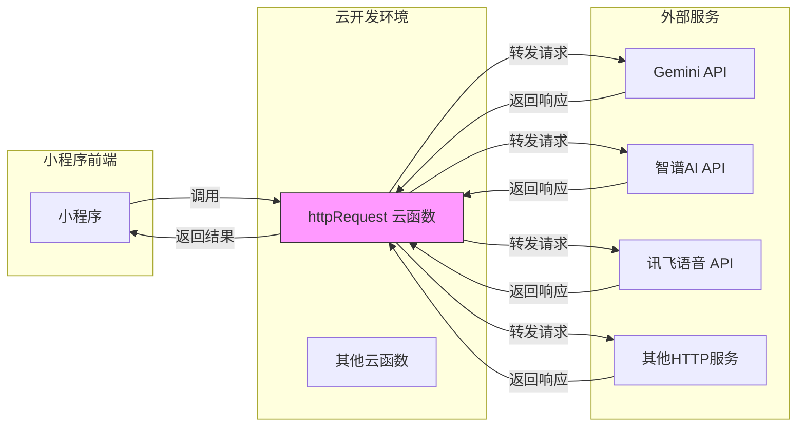
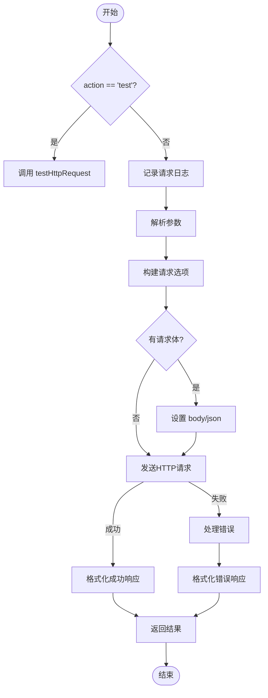
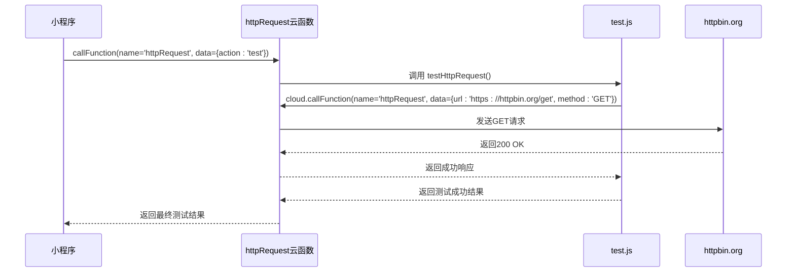
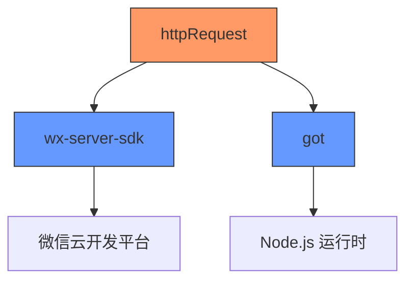
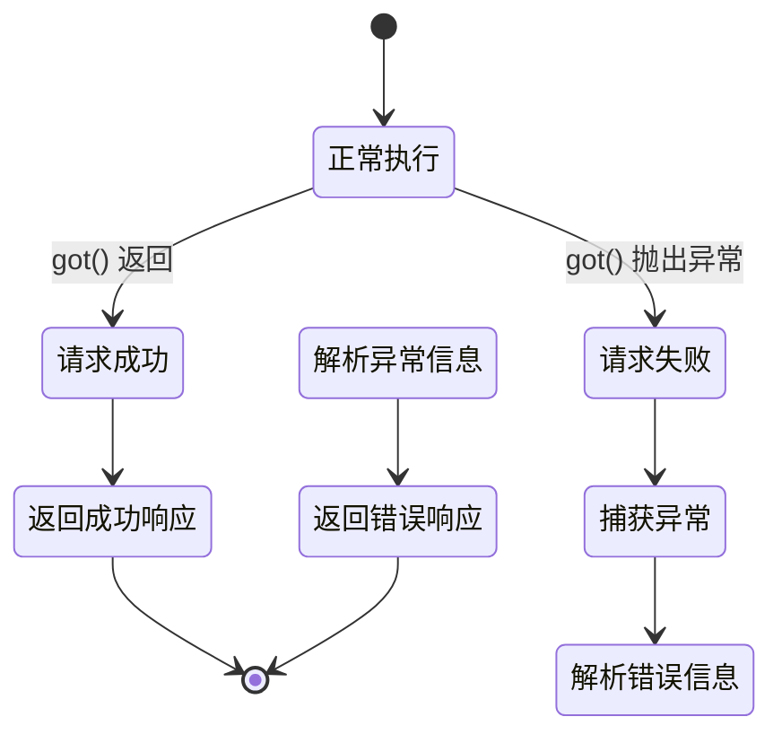

# HTTP请求封装云函数

<cite>
**本文档引用文件**  
- [index.js](file://cloudfunctions/httpRequest/index.js)
- [test.js](file://cloudfunctions/httpRequest/test.js)
- [package.json](file://cloudfunctions/httpRequest/package.json)
- [httpRequest.md](file://doc/开发文档/cloudfunctions/httpRequest.md)
- [httpRequest云函数使用文档.md](file://doc/使用文档/httpRequest云函数使用文档.md)
- [gemini_api_integration.md](file://doc/开发文档/gemini_api_integration.md)
</cite>

## 目录
1. [简介](#简介)
2. [项目结构](#项目结构)
3. [核心组件](#核心组件)
4. [架构概述](#架构概述)
5. [详细组件分析](#详细组件分析)
6. [依赖分析](#依赖分析)
7. [性能考量](#性能考量)
8. [故障排除指南](#故障排除指南)
9. [结论](#结论)

## 简介
`httpRequest` 云函数是 HeartChat 项目中的一个通用 HTTP 客户端封装，旨在为云函数环境提供统一的外部 API 调用能力。由于微信小程序云函数环境限制，无法直接使用浏览器的 `fetch` 或 Node.js 的 `http` 模块，该云函数作为中间代理层，实现了对第三方服务（如 Gemini、智谱AI、讯飞语音等）的安全、可靠调用。它通过封装 `got` 库，提供了统一的 GET/POST 请求接口，支持请求头、超时、重试等配置，并具备请求日志记录、错误统一处理和敏感信息安全管理等关键功能。

## 项目结构
`httpRequest` 云函数位于 `cloudfunctions/httpRequest` 目录下，其结构简洁明了，专注于单一职责。



**图示来源**  
- [index.js](file://cloudfunctions/httpRequest/index.js)
- [test.js](file://cloudfunctions/httpRequest/test.js)
- [package.json](file://cloudfunctions/httpRequest/package.json)

**本节来源**  
- [index.js](file://cloudfunctions/httpRequest/index.js)
- [test.js](file://cloudfunctions/httpRequest/test.js)

## 核心组件
`httpRequest` 云函数的核心功能由 `index.js` 实现，它接收外部请求，使用 `got` 库发送 HTTP 请求，并将结果返回。`test.js` 提供了对云函数自身功能的健康检查。`package.json` 定义了其依赖，其中 `got` 是核心的 HTTP 客户端库。

**本节来源**  
- [index.js](file://cloudfunctions/httpRequest/index.js#L1-L62)
- [test.js](file://cloudfunctions/httpRequest/test.js#L1-L49)
- [package.json](file://cloudfunctions/httpRequest/package.json#L1-L14)

## 架构概述
`httpRequest` 云函数采用简单的代理模式，作为小程序前端与外部世界之间的安全网关。



**图示来源**  
- [index.js](file://cloudfunctions/httpRequest/index.js)
- [httpRequest云函数使用文档.md](file://doc/使用文档/httpRequest云函数使用文档.md)
- [gemini_api_integration.md](file://doc/开发文档/gemini_api_integration.md)

## 详细组件分析

### 主函数分析
`index.js` 中的 `main` 函数是整个云函数的入口，负责处理所有传入的请求。

#### 请求处理流程


**图示来源**  
- [index.js](file://cloudfunctions/httpRequest/index.js#L15-L62)

#### 请求参数与响应格式
云函数通过 `event` 对象接收参数，并返回标准化的响应。

**请求参数结构**
- `url` (string): 目标URL，必需。
- `method` (string): HTTP方法，可选，默认为 "GET"。
- `headers` (Object): 自定义请求头，可选。
- `body` (string|Object): 请求体，可选。对象会自动序列化为JSON。
- `timeout` (number): 超时时间（毫秒），可选，默认为 30000。
- `action` (string): 特殊操作，如 "test" 用于功能测试。

**成功响应格式**
```json
{
  "statusCode": 200,
  "headers": { "content-type": "application/json" },
  "body": "响应内容"
}
```

**失败响应格式**
```json
{
  "error": true,
  "statusCode": 500,
  "message": "错误信息",
  "body": "错误详情"
}
```

**本节来源**  
- [index.js](file://cloudfunctions/httpRequest/index.js#L15-L62)
- [httpRequest.md](file://doc/开发文档/cloudfunctions/httpRequest.md#L55-L155)
- [httpRequest云函数使用文档.md](file://doc/使用文档/httpRequest云函数使用文档.md#L0-L79)

### 测试功能分析
`test.js` 文件提供了一个独立的测试函数，用于验证 `httpRequest` 云函数的可用性。

#### 测试流程


**图示来源**  
- [test.js](file://cloudfunctions/httpRequest/test.js#L10-L49)

**本节来源**  
- [test.js](file://cloudfunctions/httpRequest/test.js#L1-L49)

## 依赖分析
`httpRequest` 云函数的依赖关系清晰，主要依赖于微信官方的 `wx-server-sdk` 和功能强大的 `got` HTTP 客户端库。



**图示来源**  
- [package.json](file://cloudfunctions/httpRequest/package.json#L1-L14)

**本节来源**  
- [package.json](file://cloudfunctions/httpRequest/package.json#L1-L14)
- [index.js](file://cloudfunctions/httpRequest/index.js#L1-L2)

## 性能考量
`httpRequest` 云函数在设计时已考虑性能和稳定性。

- **连接池管理**: `got` 库内部使用 `http(s).Agent`，默认启用了连接池（keep-alive），可以复用 TCP 连接，显著减少建立新连接的开销，提高并发性能。
- **超时控制**: 通过 `timeout` 参数（默认30秒）防止请求无限期挂起，保障云函数资源不被长时间占用。
- **性能调优建议**:
  1.  **合理设置超时**: 根据目标 API 的响应时间调整 `timeout` 值，避免过短导致误判失败，或过长浪费资源。
  2.  **批量处理**: 对于需要调用多个API的场景，应尽量在单个云函数调用中完成，减少 `httpRequest` 的调用次数。
  3.  **监控与日志**: 利用云开发控制台的日志功能，监控 `httpRequest` 的执行时间和错误率，及时发现性能瓶颈。
  4.  **避免大响应体**: 处理大型响应时需注意云函数的内存限制（256MB），必要时进行流式处理或分页。

**本节来源**  
- [index.js](file://cloudfunctions/httpRequest/index.js#L27-L28)
- [httpRequest云函数使用文档.md](file://doc/使用文档/httpRequest云函数使用文档.md#L214-L255)

## 故障排除指南
本节分析 `httpRequest` 云函数的错误处理机制及常见问题。

### 错误处理机制
云函数通过 `try...catch` 捕获所有异常，并返回结构化的错误信息，便于前端进行针对性处理。



**图示来源**  
- [index.js](file://cloudfunctions/httpRequest/index.js#L42-L60)

### 常见问题与解决方案
- **请求超时**: 增加 `timeout` 参数值，或检查目标服务器是否响应缓慢。
- **无法解析响应**: 确认响应的 `Content-Type`，并使用 `JSON.parse()` 解析 JSON 数据。
- **认证失败**: 检查 `Authorization` 头是否正确，API Key 是否有效。
- **云函数调用失败**: 确认 `httpRequest` 云函数已成功部署，并检查小程序的 `request` 合法域名配置。

**本节来源**  
- [index.js](file://cloudfunctions/httpRequest/index.js#L42-L60)
- [httpRequest云函数使用文档.md](file://doc/使用文档/httpRequest云函数使用文档.md#L255-L269)

## 结论
`httpRequest` 云函数是 HeartChat 项目中不可或缺的基础设施组件。它成功地将复杂的 HTTP 请求逻辑封装起来，为上层业务（如调用 Gemini、智谱AI 等）提供了简单、安全、可靠的 API 调用接口。其设计遵循了单一职责原则，代码简洁，易于维护。通过集成 `got` 库，它具备了现代 HTTP 客户端的大部分优秀特性。未来，可以考虑扩展其功能，例如支持更精细的重试策略、请求缓存或对特定 API（如 Gemini）的深度集成，以进一步提升系统的整体性能和开发效率。