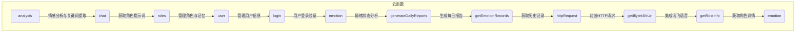
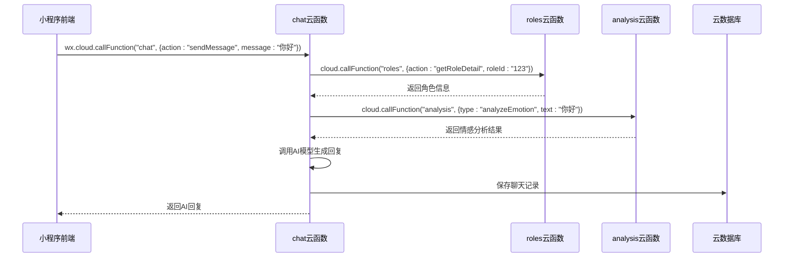
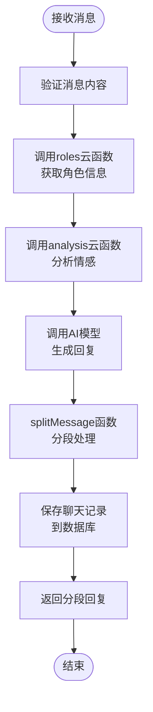
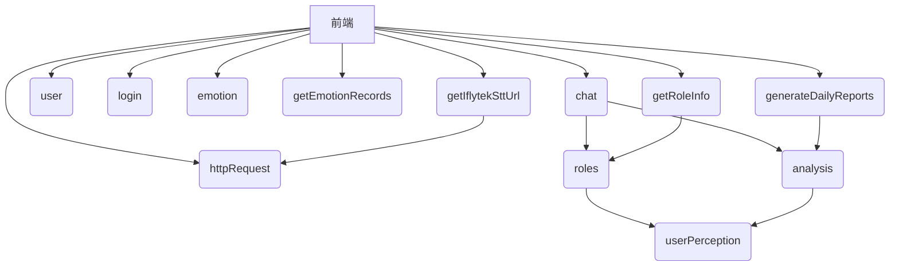

# 云函数

<cite>
**本文档引用文件**  
- [analysis/index.js](file://cloudfunctions/analysis/index.js)
- [chat/index.js](file://cloudfunctions/chat/index.js)
- [user/index.js](file://cloudfunctions/user/index.js)
- [roles/index.js](file://cloudfunctions/roles/index.js)
- [login/index.js](file://cloudfunctions/login/index.js)
- [emotion/index.js](file://cloudfunctions/emotion/index.js)
- [generateDailyReports/index.js](file://cloudfunctions/generateDailyReports/index.js)
- [getEmotionRecords/index.js](file://cloudfunctions/getEmotionRecords/index.js)
- [getIflytekSttUrl/index.js](file://cloudfunctions/getIflytekSttUrl/index.js)
- [getRoleInfo/index.js](file://cloudfunctions/getRoleInfo/index.js)
- [httpRequest/index.js](file://cloudfunctions/httpRequest/index.js)
</cite>

## 目录
1. [简介](#简介)
2. [项目结构](#项目结构)
3. [核心组件](#核心组件)
4. [架构概述](#架构概述)
5. [详细组件分析](#详细组件分析)
6. [依赖分析](#依赖分析)
7. [性能考虑](#性能考虑)
8. [故障排除指南](#故障排除指南)
9. [结论](#结论)

## 简介
HeartChat 是一个基于微信小程序的智能情感陪伴应用，其后端采用微信云开发架构，通过一系列云函数实现核心功能。本文档深入阐述 HeartChat 的云函数架构设计，详细说明每个核心云函数的功能职责、调用方式、输入输出参数结构及错误处理机制。文档结合实际代码逻辑，分析云函数内部处理流程与第三方 AI 模型（如 Gemini、智谱 AI）的集成方式，并讨论云函数间的协作关系与性能优化策略。

## 项目结构

**图示来源**
- [analysis/index.js](file://cloudfunctions/analysis/index.js#L0-L1117)
- [chat/index.js](file://cloudfunctions/chat/index.js#L0-L1413)
- [roles/index.js](file://cloudfunctions/roles/index.js#L0-L759)
- [user/index.js](file://cloudfunctions/user/index.js#L0-L1242)
- [login/index.js](file://cloudfunctions/login/index.js#L0-L268)
- [emotion/index.js](file://cloudfunctions/emotion/index.js#L0-L266)
- [generateDailyReports/index.js](file://cloudfunctions/generateDailyReports/index.js#L0-L201)
- [getEmotionRecords/index.js](file://cloudfunctions/getEmotionRecords/index.js#L0-L113)
- [httpRequest/index.js](file://cloudfunctions/httpRequest/index.js#L0-L100)
- [getIflytekSttUrl/index.js](file://cloudfunctions/getIflytekSttUrl/index.js#L0-L100)
- [getRoleInfo/index.js](file://cloudfunctions/getRoleInfo/index.js#L0-L100)

**章节来源**
- [cloudfunctions](file://cloudfunctions#L0-L100)

## 核心组件

HeartChat 的云函数架构围绕用户交互、情感分析、AI 响应生成和数据管理四大核心构建。`login` 函数处理用户身份验证，是所有功能的入口；`user` 函数管理用户资料与配置，维护用户状态；`roles` 函数负责角色数据与记忆机制，为 AI 提供个性化的对话基础；`chat` 函数处理聊天消息并生成 AI 响应，是对话的核心；`analysis` 函数进行情感分析与关键词提取，为 AI 理解用户情绪提供支持；`emotion` 和 `getEmotionRecords` 函数共同实现情绪状态分析与历史记录查询；`generateDailyReports` 函数利用分析结果生成每日心情报告；`httpRequest` 和 `getIflytekSttUrl` 函数则提供通用的 HTTP 请求能力和对讯飞语音服务的集成。

**章节来源**
- [analysis/index.js](file://cloudfunctions/analysis/index.js#L0-L1117)
- [chat/index.js](file://cloudfunctions/chat/index.js#L0-L1413)
- [user/index.js](file://cloudfunctions/user/index.js#L0-L1242)
- [roles/index.js](file://cloudfunctions/roles/index.js#L0-L759)
- [login/index.js](file://cloudfunctions/login/index.js#L0-L268)

## 架构概述

HeartChat 的云函数架构采用微服务设计模式，各云函数职责单一，通过 `wx.cloud.callFunction` 进行通信，形成一个松耦合的系统。前端通过云函数 SDK 调用后端服务，云函数之间也相互调用以完成复杂任务。例如，`chat` 函数在生成 AI 响应前，会调用 `roles` 函数获取角色的提示词和记忆，确保对话的连贯性和个性化。`analysis` 函数作为 AI 能力的统一入口，集成了智谱 AI 和 Google Gemini 两大模型，为情感分析、关键词提取等任务提供支持。数据持久化通过云数据库实现，`user`、`roles`、`emotionRecords` 等集合分别存储用户、角色和情绪数据。

**图示来源**
- [chat/index.js](file://cloudfunctions/chat/index.js#L0-L1413)
- [roles/index.js](file://cloudfunctions/roles/index.js#L0-L759)
- [analysis/index.js](file://cloudfunctions/analysis/index.js#L0-L1117)
- [user/index.js](file://cloudfunctions/user/index.js#L0-L1242)

## 详细组件分析

### analysis 云函数分析
`analysis` 云函数是 HeartChat 的 AI 能力核心，负责情感分析与关键词提取。它通过 `aiModelService` 模块统一调用智谱 AI (BigModel) 和 Google Gemini API。函数支持多种操作，如 `analyzeEmotion` 进行情感分析，`extractTextKeywords` 提取关键词，并能将两者结果关联。它接收 `text`、`history`、`modelType` 等参数，返回包含情绪类型、置信度、关键词等信息的 JSON 对象。该函数会将分析结果异步保存到 `emotionRecords` 集合中，为后续的报告生成和情绪分析提供数据基础。

**章节来源**
- [analysis/index.js](file://cloudfunctions/analysis/index.js#L0-L1117)

### chat 云函数分析
`chat` 云函数处理聊天消息的 AI 响应生成。其核心是 `generateAIReply` 子功能，它接收用户消息、对话历史和角色信息，通过 `aiModelService` 调用 AI 模型生成回复。一个关键特性是 `splitMessage` 函数，它将 AI 生成的长文本智能地分段，模拟真实聊天的节奏。该函数依赖 `roles` 云函数获取角色的提示词 (`prompt`)，并可选择性地调用 `analysis` 函数进行情感分析，使 AI 回复更具同理心。生成的回复和聊天记录会被保存到 `chats` 和 `messages` 集合中。

**图示来源**
- [chat/index.js](file://cloudfunctions/chat/index.js#L0-L1413)
- [roles/index.js](file://cloudfunctions/roles/index.js#L0-L759)
- [analysis/index.js](file://cloudfunctions/analysis/index.js#L0-L1117)

### user 云函数分析
`user` 云函数负责管理用户信息与配置。它提供 `getInfo`、`updateProfile`、`getStats` 等子功能，用于获取和更新用户的基本信息、详细资料和设置。该函数操作 `user_base`、`user_profile`、`user_config` 和 `user_stats` 多个数据库集合。`updateProfile` 函数在更新用户资料后，会确保用户统计信息的同步。`getTotalMessageCount` 函数通过聚合查询计算用户的总消息数，并更新 `user_stats` 集合，体现了数据一致性维护。

**章节来源**
- [user/index.js](file://cloudfunctions/user/index.js#L0-L1242)

### roles 云函数分析
`roles` 云函数负责角色数据与记忆机制。它提供 `getRoles`、`createRole`、`updateRole` 等功能，管理角色的增删改查。其核心是 `generateRolePrompt` 子功能，它结合角色的基础提示词、从 `memoryManager` 获取的相关记忆以及 `userPerception` 模块生成的用户画像，动态生成最终的 AI 提示词。`extractChatMemories` 函数则负责从对话历史中提取关键信息作为角色的长期记忆，实现角色的“学习”能力。

**章节来源**
- [roles/index.js](file://cloudfunctions/roles/index.js#L0-L759)

### login 云函数分析
`login` 云函数实现用户登录验证。它接收微信用户信息，通过 `openid` 在 `user_base` 集合中查询或创建用户。对于新用户，它会生成唯一的 `user_id` 并初始化 `user_stats` 记录。该函数使用 JWT (JSON Web Token) 技术生成一个包含用户身份信息的 token，并返回给前端。前端在后续请求中携带此 token 进行身份验证，确保了系统的安全性。

**章节来源**
- [login/index.js](file://cloudfunctions/login/index.js#L0-L268)

### emotion 云函数分析
`emotion` 云函数执行情绪状态分析。它提供 `getEmotionOverview` 和 `getEmotionHistory` 两个主要功能。`getEmotionOverview` 查询用户最近一周的情绪记录，统计各情绪类型的出现频率，并计算主要情绪。`getEmotionHistory` 则按天聚合情绪数据，生成用于绘制情绪波动曲线的图表数据。该函数不直接进行情感分析，而是对 `analysis` 函数生成的 `emotionRecords` 数据进行聚合和处理。

**章节来源**
- [emotion/index.js](file://cloudfunctions/emotion/index.js#L0-L266)

### generateDailyReports 云函数分析
`generateDailyReports` 云函数生成每日心情报告。它是一个定时触发的云函数，每天凌晨执行。其主要逻辑是查询前一天有情感记录的活跃用户，然后为每个用户调用 `analysis` 云函数的 `generateDailyReport` 功能。该函数会整合用户当天的所有情绪记录、关键词和关注点，利用 AI 生成一份包含情感总结、洞察、建议和鼓励话语的综合性报告，并将其存储在 `userReports` 集合中。

**章节来源**
- [generateDailyReports/index.js](file://cloudfunctions/generateDailyReports/index.js#L0-L201)

### getEmotionRecords 云函数分析
`getEmotionRecords` 云函数用于获取历史情绪记录。它接收 `userId` 和可选的 `roleId` 作为查询条件，从 `emotionRecords` 集合中按时间倒序查询指定数量的记录。该函数实现了双重查询策略：首先尝试使用字符串查询，失败后会回退到对象查询，提高了查询的健壮性。返回的结果包含情绪分析的详细数据，供前端在情绪历史页面展示。

**章节来源**
- [getEmotionRecords/index.js](file://cloudfunctions/getEmotionRecords/index.js#L0-L113)

### httpRequest 云函数分析
`httpRequest` 云函数封装了通用的 HTTP 请求能力。它提供了一个统一的接口，用于向外部 API 发送 GET 和 POST 请求。该函数处理了请求头、超时、错误重试等细节，简化了其他云函数调用外部服务的复杂性。例如，`getIflytekSttUrl` 函数就可能依赖 `httpRequest` 来与讯飞的服务器通信。

**章节来源**
- [httpRequest/index.js](file://cloudfunctions/httpRequest/index.js#L0-L100)

### getIflytekSttUrl 云函数分析
`getIflytekSttUrl` 云函数集成讯飞语音转文字服务。它负责生成一个临时的、带签名的 URL，该 URL 指向讯飞的语音听写接口。小程序前端获取此 URL 后，可以直接将录音文件上传，由讯飞服务完成语音识别，并将文本结果返回给小程序。该函数通过管理 API 密钥和签名逻辑，确保了语音服务调用的安全性。

**章节来源**
- [getIflytekSttUrl/index.js](file://cloudfunctions/getIflytekSttUrl/index.js#L0-L100)

### getRoleInfo 云函数分析
`getRoleInfo` 云函数用于获取角色详情。它接收 `roleId` 作为参数，查询 `roles` 集合并返回指定角色的完整信息，包括名称、描述、提示词等。该函数是 `chat` 和 `roles` 等云函数获取角色数据的基础，确保了角色信息的准确传递。

**章节来源**
- [getRoleInfo/index.js](file://cloudfunctions/getRoleInfo/index.js#L0-L100)

## 依赖分析

**图示来源**
- [analysis/index.js](file://cloudfunctions/analysis/index.js#L0-L1117)
- [chat/index.js](file://cloudfunctions/chat/index.js#L0-L1413)
- [user/index.js](file://cloudfunctions/user/index.js#L0-L1242)
- [roles/index.js](file://cloudfunctions/roles/index.js#L0-L759)
- [login/index.js](file://cloudfunctions/login/index.js#L0-L268)
- [emotion/index.js](file://cloudfunctions/emotion/index.js#L0-L266)
- [generateDailyReports/index.js](file://cloudfunctions/generateDailyReports/index.js#L0-L201)
- [getEmotionRecords/index.js](file://cloudfunctions/getEmotionRecords/index.js#L0-L113)
- [httpRequest/index.js](file://cloudfunctions/httpRequest/index.js#L0-L100)
- [getIflytekSttUrl/index.js](file://cloudfunctions/getIflytekSttUrl/index.js#L0-L100)
- [getRoleInfo/index.js](file://cloudfunctions/getRoleInfo/index.js#L0-L100)

## 性能考虑

为优化云函数性能，建议采取以下措施：首先，缓解冷启动问题，可通过设置云函数的“定时触发”来保持其常驻内存，例如每5分钟触发一次 `chat` 或 `analysis` 函数。其次，控制请求频率，在前端实现防抖（Debounce）和节流（Throttle）机制，避免用户快速连续发送消息导致后端压力过大。对于 `analysis` 和 `chat` 等耗时较长的 AI 调用，应采用异步处理，先返回成功状态，再通过消息通知或轮询获取最终结果。此外，合理使用数据库索引，如在 `emotionRecords` 集合的 `userId` 和 `createTime` 字段上创建索引，能显著提升查询效率。

## 故障排除指南

常见问题及解决方案：
- **云函数调用失败**：检查前端 `wx.cloud.callFunction` 的 `name` 参数是否正确，确保云函数已部署。查看云开发控制台的云函数日志，定位错误信息。
- **数据库查询无结果**：确认查询条件中的字段名和值是否正确，检查数据库集合中是否存在对应数据。对于 `getEmotionRecords` 等函数，注意 `userId` 的传递是否正确。
- **AI 响应生成缓慢或失败**：检查 `aiModelService` 模块中 AI API 的密钥是否有效，网络连接是否正常。尝试切换 `modelType` 参数，使用备用模型。
- **JWT token 验证失败**：确保 `login` 云函数生成的 token 被正确存储和发送。检查 token 是否过期（默认7天），过期后需重新登录。
- **角色记忆未生效**：确认 `chat` 函数在调用 `generateAIReply` 时，`includeEmotionAnalysis` 参数是否为 `true`，并检查 `roles` 函数的 `memoryManager` 是否正常工作。

**章节来源**
- [analysis/index.js](file://cloudfunctions/analysis/index.js#L0-L1117)
- [chat/index.js](file://cloudfunctions/chat/index.js#L0-L1413)
- [login/index.js](file://cloudfunctions/login/index.js#L0-L268)

## 结论

HeartChat 的云函数架构设计清晰，职责分明，通过模块化和微服务化的方式，有效支撑了其复杂的 AI 交互功能。`analysis`、`chat`、`roles` 等核心云函数深度集成了第三方 AI 模型，并通过 `user`、`login` 等函数构建了完整的用户体系。云函数间的协作，如 `chat` 依赖 `roles` 获取提示词，形成了一个有机的整体。通过合理的性能优化和错误处理，该架构能够为用户提供稳定、智能的情感陪伴服务。未来可进一步优化 AI 模型的调用策略，并增强云函数的监控和告警能力。