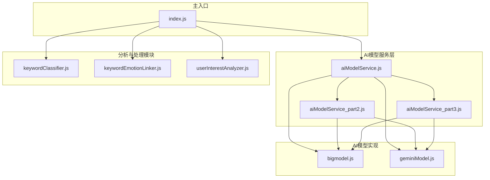
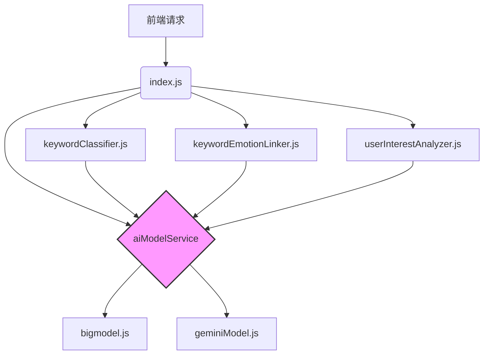
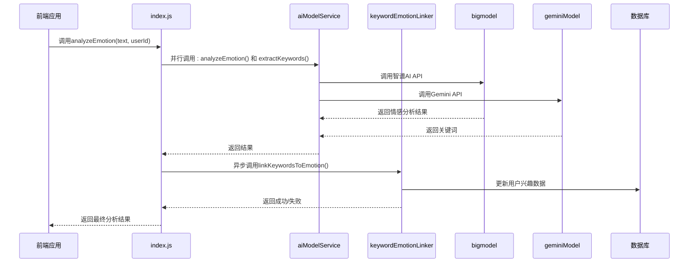
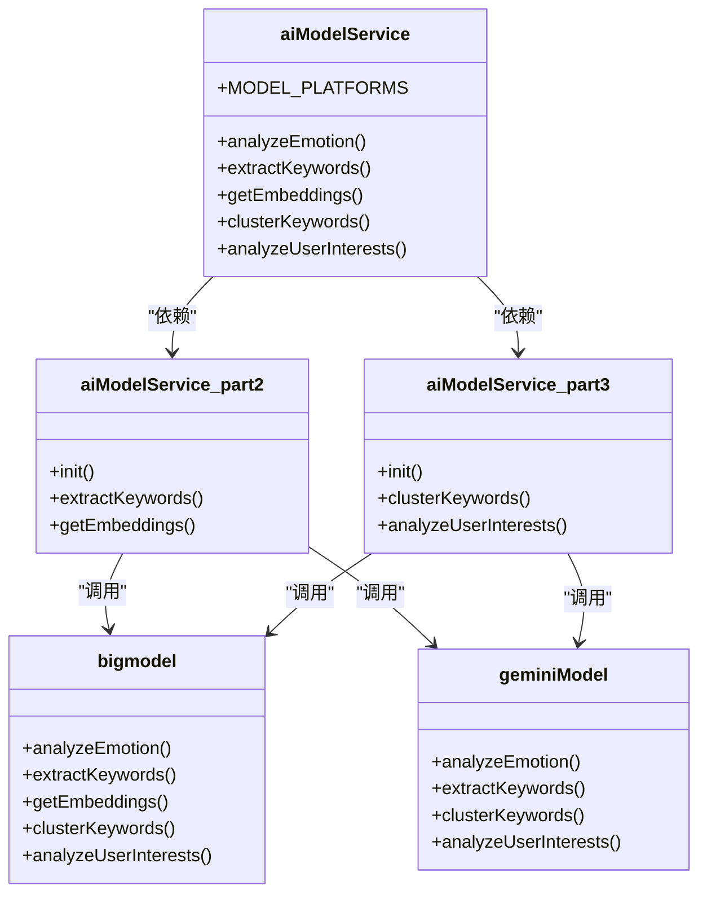
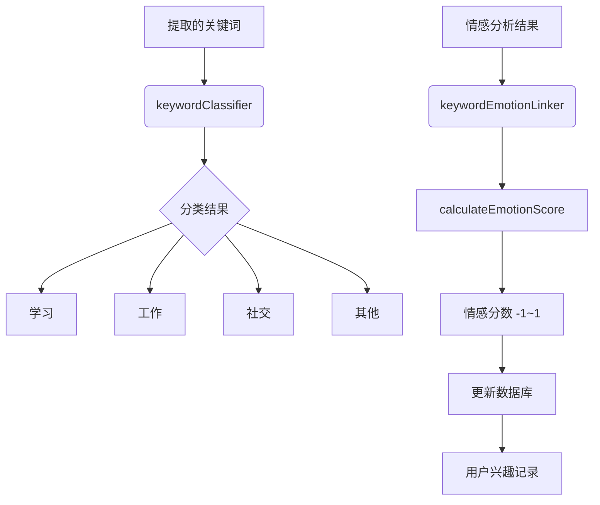
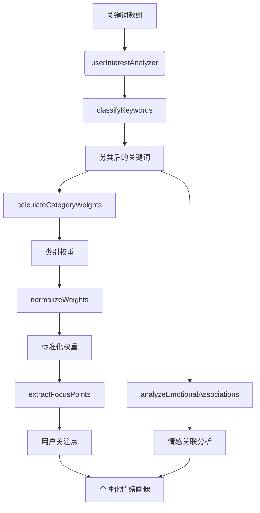
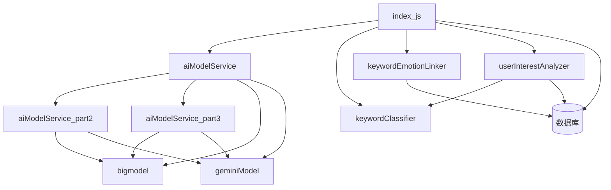

# 情感分析云函数

<cite>
**本文档引用文件**  
- [index.js](file://cloudfunctions/analysis/index.js)
- [aiModelService.js](file://cloudfunctions/analysis/aiModelService.js)
- [aiModelService_part2.js](file://cloudfunctions/analysis/aiModelService_part2.js)
- [aiModelService_part3.js](file://cloudfunctions/analysis/aiModelService_part3.js)
- [bigmodel.js](file://cloudfunctions/analysis/bigmodel.js)
- [geminiModel.js](file://cloudfunctions/analysis/geminiModel.js)
- [keywordClassifier.js](file://cloudfunctions/analysis/keywordClassifier.js)
- [keywordEmotionLinker.js](file://cloudfunctions/analysis/keywordEmotionLinker.js)
- [userInterestAnalyzer.js](file://cloudfunctions/analysis/userInterestAnalyzer.js)
</cite>

## 目录
1. [简介](#简介)
2. [项目结构](#项目结构)
3. [核心组件](#核心组件)
4. [架构概述](#架构概述)
5. [详细组件分析](#详细组件分析)
6. [依赖分析](#依赖分析)
7. [性能考虑](#性能考虑)
8. [故障排除指南](#故障排除指南)
9. [结论](#结论)

## 简介
`analysis` 云函数是 HeartChat 应用的核心功能模块，负责对用户输入的聊天内容或情绪描述文本进行深度情感分析。该函数通过调用多模型 AI 推理服务，提取关键词并建立情绪标签映射，结合用户长期兴趣偏好，生成个性化的“情绪画像”。它不仅识别当前情绪状态，还提供趋势分析、关注点识别和个性化建议，为后续的每日心情报告生成和智能对话提供数据支持。

## 项目结构
`analysis` 云函数模块采用模块化设计，各文件职责明确，协同完成复杂的情感分析任务。

**图表来源**  
- [index.js](file://cloudfunctions/analysis/index.js#L1-L1117)
- [aiModelService.js](file://cloudfunctions/analysis/aiModelService.js#L1-L663)
- [bigmodel.js](file://cloudfunctions/analysis/bigmodel.js#L1-L705)
- [geminiModel.js](file://cloudfunctions/analysis/geminiModel.js#L1-L656)

**本节来源**  
- [index.js](file://cloudfunctions/analysis/index.js#L1-L1117)
- [aiModelService.js](file://cloudfunctions/analysis/aiModelService.js#L1-L663)

## 核心组件
`analysis` 云函数的核心在于其分层的架构设计。`index.js` 作为主入口，接收前端请求并协调各个分析模块。`aiModelService.js` 及其拆分文件构成了统一的 AI 服务层，抽象了对智谱AI和Google Gemini等不同模型平台的调用。`keywordClassifier.js` 和 `keywordEmotionLinker.js` 负责关键词的分类与情感关联，而 `userInterestAnalyzer.js` 则利用这些信息生成用户的长期兴趣画像。

**本节来源**  
- [index.js](file://cloudfunctions/analysis/index.js#L1-L1117)
- [aiModelService.js](file://cloudfunctions/analysis/aiModelService.js#L1-L663)
- [keywordClassifier.js](file://cloudfunctions/analysis/keywordClassifier.js#L1-L299)
- [keywordEmotionLinker.js](file://cloudfunctions/analysis/keywordEmotionLinker.js#L1-L207)
- [userInterestAnalyzer.js](file://cloudfunctions/analysis/userInterestAnalyzer.js#L1-L289)

## 架构概述
该云函数采用“主控-服务-实现”的三层架构。最上层是 `index.js`，它定义了对外的云函数接口，如 `analyzeEmotion` 和 `extractTextKeywords`。中间层是统一的 AI 模型服务 `aiModelService`，它提供 `analyzeEmotion`、`extractKeywords` 等标准化接口，屏蔽了底层模型差异。最底层是具体的模型实现 `bigmodel.js` 和 `geminiModel.js`，它们直接与第三方 API 通信。

**图表来源**  
- [index.js](file://cloudfunctions/analysis/index.js#L1-L1117)
- [aiModelService.js](file://cloudfunctions/analysis/aiModelService.js#L1-L663)
- [bigmodel.js](file://cloudfunctions/analysis/bigmodel.js#L1-L705)
- [geminiModel.js](file://cloudfunctions/analysis/geminiModel.js#L1-L656)

## 详细组件分析

### 主入口逻辑分析
`index.js` 是整个云函数的调度中心。它通过 `analyzeEmotion` 函数接收前端传入的 `text`（聊天内容）、`userId`、`history`（对话历史）等参数。

**图表来源**  
- [index.js](file://cloudfunctions/analysis/index.js#L1-L1117)
- [aiModelService.js](file://cloudfunctions/analysis/aiModelService.js#L1-L663)
- [keywordEmotionLinker.js](file://cloudfunctions/analysis/keywordEmotionLinker.js#L1-L207)

**本节来源**  
- [index.js](file://cloudfunctions/analysis/index.js#L1-L1117)

### 统一AI服务层分析
`aiModelService.js` 的设计意图是解耦和抽象。它将 `bigmodel.js` 和 `geminiModel.js` 的具体实现细节封装起来，对外提供统一的调用接口。通过 `MODEL_PLATFORMS` 配置对象，可以轻松管理多个AI平台的API地址、密钥和模型名称。`aiModelService_part2.js` 和 `aiModelService_part3.js` 的拆分是为了避免单个文件过大，将 `extractKeywords`、`getEmbeddings`、`clusterKeywords`、`analyzeUserInterests` 等功能分散到不同文件，提高了代码的可维护性。

**图表来源**  
- [aiModelService.js](file://cloudfunctions/analysis/aiModelService.js#L1-L663)
- [aiModelService_part2.js](file://cloudfunctions/analysis/aiModelService_part2.js#L1-L317)
- [aiModelService_part3.js](file://cloudfunctions/analysis/aiModelService_part3.js#L1-L479)
- [bigmodel.js](file://cloudfunctions/analysis/bigmodel.js#L1-L705)
- [geminiModel.js](file://cloudfunctions/analysis/geminiModel.js#L1-L656)

**本节来源**  
- [aiModelService.js](file://cloudfunctions/analysis/aiModelService.js#L1-L663)
- [aiModelService_part2.js](file://cloudfunctions/analysis/aiModelService_part2.js#L1-L317)
- [aiModelService_part3.js](file://cloudfunctions/analysis/aiModelService_part3.js#L1-L479)

### 关键词与情绪关联分析
`keywordClassifier.js` 使用大模型对提取的关键词进行分类，将其归入“学习”、“工作”、“社交”等预定义类别。`keywordEmotionLinker.js` 则负责将关键词与情感分数关联。它通过 `calculateEmotionScore` 函数将情感类型（如“焦虑”、“喜悦”）转换为-1到1之间的数值，并异步更新数据库中用户兴趣记录的 `emotionScore` 字段，从而实现关键词情感的长期追踪。

**图表来源**  
- [keywordClassifier.js](file://cloudfunctions/analysis/keywordClassifier.js#L1-L299)
- [keywordEmotionLinker.js](file://cloudfunctions/analysis/keywordEmotionLinker.js#L1-L207)

**本节来源**  
- [keywordClassifier.js](file://cloudfunctions/analysis/keywordClassifier.js#L1-L299)
- [keywordEmotionLinker.js](file://cloudfunctions/analysis/keywordEmotionLinker.js#L1-L207)

### 用户兴趣画像分析
`userInterestAnalyzer.js` 是生成个性化情绪画像的关键。它首先调用 `keywordClassifier` 对关键词进行分类，然后计算每个类别（如“学习”、“工作”）的权重总和，并将其标准化为百分比。通过 `extractFocusPoints` 函数，它能识别出用户最关注的几个领域。最后，`analyzeEmotionalAssociations` 函数分析关键词与历史情绪记录的关联，找出哪些关键词常与积极或消极情绪相关。

**图表来源**  
- [userInterestAnalyzer.js](file://cloudfunctions/analysis/userInterestAnalyzer.js#L1-L289)
- [keywordClassifier.js](file://cloudfunctions/analysis/keywordClassifier.js#L1-L299)

**本节来源**  
- [userInterestAnalyzer.js](file://cloudfunctions/analysis/userInterestAnalyzer.js#L1-L289)

## 依赖分析
该云函数模块内部依赖关系清晰。`index.js` 依赖于所有分析模块。`aiModelService.js` 作为核心服务，依赖于 `aiModelService_part2.js`、`aiModelService_part3.js` 以及具体的模型实现 `bigmodel.js` 和 `geminiModel.js`。`userInterestAnalyzer.js` 依赖于 `keywordClassifier.js` 来完成关键词分类。外部依赖主要为 `wx-server-sdk` 用于云开发环境，以及 `axios` 用于HTTP请求。

**图表来源**  
- [index.js](file://cloudfunctions/analysis/index.js#L1-L1117)
- [aiModelService.js](file://cloudfunctions/analysis/aiModelService.js#L1-L663)
- [userInterestAnalyzer.js](file://cloudfunctions/analysis/userInterestAnalyzer.js#L1-L289)
- [keywordEmotionLinker.js](file://cloudfunctions/analysis/keywordEmotionLinker.js#L1-L207)

**本节来源**  
- [index.js](file://cloudfunctions/analysis/index.js#L1-L1117)
- [aiModelService.js](file://cloudfunctions/analysis/aiModelService.js#L1-L663)
- [userInterestAnalyzer.js](file://cloudfunctions/analysis/userInterestAnalyzer.js#L1-L289)

## 性能考虑
该云函数的主要性能瓶颈在于调用外部AI API，其延迟和成功率受网络状况和第三方服务影响。为优化性能，代码中已实现重试机制（`callModelApi` 中的 `retryCount`）。一个潜在的优化策略是实现关键词分类结果的缓存。例如，对于高频出现的关键词（如“学习”、“工作”），可以将分类结果缓存到内存或数据库中，避免每次分析都调用大模型进行分类，从而显著降低延迟和API调用成本。

## 故障排除指南
常见问题及解决方案：
- **情感分析返回空或错误**：检查 `ZHIPU_API_KEY` 或 `GEMINI_API_KEY` 环境变量是否正确配置。
- **关键词提取失败**：确认 `modelType` 参数是否为支持的值（`zhipu`, `gemini`）。
- **用户兴趣分析无数据**：确保数据库 `userInterests` 集合中存在对应用户的记录。
- **函数执行超时**：由于并行调用多个AI服务，处理长文本时可能超时，建议对输入文本进行长度限制。

**本节来源**  
- [index.js](file://cloudfunctions/analysis/index.js#L1-L1117)
- [aiModelService.js](file://cloudfunctions/analysis/aiModelService.js#L1-L663)
- [bigmodel.js](file://cloudfunctions/analysis/bigmodel.js#L1-L705)
- [geminiModel.js](file://cloudfunctions/analysis/geminiModel.js#L1-L656)

## 结论
`analysis` 云函数通过模块化和分层设计，成功实现了复杂的情感分析功能。其核心价值在于将即时的文本分析与长期的用户兴趣追踪相结合，形成了动态的“情绪画像”。统一的AI服务层设计保证了系统的可扩展性，未来可轻松接入更多AI模型。通过进一步引入缓存等优化策略，可以有效提升系统性能和用户体验。