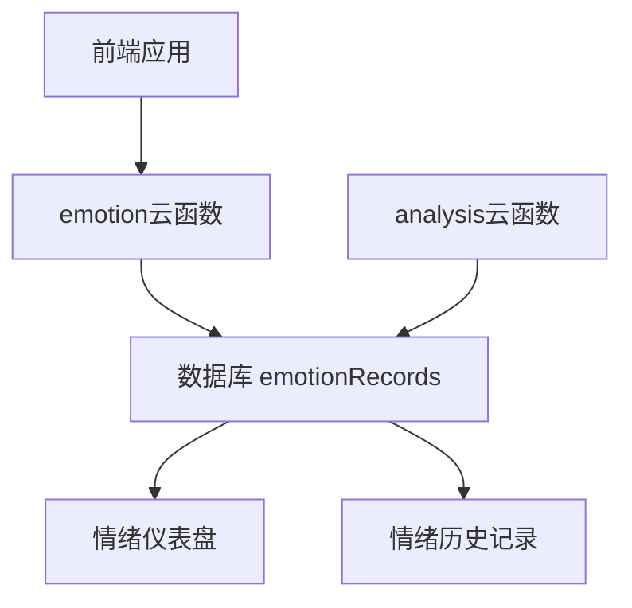
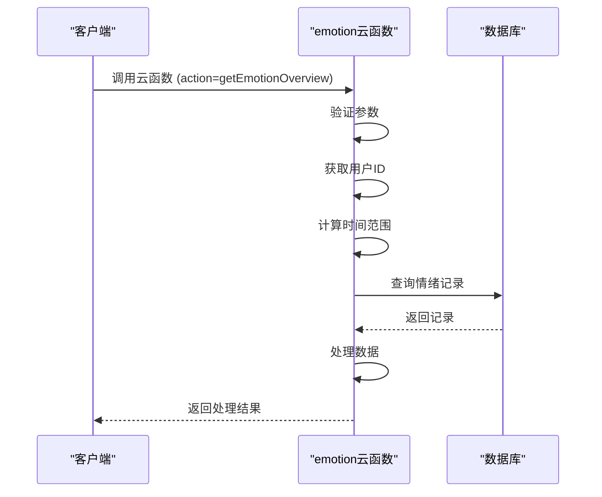
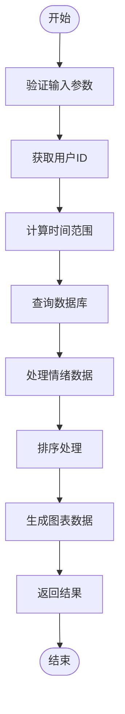
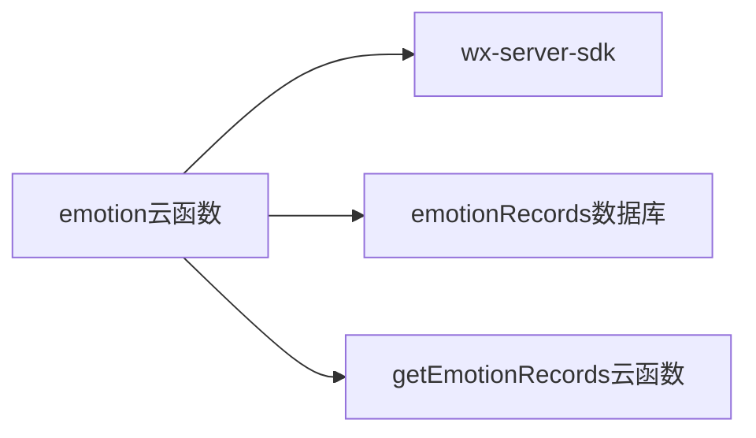

# 情绪状态分析云函数

<cite>
**本文档引用文件**  
- [index.js](file://cloudfunctions/emotion/index.js)
- [emotion.md](file://doc/开发文档/cloudfunctions/emotion.md)
- [getEmotionRecords/index.js](file://cloudfunctions/getEmotionRecords/index.js)
- [analysis/index.js](file://cloudfunctions/analysis/index.js)
</cite>

## 目录
1. [简介](#简介)
2. [项目结构](#项目结构)
3. [核心组件](#核心组件)
4. [架构概述](#架构概述)
5. [详细组件分析](#详细组件分析)
6. [依赖分析](#依赖分析)
7. [性能考虑](#性能考虑)
8. [故障排除指南](#故障排除指南)
9. [结论](#结论)

## 简介
情绪状态分析云函数是HeartChat系统中的关键模块，负责处理用户情绪数据的实时记录与分析。该函数专注于即时情绪状态的捕获与管理，为情绪历史记录、情绪仪表盘等前端功能提供支持。与侧重深度文本挖掘的analysis云函数不同，emotion云函数更强调快速、轻量级的情绪分类与强度计算，适用于高频次的情绪状态更新场景。

## 项目结构
emotion云函数位于`cloudfunctions/emotion/`目录下，主要由`index.js`构成，负责处理情绪数据的查询与统计。该函数通过调用数据库中的`emotionRecords`集合，实现对用户情绪状态的概览分析和历史趋势查询。其设计遵循微服务架构原则，专注于单一职责——情绪数据管理。

**图表来源**  
- [index.js](file://cloudfunctions/emotion/index.js#L1-L265)
- [emotion.md](file://doc/开发文档/cloudfunctions/emotion.md#L1-L203)

**本节来源**  
- [index.js](file://cloudfunctions/emotion/index.js#L1-L265)
- [emotion.md](file://doc/开发文档/cloudfunctions/emotion.md#L1-L203)

## 核心组件
emotion云函数的核心功能由`index.js`中的`getEmotionOverview`和`getEmotionHistory`两个函数实现。`getEmotionOverview`用于获取用户最近一周的情绪统计数据，而`getEmotionHistory`则用于查询指定时间范围内的情绪历史趋势。这两个函数共同构成了情绪数据管理服务的基础。

**本节来源**  
- [index.js](file://cloudfunctions/emotion/index.js#L1-L265)

## 架构概述
emotion云函数采用事件驱动架构，通过`exports.main`入口函数接收外部请求。根据请求中的`action`参数，函数路由到相应的处理逻辑。整个处理流程包括参数验证、用户识别、时间范围计算、数据库查询、数据处理和结果返回。该架构设计简洁，易于维护和扩展。

**图表来源**  
- [index.js](file://cloudfunctions/emotion/index.js#L1-L265)

**本节来源**  
- [index.js](file://cloudfunctions/emotion/index.js#L1-L265)

## 详细组件分析
### 情绪概览分析
`getEmotionOverview`函数负责生成用户情绪概览。它首先查询最近一周的情绪记录，然后统计各情绪类型的出现次数，并计算百分比。最终，函数生成包含标签、数值、颜色等信息的可视化数据，供前端图表组件使用。

#### 数据处理流程

**图表来源**  
- [index.js](file://cloudfunctions/emotion/index.js#L1-L265)

**本节来源**  
- [index.js](file://cloudfunctions/emotion/index.js#L1-L265)

### 情绪历史查询
`getEmotionHistory`函数用于查询用户的情绪历史。它支持自定义查询天数和记录数量限制，能够按日期分组并计算每日主要情绪。通过情绪值映射表，函数将情绪类型转换为数值，便于生成趋势图表。

#### 情绪值映射
| 情绪类型 | 情绪值 |
|---------|-------|
| 快乐 | 100 |
| 满足 | 80 |
| 平静 | 60 |
| 期待 | 40 |
| 惊讶 | 20 |
| 未知 | 0 |
| 担忧 | -20 |
| 疲惫 | -40 |
| 焦虑 | -60 |
| 悲伤 | -80 |
| 压力 | -90 |
| 愤怒 | -95 |
| 恐惧 | -100 |

**本节来源**  
- [index.js](file://cloudfunctions/emotion/index.js#L1-L265)
- [emotion.md](file://doc/开发文档/cloudfunctions/emotion.md#L1-L203)

## 依赖分析
emotion云函数依赖于`wx-server-sdk`进行云开发环境初始化和数据库操作。它与`emotionRecords`数据库集合紧密耦合，通过`db.collection('emotionRecords')`进行数据查询。此外，该函数与`getEmotionRecords`云函数存在功能重叠，后者也提供情绪记录查询服务，但侧重于原始记录的获取。

**图表来源**  
- [index.js](file://cloudfunctions/emotion/index.js#L1-L265)
- [getEmotionRecords/index.js](file://cloudfunctions/getEmotionRecords/index.js#L1-L112)

**本节来源**  
- [index.js](file://cloudfunctions/emotion/index.js#L1-L265)
- [getEmotionRecords/index.js](file://cloudfunctions/getEmotionRecords/index.js#L1-L112)

## 性能考虑
为了优化性能，emotion云函数采取了多项措施。首先，通过限制查询记录数量和按时间范围过滤数据，减少数据库IO开销。其次，所有数据处理都在内存中完成，避免了复杂的聚合查询。建议在高并发场景下采用批量写入数据库的策略，进一步降低IO压力。

**本节来源**  
- [emotion.md](file://doc/开发文档/cloudfunctions/emotion.md#L1-L203)

## 故障排除指南
常见问题包括数据库查询失败、参数验证错误等。函数内置了详细的错误日志记录机制，能够捕获并返回友好的错误信息。在调试时，应首先检查请求参数是否正确，然后确认数据库连接状态。

**本节来源**  
- [index.js](file://cloudfunctions/emotion/index.js#L1-L265)
- [emotion.md](file://doc/开发文档/cloudfunctions/emotion.md#L1-L203)

## 结论
emotion云函数作为情绪数据管理的核心服务，为HeartChat系统提供了高效、可靠的情绪状态分析能力。其简洁的架构设计和优化的性能表现，使其成为情绪仪表盘和历史记录等关键功能的基石。未来可通过引入缓存机制进一步提升响应速度。