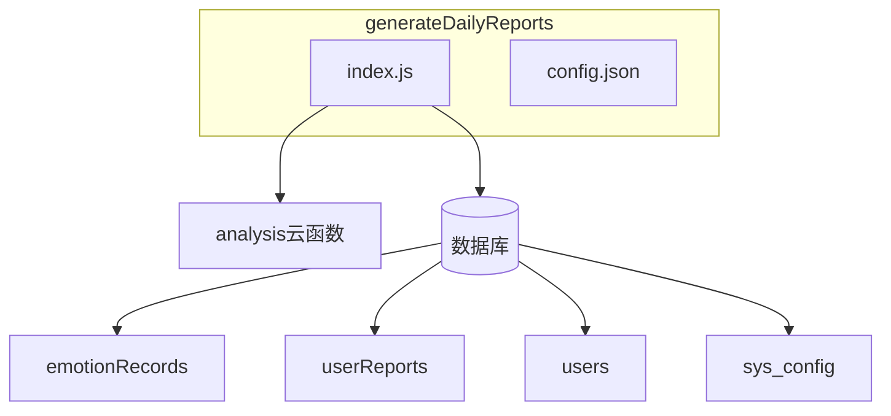
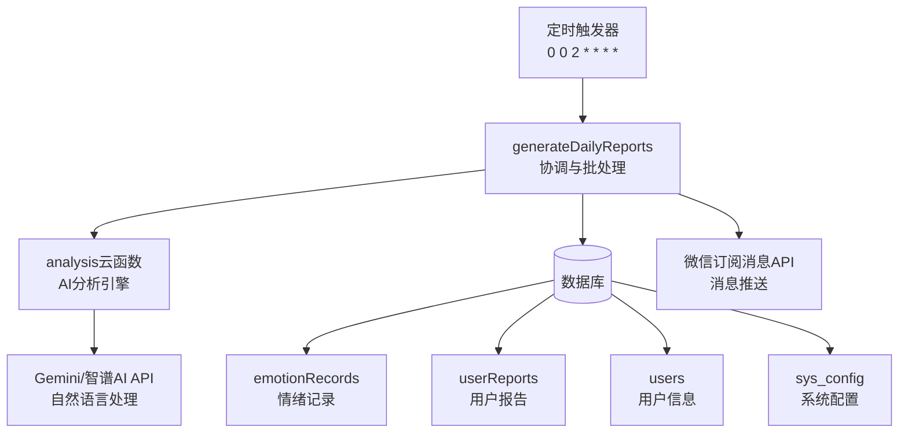
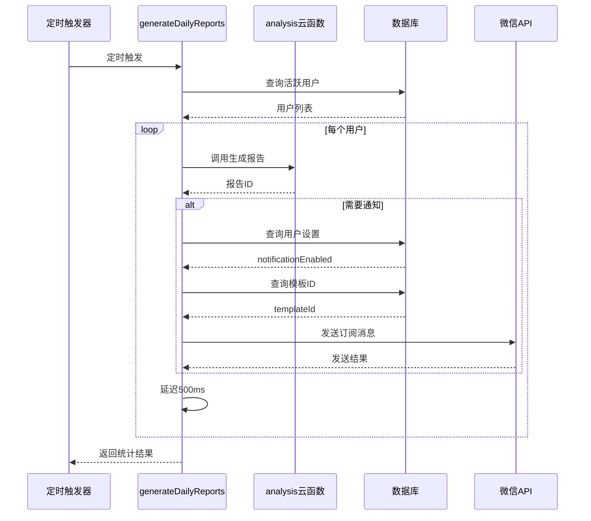
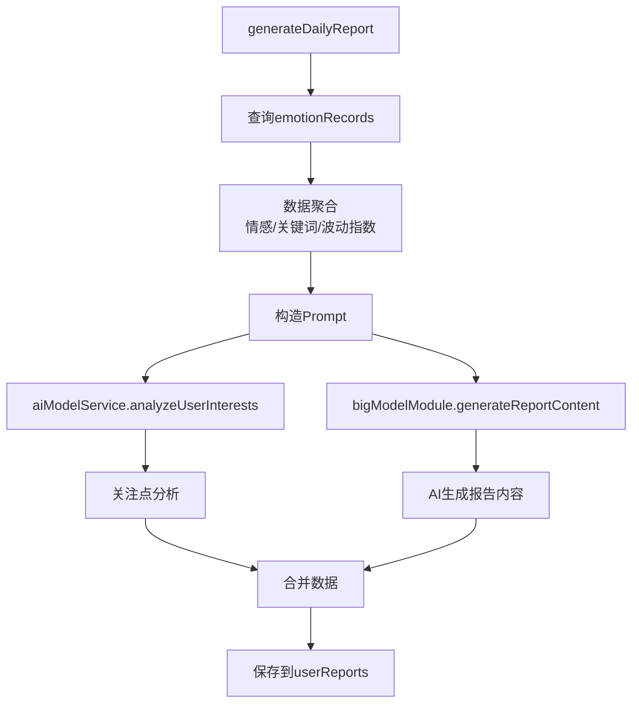
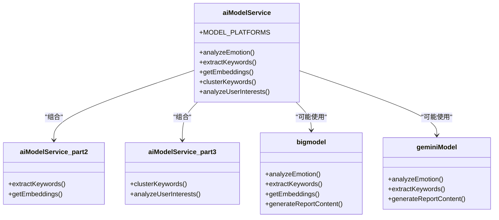
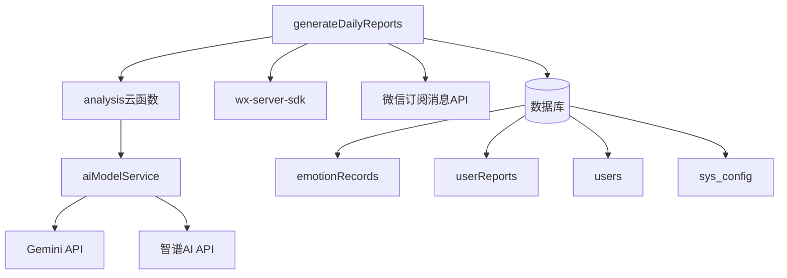

# 每日心情报告生成云函数

<cite>
**本文档引用文件**  
- [index.js](file://cloudfunctions/generateDailyReports/index.js)
- [config.json](file://cloudfunctions/generateDailyReports/config.json)
- [generateDailyReports.md](file://doc/开发文档/cloudfunctions/generateDailyReports.md)
- [index.js](file://cloudfunctions/analysis/index.js)
- [aiModelService.js](file://cloudfunctions/analysis/aiModelService.js)
- [bigmodel.js](file://cloudfunctions/analysis/bigmodel.js)
- [geminiModel.js](file://cloudfunctions/analysis/geminiModel.js)
- [userReports.md](file://doc/开发文档/database/userReports.md)
</cite>

## 目录
1. [简介](#简介)
2. [项目结构](#项目结构)
3. [核心组件](#核心组件)
4. [架构概述](#架构概述)
5. [详细组件分析](#详细组件分析)
6. [依赖分析](#依赖分析)
7. [性能考虑](#性能考虑)
8. [故障排除指南](#故障排除指南)
9. [结论](#结论)

## 简介
每日心情报告生成云函数（generateDailyReports）是HeartChat系统中的关键自动化服务，负责为用户批量生成个性化的每日心情分析报告。该函数通过定时触发机制，基于用户前一天的情绪记录（emotionRecords）和聊天记录（chatRecords），利用AI模型进行深度数据分析，生成包含情绪趋势、高频关键词、社交活跃度等维度的综合报告。系统采用Gemini等AI模型进行自然语言润色，并通过微信订阅消息向用户推送报告。整个流程实现了从数据聚合、AI分析、报告生成到消息推送的全自动化，为用户提供持续的情绪洞察和心理支持。

## 项目结构
每日心情报告生成功能主要由`cloudfunctions/generateDailyReports`目录下的两个核心文件构成：`index.js`作为主入口文件，实现报告生成与通知推送逻辑；`config.json`定义定时触发器配置。该云函数依赖于`analysis`云函数进行AI分析处理，并与数据库中的`emotionRecords`、`userReports`、`users`和`sys_config`集合进行交互。整体结构遵循微服务设计原则，职责分离清晰，便于维护和扩展。

**Diagram sources**
- [index.js](file://cloudfunctions/generateDailyReports/index.js#L1-L200)
- [config.json](file://cloudfunctions/generateDailyReports/config.json#L1-L8)

**Section sources**
- [index.js](file://cloudfunctions/generateDailyReports/index.js#L1-L200)
- [config.json](file://cloudfunctions/generateDailyReports/config.json#L1-L8)

## 核心组件
`generateDailyReports`云函数的核心在于其批量处理与协调能力。它首先通过数据库聚合查询找出前一天有情绪记录的活跃用户，然后为每个用户调用`analysis`云函数生成详细的报告。在报告生成后，函数会检查用户的推送设置，并通过微信开放平台的订阅消息API发送通知。该组件巧妙地将批处理、错误隔离和延迟控制相结合，确保了在处理大量用户时的稳定性和可靠性。其核心逻辑围绕着“查询-生成-通知-统计”的流程展开，是整个报告系统的大脑。

**Section sources**
- [index.js](file://cloudfunctions/generateDailyReports/index.js#L25-L100)

## 架构概述
每日心情报告系统的架构是一个典型的事件驱动、分层处理的微服务架构。最上层是定时触发器，每天凌晨2点触发`generateDailyReports`云函数。该函数作为协调者，负责调度整个流程。中间层是`analysis`云函数，它封装了所有AI分析能力，包括情感分析、关键词提取和报告内容生成。底层是数据库，存储原始数据和最终报告。AI模型服务层（如Gemini、智谱AI）作为外部依赖，为系统提供强大的自然语言处理能力。这种分层设计确保了系统的可扩展性和灵活性。

**Diagram sources**
- [config.json](file://cloudfunctions/generateDailyReports/config.json#L1-L8)
- [index.js](file://cloudfunctions/generateDailyReports/index.js#L1-L200)
- [index.js](file://cloudfunctions/analysis/index.js#L1-L1117)

## 详细组件分析

### generateDailyReports云函数分析
`generateDailyReports/index.js`是整个报告生成流程的入口和控制器。它首先计算目标日期（前一天），然后使用数据库聚合管道查询所有有情绪记录的活跃用户。对于每个用户，它通过`cloud.callFunction`调用`analysis`云函数，传入用户ID和日期参数来生成报告。生成成功后，函数会查询用户的`reportSettings`以确定是否需要推送通知。如果需要，它会进一步查询`sys_config`集合获取订阅消息模板ID，并调用`sendReportNotification`函数完成推送。整个过程通过`try-catch`块进行错误隔离，确保单个用户的失败不会影响整体流程。

#### 主要流程序列图

**Diagram sources**
- [index.js](file://cloudfunctions/generateDailyReports/index.js#L1-L200)

**Section sources**
- [index.js](file://cloudfunctions/generateDailyReports/index.js#L1-L200)

### AI分析与报告生成分析
`analysis/index.js`云函数是报告内容的“大脑”。当`generateDailyReports`调用它并指定`type: 'daily_report'`时，它会执行`generateDailyReport`函数。该函数首先查询用户在指定日期内的所有`emotionRecords`，然后进行数据聚合：统计情感分布以确定主要情绪（`primaryEmotion`），聚合关键词并计算权重，计算情绪波动指数（`emotionalVolatility`）。最关键的一步是调用AI模型生成报告内容。函数会将用户当天的所有聊天文本拼接起来，构造一个详细的提示词（prompt），然后调用`bigModelModule.generateReportContent`（实际由`aiModelService`实现）来生成包含总结、洞察、建议等内容的JSON响应。

#### AI模型服务调用流程

**Diagram sources**
- [index.js](file://cloudfunctions/analysis/index.js#L1-L1117)
- [aiModelService.js](file://cloudfunctions/analysis/aiModelService.js#L1-L663)

**Section sources**
- [index.js](file://cloudfunctions/analysis/index.js#L1-L1117)

### 报告模板与AI润色分析
报告的AI润色流程由`aiModelService.js`模块统一管理。该模块支持多种AI平台（Gemini、智谱AI等），通过`MODEL_PLATFORMS`配置对象进行管理。当`generateReportContent`被调用时，`aiModelService`会根据配置选择平台（如Gemini），构建符合该平台API要求的请求体。对于Gemini，它会构造一个包含`contents`数组的请求，其中包含系统提示词和用户的具体分析请求。AI模型会返回一个JSON格式的响应，包含`summary`、`insights`、`suggestions`等字段。如果AI调用失败，系统会使用内置的默认内容模板，确保报告生成流程不会中断。

#### AI模型服务类图

**Diagram sources**
- [aiModelService.js](file://cloudfunctions/analysis/aiModelService.js#L1-L663)
- [bigmodel.js](file://cloudfunctions/analysis/bigmodel.js#L1-L705)
- [geminiModel.js](file://cloudfunctions/analysis/geminiModel.js#L1-L656)

**Section sources**
- [aiModelService.js](file://cloudfunctions/analysis/aiModelService.js#L1-L663)

## 依赖分析
`generateDailyReports`云函数的依赖关系清晰且松耦合。它的直接依赖是`analysis`云函数，通过云开发的`callFunction`接口进行调用，实现了服务间的解耦。数据依赖方面，它需要访问`emotionRecords`、`userReports`、`users`和`sys_config`四个数据库集合。外部依赖包括微信云开发SDK（`wx-server-sdk`）和微信开放平台的订阅消息API。AI分析能力则通过`aiModelService`间接依赖Gemini和智谱AI等外部API。这种依赖结构使得`generateDailyReports`可以专注于流程编排，而将复杂的分析任务委托给专门的服务。

**Diagram sources**
- [index.js](file://cloudfunctions/generateDailyReports/index.js#L1-L200)
- [index.js](file://cloudfunctions/analysis/index.js#L1-L1117)

**Section sources**
- [index.js](file://cloudfunctions/generateDailyReports/index.js#L1-L200)
- [index.js](file://cloudfunctions/analysis/index.js#L1-L1117)

## 性能考虑
该系统在设计时充分考虑了性能和稳定性。`generateDailyReports`函数通过`limit(100)`限制了单次处理的用户数量，防止资源耗尽。在遍历用户时，使用`await new Promise(resolve => setTimeout(resolve, 500))`添加了500毫秒的延迟，有效避免了对`analysis`云函数和数据库的调用过于频繁，从而防止API限流。错误处理机制完善，每个用户的处理都在独立的`try-catch`块中，确保了错误隔离。AI模型服务内部也实现了重试机制（如`callModelApi`中的`retryCount`），能够应对临时的网络波动。这些措施共同保障了系统在高负载下的可靠运行。

## 故障排除指南
当报告生成出现问题时，应按以下步骤排查：
1.  **检查定时触发器**：确认`config.json`中的Cron表达式`0 0 2 * * * *`是否正确，确保函数能被按时触发。
2.  **检查日志**：在云开发控制台查看`generateDailyReports`的运行日志，查找`console.error`输出的错误信息，如“批量生成每日报告失败”或“为用户生成报告失败”。
3.  **验证AI服务**：检查`analysis`云函数是否正常运行，确认`ZHIPU_API_KEY`或`GEMINI_API_KEY`环境变量已正确配置。
4.  **检查数据库**：确认`sys_config`集合中存在`configKey`为`report_template_id`的文档，且`users`集合中相关用户的`openid`和`reportSettings.notificationEnabled`字段正确。
5.  **检查数据源**：确认`emotionRecords`集合中存在目标日期的记录，因为没有记录的用户不会生成报告。

**Section sources**
- [index.js](file://cloudfunctions/generateDailyReports/index.js#L1-L200)
- [config.json](file://cloudfunctions/generateDailyReports/config.json#L1-L8)

## 结论
`generateDailyReports`云函数是HeartChat系统中一个高效、可靠的自动化服务。它通过精巧的架构设计，将定时任务、数据聚合、AI分析和消息推送无缝集成，为用户提供了有价值的每日心情洞察。其模块化的代码结构、完善的错误处理和性能优化措施，体现了良好的工程实践。未来可考虑增加报告内容的个性化程度，或引入更复杂的机器学习模型来预测用户情绪趋势，进一步提升服务价值。