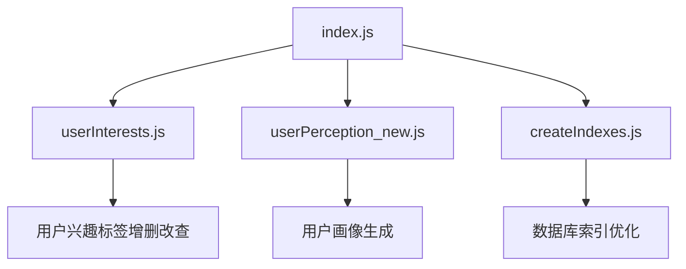
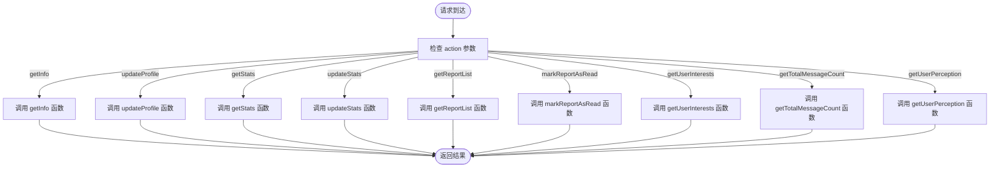
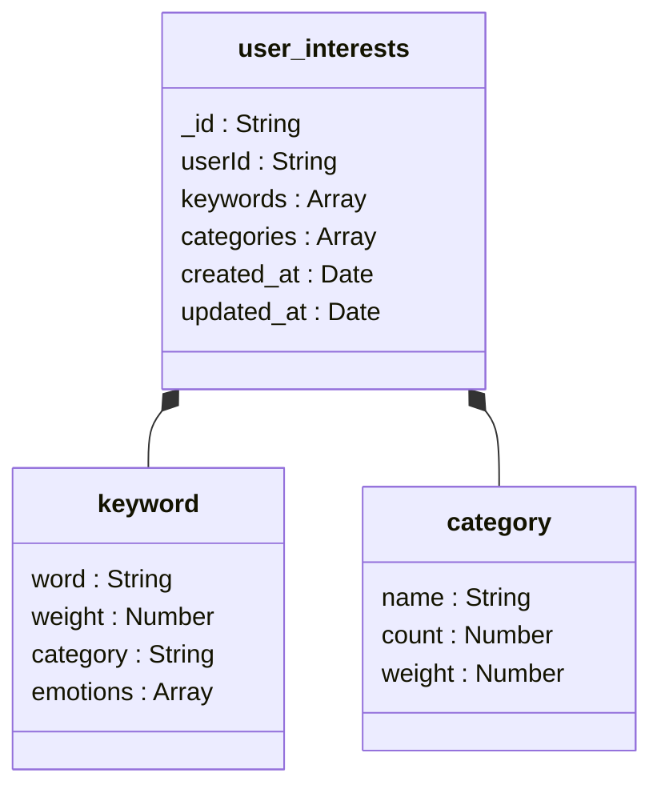
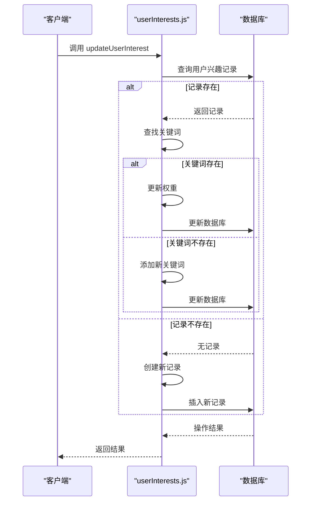
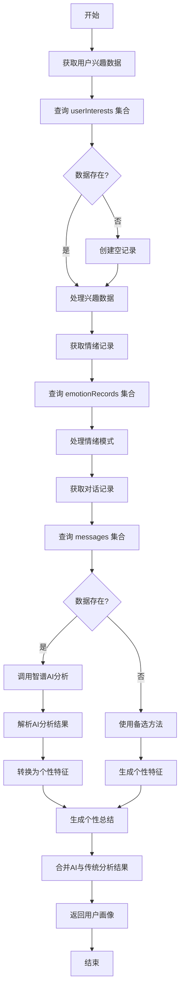
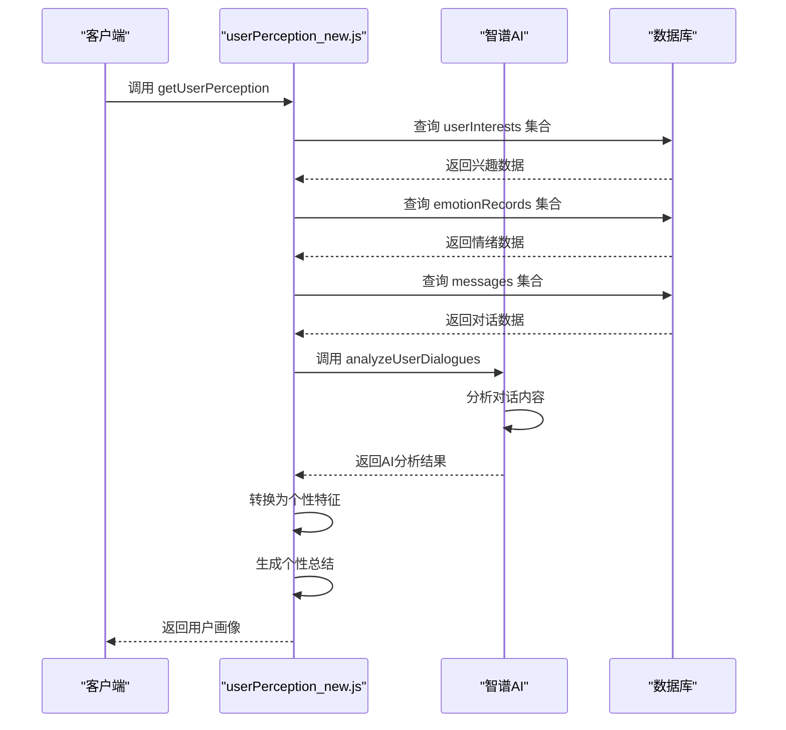
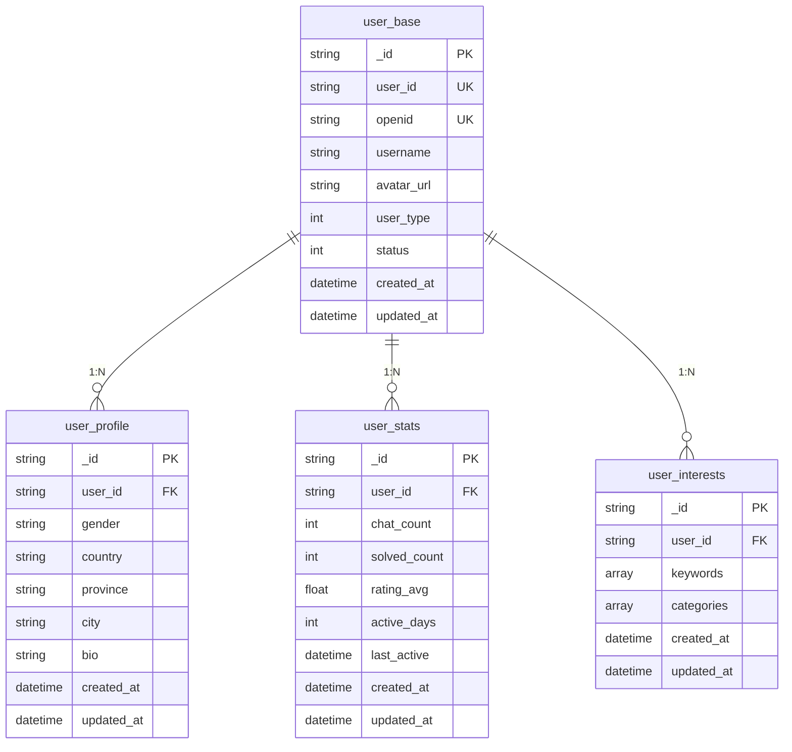

# 用户管理云函数

<cite>
**本文档引用文件**  
- [index.js](file://cloudfunctions/user/index.js)
- [userInterests.js](file://cloudfunctions/user/userInterests.js)
- [userPerception_new.js](file://cloudfunctions/user/userPerception_new.js)
- [createIndexes.js](file://cloudfunctions/user/createIndexes.js)
- [database_design.md](file://doc/设计文档/后端/database_design.md)
- [user.md](file://doc/开发文档/cloudfunctions/user.md)
- [user_base.md](file://doc/开发文档/database/user_base.md)
- [user_profile.md](file://doc/开发文档/database/user_profile.md)
- [userInterests.md](file://doc/开发文档/database/userInterests.md)
- [HeartChat数据库结构图.html](file://doc/设计文档/流程图/html/HeartChat数据库结构图.html)
- [userPerception模块使用文档.md](file://doc/使用文档/userPerception模块使用文档.md)
- [personalityService.js](file://miniprogram/services/personalityService.js)
</cite>

## 目录
1. [用户管理云函数职责概述](#用户管理云函数职责概述)
2. [核心模块与文件结构](#核心模块与文件结构)
3. [路由分发逻辑解析](#路由分发逻辑解析)
4. [用户兴趣管理模块](#用户兴趣管理模块)
5. [用户画像构建模块](#用户画像构建模块)
6. [数据库操作与索引优化](#数据库操作与索引优化)
7. [权限控制与安全验证](#权限控制与安全验证)
8. [API参数说明](#api参数说明)
9. [跨模块数据调用](#跨模块数据调用)
10. [附录](#附录)

## 用户管理云函数职责概述

用户管理云函数是HeartChat系统的核心组件，负责用户数据的全生命周期管理。该模块通过`index.js`作为入口，协调`userInterests.js`和`userPerception_new.js`等子模块，实现用户注册、资料更新、兴趣标签维护及用户画像构建等核心功能。系统采用微信云开发技术栈，基于`wx-server-sdk`与云数据库进行交互，确保数据操作的安全性与高效性。

**Section sources**
- [index.js](file://cloudfunctions/user/index.js#L0-L45)
- [user.md](file://doc/开发文档/cloudfunctions/user.md#L1-L10)

## 核心模块与文件结构

用户管理模块位于`cloudfunctions/user`目录下，包含以下核心文件：
- `index.js`：主入口文件，负责路由分发与请求处理
- `userInterests.js`：用户兴趣标签管理模块
- `userPerception_new.js`：基于智谱AI的用户画像构建模块
- `createIndexes.js`：数据库索引创建与优化模块

模块通过`require`机制导入各子模块，形成清晰的职责分离架构。`index.js`作为协调者，根据请求的`action`参数调用相应子模块的处理函数。



**Diagram sources**
- [index.js](file://cloudfunctions/user/index.js#L0-L45)
- [userInterests.js](file://cloudfunctions/user/userInterests.js#L0-L50)
- [userPerception_new.js](file://cloudfunctions/user/userPerception_new.js#L0-L50)
- [createIndexes.js](file://cloudfunctions/user/createIndexes.js#L0-L50)

**Section sources**
- [index.js](file://cloudfunctions/user/index.js#L0-L45)
- [user.md](file://doc/开发文档/cloudfunctions/user.md#L1-L10)

## 路由分发逻辑解析

`index.js`文件通过`action`参数实现路由分发，支持多种操作类型。主函数根据`event.action`的值调用相应的子功能函数，形成清晰的控制流。



**Diagram sources**
- [index.js](file://cloudfunctions/user/index.js#L0-L873)

**Section sources**
- [index.js](file://cloudfunctions/user/index.js#L0-L873)

## 用户兴趣管理模块

`userInterests.js`模块负责用户兴趣标签的全生命周期管理，提供增删改查功能。模块通过`userInterests`集合存储用户兴趣数据，每个用户对应一条记录，包含关键词数组和分类数组。

### 数据结构设计



**Diagram sources**
- [HeartChat数据库结构图.html](file://doc/设计文档/流程图/html/HeartChat数据库结构图.html#L381-L427)
- [userInterests.md](file://doc/开发文档/database/userInterests.md#L1-L10)

### 核心功能实现

#### 兴趣标签增删改查

模块提供以下核心函数：
- `getUserInterests(userId)`：获取用户兴趣数据
- `updateUserInterest(userId, keyword, weightDelta)`：更新用户兴趣关键词
- `batchUpdateUserInterests(userId, keywords)`：批量更新用户兴趣
- `deleteUserInterest(userId, keyword)`：删除用户兴趣关键词
- `updateKeywordCategory(userId, keyword, category)`：更新关键词分类



**Diagram sources**
- [userInterests.js](file://cloudfunctions/user/userInterests.js#L50-L500)

**Section sources**
- [userInterests.js](file://cloudfunctions/user/userInterests.js#L50-L500)
- [userInterests.md](file://doc/开发文档/database/userInterests.md#L1-L10)

## 用户画像构建模块

`userPerception_new.js`模块基于智谱AI技术，整合用户历史交互数据生成动态用户感知模型。该模块通过分析用户兴趣、情绪记录和对话内容，构建多维度的用户画像。

### 数据整合与分析流程



**Diagram sources**
- [userPerception_new.js](file://cloudfunctions/user/userPerception_new.js#L0-L635)

### 核心功能实现

#### 智谱AI集成

模块通过`callZhipuAI`函数调用智谱AI接口，实现高级用户画像分析。AI分析流程包括：
1. 提取用户最近50条消息内容
2. 构建AI请求参数，指定分析目标
3. 调用`httpRequest`云函数发送请求
4. 解析AI返回的JSON格式结果
5. 转换AI分析结果为系统可识别的特征数据



**Diagram sources**
- [userPerception_new.js](file://cloudfunctions/user/userPerception_new.js#L0-L635)
- [personalityService.js](file://miniprogram/services/personalityService.js#L0-L52)

**Section sources**
- [userPerception_new.js](file://cloudfunctions/user/userPerception_new.js#L0-L635)
- [userPerception模块使用文档.md](file://doc/使用文档/userPerception模块使用文档.md#L1-L100)

## 数据库操作与索引优化

用户管理模块涉及多个数据库集合的读写操作，并通过索引优化提升查询性能。

### 数据库集合结构

#### 用户基础信息(user_base)
```javascript
{
  _id: "记录ID",
  user_id: "用户ID",
  openid: "微信openid",
  username: "用户名",
  avatar_url: "头像URL",
  user_type: 1,
  status: 1,
  created_at: "创建时间",
  updated_at: "更新时间"
}
```

#### 用户详细信息(user_profile)
```javascript
{
  _id: "记录ID",
  user_id: "用户ID",
  gender: "性别",
  country: "国家",
  province: "省份",
  city: "城市",
  bio: "个人简介",
  birthday: "生日",
  interests: ["兴趣1", "兴趣2"],
  personality: ["性格特点1", "性格特点2"],
  created_at: "创建时间",
  updated_at: "更新时间"
}
```

#### 用户统计信息(user_stats)
```javascript
{
  _id: "记录ID",
  stats_id: "统计ID",
  user_id: "用户ID",
  openid: "微信openid",
  chat_count: 0,
  solved_count: 0,
  rating_avg: 0,
  active_days: 1,
  last_active: "最后活跃时间",
  favorite_roles: [
    {
      role_id: "角色ID",
      usage_count: 0,
      last_used: "最后使用时间"
    }
  ],
  created_at: "创建时间",
  updated_at: "更新时间"
}
```

**Section sources**
- [user_base.md](file://doc/开发文档/database/user_base.md#L1-L39)
- [user_profile.md](file://doc/开发文档/database/user_profile.md#L1-L41)
- [user.md](file://doc/开发文档/cloudfunctions/user.md#L52-L110)

### 索引优化策略

`createIndexes.js`模块负责创建数据库索引，提升查询性能。主要索引包括：

#### userInterests集合索引
- `userId`索引：确保用户ID唯一性，加速用户数据查询
- `keywords.category`索引：支持按分类查询兴趣标签
- `keywords.word`索引：支持按关键词查询
- `lastUpdated`索引：支持按更新时间排序

#### roles集合索引
- `creator`索引：加速角色创建者查询
- `category`索引：支持按类别查询角色
- `isSystem`索引：区分系统角色与用户角色
- 组合索引：`isSystem + category`和`creator + category`，支持复合条件查询

#### emotionRecords集合索引
- `userId + timestamp`索引：支持按用户和时间范围查询情绪记录
- `roleId + userId + timestamp`索引：支持按角色、用户和时间查询
- `chatId + timestamp`索引：支持按聊天会话查询
- `primary_emotion + userId + timestamp`索引：支持按主要情绪查询



**Diagram sources**
- [createIndexes.js](file://cloudfunctions/user/createIndexes.js#L0-L224)
- [database_design.md](file://doc/设计文档/后端/database_design.md#L1-L51)

**Section sources**
- [createIndexes.js](file://cloudfunctions/user/createIndexes.js#L0-L224)
- [database_design.md](file://doc/设计文档/后端/database_design.md#L1-L51)

## 权限控制与安全验证

用户管理模块实施严格的权限控制机制，确保数据安全。

### 权限控制规则

#### 数据库安全规则
```json
{
  "read": "auth.openid != null",
  "write": "auth.openid != null && doc._openid == auth.openid",
  "update": "auth.openid != null && doc._openid == auth.openid",
  "delete": false
}
```

#### 云函数权限验证
- 所有操作必须通过微信登录验证
- 用户只能访问和修改自己的数据
- 禁止删除用户数据
- 使用`openid`作为用户唯一标识

### 安全验证措施

#### 防越权访问
- 在`getInfo`函数中验证`userId`参数，确保用户只能获取自己的信息
- 在`updateProfile`函数中验证`userId`参数，确保用户只能更新自己的资料
- 在`markReportAsRead`函数中验证报告归属，确保用户只能标记自己的报告为已读

#### 输入参数验证
- 所有函数检查必填参数，如`userId`、`keyword`等
- 对输入数据进行类型检查，防止注入攻击
- 使用`try-catch`块捕获异常，防止系统崩溃

**Section sources**
- [index.js](file://cloudfunctions/user/index.js#L0-L873)
- [database_design.md](file://doc/设计文档/后端/database_design.md#L1-L51)

## API参数说明

用户管理云函数提供标准化的API接口，支持多种操作类型。

### 请求参数规范

| 参数名 | 类型 | 必填 | 说明 |
|-------|------|------|------|
| action | string | 是 | 操作类型，如getInfo、updateProfile等 |
| userId | string | 否 | 用户ID，未提供时使用当前登录用户 |
| OPENID | string | 否 | 微信用户唯一标识，由系统自动获取 |

### 操作类型与参数

#### getInfo
- **功能**：获取用户信息
- **参数**：`userId`（可选）
- **返回**：用户基本信息、统计信息、详细信息和配置

#### updateProfile
- **功能**：更新用户资料
- **参数**：`userId`、`username`、`avatarUrl`、`gender`、`country`、`province`、`city`、`bio`、`settings`
- **返回**：更新后的用户信息

#### getStats
- **功能**：获取用户统计
- **参数**：`userId`（可选）
- **返回**：用户统计信息

#### updateStats
- **功能**：更新用户统计
- **参数**：`userId`、`statsType`、`value`
- **返回**：更新后的统计信息

#### getUserInterests
- **功能**：获取用户兴趣数据
- **参数**：`userId`（可选）
- **返回**：用户兴趣标签和分类

#### getUserPerception
- **功能**：获取用户画像
- **参数**：`userId`（可选）
- **返回**：用户兴趣、个性特征、个性总结和情绪模式

**Section sources**
- [index.js](file://cloudfunctions/user/index.js#L0-L873)
- [user.md](file://doc/开发文档/cloudfunctions/user.md#L1-L10)

## 跨模块数据调用

用户管理模块的数据被其他模块广泛调用，实现个性化服务。

### 与其他模块的集成

#### analysis模块
- 调用`userInterests.js`获取用户兴趣数据
- 用于关键词分类和情感分析
- 基于用户兴趣调整分析策略

#### chat模块
- 调用`userPerception_new.js`获取用户画像
- 根据用户个性特征调整对话策略
- 基于用户兴趣推荐相关话题

#### roles模块
- 调用`user_stats`集合获取用户活跃数据
- 根据用户使用习惯优化角色推荐
- 基于用户情绪模式调整角色行为

### 实际应用场景

#### 个性化对话
- 通过`getUserPerception`获取用户沟通风格
- 调整AI角色的语言风格和表达方式
- 基于用户兴趣推荐相关话题

#### 情绪支持
- 通过`emotionRecords`集合获取用户情绪历史
- 识别用户情绪变化趋势
- 提供针对性的情绪支持和建议

#### 内容推荐
- 通过`userInterests`集合获取用户兴趣标签
- 推荐相关文章、音乐或活动
- 基于用户偏好优化推荐算法

**Section sources**
- [userPerception_new.js](file://cloudfunctions/user/userPerception_new.js#L0-L635)
- [userInterests.js](file://cloudfunctions/user/userInterests.js#L0-L50)
- [personalityService.js](file://miniprogram/services/personalityService.js#L0-L52)

## 附录

### 错误处理规范
- 所有函数返回统一格式：`{ success: boolean, error?: string, data?: any }`
- 捕获并记录所有异常，便于调试
- 提供有意义的错误信息，帮助前端处理

### 性能优化建议
- 合理使用数据库索引，避免全表扫描
- 批量操作替代单条操作，减少数据库交互
- 缓存常用数据，减少重复计算

### 扩展性考虑
- 模块化设计，便于功能扩展
- 标准化接口，支持多端调用
- 可配置化参数，适应不同场景

**Section sources**
- [index.js](file://cloudfunctions/user/index.js#L0-L873)
- [userPerception_new.js](file://cloudfunctions/user/userPerception_new.js#L0-L635)
- [userInterests.js](file://cloudfunctions/user/userInterests.js#L0-L50)