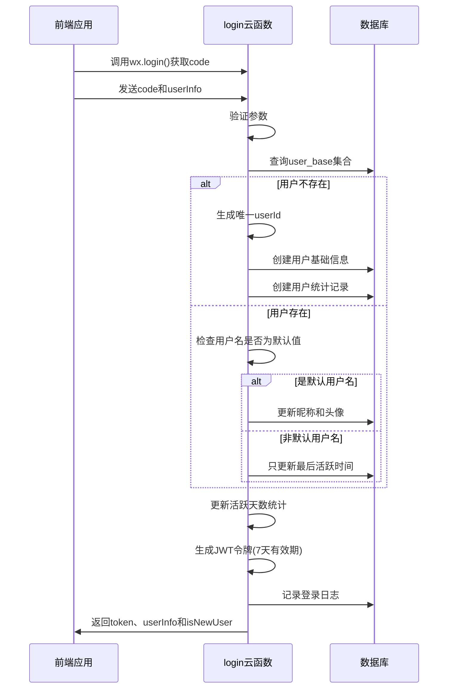
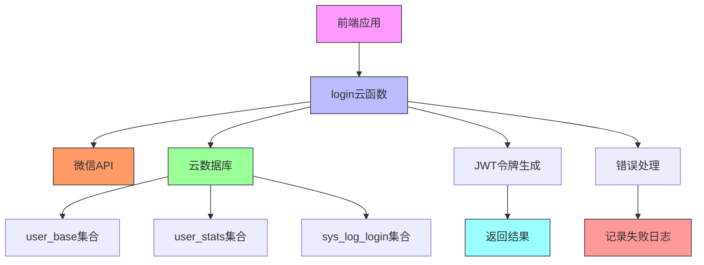
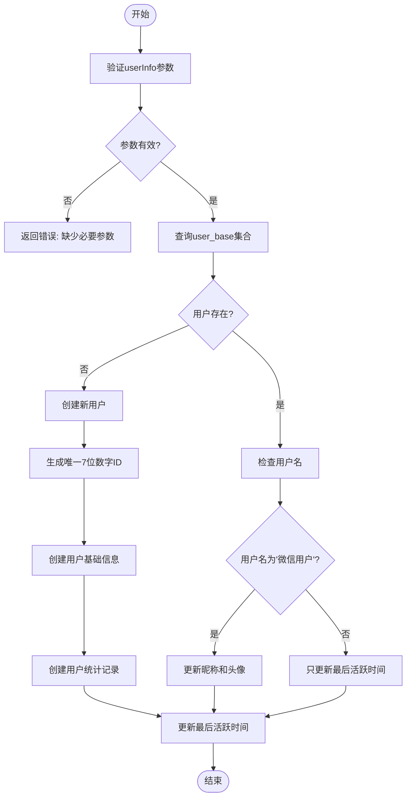
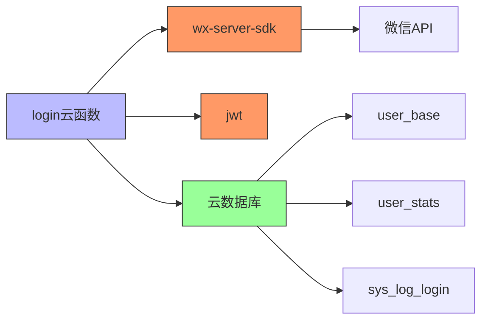

# 登录认证云函数

<cite>
**本文档引用的文件**   
- [index.js](file://cloudfunctions/login/index.js)
- [login.md](file://doc/开发文档/cloudfunctions/login.md)
- [welcome.js](file://miniprogram/pages/welcome/welcome.js)
- [app.js](file://miniprogram/app.js)
- [user/index.js](file://cloudfunctions/user/index.js)
</cite>

## 目录
1. [介绍](#介绍)
2. [用户身份验证流程](#用户身份验证流程)
3. [核心组件分析](#核心组件分析)
4. [架构概述](#架构概述)
5. [详细组件分析](#详细组件分析)
6. [依赖分析](#依赖分析)
7. [性能考虑](#性能考虑)
8. [故障排除指南](#故障排除指南)
9. [结论](#结论)

## 介绍
登录认证云函数是HeartChat小程序的核心身份验证服务，负责处理微信用户的登录授权、用户信息管理、JWT令牌生成和用户统计功能。该云函数实现了完整的微信授权登录机制，支持新用户自动注册和现有用户信息更新。通过集成JWT令牌和会话管理策略，确保了系统的安全性和可扩展性。本文档详细说明了login云函数的用户身份验证流程，包括微信授权登录的实现机制、参数处理、输出结构、会话管理策略、安全性保障措施以及与用户系统的集成方式。

## 用户身份验证流程
登录认证云函数的用户身份验证流程始于前端调用`wx.login()`获取临时登录凭证（code），然后将该code和用户信息一起发送到云函数。云函数通过微信服务器接口验证code并获取用户的openid和session_key。系统根据openid查询用户基础信息表（user_base），如果用户不存在则创建新用户记录，包括生成唯一的7位数字用户ID。对于现有用户，系统会根据用户名是否为默认值"微信用户"来决定是否更新昵称和头像信息。随后，系统生成包含用户ID、用户类型和状态信息的JWT令牌，设置7天有效期，并记录登录日志。整个流程确保了用户身份的安全验证和会话状态的正确管理。



**图表来源**
- [index.js](file://cloudfunctions/login/index.js#L0-L267)
- [login.md](file://doc/开发文档/cloudfunctions/login.md#L0-L222)

**本节来源**
- [index.js](file://cloudfunctions/login/index.js#L0-L267)
- [login.md](file://doc/开发文档/cloudfunctions/login.md#L0-L222)

## 核心组件分析
登录认证云函数的核心组件包括用户信息处理、JWT令牌生成、用户统计管理和日志记录。用户信息处理组件负责验证输入参数、查询或创建用户记录，并根据用户状态执行相应的更新策略。JWT令牌生成组件使用jsonwebtoken库创建包含用户ID、用户类型和状态信息的安全令牌，设置7天有效期以平衡安全性和用户体验。用户统计管理组件负责创建和更新用户的统计信息，包括聊天次数、解决问题数、平均评分和活跃天数等指标。日志记录组件则负责记录登录成功和失败的日志，便于后续的审计和问题排查。这些组件协同工作，确保了用户身份验证流程的完整性和安全性。

**本节来源**
- [index.js](file://cloudfunctions/login/index.js#L0-L267)
- [login.md](file://doc/开发文档/cloudfunctions/login.md#L0-L222)

## 架构概述
登录认证云函数的架构基于微信云开发平台，采用事件驱动的函数式编程模型。云函数接收前端发送的事件参数，包括用户的code和userInfo，然后执行一系列异步操作来完成身份验证流程。系统与云数据库的多个集合进行交互，包括user_base（用户基础信息）、user_stats（用户统计）和sys_log_login（登录日志）。通过使用Promise和async/await语法，确保了异步操作的顺序执行和错误处理。整体架构设计遵循单一职责原则，每个函数和模块都有明确的职责，提高了代码的可维护性和可测试性。



**图表来源**
- [index.js](file://cloudfunctions/login/index.js#L0-L267)
- [login.md](file://doc/开发文档/cloudfunctions/login.md#L0-L222)

## 详细组件分析
### 用户信息处理组件
用户信息处理组件是登录认证云函数的核心，负责处理用户的身份验证和信息管理。该组件首先验证输入参数，确保userInfo对象存在。然后根据微信上下文中的OPENID查询user_base集合，判断用户是否为新用户。对于新用户，系统生成唯一的7位数字用户ID，创建用户基础信息记录，并初始化用户统计信息。对于现有用户，系统采用智能更新策略：只有当用户名为默认的"微信用户"时才更新昵称和头像，否则只更新最后活跃时间。这种策略既保证了用户自定义信息的保留，又实现了用户状态的及时更新。



**图表来源**
- [index.js](file://cloudfunctions/login/index.js#L0-L267)
- [login.md](file://doc/开发文档/cloudfunctions/login.md#L0-L222)

**本节来源**
- [index.js](file://cloudfunctions/login/index.js#L0-L267)
- [login.md](file://doc/开发文档/cloudfunctions/login.md#L0-L222)

### JWT令牌生成组件
JWT令牌生成组件负责创建安全的访问令牌，用于后续的API调用身份验证。该组件使用jsonwebtoken库，基于预定义的密钥（JWT_SECRET）对用户信息进行签名。生成的令牌包含用户ID、用户类型和状态等必要信息，并设置7天的有效期。通过将用户关键信息编码到令牌中，减少了后续请求中对数据库的查询次数，提高了系统性能。同时，7天的有效期平衡了安全性和用户体验，避免了用户频繁重新登录。

**本节来源**
- [index.js](file://cloudfunctions/login/index.js#L0-L267)
- [login.md](file://doc/开发文档/cloudfunctions/login.md#L0-L222)

### 用户统计管理组件
用户统计管理组件负责维护用户的统计信息，包括聊天次数、解决问题数、平均评分和活跃天数等。当新用户注册时，系统创建包含初始值的统计记录。对于现有用户，系统在每次登录时检查最后活跃时间，如果不是当天，则增加活跃天数。这种智能的活跃天数计算方式准确反映了用户的实际使用情况。统计信息的更新采用原子操作，确保了数据的一致性和完整性。

**本节来源**
- [index.js](file://cloudfunctions/login/index.js#L0-L267)
- [login.md](file://doc/开发文档/cloudfunctions/login.md#L0-L222)

## 依赖分析
登录认证云函数依赖于多个外部组件和库，包括微信云开发SDK、jsonwebtoken库和云数据库服务。微信云开发SDK提供了获取微信上下文、调用云函数和访问云数据库的接口。jsonwebtoken库用于生成和验证JWT令牌，确保了会话的安全性。云数据库服务则存储用户的基础信息、统计信息和登录日志。这些依赖关系通过package.json文件进行管理，确保了依赖版本的一致性和可重现性。



**图表来源**
- [index.js](file://cloudfunctions/login/index.js#L0-L267)
- [package.json](file://cloudfunctions/login/package.json#L0-L13)

**本节来源**
- [index.js](file://cloudfunctions/login/index.js#L0-L267)
- [package.json](file://cloudfunctions/login/package.json#L0-L13)

## 性能考虑
登录认证云函数在设计时充分考虑了性能优化。首先，通过智能的用户信息更新策略，减少了不必要的数据库写操作。其次，使用Promise.all等并发操作，提高了异步任务的执行效率。再者，将用户关键信息编码到JWT令牌中，减少了后续请求中对数据库的查询次数。此外，系统采用了错误隔离处理机制，确保单个操作的失败不会影响整个登录流程。最后，通过批量数据库操作和索引优化，进一步提升了数据访问性能。

**本节来源**
- [index.js](file://cloudfunctions/login/index.js#L0-L267)
- [login.md](file://doc/开发文档/cloudfunctions/login.md#L0-L222)

## 故障排除指南
### 常见错误码说明
- **缺少必要参数**：当请求中缺少userInfo参数时返回此错误。解决方案是确保前端正确传递userInfo对象。
- **数据库操作失败**：当与云数据库交互出现异常时返回此错误。可能原因是网络问题或数据库服务异常。系统会自动重试并记录详细日志。
- **ID生成失败**：当无法生成唯一的用户ID时返回此错误。系统设置了最大尝试次数（10次），防止无限循环。建议检查ID生成算法和数据库索引。
- **JWT生成失败**：当令牌生成过程出现异常时返回此错误。可能原因是密钥配置错误或库版本不兼容。

### 前端调用示例
```javascript
// 获取用户信息
const userProfile = await wx.getUserProfile({
  desc: '用于完善用户资料'
});

// 获取登录凭证
const { code } = await wx.login();

// 调用登录云函数
const { result } = await wx.cloud.callFunction({
  name: 'login',
  data: {
    code,
    userInfo: userProfile.userInfo
  }
});

if (result.success) {
  // 保存登录信息
  const loginData = {
    token: result.data.token,
    userInfo: result.data.userInfo
  };
  saveLoginInfo(loginData);
} else {
  throw new Error(result.error || '登录失败');
}
```

**本节来源**
- [index.js](file://cloudfunctions/login/index.js#L0-L267)
- [welcome.js](file://miniprogram/pages/welcome/welcome.js#L0-L151)
- [app.js](file://miniprogram/app.js#L104-L160)

## 结论
登录认证云函数成功实现了微信授权登录的完整流程，提供了安全可靠的用户身份验证服务。通过合理的架构设计和组件划分，系统具有良好的可维护性和扩展性。JWT令牌的使用提高了API调用的效率，而智能的用户信息更新策略则优化了用户体验。与用户系统的集成确保了用户数据的一致性和完整性。未来可以考虑实现JWT令牌刷新机制、多设备登录管理和更细粒度的权限控制，以进一步提升系统的安全性和功能性。