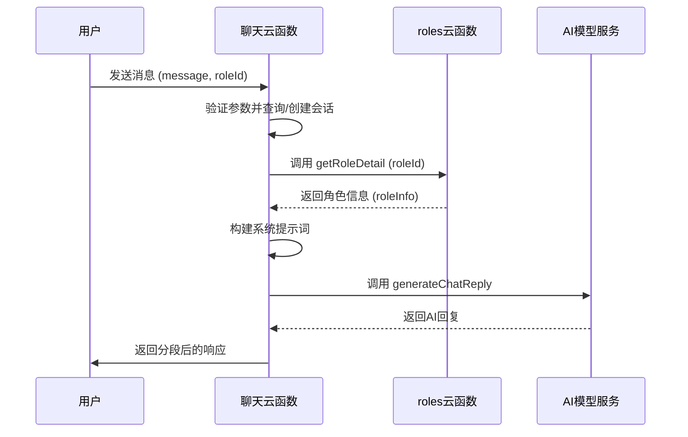
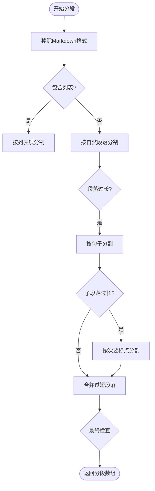
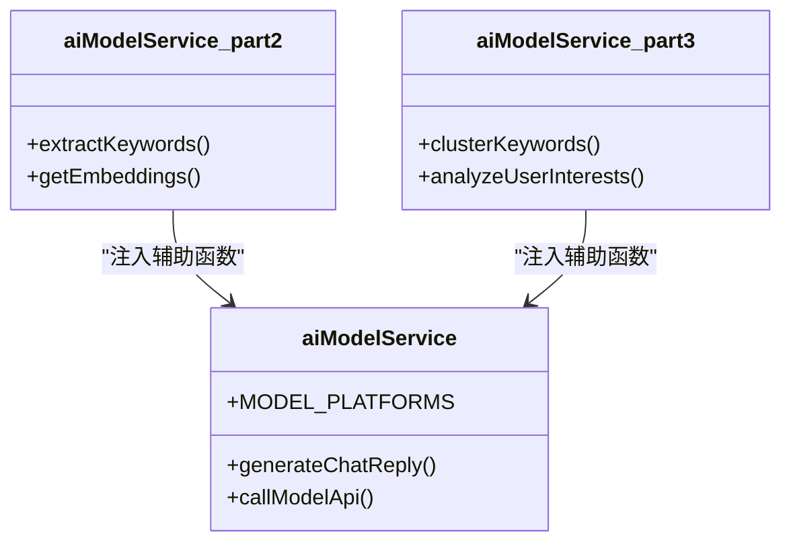

# 聊天云函数

<cite>
**本文档引用的文件**
- [index.js](file://cloudfunctions/chat/index.js)
- [aiModelService.js](file://cloudfunctions/chat/aiModelService.js)
- [roles/index.js](file://cloudfunctions/roles/index.js)
- [roles/promptGenerator.js](file://cloudfunctions/roles/promptGenerator.js)
</cite>

## 目录
1. [简介](#简介)
2. [核心流程解析](#核心流程解析)
3. [请求与响应结构](#请求与响应结构)
4. [流式响应与分段输出](#流式响应与分段输出)
5. [模块复用设计](#模块复用设计)
6. [错误处理指南](#错误处理指南)

## 简介
聊天云函数是HeartChat应用的核心组件，负责处理用户发送的聊天消息并生成AI响应。该函数通过集成Gemini和智谱AI等大模型，结合角色设定与记忆状态，为用户提供个性化、上下文感知的对话体验。本文档详细解析了消息处理的完整流程，包括上下文构建、角色提示词注入、AI模型调用以及与roles云函数的协作机制。

## 核心流程解析

聊天云函数的核心流程始于用户发送消息，通过`sendMessage`子功能处理。该功能首先验证输入参数，包括`message`、`roleId`和`chatId`。若`chatId`不存在，则查询或创建新的聊天会话。随后，函数通过调用`getRoleInfo`获取角色信息，这是与roles云函数协作的关键步骤。

**图表来源**
- [index.js](file://cloudfunctions/chat/index.js#L500-L600)
- [roles/index.js](file://cloudfunctions/roles/index.js#L200-L300)

**本节来源**
- [index.js](file://cloudfunctions/chat/index.js#L500-L600)
- [roles/index.js](file://cloudfunctions/roles/index.js#L200-L300)

## 请求与响应结构

### 请求参数
聊天云函数接受以下主要请求参数：
- **message**: 用户发送的聊天内容，字符串类型。
- **roleId**: 角色ID，用于获取角色设定和记忆状态。
- **sessionId**: 会话ID，用于关联对话历史。
- **modelType**: 指定使用的AI模型类型（如gemini、zhipu）。
- **modelName**: 具体的模型名称。
- **modelParams**: 包含温度、最大token数等模型参数的对象。

### 响应结构
成功响应包含以下字段：
- **success**: 布尔值，表示操作是否成功。
- **content**: AI生成的完整回复内容。
- **segments**: 分段后的消息数组，用于流式输出。
- **emotionAnalysis**: 情感分析结果（当前为空，由专门的分析云函数处理）。
- **usage**: 令牌使用情况，包含`prompt_tokens`、`completion_tokens`和`total_tokens`。
- **modelType**: 使用的模型类型。
- **timestamp**: 响应生成的时间戳。

**本节来源**
- [index.js](file://cloudfunctions/chat/index.js#L550-L580)

## 流式响应与分段输出

为了模拟真实的人类聊天行为，聊天云函数实现了消息分段输出功能。`splitMessage`函数负责将AI生成的长回复拆分为多个短小的段落。该函数首先移除Markdown格式，然后根据最大段落长度（150字符）和最小段落长度（20字符）进行智能分割。

分割逻辑优先按自然段落（空行）分割，若无自然段落则按句子（中文句号、问号、感叹号）分割，最后按次要标点（中文逗号、分号）分割。对于过长的段落，还会尝试按空格或字符数进行强制分割。最终，函数会合并过短的段落，使分段更自然。

**图表来源**
- [index.js](file://cloudfunctions/chat/index.js#L20-L150)

**本节来源**
- [index.js](file://cloudfunctions/chat/index.js#L20-L150)

## 模块复用设计

聊天模块和分析模块均复用了`aiModelService`设计，但调用方式存在差异。聊天模块的`aiModelService.js`专注于生成聊天回复，其`generateChatReply`函数构建包含系统提示词、历史消息和用户消息的消息数组，并调用指定的AI模型。

分析模块的`aiModelService.js`则分为多个子模块，通过`aiModelService_part2.js`和`aiModelService_part3.js`分别处理关键词提取、词向量生成、聚类分析和用户兴趣分析。这种设计实现了功能的模块化和复用，同时保持了各自领域的专业性。

**图表来源**
- [aiModelService.js](file://cloudfunctions/chat/aiModelService.js#L200-L300)
- [aiModelService_part2.js](file://cloudfunctions/analysis/aiModelService_part2.js#L50-L100)
- [aiModelService_part3.js](file://cloudfunctions/analysis/aiModelService_part3.js#L50-L100)

**本节来源**
- [aiModelService.js](file://cloudfunctions/chat/aiModelService.js#L200-L300)
- [aiModelService_part2.js](file://cloudfunctions/analysis/aiModelService_part2.js#L50-L100)
- [aiModelService_part3.js](file://cloudfunctions/analysis/aiModelService_part3.js#L50-L100)

## 错误处理指南

聊天云函数实现了全面的错误处理机制。对于模型超时，`callModelApi`函数设置了20秒（Claude模型为30秒）的超时时间，并在超时后抛出“连接超时”错误。对于API密钥无效，函数会捕获401或403状态码并提示“API密钥无效”。

敏感词过滤等异常场景由前端或专门的分析云函数处理，聊天云函数本身不直接处理。当AI模型调用失败时，函数会记录详细的错误日志，并返回包含错误信息的响应，确保前端能够正确处理异常情况。

**本节来源**
- [aiModelService.js](file://cloudfunctions/chat/aiModelService.js#L400-L500)
- [index.js](file://cloudfunctions/chat/index.js#L580-L600)