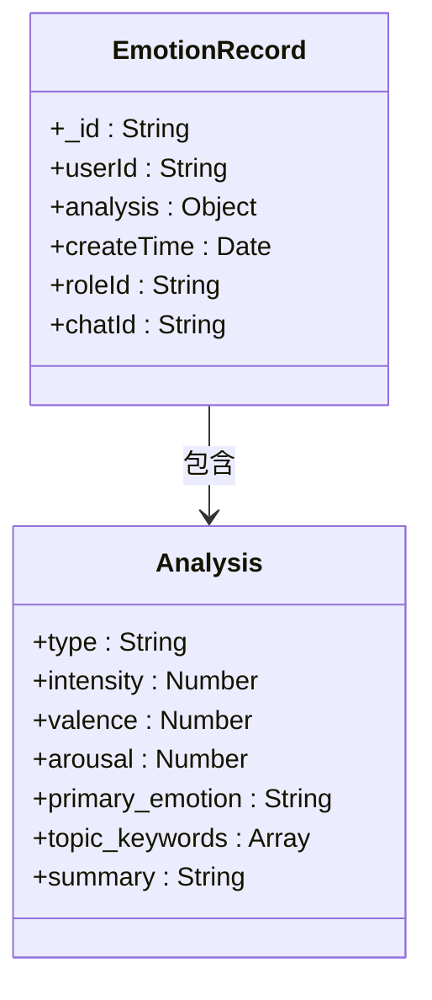
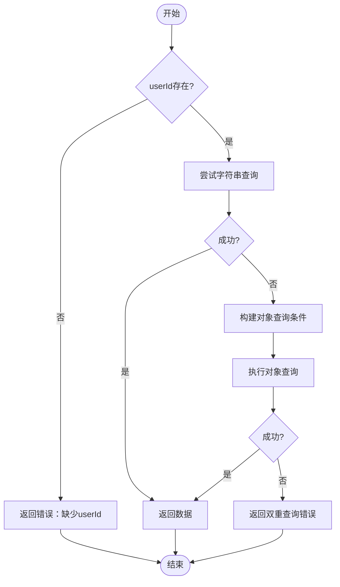
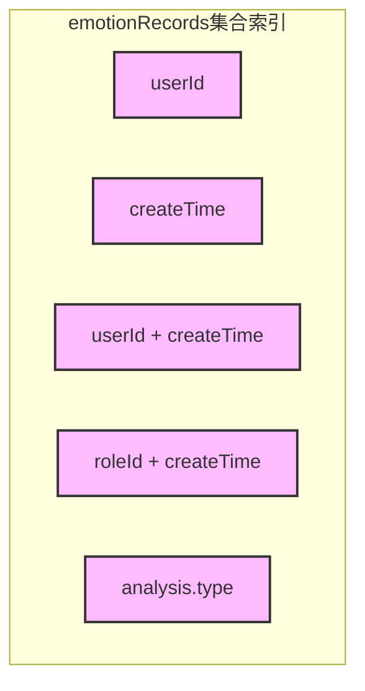

# 获取情绪记录云函数

<cite>
**本文档引用文件**  
- [index.js](file://cloudfunctions/getEmotionRecords/index.js)
- [emotionRecords.md](file://doc/开发文档/database/emotionRecords.md)
- [createIndexes.js](file://cloudfunctions/user/createIndexes.js)
- [emotionService.js](file://miniprogram/services/emotionService.js)
</cite>

## 目录
1. [简介](#简介)
2. [请求参数解析](#请求参数解析)
3. [响应结构定义](#响应结构定义)
4. [数据库查询逻辑](#数据库查询逻辑)
5. [索引与性能优化](#索引与性能优化)
6. [数据聚合与统计](#数据聚合与统计)
7. [前端交互场景示例](#前端交互场景示例)
8. [大数据量性能策略](#大数据量性能策略)
9. [结论](#结论)

## 简介
`getEmotionRecords` 云函数用于查询用户的历史情绪数据，支持按用户ID、角色ID进行筛选，并返回指定数量的记录。该函数是情绪历史界面和每日报告生成的核心数据来源，确保用户能够追踪其情绪变化趋势。

## 请求参数解析

该云函数接收以下参数：

- **userId**：用户唯一标识（必填）
- **roleId**：角色ID（可选），用于筛选特定角色下的情绪记录
- **limit**：每页记录数，默认为20条

参数通过 `event` 对象传递，在函数入口处解构获取。若未提供 `userId`，将返回错误提示。

**Section sources**
- [index.js](file://cloudfunctions/getEmotionRecords/index.js#L15-L25)

## 响应结构定义

成功响应包含以下字段：

- **success**：布尔值，表示请求是否成功
- **data**：情绪记录数组，每条记录包含：
  - `_id`：记录ID
  - `userId`：用户ID
  - `analysis`：情感分析对象（含类型、强度、关键词等）
  - `createTime`：创建时间
  - `roleId`、`chatId`：关联的角色与聊天会话ID
- **openid/appid/unionid**：微信上下文信息

错误响应包含 `success: false` 及错误详情。



**Diagram sources**
- [emotionRecords.md](file://doc/开发文档/database/emotionRecords.md#L7-L61)

## 数据库查询逻辑

云函数采用双重查询策略以提高兼容性：

1. **字符串查询**：构建 `userId=="xxx" && roleId=="yyy"` 形式的字符串条件进行查询。
2. **对象查询**：若字符串查询失败，则使用JavaScript对象作为查询条件（如 `{ userId: 'xxx', roleId: 'yyy' }`）。

查询结果按 `createTime` 降序排列，并限制返回数量。此设计增强了对不同数据库版本的兼容性。



**Diagram sources**
- [index.js](file://cloudfunctions/getEmotionRecords/index.js#L30-L90)

## 索引与性能优化

为提升查询效率，系统已在 `emotionRecords` 集合上创建多个索引：

- **复合索引**：`userId + createTime`（降序）——用于高效分页查询
- **复合索引**：`roleId + createTime`
- **单字段索引**：`analysis.type`——支持按情感类型筛选

这些索引在 `createIndexes.js` 中定义并初始化，确保在大数据量下仍能保持快速响应。



**Diagram sources**
- [createIndexes.js](file://cloudfunctions/user/createIndexes.js#L151-L180)

## 数据聚合与统计

虽然 `getEmotionRecords` 本身不直接执行聚合，但其返回的数据可用于前端或其它云函数（如 `generateDailyReports`）进行数据聚合分析，例如：

- **按日/周统计平均情绪值**：基于 `createTime` 分组，计算每日/每周的平均 `intensity` 或 `valence`
- **情绪分布统计**：统计各类情绪（喜悦、焦虑等）出现频率
- **关键词热度分析**：汇总 `topic_keywords` 出现次数，识别高频话题

此类聚合通常在客户端或报告生成服务中完成。

**Section sources**
- [emotionService.js](file://miniprogram/services/emotionService.js#L700-L799)

## 前端交互场景示例

### 分页加载
```javascript
// 获取第一页数据
wx.cloud.callFunction({
  name: 'getEmotionRecords',
  data: { userId, limit: 20 }
}).then(res => {
  this.setData({ emotionList: res.result.data });
});

// 加载更多
wx.cloud.callFunction({
  name: 'getEmotionRecords',
  data: { userId, limit: 20 }
}).then(res => {
  this.setData({ emotionList: [...this.data.emotionList, ...res.result.data] });
});
```

### 下拉刷新
```javascript
onPullDownRefresh() {
  wx.cloud.callFunction({
    name: 'getEmotionRecords',
    data: { userId, limit: 20 }
  }).then(res => {
    this.setData({ emotionList: res.result.data });
    wx.stopPullDownRefresh();
  });
}
```

**Section sources**
- [emotionService.js](file://miniprogram/services/emotionService.js#L500-L599)

## 大数据量性能策略

针对大数据量场景，建议采用以下优化策略：

1. **预聚合机制**：定期将原始情绪记录按日/周聚合，生成统计摘要存入 `userReports` 表，减少实时计算压力。
2. **缓存机制**：使用 Redis 或本地缓存存储近期查询结果，避免重复查询数据库。
3. **分页与懒加载**：前端采用分页或无限滚动，避免一次性加载过多数据。
4. **归档旧数据**：将超过一定时间的历史记录归档至低成本存储，保留近期活跃数据供高频访问。

这些策略可显著提升系统响应速度与用户体验。

**Section sources**
- [emotionRecords.md](file://doc/开发文档/database/emotionRecords.md#L100-L110)

## 结论
`getEmotionRecords` 云函数通过灵活的查询机制和索引优化，高效支持用户情绪历史数据的获取。结合前端分页、下拉刷新等交互设计，以及后端的数据预聚合与缓存策略，系统能够在保证性能的同时，提供丰富的情绪分析功能，助力用户进行心理健康追踪与自我认知提升。