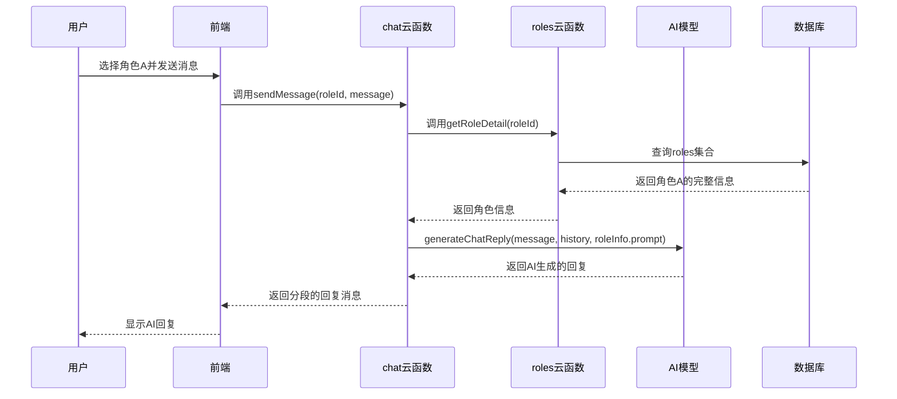

# 获取角色信息云函数

<cite>
**本文档引用的文件**  
- [index.js](file://cloudfunctions/getRoleInfo/index.js)
- [getRoleInfo.md](file://doc/开发文档/cloudfunctions/getRoleInfo.md)
- [roles.md](file://doc/开发文档/database/roles.md)
- [roles/index.js](file://cloudfunctions/roles/index.js)
- [chat/index.js](file://cloudfunctions/chat/index.js)
</cite>

## 目录
1. [简介](#简介)
2. [核心功能与作用](#核心功能与作用)
3. [输入参数与输出结构](#输入参数与输出结构)
4. [典型调用场景：为AI对话提供上下文](#典型调用场景为ai对话提供上下文)
5. [权限控制机制](#权限控制机制)
6. [缓存策略分析](#缓存策略分析)
7. [错误处理与健壮性](#错误处理与健壮性)
8. [性能与优化建议](#性能与优化建议)

## 简介

`getRoleInfo` 云函数是 HeartChat 应用中一个关键的数据查询服务，专门用于根据角色ID（`roleId`）从数据库中读取角色的详细信息。该函数是前端界面展示角色详情、初始化AI对话会话以及实现个性化交互体验的核心数据支撑。它通过简洁的接口设计，实现了对角色基础信息、提示词模板及配置的高效查询，为上层业务逻辑提供了稳定可靠的数据源。

**Section sources**
- [getRoleInfo.md](file://doc/开发文档/cloudfunctions/getRoleInfo.md#L1-L10)

## 核心功能与作用

`getRoleInfo` 云函数的核心作用是作为**角色信息查询服务**，其主要功能是根据传入的 `roleId` 参数，从名为 `roles` 的数据库集合中精确查询并返回对应角色的完整数据记录。

该函数的处理流程遵循清晰的步骤：
1.  **接收请求**：接收来自小程序前端或其他云函数的调用请求。
2.  **参数验证**：首先检查请求中是否包含必需的 `roleId` 参数，若缺失则立即返回错误。
3.  **数据库查询**：使用 `roleId` 作为查询条件，向 `roles` 集合发起查询请求。
4.  **结果检查**：验证数据库返回的结果是否有效且包含数据。
5.  **数据返回**：若查询成功，则将角色的完整数据封装在响应中返回；若失败，则返回相应的错误信息。

此函数的设计确保了角色数据读取的高效性和准确性，是整个角色系统数据流动的起点。

```mermaid
flowchart TD
A[接收请求] --> B{参数验证<br/>roleId是否存在?}
B --> |否| C[返回错误<br/>缺少必要参数]
B --> |是| D[查询数据库<br/>roles集合]
D --> E{查询结果<br/>是否为空?}
E --> |是| F[返回错误<br/>未找到角色信息]
E --> |否| G[返回角色数据<br/>data: result.data[0]]
C --> H[结束]
F --> H
G --> H
```

**Diagram sources**
- [index.js](file://cloudfunctions/getRoleInfo/index.js#L15-L45)

**Section sources**
- [index.js](file://cloudfunctions/getRoleInfo/index.js#L1-L50)
- [getRoleInfo.md](file://doc/开发文档/cloudfunctions/getRoleInfo.md#L1-L71)

## 输入参数与输出结构

### 输入参数

`getRoleInfo` 函数的输入是一个JSON对象，其核心参数如下：

- **`roleId`** (string, 必需): 角色的唯一标识符，即数据库中 `roles` 集合的 `_id` 字段。这是函数执行查询的唯一依据。

### 输出结构

函数的输出也是一个JSON对象，其结构根据执行结果分为成功和失败两种情况。

#### 成功响应
当查询成功时，返回的数据结构如下：
```json
{
  "success": true,
  "data": { /* 角色详细信息对象 */ },
  "openid": "用户openid"
}
```
其中，`data` 字段包含从数据库中查询到的完整角色对象，其核心字段包括：
- **`_id`**: 角色ID。
- **`name`**: 角色名称。
- **`avatar`**: 角色头像URL。
- **`personality`**: 角色性格特点（数组）。
- **`prompt` / `system_prompt`**: 角色的提示词模板，这是AI进行对话的核心指令。
- **`memories`**: 角色的记忆配置（数组），用于长期记忆。
- **`user_perception`**: 用户画像信息，用于个性化交互。
- 其他元数据如 `category`, `description`, `createTime` 等。

#### 失败响应
当发生错误时，返回的数据结构如下：
```json
{
  "success": false,
  "error": "错误信息描述",
  "openid": "用户openid"
}
```
常见的错误信息包括：
- `"缺少必要参数: roleId"`：请求中未提供 `roleId`。
- `"未找到角色信息"`：数据库中不存在指定ID的角色。
- 其他系统错误信息。

**Section sources**
- [getRoleInfo.md](file://doc/开发文档/cloudfunctions/getRoleInfo.md#L72-L135)
- [roles.md](file://doc/开发文档/database/roles.md#L1-L123)

## 典型调用场景为ai对话提供上下文

`getRoleInfo` 函数最典型的调用场景是在用户发起与AI角色的聊天时，为 `chat` 云函数提供必要的上下文基础。

虽然 `chat` 云函数本身通过调用 `roles` 云函数的 `getRoleDetail` 动作来获取角色信息，但 `getRoleInfo` 的设计和功能与之高度一致，共同服务于这一核心场景。其工作流程如下：

1.  **用户选择角色**：用户在前端界面选择一个角色开始聊天。
2.  **发起聊天请求**：前端调用 `chat` 云函数的 `sendMessage` 功能，并传入 `roleId`。
3.  **获取角色信息**：`chat` 云函数内部会调用 `roles` 云函数（其 `getRoleDetail` 功能与 `getRoleInfo` 功能逻辑相同）来获取该 `roleId` 对应的完整角色信息。
4.  **构建AI上下文**：`chat` 云函数将获取到的角色信息，特别是 `prompt` 和 `system_prompt` 字段，作为系统提示词（system prompt）传递给AI模型（如Gemini或GLM）。
5.  **生成AI回复**：AI模型根据系统提示词中定义的角色性格、背景和说话风格，生成符合角色设定的回复。



**Diagram sources**
- [chat/index.js](file://cloudfunctions/chat/index.js#L719-L766)
- [roles/index.js](file://cloudfunctions/roles/index.js#L100-L135)

**Section sources**
- [chat/index.js](file://cloudfunctions/chat/index.js#L719-L766)
- [roles/index.js](file://cloudfunctions/roles/index.js#L100-L135)

## 权限控制机制

`getRoleInfo` 云函数本身在代码层面没有实现复杂的权限过滤逻辑，它会返回查询到的完整角色数据。然而，系统的权限控制是通过另一个更高级的云函数 `roles` 来实现的，这确保了用户只能访问他们有权查看的角色。

具体机制如下：
1.  **角色创建者标识**：每个角色在创建时都会记录其 `creator` 字段，该字段的值为创建者的 `openid`。
2.  **查询条件过滤**：当调用 `roles` 云函数的 `getRoles` 功能获取角色列表时，其查询条件（query）被设计为：
    ```javascript
    query = {
      $or: [
        { creator: 'system' }, // 允许访问所有系统角色
        { creator: openid }    // 允许访问当前用户自己创建的角色
      ]
    }
    ```
3.  **权限隔离**：这意味着普通用户在获取角色列表时，只能看到系统预设的角色和自己创建的角色，而无法看到其他用户创建的私有角色。

因此，虽然 `getRoleInfo` 可以查询任何角色，但前端应用通常会先通过 `getRoles` 获取一个经过权限过滤的角色列表，然后用户只能从这个安全的列表中选择角色，从而间接保证了 `getRoleInfo` 查询的数据始终是用户有权访问的。

**Section sources**
- [roles/index.js](file://cloudfunctions/roles/index.js#L38-L87)
- [getRoleInfo.md](file://doc/开发文档/cloudfunctions/getRoleInfo.md#L137-L142)

## 缓存策略分析

尽管 `getRoleInfo` 云函数本身没有集成缓存，但系统的整体设计强烈建议并支持对角色信息进行缓存，以减轻数据库压力并提升用户体验。

**缓存策略体现在以下层面：**
1.  **开发文档建议**：`getRoleInfo.md` 文档明确提出了“**缓存机制**：对热门角色信息进行缓存”的扩展建议。
2.  **前端实现**：小程序前端代码中已实现了角色信息的缓存逻辑。例如，在 `emotion-history.js` 和 `role-select.js` 中，都使用了 `wx.getStorageSync` 和 `wx.setStorageSync` 将角色信息（`roleCache`）存储在本地缓存中，并设置了30分钟的过期时间。前端会优先从本地缓存读取角色信息，只有在缓存中不存在时才调用云函数。
3.  **批量查询优化**：前端代码（如 `home.js`）展示了通过数据库的 `_.in()` 操作符一次性批量查询多个角色信息的模式，这本身就是一种减少网络请求次数的优化，与缓存策略相辅相成。

这种客户端缓存策略有效地减少了对云函数和数据库的直接调用频率，特别是对于频繁访问的系统角色或用户常用角色，显著提升了应用的响应速度和性能。

**Section sources**
- [getRoleInfo.md](file://doc/开发文档/cloudfunctions/getRoleInfo.md#L137-L142)
- [emotion-history.js](file://miniprogram/packageEmotion/pages/emotion-history/emotion-history.js#L1046-L1088)
- [role-select.js](file://miniprogram/pages/role-select/role-select.js#L116-L145)

## 错误处理与健壮性

`getRoleInfo` 云函数具备完善的错误处理机制，确保了服务的健壮性。

其错误处理覆盖了以下几种情况：
1.  **参数验证错误**：在函数执行初期，会检查 `roleId` 是否存在。如果缺失，会立即返回一个结构化的错误响应，明确指出 `"缺少必要参数: roleId"`。
2.  **查询结果错误**：如果数据库查询成功但返回的结果为空（即未找到对应ID的角色），函数会返回 `"未找到角色信息"` 的错误。
3.  **系统异常**：函数使用 `try...catch` 语句包裹了整个数据库查询过程。任何未预期的异常（如数据库连接问题）都会被捕获，并将错误的详细信息（`error.message`）返回给调用方，便于问题排查。

这种分层的错误处理方式，使得调用方能够根据返回的 `success` 字段和 `error` 字段，准确地判断操作结果并进行相应的用户提示或重试逻辑。

**Section sources**
- [index.js](file://cloudfunctions/getRoleInfo/index.js#L25-L45)
- [getRoleInfo.md](file://doc/开发文档/cloudfunctions/getRoleInfo.md#L100-L135)

## 性能与优化建议

`getRoleInfo` 函数在性能方面表现良好，主要得益于其简单的查询逻辑。

**性能优势：**
- **高效查询**：直接根据主键 `_id` 进行查询，数据库可以利用索引实现O(1)时间复杂度的查找，效率极高。
- **数据量小**：每次只返回单个角色的数据，避免了大量数据的传输。

**优化建议：**
1.  **实施缓存**：如前所述，强烈建议在客户端或服务端（如Redis）实现缓存层，特别是对于访问频率高的系统角色。
2.  **字段过滤**：在某些场景下，前端可能只需要角色的名称和头像，而不需要完整的 `prompt` 或 `memories`。可以考虑扩展API，支持按需返回特定字段，以减少网络传输量。
3.  **使用统计**：可以结合 `roleUsage` 集合，更新角色的使用次数和最后使用时间，为推荐系统和热门角色分析提供数据支持。

**Section sources**
- [getRoleInfo.md](file://doc/开发文档/cloudfunctions/getRoleInfo.md#L120-L135)
- [user/createIndexes.js](file://cloudfunctions/user/createIndexes.js#L52-L108)