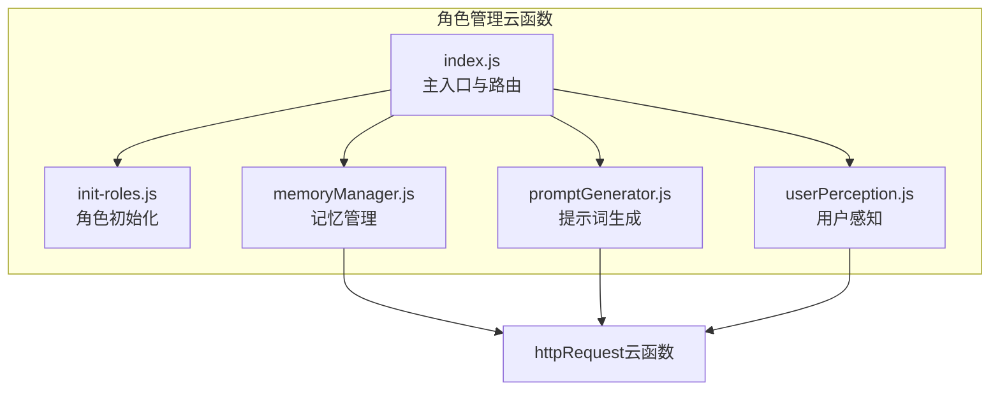
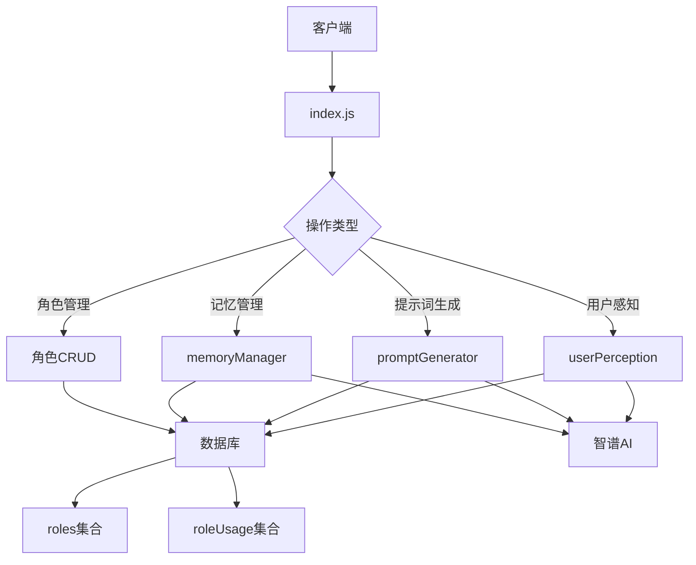
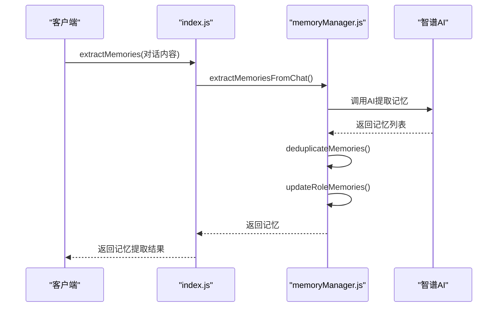
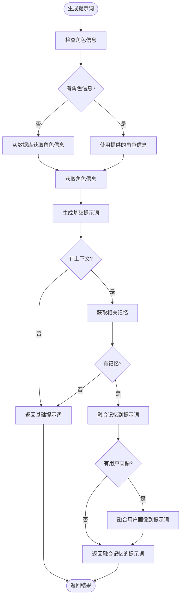
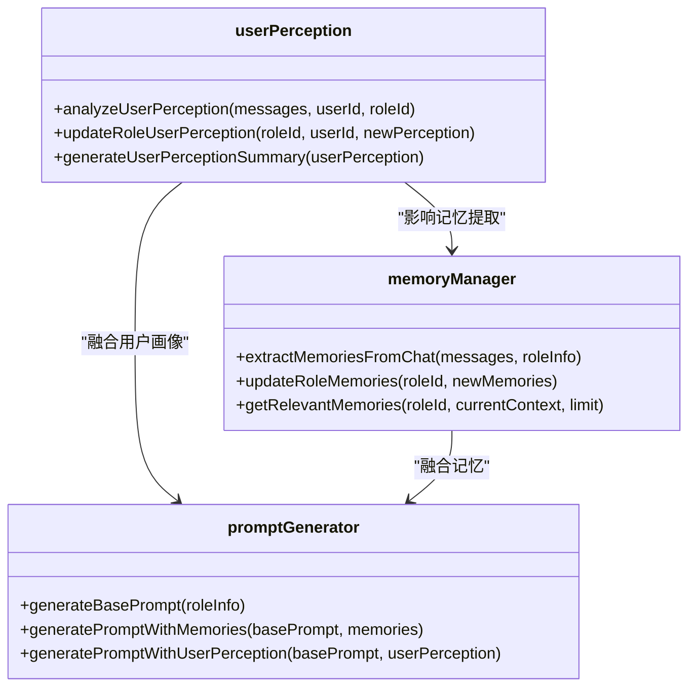
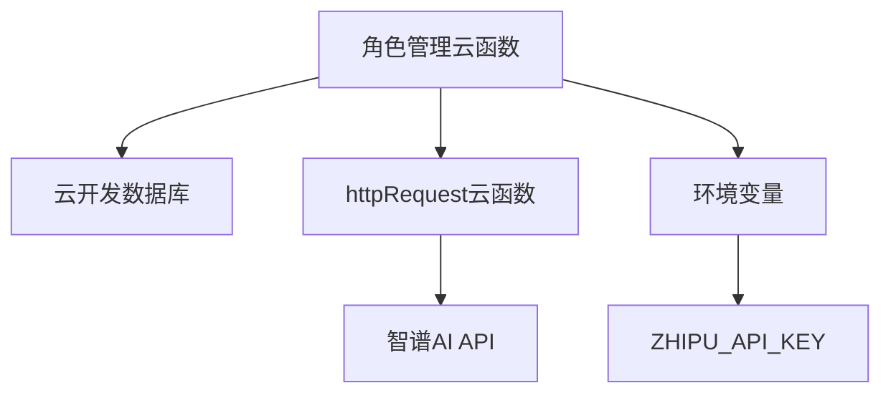

# 角色管理云函数

<cite>
**本文档引用的文件**
- [index.js](file://cloudfunctions/roles/index.js)
- [init-roles.js](file://cloudfunctions/roles/init-roles.js)
- [memoryManager.js](file://cloudfunctions/roles/memoryManager.js)
- [promptGenerator.js](file://cloudfunctions/roles/promptGenerator.js)
- [userPerception.js](file://cloudfunctions/roles/userPerception.js)
- [roles.md](file://doc/开发文档/cloudfunctions/roles.md)
- [roles.md](file://doc/开发文档/database/roles.md)
- [roleUsage.md](file://doc/开发文档/database/roleUsage.md)
- [roles云函数使用文档.md](file://doc/使用文档/roles云函数使用文档.md)
</cite>

## 目录
1. [引言](#引言)
2. [项目结构](#项目结构)
3. [核心组件](#核心组件)
4. [架构概述](#架构概述)
5. [详细组件分析](#详细组件分析)
6. [依赖分析](#依赖分析)
7. [性能考虑](#性能考虑)
8. [故障排除指南](#故障排除指南)
9. [结论](#结论)

## 引言
角色管理云函数是HeartChat应用中AI角色生命周期管理的核心模块。该系统通过一系列云函数实现了角色的创建、查询、编辑、删除等全生命周期管理功能，并集成了长期记忆机制、用户画像感知和智能提示词生成等高级AI功能。本系统旨在为用户提供个性化的AI角色交互体验，通过记忆和用户画像的持续更新，使AI角色能够展现出更连贯、更个性化的对话能力。系统采用模块化设计，将角色管理、记忆管理、提示词生成和用户感知等功能分离，确保了代码的可维护性和扩展性。

## 项目结构
角色管理云函数位于`cloudfunctions/roles`目录下，包含多个功能模块文件。主入口文件`index.js`负责路由和分发请求，`init-roles.js`负责初始化预设角色，`memoryManager.js`实现长期记忆机制，`promptGenerator.js`负责生成高质量提示词，`userPerception.js`实现用户情绪感知功能。这些模块共同构成了一个完整的AI角色管理系统，通过调用智谱AI等外部API实现高级AI功能。

**Diagram sources**
- [index.js](file://cloudfunctions/roles/index.js)
- [init-roles.js](file://cloudfunctions/roles/init-roles.js)
- [memoryManager.js](file://cloudfunctions/roles/memoryManager.js)
- [promptGenerator.js](file://cloudfunctions/roles/promptGenerator.js)
- [userPerception.js](file://cloudfunctions/roles/userPerception.js)

**Section sources**
- [index.js](file://cloudfunctions/roles/index.js)
- [init-roles.js](file://cloudfunctions/roles/init-roles.js)
- [memoryManager.js](file://cloudfunctions/roles/memoryManager.js)
- [promptGenerator.js](file://cloudfunctions/roles/promptGenerator.js)
- [userPerception.js](file://cloudfunctions/roles/userPerception.js)

## 核心组件
角色管理云函数的核心组件包括角色生命周期管理、长期记忆机制、用户画像感知和智能提示词生成。`index.js`作为主入口文件，实现了角色的CRUD操作和权限验证，同时集成了AI分析功能。`memoryManager.js`实现了从对话中提取记忆、合并记忆和检索相关记忆的功能，通过调用智谱AI接口实现高级记忆处理。`promptGenerator.js`负责生成和优化角色提示词，将角色设定、用户画像和记忆信息融合到提示词中。`userPerception.js`实现了从对话中分析用户画像、更新角色用户画像和生成用户画像摘要的功能。这些组件协同工作，共同构建了一个智能化的AI角色管理系统。

**Section sources**
- [index.js](file://cloudfunctions/roles/index.js)
- [memoryManager.js](file://cloudfunctions/roles/memoryManager.js)
- [promptGenerator.js](file://cloudfunctions/roles/promptGenerator.js)
- [userPerception.js](file://cloudfunctions/roles/userPerception.js)

## 架构概述
角色管理云函数采用分层架构设计，分为接口层、业务逻辑层和数据访问层。接口层由`index.js`实现，负责接收和分发请求。业务逻辑层由`memoryManager.js`、`promptGenerator.js`和`userPerception.js`等模块组成，实现具体的业务逻辑。数据访问层通过云开发数据库API与`roles`和`roleUsage`集合进行交互。系统通过调用`httpRequest`云函数与智谱AI等外部API进行通信，实现AI分析功能。这种分层设计确保了系统的可维护性和扩展性，同时通过模块化设计实现了功能的解耦。

**Diagram sources**
- [index.js](file://cloudfunctions/roles/index.js)
- [memoryManager.js](file://cloudfunctions/roles/memoryManager.js)
- [promptGenerator.js](file://cloudfunctions/roles/promptGenerator.js)
- [userPerception.js](file://cloudfunctions/roles/userPerception.js)
- [roles.md](file://doc/开发文档/database/roles.md)
- [roleUsage.md](file://doc/开发文档/database/roleUsage.md)

## 详细组件分析

### 角色生命周期管理分析
角色生命周期管理功能由`index.js`中的多个子功能实现，包括获取角色列表、获取角色详情、创建角色、更新角色、删除角色等。系统通过`openid`进行权限验证，确保用户只能管理自己的角色。角色数据存储在`roles`集合中，包含角色名称、头像、分类、描述、性格特点、提示词等字段。系统还实现了角色使用统计功能，通过`roleUsage`集合记录用户对角色的使用情况。

**Section sources**
- [index.js](file://cloudfunctions/roles/index.js)
- [roles.md](file://doc/开发文档/database/roles.md)
- [roleUsage.md](file://doc/开发文档/database/roleUsage.md)

### 长期记忆机制分析
长期记忆机制由`memoryManager.js`实现，包括从对话中提取记忆、更新角色记忆和检索相关记忆三个核心功能。系统通过调用智谱AI接口从对话中提取重要信息作为记忆，每条记忆包含内容、重要性评分、类别和上下文等元数据。当记忆数量超过50条时，系统会自动进行合并和清理，保留最重要的记忆。记忆检索功能考虑了语义相关性、主题匹配度、情感一致性和时间相关性等多个因素，确保检索到最相关的记忆。

**Diagram sources**
- [memoryManager.js](file://cloudfunctions/roles/memoryManager.js)
- [index.js](file://cloudfunctions/roles/index.js)

**Section sources**
- [memoryManager.js](file://cloudfunctions/roles/memoryManager.js)
- [index.js](file://cloudfunctions/roles/index.js)

### 智能提示词生成分析
智能提示词生成功能由`promptGenerator.js`实现，包括生成基础提示词、融合记忆的提示词和融合用户画像的提示词。系统首先根据角色设定生成基础提示词，然后根据需要将记忆和用户画像信息融合到提示词中。提示词生成过程通过调用智谱AI接口实现，确保生成的提示词质量。系统还提供了本地融合方法作为AI调用失败时的后备方案，确保功能的可靠性。

**Diagram sources**
- [promptGenerator.js](file://cloudfunctions/roles/promptGenerator.js)

**Section sources**
- [promptGenerator.js](file://cloudfunctions/roles/promptGenerator.js)

### 用户画像感知分析
用户画像感知功能由`userPerception.js`实现，包括分析用户画像、更新角色用户画像和生成用户画像摘要。系统通过分析用户的对话内容，提取用户的兴趣、偏好、沟通风格和情感模式等信息。当新的对话内容产生时，系统会更新角色的用户画像，将新旧画像进行智能合并。用户画像摘要功能将复杂的用户画像数据转化为自然、友好的描述，可以在对话中自然地提及。

**Diagram sources**
- [userPerception.js](file://cloudfunctions/roles/userPerception.js)
- [memoryManager.js](file://cloudfunctions/roles/memoryManager.js)
- [promptGenerator.js](file://cloudfunctions/roles/promptGenerator.js)

**Section sources**
- [userPerception.js](file://cloudfunctions/roles/userPerception.js)

## 依赖分析
角色管理云函数依赖于云开发数据库、智谱AI API和httpRequest云函数。系统通过云开发数据库API与`roles`和`roleUsage`集合进行交互，存储和检索角色数据。通过调用智谱AI API实现高级AI功能，如记忆提取、提示词生成和用户画像分析。httpRequest云函数作为与外部API通信的中间层，确保了系统的安全性和可维护性。此外，系统还依赖于环境变量中的`ZHIPU_API_KEY`，用于认证智谱AI API调用。

**Diagram sources**
- [index.js](file://cloudfunctions/roles/index.js)
- [memoryManager.js](file://cloudfunctions/roles/memoryManager.js)
- [promptGenerator.js](file://cloudfunctions/roles/promptGenerator.js)
- [userPerception.js](file://cloudfunctions/roles/userPerception.js)

**Section sources**
- [index.js](file://cloudfunctions/roles/index.js)
- [memoryManager.js](file://cloudfunctions/roles/memoryManager.js)
- [promptGenerator.js](file://cloudfunctions/roles/promptGenerator.js)
- [userPerception.js](file://cloudfunctions/roles/userPerception.js)

## 性能考虑
为确保角色管理云函数的性能，系统实现了多项优化措施。记忆管理模块通过本地预过滤减少需要评估的记忆数量，提高检索效率。系统采用`glm-4-flash`等快速模型处理实时请求，确保响应速度。对于大量记忆的合并操作，系统采用分步处理策略，先按类别聚类再进行合并，避免一次性处理过多数据。此外，系统还实现了AI调用失败时的本地后备方案，确保功能的可靠性。建议进一步优化包括实现记忆分页加载、添加记忆过期清理机制和优化数据库索引。

**Section sources**
- [memoryManager.js](file://cloudfunctions/roles/memoryManager.js)
- [promptGenerator.js](file://cloudfunctions/roles/promptGenerator.js)
- [userPerception.js](file://cloudfunctions/roles/userPerception.js)

## 故障排除指南
在使用角色管理云函数时，可能遇到以下常见问题：AI API调用失败、记忆提取不准确、提示词生成质量不佳等。对于AI API调用失败，首先检查`ZHIPU_API_KEY`环境变量是否正确配置。对于记忆提取不准确，可以检查对话内容是否足够丰富，或调整记忆提取的提示词。对于提示词生成质量不佳，可以检查角色设定是否完整，或调整提示词生成的参数。系统日志记录了所有关键操作，可通过查看日志定位问题。建议定期监控云函数的执行时间和资源消耗，及时发现性能瓶颈。

**Section sources**
- [index.js](file://cloudfunctions/roles/index.js)
- [memoryManager.js](file://cloudfunctions/roles/memoryManager.js)
- [promptGenerator.js](file://cloudfunctions/roles/promptGenerator.js)
- [userPerception.js](file://cloudfunctions/roles/userPerception.js)

## 结论
角色管理云函数通过模块化设计和AI技术的深度集成，实现了AI角色的全生命周期管理。系统不仅提供了基本的角色CRUD功能，还通过长期记忆机制、用户画像感知和智能提示词生成等高级功能，显著提升了AI角色的对话连贯性和个性化水平。系统的分层架构和模块化设计确保了代码的可维护性和扩展性，为未来的功能扩展奠定了良好基础。通过持续优化和监控，系统能够为用户提供稳定、高效的AI角色交互体验。