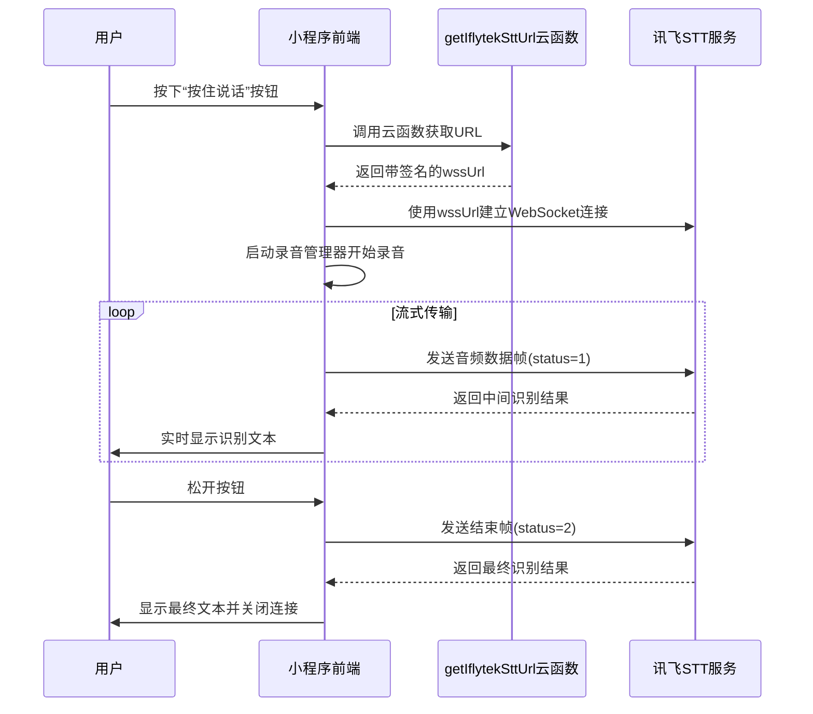
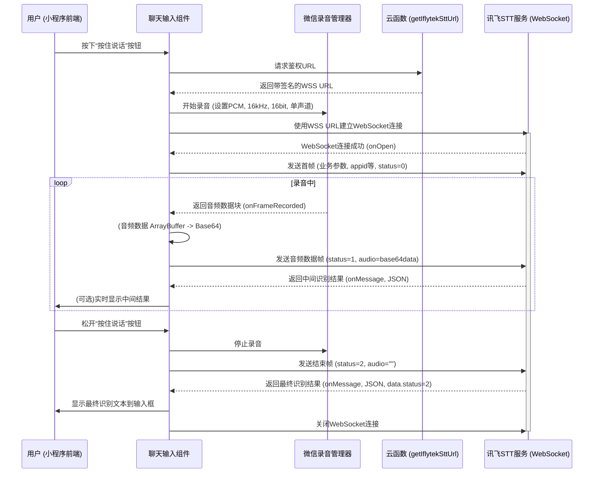

# 讯飞语音转文字URL获取云函数

<cite>
**本文档引用文件**  
- [index.js](file://cloudfunctions/getIflytekSttUrl/index.js)
- [voiceService.js](file://miniprogram/services/voiceService.js)
- [HeartChat 语音输入功能 (讯飞语音听写) 开发文档.md](file://doc/开发文档/HeartChat 语音输入功能 (讯飞语音听写) 开发文档.md)
</cite>

## 目录
1. [功能概述](#功能概述)
2. [云函数核心作用](#云函数核心作用)
3. [签名URL生成逻辑](#签名url生成逻辑)
4. [服务端生成URL的必要性](#服务端生成url的必要性)
5. [签名算法实现细节](#签名算法实现细节)
6. [参数有效期与错误处理](#参数有效期与错误处理)
7. [前端集成方式](#前端集成方式)
8. [连接稳定性与重连机制](#连接稳定性与重连机制)
9. [系统架构流程](#系统架构流程)

## 功能概述

本云函数 `getIflytekSttUrl` 是 HeartChat 小程序语音输入功能的核心组件，负责为前端生成带有安全签名的讯飞语音听写（STT）WebSocket 连接 URL。该函数确保了语音识别服务的安全调用，避免了敏感密钥在前端暴露的风险。

**Section sources**
- [HeartChat 语音输入功能 (讯飞语音听写) 开发文档.md](file://doc/开发文档/HeartChat 语音输入功能 (讯飞语音听写) 开发文档.md#L1-L30)

## 云函数核心作用

`getIflytekSttUrl` 云函数的主要职责是根据讯飞开放平台的 WebAPI 2.0 协议，生成一个包含有效签名的 WebSocket 安全连接地址（wssUrl）。该函数在用户触发语音输入时被调用，为前端提供一个临时、一次性、鉴权通过的连接凭证，使得前端能够与讯飞的语音识别服务建立安全的实时通信。

**Section sources**
- [index.js](file://cloudfunctions/getIflytekSttUrl/index.js#L1-L10)

## 签名URL生成逻辑

云函数通过以下步骤生成带签名的 URL：

1.  **获取配置**：从云函数的环境变量中读取 `APPID`、`API_SECRET` 和 `API_KEY`。
2.  **时间戳生成**：获取当前 UTC 时间，并格式化为 RFC1123 格式。
3.  **构造签名原串**：按照讯飞协议，拼接 `host`、`date` 和请求行（`GET /v2/iat HTTP/1.1`）。
4.  **生成签名**：使用 `API_SECRET` 对签名原串进行 HMAC-SHA256 加密，并将结果 Base64 编码。
5.  **构造授权头**：将 `API_KEY` 和生成的签名等信息组合成 `authorization_origin` 字符串，并再次进行 Base64 编码。
6.  **拼接最终URL**：将编码后的 `authorization`、`date` 和 `host` 参数拼接到 WebSocket 的基础地址上，形成最终的 `wssUrl`。

**Section sources**
- [index.js](file://cloudfunctions/getIflytekSttUrl/index.js#L25-L65)

## 服务端生成URL的必要性

必须在服务端（云函数）生成 URL 的核心原因是**安全性**。`API_SECRET` 是讯飞 API 的最高权限密钥，一旦在前端代码中暴露，任何第三方都可以盗用该密钥进行非法调用，导致服务被滥用、产生高额费用或被封禁。通过将密钥存储在云函数的环境变量中，前端仅能通过调用云函数来间接获取临时连接，从根本上杜绝了密钥泄露的风险。

**Section sources**
- [HeartChat 语音输入功能 (讯飞语音听写) 开发文档.md](file://doc/开发文档/HeartChat 语音输入功能 (讯飞语音听写) 开发文档.md#L190-L200)

## 签名算法实现细节

签名算法严格遵循讯飞官方文档的 HMAC-SHA256 鉴权流程：
- **加密算法**：使用 Node.js 内置的 `crypto` 模块进行 `HMAC-SHA256` 加密。
- **签名原串**：格式为 `host: ${host}\ndate: ${date}\nGET ${requestLine} HTTP/1.1`，其中换行符 `\n` 是关键。
- **编码**：第一次 Base64 编码的是 HMAC-SHA256 的加密结果，第二次 Base64 编码的是包含 `api_key` 和 `signature` 的授权字符串。
- **参数**：`host` 固定为 `iat-api.xfyun.cn`，`requestLine` 为 `/v2/iat`。

**Section sources**
- [index.js](file://cloudfunctions/getIflytekSttUrl/index.js#L40-L55)

## 参数有效期与错误处理

- **有效期**：生成的 `wssUrl` 中的 `date` 参数决定了其有效期。由于 URL 中包含了精确到秒的 UTC 时间戳，讯飞服务端会验证该时间戳是否在合理范围内（通常为几分钟内），过期的 URL 将无法建立连接。
- **错误处理**：
  - **配置错误**：如果环境变量中缺少 `APPID`、`API_SECRET` 或 `API_KEY`，函数会返回 `{ success: false, error: '语音服务配置错误' }`。
  - **运行时异常**：在签名计算或 URL 拼接过程中发生任何错误，函数会捕获异常并返回 `{ success: false, error: '生成语音服务连接失败' }`，同时在日志中记录详细错误信息。

**Section sources**
- [index.js](file://cloudfunctions/getIflytekSttUrl/index.js#L15-L24)
- [index.js](file://cloudfunctions/getIflytekSttUrl/index.js#L66-L70)

## 前端集成方式

前端通过 `audioRecorderManager.start({speechMode: true})` 启动语音识别的集成流程如下：

1.  **调用云函数**：在用户按下“按住说话”按钮时，调用 `wx.cloud.callFunction({ name: 'getIflytekSttUrl' })`。
2.  **获取连接凭证**：成功后，从返回结果中提取 `wssUrl` 和 `appid`。
3.  **建立WebSocket**：使用 `wx.connectSocket({ url: wssUrl })` 建立与讯飞服务的连接。
4.  **启动录音**：初始化 `wx.getRecorderManager()`，并调用 `recorderManager.start()` 开始录音，录音参数需设置为 `sampleRate: 16000`, `numberOfChannels: 1`, `format: 'pcm'`。
5.  **流式发送音频**：在 `recorderManager.onFrameRecorded` 回调中，将 `frameBuffer` 转换为 Base64 并通过 WebSocket 发送给讯飞服务器。
6.  **接收识别结果**：在 `socketTask.onMessage` 回调中解析讯飞返回的 JSON 数据，提取文本并实时显示。

**Diagram sources**
- [index.js](file://cloudfunctions/getIflytekSttUrl/index.js)
- [voiceService.js](file://miniprogram/services/voiceService.js)
- [HeartChat 语音输入功能 (讯飞语音听写) 开发文档.md](file://doc/开发文档/HeartChat 语音输入功能 (讯飞语音听写) 开发文档.md)

**Section sources**
- [voiceService.js](file://miniprogram/services/voiceService.js#L401-L442)
- [HeartChat 语音输入功能 (讯飞语音听写) 开发文档.md](file://doc/开发文档/HeartChat 语音输入功能 (讯飞语音听写) 开发文档.md#L115-L299)

## 连接稳定性与异常重连机制

为确保连接的稳定性，系统在前端实现了以下机制：
- **预热连接**：在建立 WebSocket 连接后，立即发送业务参数帧（`status=0`），并在开始录音前发送静音帧，帮助讯飞服务端预热，减少开头语音丢失。
- **错误监听**：全面监听 `recorderManager` 和 `socketTask` 的 `onError` 和 `onClose` 事件。
- **资源清理**：在发生错误或连接关闭时，立即调用 `closeSocketConnection()` 关闭连接，并重置相关状态。
- **异常重连**：当前端检测到连接失败或错误时，会提示用户并允许其重新尝试语音输入。由于每次调用 `getIflytekSttUrl` 都会生成一个新的、有效的 URL，因此重连机制本质上是通过重新获取 URL 来实现的。

**Section sources**
- [voiceService.js](file://miniprogram/services/voiceService.js#L250-L300)
- [voiceService.js](file://miniprogram/services/voiceService.js#L430-L485)

## 系统架构流程

整个语音输入功能的系统架构是一个典型的前后端协作模式。前端负责用户交互和音频采集，云函数负责安全鉴权，讯飞服务负责核心的语音识别。三者通过 WebSocket 协议实现实时、流式的语音转文字。

**Diagram sources**
- [HeartChat 语音输入功能 (讯飞语音听写) 开发文档.md](file://doc/开发文档/HeartChat 语音输入功能 (讯飞语音听写) 开发文档.md#L57-L113)