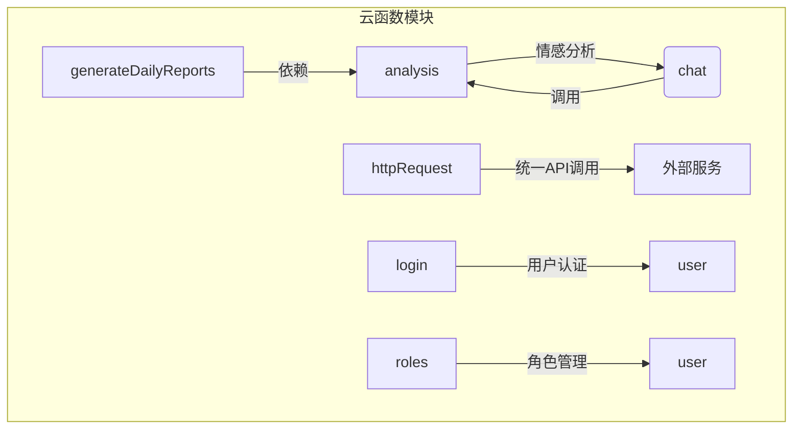
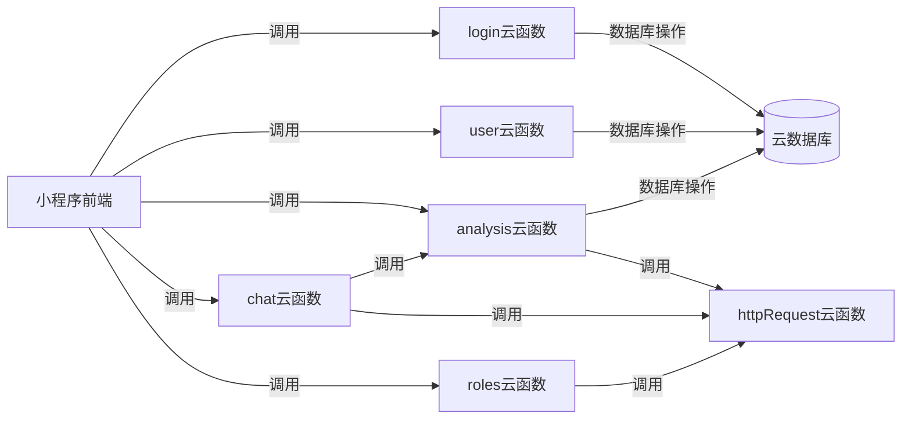
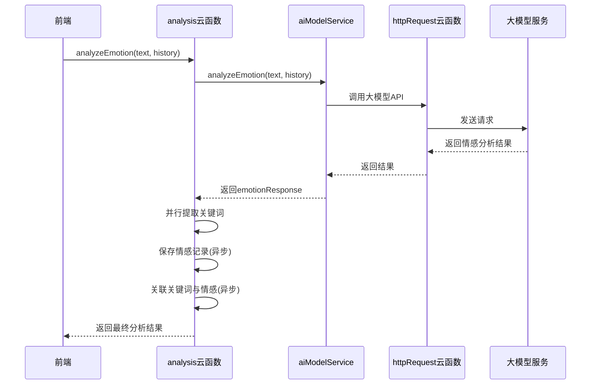
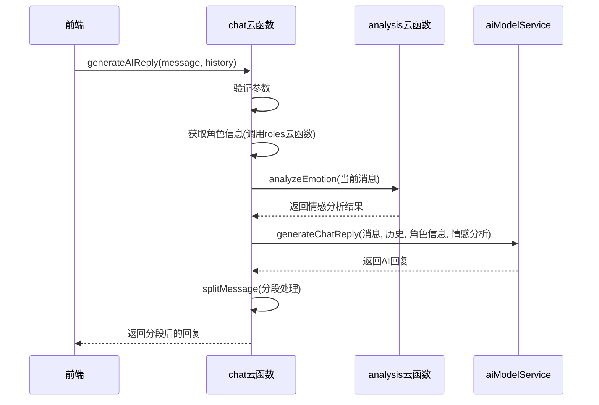
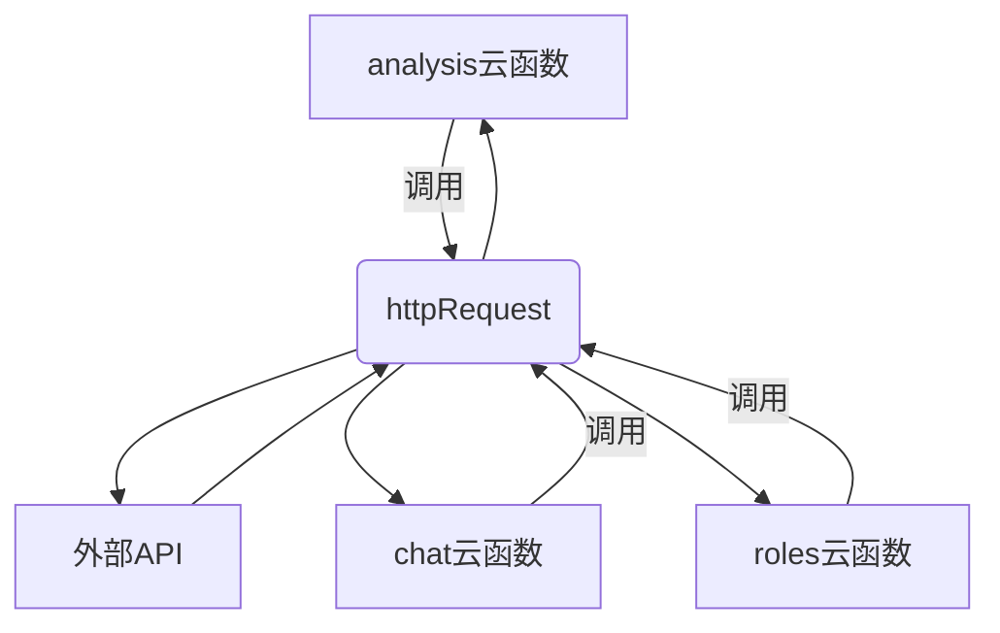
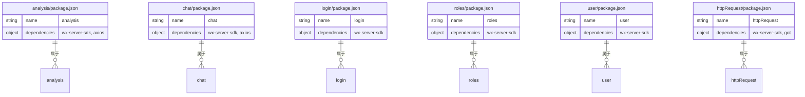

# 云函数设计

<cite>
**本文档中引用的文件**  
- [analysis/index.js](file://cloudfunctions/analysis/index.js)
- [analysis/package.json](file://cloudfunctions/analysis/package.json)
- [chat/index.js](file://cloudfunctions/chat/index.js)
- [chat/package.json](file://cloudfunctions/chat/package.json)
- [login/index.js](file://cloudfunctions/login/index.js)
- [login/package.json](file://cloudfunctions/login/package.json)
- [roles/index.js](file://cloudfunctions/roles/index.js)
- [roles/package.json](file://cloudfunctions/roles/package.json)
- [user/index.js](file://cloudfunctions/user/index.js)
- [user/package.json](file://cloudfunctions/user/package.json)
- [httpRequest/index.js](file://cloudfunctions/httpRequest/index.js)
- [httpRequest/package.json](file://cloudfunctions/httpRequest/package.json)
</cite>

## 目录
1. [简介](#简介)
2. [项目结构](#项目结构)
3. [核心组件](#核心组件)
4. [架构概览](#架构概览)
5. [详细组件分析](#详细组件分析)
6. [依赖分析](#依赖分析)
7. [性能考虑](#性能考虑)
8. [故障排除指南](#故障排除指南)
9. [结论](#结论)

## 简介
HeartChat 是一个基于云函数架构的智能心理健康对话系统，其后端逻辑通过多个独立部署的云函数实现模块化设计。本项目聚焦于核心云函数（如 analysis、chat、login、roles、user 等）的职责划分与协同工作。每个云函数都以 `index.js` 作为入口，接收前端请求并协调内部服务逻辑。例如，`analysis` 云函数整合 `aiModelService.js` 与 `keywordClassifier.js` 实现多阶段情感分析。系统通过 `httpRequest` 云函数统一处理外部 API 调用，确保安全与可维护性。各云函数拥有独立的 `package.json`，实现依赖隔离与 Node.js 运行时配置。本文档旨在深入解析其设计模式、调用关系与最佳实践。

## 项目结构
HeartChat 的云函数模块化设计清晰，每个功能单元独立封装，便于维护与扩展。核心云函数按业务功能划分，如情感分析、聊天交互、用户管理等，各自拥有独立的代码与依赖。

**图示来源**  
- [cloudfunctions](file://cloudfunctions)

**本节来源**  
- [cloudfunctions](file://cloudfunctions)

## 核心组件
HeartChat 的核心功能由一系列职责明确的云函数构成。`analysis` 函数负责情感与关键词分析，`chat` 函数处理对话逻辑，`login` 和 `user` 函数管理用户身份与数据，`roles` 函数控制角色行为，而 `httpRequest` 函数则作为所有外部 API 请求的统一出口。这些组件通过云函数调用机制协同工作，形成一个完整的智能对话系统。

**本节来源**  
- [analysis/index.js](file://cloudfunctions/analysis/index.js#L1-L50)
- [chat/index.js](file://cloudfunctions/chat/index.js#L1-L50)
- [login/index.js](file://cloudfunctions/login/index.js#L1-L20)
- [roles/index.js](file://cloudfunctions/roles/index.js#L1-L20)
- [user/index.js](file://cloudfunctions/user/index.js#L1-L20)

## 架构概览
HeartChat 采用微服务式的云函数架构，前端通过微信云开发 SDK 调用后端云函数。每个云函数是一个独立的执行单元，拥有自己的入口、业务逻辑和依赖。`analysis` 和 `chat` 等函数通过调用 `httpRequest` 来与智谱AI、Google Gemini 等外部大模型服务通信，避免了在前端暴露敏感的 API 密钥。`login` 云函数处理用户登录，`user` 云函数管理用户资料，`roles` 云函数则负责角色的初始化与记忆管理。

**图示来源**  
- [analysis/index.js](file://cloudfunctions/analysis/index.js#L1-L100)
- [chat/index.js](file://cloudfunctions/chat/index.js#L1-L100)
- [httpRequest/index.js](file://cloudfunctions/httpRequest/index.js#L1-L20)

## 详细组件分析
本节将深入分析 HeartChat 的关键云函数，揭示其内部实现机制、调用流程和设计模式。

### analysis 云函数分析
`analysis` 云函数是 HeartChat 的情感分析核心，负责处理文本的情绪识别、关键词提取和用户兴趣分析。它通过 `index.js` 的多个导出函数（如 `analyzeEmotion`、`extractTextKeywords`）对外提供服务。

#### 情感分析流程

**图示来源**  
- [analysis/index.js](file://cloudfunctions/analysis/index.js#L100-L300)
- [analysis/aiModelService.js](file://cloudfunctions/analysis/aiModelService.js#L1-L50)

#### 模块化服务整合
`analysis` 云函数通过模块化设计整合了多个内部服务：
- `aiModelService.js`：提供统一的 AI 模型调用接口，支持智谱AI和Google Gemini。
- `keywordClassifier.js`：对提取的关键词进行分类。
- `keywordEmotionLinker.js`：将关键词与情感进行关联分析。
- `userInterestAnalyzer.js`：基于历史数据生成用户兴趣报告。

这种设计实现了高内聚、低耦合，便于功能扩展和维护。

**本节来源**  
- [analysis/index.js](file://cloudfunctions/analysis/index.js#L1-L1117)
- [analysis/aiModelService.js](file://cloudfunctions/analysis/aiModelService.js#L1-L100)
- [analysis/keywordClassifier.js](file://cloudfunctions/analysis/keywordClassifier.js#L1-L50)

### chat 云函数分析
`chat` 云函数负责处理聊天消息的发送、历史记录获取和 AI 回复生成。它与 `analysis` 云函数存在直接调用关系，以实现情绪感知的智能回复。

#### AI回复生成流程

**图示来源**  
- [chat/index.js](file://cloudfunctions/chat/index.js#L300-L600)
- [analysis/index.js](file://cloudfunctions/analysis/index.js#L100-L200)

#### 聊天记录管理
`chat` 云函数还负责聊天记录的持久化。`saveChatHistory` 函数将聊天会话元数据保存到 `chats` 集合，而具体的消息内容则保存到 `messages` 集合。`getChatHistory` 函数则负责从数据库中查询并组装完整的聊天历史。

**本节来源**  
- [chat/index.js](file://cloudfunctions/chat/index.js#L1-L1413)
- [chat/aiModelService.js](file://cloudfunctions/chat/aiModelService.js#L1-L50)

### httpRequest 云函数分析
`httpRequest` 云函数是系统与外部世界通信的唯一通道，它封装了所有对外部 API 的调用，如大模型服务、语音识别服务等。

#### 统一API调用
该函数使用 `got` 库执行 HTTP 请求，接收前端或其它云函数传入的 URL、方法、头信息和数据，执行请求后将结果返回。这种设计极大地提升了安全性，避免了 API 密钥在客户端泄露的风险。

**图示来源**  
- [httpRequest/index.js](file://cloudfunctions/httpRequest/index.js#L1-L50)
- [httpRequest/package.json](file://cloudfunctions/httpRequest/package.json#L1-L10)

**本节来源**  
- [httpRequest/index.js](file://cloudfunctions/httpRequest/index.js#L1-L100)

### login 与 user 云函数分析
`login` 云函数处理用户的登录逻辑，通常与微信登录体系集成。`user` 云函数则负责管理用户的基本信息、配置和统计数据。

#### 用户数据管理
`user` 云函数通过云数据库操作用户的 `user_base`、`user_config` 和 `user_stats` 等集合，实现用户资料的增删改查。`login` 云函数在成功登录后，可能会调用 `user` 云函数来初始化或更新用户数据。

**本节来源**  
- [login/index.js](file://cloudfunctions/login/index.js#L1-L50)
- [user/index.js](file://cloudfunctions/user/index.js#L1-L50)
- [user/package.json](file://cloudfunctions/user/package.json#L1-L10)

### roles 云函数分析
`roles` 云函数管理虚拟角色的配置、提示词和记忆。它提供获取角色信息、初始化角色和管理角色记忆的功能。

#### 角色记忆机制
该函数可能使用 `memoryManager.js` 来存储和检索角色的对话记忆，确保角色在不同会话中保持一致的性格和记忆。`promptGenerator.js` 则负责根据角色设定动态生成提示词。

**本节来源**  
- [roles/index.js](file://cloudfunctions/roles/index.js#L1-L50)
- [roles/memoryManager.js](file://cloudfunctions/roles/memoryManager.js#L1-L50)
- [roles/promptGenerator.js](file://cloudfunctions/roles/promptGenerator.js#L1-L50)

## 依赖分析
HeartChat 的云函数采用独立的依赖管理策略，每个云函数目录下都有自己的 `package.json` 文件，定义了其运行时所需的依赖。

### 依赖管理策略

**图示来源**  
- [analysis/package.json](file://cloudfunctions/analysis/package.json#L1-L10)
- [chat/package.json](file://cloudfunctions/chat/package.json#L1-L10)
- [login/package.json](file://cloudfunctions/login/package.json#L1-L10)
- [roles/package.json](file://cloudfunctions/roles/package.json#L1-L10)
- [user/package.json](file://cloudfunctions/user/package.json#L1-L10)
- [httpRequest/package.json](file://cloudfunctions/httpRequest/package.json#L1-L10)

**本节来源**  
- 所有 `package.json` 文件

## 性能考虑
在云函数设计中，性能优化至关重要。HeartChat 通过多种方式提升性能：
- **异步操作**：在 `analysis` 函数中，保存记录和关联关键词等耗时操作被设计为异步执行，不阻塞主流程。
- **并行处理**：情感分析和关键词提取通过 `Promise.all` 并行执行，减少总响应时间。
- **分段输出**：`chat` 函数的 `splitMessage` 方法将长回复分段，实现流式输出，提升用户体验。
- **数据库索引**：在用户和聊天记录查询中，应确保对 `userId`、`roleId`、`createTime` 等字段建立数据库索引，以加速查询。

## 故障排除指南
当云函数出现问题时，应遵循以下步骤进行排查：
1. **检查日志**：通过云开发控制台查看云函数的执行日志，定位错误信息。
2. **验证参数**：确保前端传入的参数符合云函数的预期格式和类型。
3. **测试依赖**：检查 `httpRequest` 是否能正常访问外部 API，确认网络和密钥配置正确。
4. **数据库连接**：确认云数据库的集合和字段是否存在，权限配置是否正确。
5. **依赖版本**：检查 `package.json` 中的依赖版本是否兼容，必要时重新安装依赖。

**本节来源**  
- [analysis/index.js](file://cloudfunctions/analysis/index.js#L100-L200)
- [chat/index.js](file://cloudfunctions/chat/index.js#L100-L200)
- [httpRequest/index.js](file://cloudfunctions/httpRequest/index.js#L1-L50)

## 结论
HeartChat 的云函数设计体现了模块化、高内聚和低耦合的优秀架构原则。通过将不同功能拆分为独立的云函数，并利用 `httpRequest` 作为统一的外部调用网关，系统实现了良好的可维护性和安全性。`analysis` 和 `chat` 函数之间的协同工作，展示了复杂业务逻辑的优雅实现。独立的依赖管理和清晰的职责划分，为系统的持续迭代和扩展奠定了坚实的基础。遵循本文档中的最佳实践，可以进一步提升 HeartChat 的性能和稳定性。