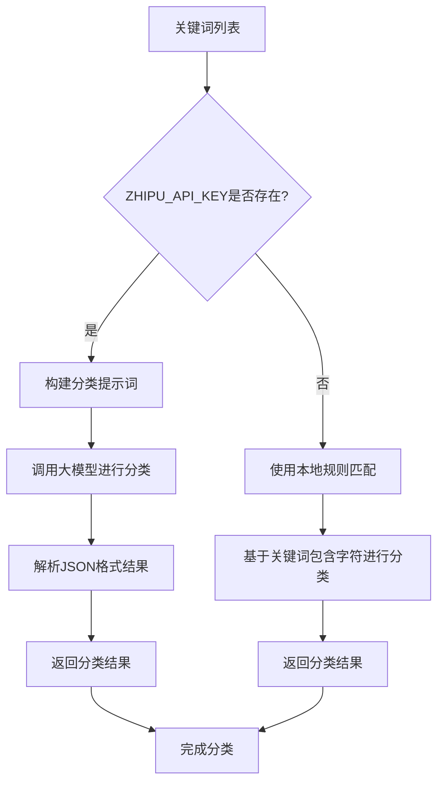
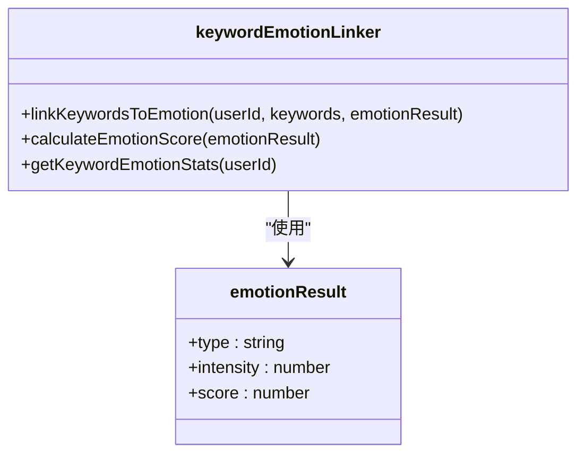
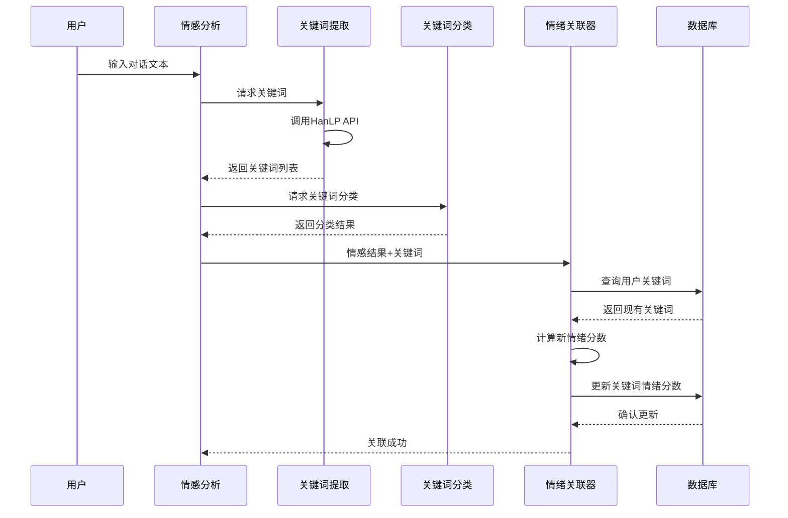

# 关键词处理

<cite>
**本文档中引用的文件**  
- [keywordClassifier.js](file://cloudfunctions/analysis/keywordClassifier.js)
- [keywordEmotionLinker.js](file://cloudfunctions/analysis/keywordEmotionLinker.js)
- [keywords.js](file://cloudfunctions/analysis/keywords.js)
- [关键词情感关联功能使用示例.md](file://doc/使用文档/关键词情感关联功能使用示例.md)
</cite>

## 目录
1. [引言](#引言)
2. [核心组件](#核心组件)
3. [关键词提取与分类机制](#关键词提取与分类机制)
4. [关键词-情绪关联系统](#关键词-情绪关联系统)
5. [上下文感知情绪分析中的作用](#上下文感知情绪分析中的作用)
6. [关键词-情绪关联矩阵构建](#关键词-情绪关联矩阵构建)
7. [关键词库扩展与配置](#关键词库扩展与配置)
8. [结论](#结论)

## 引言

关键词处理子系统是HeartChat智能对话系统的核心模块之一，负责从用户对话中提取关键语义词汇，并将其与情绪维度进行关联分析。该系统通过自然语言处理技术实现关键词的精准识别、分类和情感量化，为个性化情绪支持和用户兴趣理解提供数据基础。本文档详细说明`keywordClassifier.js`、`keywordEmotionLinker.js`和`keywords.js`三个核心文件的工作机制，以及如何结合使用文档中的示例进行系统配置与扩展。

## 核心组件

本系统由三个主要模块构成：关键词提取模块（`keywords.js`）、关键词分类器（`keywordClassifier.js`）和关键词情绪关联器（`keywordEmotionLinker.js`）。这些模块协同工作，完成从原始文本到结构化关键词-情绪数据的转换过程。

**Section sources**
- [keywordClassifier.js](file://cloudfunctions/analysis/keywordClassifier.js#L1-L298)
- [keywordEmotionLinker.js](file://cloudfunctions/analysis/keywordEmotionLinker.js#L1-L206)
- [keywords.js](file://cloudfunctions/analysis/keywords.js#L1-L283)

## 关键词提取与分类机制

### 分词算法与关键词提取

`keywords.js`模块基于HanLP API实现关键词提取功能。系统通过调用外部HanLP服务，对输入文本进行分词和权重计算，返回具有语义重要性的关键词列表。该过程包括文本预处理、词性标注、TF-IDF或TextRank算法计算关键词权重等步骤，确保提取出最具代表性的语义单元。

```mermaid
flowchart TD
A[原始文本] --> B[调用HanLP API]
B --> C{API调用成功?}
C --> |是| D[解析返回的关键词-权重对]
C --> |否| E[返回错误信息]
D --> F[格式化为{word, weight}对象数组]
F --> G[返回提取结果]
```

**Diagram sources**
- [keywords.js](file://cloudfunctions/analysis/keywords.js#L15-L68)

### 停用词过滤与词性筛选

在关键词提取过程中，系统自动过滤常见停用词（如“的”、“了”、“在”等虚词和功能词），并优先保留名词、动词、形容词等具有实际语义的词性。这一机制通过HanLP的词性标注功能实现，确保最终提取的关键词具有明确的语义指向性和分析价值。

**Section sources**
- [keywords.js](file://cloudfunctions/analysis/keywords.js#L15-L68)

### 关键词分类机制

`keywordClassifier.js`模块负责将提取的关键词归类到预定义的语义类别中。系统采用双重分类策略：当智谱AI API可用时，通过大模型进行语义理解分类；否则使用本地规则匹配进行分类。

预定义分类包括：学习、工作、娱乐、社交、健康、生活、科技、艺术、体育、旅游、美食、时尚、金融、宠物、家庭、音乐、电影、阅读、游戏、心理、自我提升、时间管理、压力缓解、人际关系、休闲活动及其他。



**Diagram sources**
- [keywordClassifier.js](file://cloudfunctions/analysis/keywordClassifier.js#L100-L250)

**Section sources**
- [keywordClassifier.js](file://cloudfunctions/analysis/keywordClassifier.js#L1-L298)

## 关键词-情绪关联系统

### 情绪维度映射机制

`keywordEmotionLinker.js`模块实现了关键词与情绪维度的关联。系统通过`calculateEmotionScore`函数将情感分析结果转换为-1到1之间的连续分数，其中正值表示正面情绪，负值表示负面情绪，绝对值大小表示情绪强度。

情绪类型与基础分数的映射关系如下：
- 正面情绪：喜悦(0.8)、幸福(0.9)、满足(0.7)、兴奋(0.8)、爱(0.9)、乐观(0.6)、自豪(0.5)
- 中性情绪：中立(0)、困惑(-0.2)、无聊(-0.3)
- 负面情绪：悲伤(-0.7)、愤怒(-0.8)、恐惧(-0.7)、厌恶(-0.6)、焦虑(-0.6)、压力(-0.5)、疲劳(-0.4)、失望(-0.5)、尴尬(-0.4)、内疚(-0.6)、羞耻(-0.7)



**Diagram sources**
- [keywordEmotionLinker.js](file://cloudfunctions/analysis/keywordEmotionLinker.js#L1-L206)

### 情绪强度量化方法

情绪强度通过加权计算方式量化。系统采用加权平均算法更新关键词的情感分数：`新分数 = 当前分数 × 0.7 + 当前情绪分数 × 0.3`。这种设计使得关键词的情感分数既能反映最新对话的情绪倾向，又能保持一定的历史稳定性，避免因单次对话而产生剧烈波动。

**Section sources**
- [keywordEmotionLinker.js](file://cloudfunctions/analysis/keywordEmotionLinker.js#L42-L84)

## 上下文感知情绪分析中的作用

关键词处理子系统在上下文感知情绪分析中扮演着桥梁角色。它不仅识别用户提及的话题（通过关键词提取与分类），还量化了用户对这些话题的情感态度（通过情绪关联）。这种双重分析能力使系统能够：

1. 识别用户关注的核心话题领域（如工作、学习、家庭等）
2. 追踪用户对特定话题的情感变化趋势
3. 发现潜在的心理压力源或积极兴趣点
4. 为后续的个性化回应和干预建议提供依据

例如，当系统检测到"加班"这一关键词持续关联负面情绪时，可主动提供压力缓解建议；当"阅读"、"音乐"等关键词关联正面情绪时，可推荐相关休闲活动。

**Section sources**
- [关键词情感关联功能使用示例.md](file://doc/使用文档/关键词情感关联功能使用示例.md#L1-L225)

## 关键词-情绪关联矩阵构建

### 数据结构设计

系统在数据库中维护用户兴趣数据集合（`userInterests`），其中每个用户的记录包含关键词数组，每个关键词对象具有以下属性：

```json
{
  "word": "旅行",
  "weight": 1.5,
  "category": "娱乐",
  "emotionScore": 0.8,
  "source": "chat",
  "firstSeen": "2024-01-01T00:00:00Z",
  "lastUpdated": "2024-01-02T00:00:00Z",
  "occurrences": 5
}
```

### 构建过程

关键词-情绪关联矩阵的构建过程如下：
1. 从用户对话中提取关键词及其权重
2. 对关键词进行语义分类
3. 分析当前对话的情感倾向并计算情绪分数
4. 在用户兴趣数据库中查找对应关键词
5. 使用加权平均算法更新关键词的情感分数
6. 记录更新时间



**Diagram sources**
- [keywordEmotionLinker.js](file://cloudfunctions/analysis/keywordEmotionLinker.js#L1-L206)
- [keywords.js](file://cloudfunctions/analysis/keywords.js#L1-L283)

**Section sources**
- [keywordEmotionLinker.js](file://cloudfunctions/analysis/keywordEmotionLinker.js#L1-L206)
- [keywords.js](file://cloudfunctions/analysis/keywords.js#L1-L283)

## 关键词库扩展与配置

### 预定义分类扩展

虽然系统主要依赖大模型进行语义分类，但本地分类规则也可通过修改`PREDEFINED_CATEGORIES`和`SUBCATEGORIES`常量进行扩展。开发者可以根据目标用户群体的语言习惯，添加新的分类类别和对应的关键词映射。

### 停用词与特殊词汇配置

尽管当前系统依赖HanLP服务进行基础处理，但可在`keywords.js`中添加自定义的预处理逻辑，如扩展停用词表或添加领域特定的重要词汇权重调整规则，以适应不同用户群体的语言特征。

### 使用示例配置

根据使用文档示例，可通过以下方式启用关键词情感关联功能：

```javascript
const emotionService = require('../../services/emotionService');

async function analyzeTextEmotion(text, history = []) {
  const result = await emotionService.analyzeEmotion(text, {
    history: history,
    saveRecord: true,
    extractKeywords: true,
    linkKeywords: true
  });
  
  return result;
}
```

此配置确保在情感分析过程中自动完成关键词提取和情绪关联，简化了集成过程。

**Section sources**
- [关键词情感关联功能使用示例.md](file://doc/使用文档/关键词情感关联功能使用示例.md#L25-L100)

## 结论

关键词处理子系统通过整合NLP技术、大模型语义理解能力和本地规则引擎，实现了从用户对话中提取关键语义词汇并量化其情绪强度的完整流程。该系统不仅能够准确分类关键词到预定义的语义类别，还能通过加权平均算法动态更新关键词的情感分数，形成个性化的关键词-情绪关联矩阵。通过合理配置和扩展，该系统可适应不同用户群体的语言习惯，为上下文感知的情绪分析和个性化服务提供坚实的数据基础。