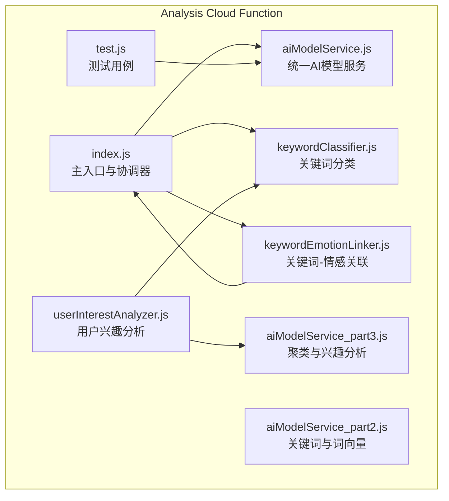
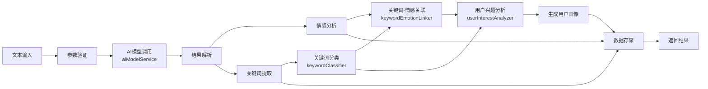
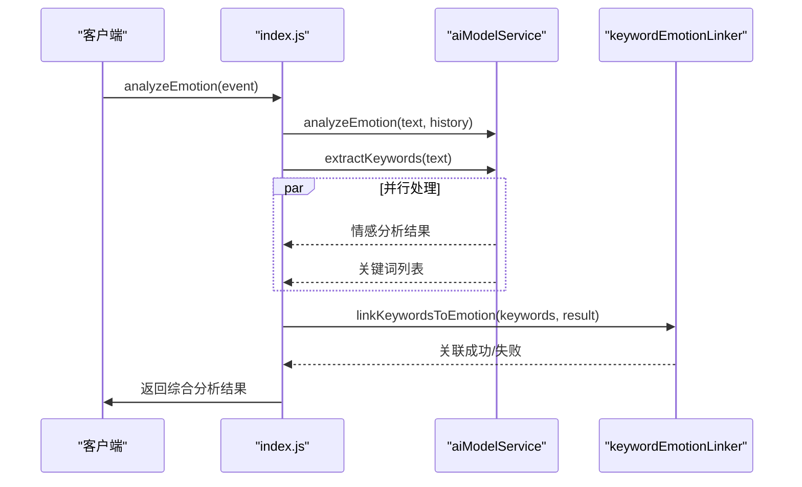
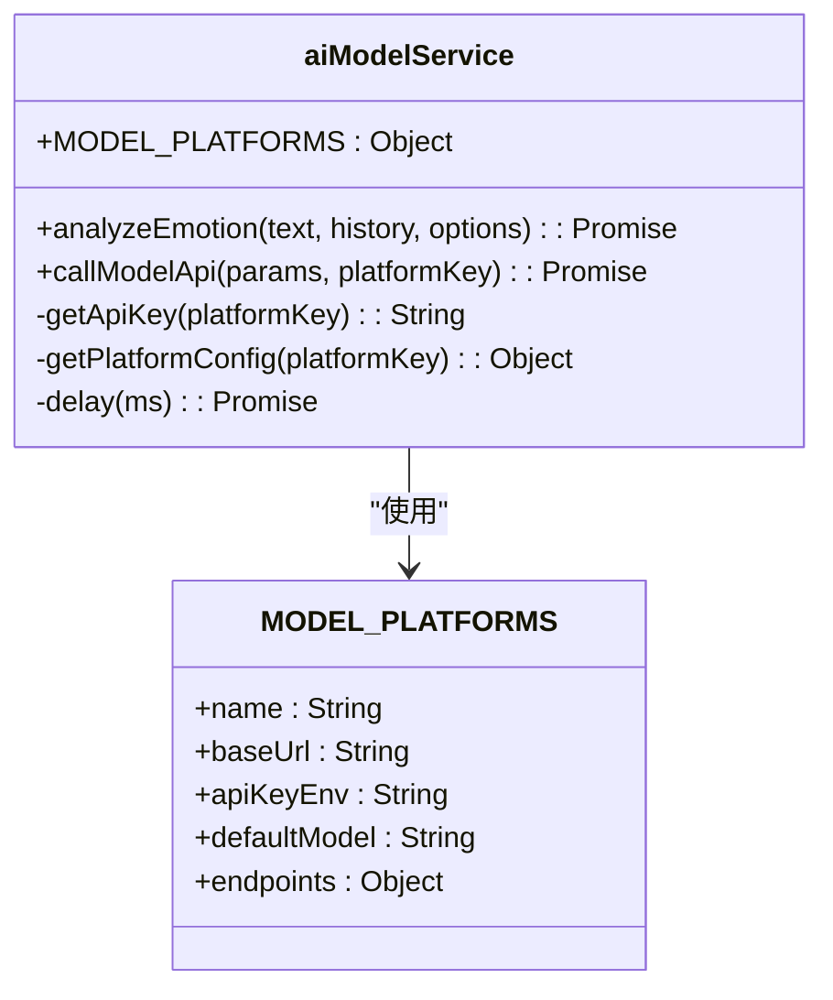
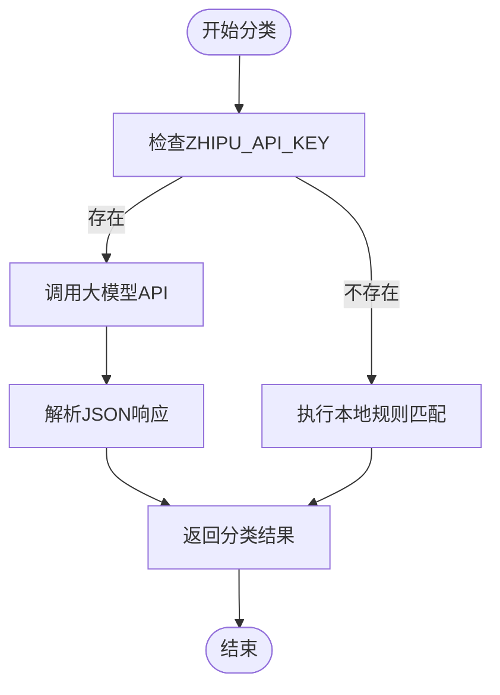
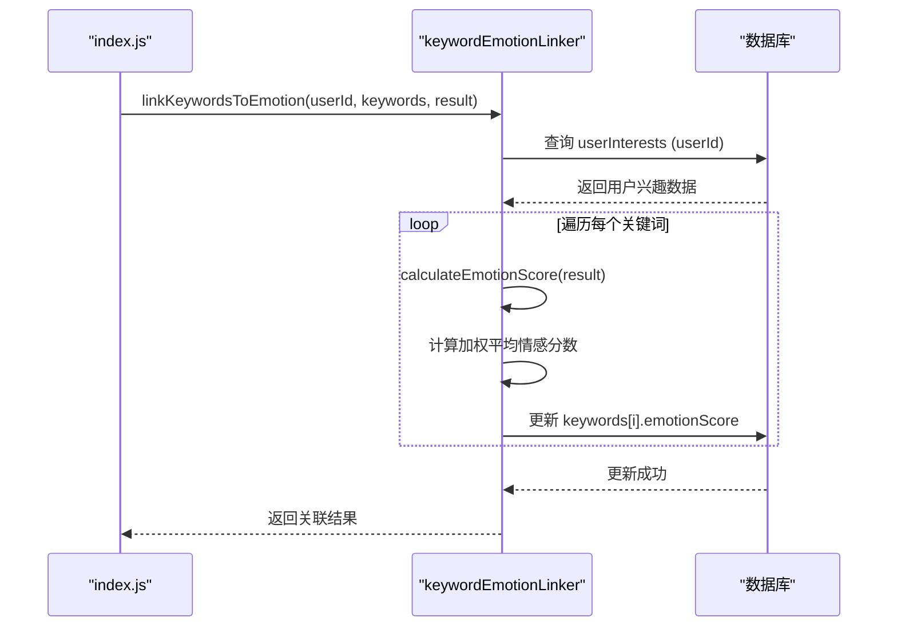
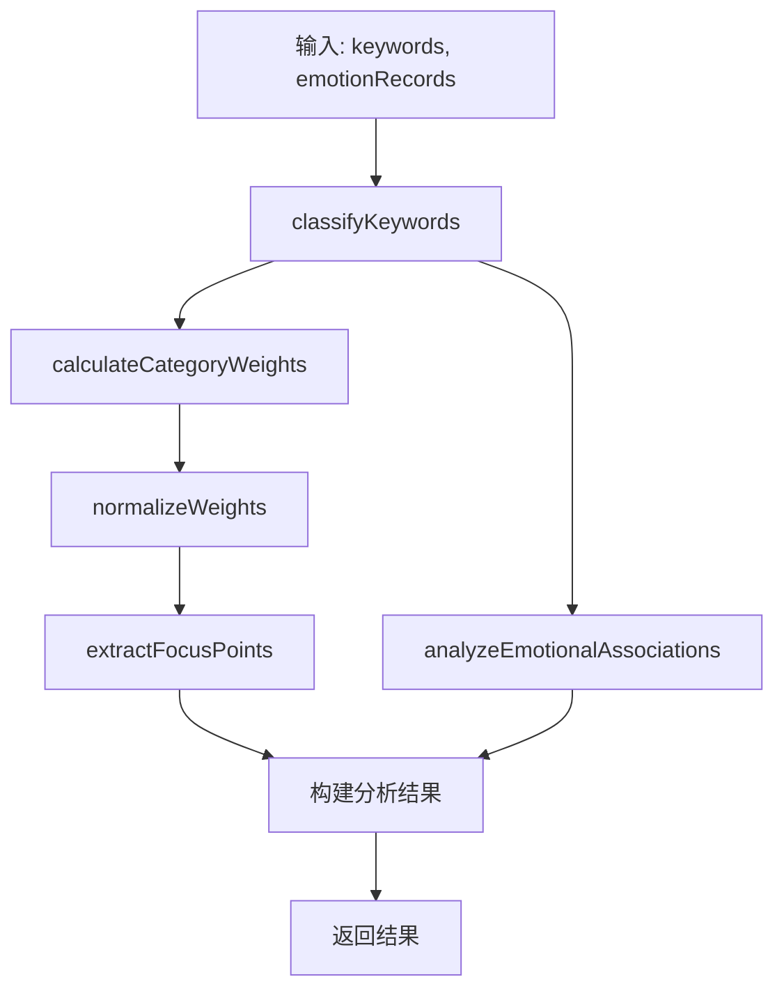
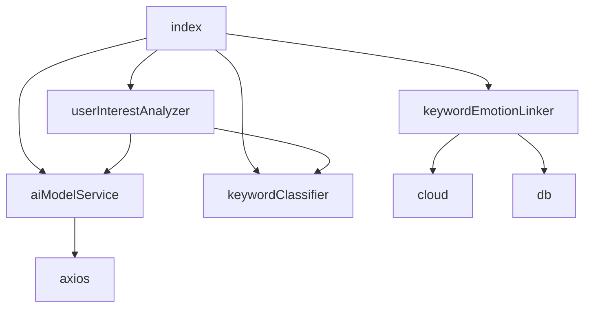

# 分析服务

<cite>
**本文档引用的文件**  
- [index.js](file://cloudfunctions/analysis/index.js)
- [aiModelService.js](file://cloudfunctions/analysis/aiModelService.js)
- [keywordClassifier.js](file://cloudfunctions/analysis/keywordClassifier.js)
- [keywordEmotionLinker.js](file://cloudfunctions/analysis/keywordEmotionLinker.js)
- [userInterestAnalyzer.js](file://cloudfunctions/analysis/userInterestAnalyzer.js)
- [test.js](file://cloudfunctions/analysis/test.js)
- [analysis.md](file://doc/开发文档/cloudfunctions/analysis.md)
</cite>

## 目录
1. [简介](#简介)
2. [项目结构](#项目结构)
3. [核心组件](#核心组件)
4. [架构概览](#架构概览)
5. [详细组件分析](#详细组件分析)
6. [依赖分析](#依赖分析)
7. [性能考量](#性能考量)
8. [故障排除指南](#故障排除指南)
9. [结论](#结论)

## 简介
HeartChat分析服务是一个基于云函数的情感分析与用户兴趣识别系统，专注于通过AI模型对用户输入文本进行多阶段处理。该服务以`index.js`为核心协调器，整合多个专用模块，实现从文本预处理、情绪识别、关键词提取到用户画像构建的完整职责链。系统支持多种AI模型平台（如Gemini、智谱AI等），具备灵活的降级策略和缓存机制，确保在高并发场景下的稳定性和响应速度。本文档将深入解析其多阶段处理架构、模块间协作机制、错误处理策略及性能优化手段。

## 项目结构
HeartChat分析服务的云函数模块位于`cloudfunctions/analysis/`目录下，采用模块化设计，各司其职。主入口`index.js`负责接收外部请求并调度各子服务，`aiModelService.js`及其分片文件提供统一的AI模型调用接口，`keywordClassifier.js`、`keywordEmotionLinker.js`和`userInterestAnalyzer.js`分别负责关键词分类、情感关联和用户兴趣分析。测试文件`test.js`用于验证核心功能。

**图示来源**
- [index.js](file://cloudfunctions/analysis/index.js#L1-L100)
- [aiModelService.js](file://cloudfunctions/analysis/aiModelService.js#L1-L50)
- [keywordClassifier.js](file://cloudfunctions/analysis/keywordClassifier.js#L1-L30)
- [keywordEmotionLinker.js](file://cloudfunctions/analysis/keywordEmotionLinker.js#L1-L20)
- [userInterestAnalyzer.js](file://cloudfunctions/analysis/userInterestAnalyzer.js#L1-L30)
- [test.js](file://cloudfunctions/analysis/test.js#L1-L10)

## 核心组件
分析服务的核心组件围绕`index.js`构建，形成一个职责分明的处理流水线。`index.js`作为协调者，接收来自前端的文本分析请求，根据请求类型（如情感分析、关键词提取、用户兴趣分析）调用相应的处理函数。`aiModelService.js`是整个系统与外部AI模型交互的统一网关，它封装了对Gemini、智谱AI等多种平台的API调用细节，实现了模型调用的抽象化和标准化。`keywordClassifier.js`利用大模型能力，将提取出的关键词自动归类到预定义的兴趣类别中。`keywordEmotionLinker.js`则负责将关键词与情感分析结果进行关联，计算并更新关键词的情感分数。`userInterestAnalyzer.js`是用户画像构建的核心，它整合分类后的关键词和历史情绪记录，生成用户的关注点和情感洞察。

**本节来源**
- [index.js](file://cloudfunctions/analysis/index.js#L1-L100)
- [aiModelService.js](file://cloudfunctions/analysis/aiModelService.js#L1-L100)
- [keywordClassifier.js](file://cloudfunctions/analysis/keywordClassifier.js#L1-L50)
- [keywordEmotionLinker.js](file://cloudfunctions/analysis/keywordEmotionLinker.js#L1-L50)
- [userInterestAnalyzer.js](file://cloudfunctions/analysis/userInterestAnalyzer.js#L1-L50)

## 架构概览
HeartChat分析服务采用多阶段处理的职责链设计模式，将复杂的分析任务分解为一系列独立且可复用的步骤。整个流程始于`index.js`的请求处理，经过AI模型调用、结果解析、数据加工、关联分析等多个阶段，最终将结果存储或返回。这种设计模式确保了每个阶段的单一职责，提高了代码的可维护性和可测试性。

**图示来源**
- [index.js](file://cloudfunctions/analysis/index.js#L100-L800)
- [aiModelService.js](file://cloudfunctions/analysis/aiModelService.js#L100-L700)
- [keywordClassifier.js](file://cloudfunctions/analysis/keywordClassifier.js#L50-L300)
- [keywordEmotionLinker.js](file://cloudfunctions/analysis/keywordEmotionLinker.js#L50-L200)
- [userInterestAnalyzer.js](file://cloudfunctions/analysis/userInterestAnalyzer.js#L50-L300)

## 详细组件分析
### index.js 协调机制分析
`index.js`是整个分析服务的入口和调度中心。它通过`analyzeEmotion`、`extractTextKeywords`、`generateDailyReport`等函数暴露不同的API接口。当收到情感分析请求时，`index.js`会并行调用`aiModelService.analyzeEmotion`进行情绪识别和`aiModelService.extractKeywords`进行关键词提取，以提高处理效率。分析完成后，它会根据配置决定是否异步调用`keywordEmotionLinker.linkKeywordsToEmotion`来更新数据库中关键词的情感分数，从而实现分析结果的持久化和用户画像的动态更新。

**图示来源**
- [index.js](file://cloudfunctions/analysis/index.js#L100-L400)
- [aiModelService.js](file://cloudfunctions/analysis/aiModelService.js#L100-L300)
- [keywordEmotionLinker.js](file://cloudfunctions/analysis/keywordEmotionLinker.js#L50-L100)

### aiModelService.js 模型调用分析
`aiModelService.js`是系统与外部AI世界沟通的桥梁。它通过`MODEL_PLATFORMS`配置对象定义了对Gemini、智谱AI、OpenAI等多家模型提供商的支持。`callModelApi`函数是其核心，实现了统一的API调用逻辑，包括请求构建、认证、错误处理和重试机制。`analyzeEmotion`函数则根据不同的平台（如Gemini或OpenAI）构造特定的提示词（prompt）和请求体，确保输出为结构化的JSON格式，便于后续解析。该模块的设计使得系统可以轻松地在不同AI模型间切换或进行负载均衡。

**图示来源**
- [aiModelService.js](file://cloudfunctions/analysis/aiModelService.js#L1-L700)

### keywordClassifier.js 分类机制分析
`keywordClassifier.js`负责将原始关键词映射到有意义的兴趣类别。其核心是`batchClassifyKeywords`函数，它首先检查环境变量中是否存在智谱AI的API密钥。如果存在，则通过`bigmodel.chatCompletion`调用大模型，根据预定义的分类说明和提示词模板，将关键词列表分类为“学习”、“工作”、“娱乐”等类别。如果API密钥不存在，则降级为本地规则匹配，通过检查关键词中是否包含特定字词（如“学”、“工作”、“游戏”）来进行快速分类。这种降级策略保证了服务在外部依赖不可用时仍能提供基本功能。

**图示来源**
- [keywordClassifier.js](file://cloudfunctions/analysis/keywordClassifier.js#L1-L300)

### keywordEmotionLinker.js 关联机制分析
`keywordEmotionLinker.js`实现了关键词与情感的动态关联。`linkKeywordsToEmotion`函数接收用户ID、关键词列表和情感分析结果。它首先查询数据库中该用户的`userInterests`记录，然后遍历关键词列表，对于每个关键词，计算一个基于当前情感分数和历史分数的加权平均值（新分数 = 历史分数 * 0.7 + 当前情感分数 * 0.3），并更新数据库。`calculateEmotionScore`函数根据情感类型（如“喜悦”、“悲伤”）和强度，将其映射为一个-1到1之间的数值，正面情绪为正，负面情绪为负。这种机制使得系统能够追踪用户对特定话题的情感变化。

**图示来源**
- [keywordEmotionLinker.js](file://cloudfunctions/analysis/keywordEmotionLinker.js#L50-L200)

### userInterestAnalyzer.js 兴趣分析机制分析
`userInterestAnalyzer.js`是用户画像构建的引擎。`analyzeUserInterests`函数是其入口，它接收一个带权重的关键词数组和历史情绪记录。该函数首先调用`keywordClassifier.batchClassifyKeywords`对关键词进行分类，然后计算每个类别的总权重，再将其标准化为百分比。接着，它提取权重最高的几个类别作为用户的“关注点”（focusPoints），并利用`analyzeEmotionalAssociations`函数分析哪些关键词经常与积极或消极情绪同时出现，从而生成情感洞察。最终，它将所有这些信息整合成一个全面的用户兴趣分析报告。

**图示来源**
- [userInterestAnalyzer.js](file://cloudfunctions/analysis/userInterestAnalyzer.js#L1-L300)

## 依赖分析
分析服务的模块间依赖关系清晰，形成了一个以`index.js`为顶点的依赖树。`index.js`直接依赖`aiModelService.js`、`keywordClassifier.js`、`keywordEmotionLinker.js`和`userInterestAnalyzer.js`。`userInterestAnalyzer.js`又依赖`keywordClassifier.js`和`aiModelService.js`（通过`bigmodel`模块）。`keywordEmotionLinker.js`依赖云开发环境和数据库。`aiModelService.js`依赖`axios`库进行HTTP请求。这种分层依赖避免了循环依赖，保证了系统的稳定性。

**图示来源**
- [index.js](file://cloudfunctions/analysis/index.js#L1-L20)
- [userInterestAnalyzer.js](file://cloudfunctions/analysis/userInterestAnalyzer.js#L1-L10)
- [keywordEmotionLinker.js](file://cloudfunctions/analysis/keywordEmotionLinker.js#L1-L10)
- [aiModelService.js](file://cloudfunctions/analysis/aiModelService.js#L1-L10)

## 性能考量
分析服务在设计上充分考虑了性能优化。首先，`index.js`在处理情感分析时，会并行执行情感识别和关键词提取两个耗时操作，显著减少了总响应时间。其次，数据库的写入操作（如保存情感记录、更新关键词情感分数）被设计为异步执行，不阻塞主请求流程，保证了API的快速响应。此外，系统支持多种AI模型，可以通过配置实现负载均衡，避免单一模型成为瓶颈。虽然当前代码中未显式实现中间结果缓存，但其模块化设计为未来引入Redis等缓存机制提供了便利。

## 故障排除指南
该服务具备完善的错误处理机制。在AI模型调用层面，`aiModelService.callModelApi`函数实现了针对429（请求过多）错误的指数退避重试策略，最多重试3次。当所有AI模型均不可用时，系统会降级为使用本地规则进行关键词分类，确保核心功能不完全中断。日志记录贯穿整个处理流程，从`index.js`的入口日志到各模块的详细错误信息，都通过`console.error`输出，便于开发者在云函数日志中排查问题。对于数据库操作，所有写入都包裹在`try-catch`块中，单个记录的保存失败不会导致整个分析流程崩溃。

**本节来源**
- [index.js](file://cloudfunctions/analysis/index.js#L400-L800)
- [aiModelService.js](file://cloudfunctions/analysis/aiModelService.js#L500-L700)
- [keywordEmotionLinker.js](file://cloudfunctions/analysis/keywordEmotionLinker.js#L150-L200)

## 结论
HeartChat分析服务通过精心设计的多阶段处理架构，成功地将复杂的情感分析与用户画像任务分解为一系列高内聚、低耦合的模块。`index.js`作为协调者，高效地调度`aiModelService`、`keywordClassifier`、`keywordEmotionLinker`和`userInterestAnalyzer`等组件，实现了从原始文本到深度用户洞察的转化。其职责链模式、并行处理、异步存储和降级策略，共同保障了服务的高性能、高可用性和可维护性。`test.js`文件的存在也体现了对代码质量的重视，为系统的稳定运行提供了保障。该架构为构建更智能、更个性化的心理健康服务奠定了坚实的基础。