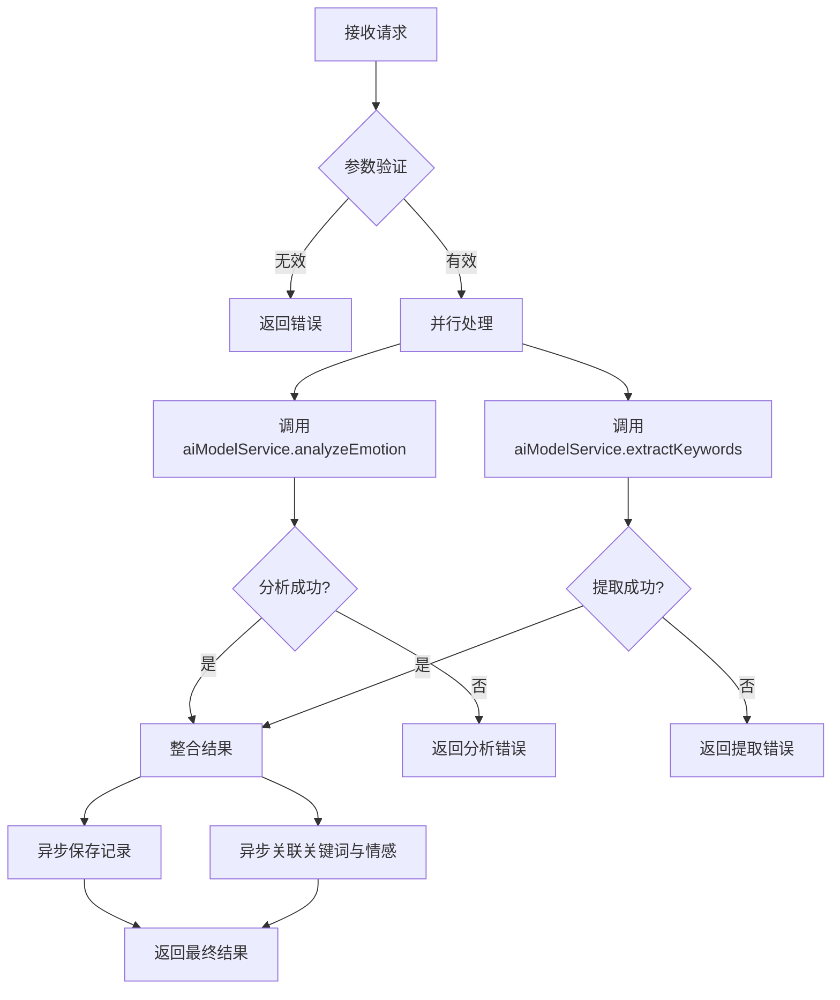
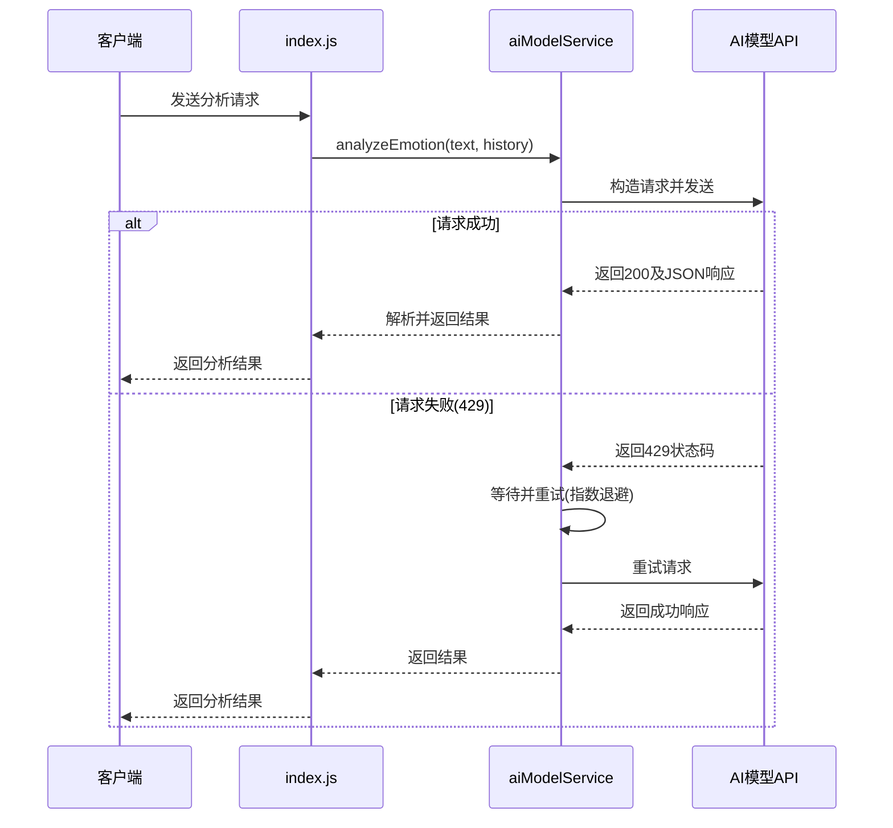
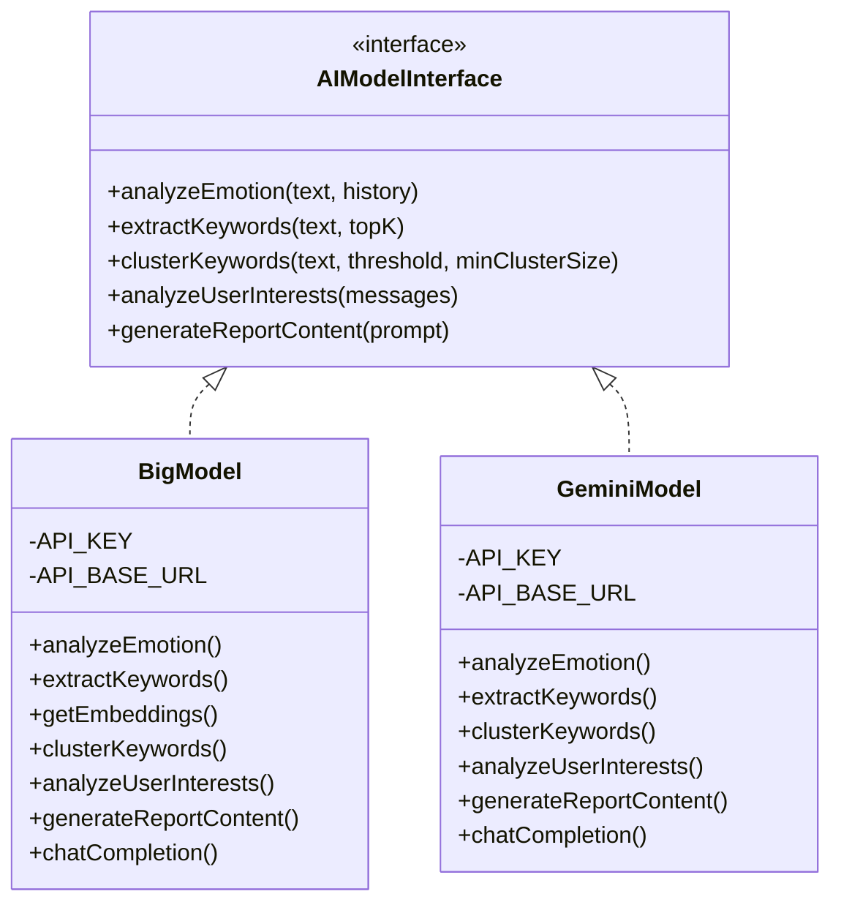

# 情绪分析引擎

<cite>
**本文档引用文件**   
- [index.js](file://cloudfunctions/analysis/index.js)
- [aiModelService.js](file://cloudfunctions/analysis/aiModelService.js)
- [aiModelService_part2.js](file://cloudfunctions/analysis/aiModelService_part2.js)
- [aiModelService_part3.js](file://cloudfunctions/analysis/aiModelService_part3.js)
- [bigmodel.js](file://cloudfunctions/analysis/bigmodel.js)
- [geminiModel.js](file://cloudfunctions/analysis/geminiModel.js)
- [test.js](file://cloudfunctions/analysis/test.js)
</cite>

## 目录
1. [简介](#简介)
2. [核心架构与主入口协调机制](#核心架构与主入口协调机制)
3. [AI模型服务封装机制](#ai模型服务封装机制)
4. [模型实现差异与适用场景](#模型实现差异与适用场景)
5. [模型降级与负载均衡逻辑](#模型降级与负载均衡逻辑)
6. [情绪分类准确率验证与边界处理](#情绪分类准确率验证与边界处理)
7. [完整调用流程示例](#完整调用流程示例)
8. [数据交互格式](#数据交互格式)

## 简介
HeartChat情绪分析引擎是一个基于多AI模型的云函数服务，旨在通过分析用户输入的文本内容，识别其情绪状态并提取关键信息。该引擎支持智谱AI（BigModel）和Google Gemini等多种AI模型平台，具备情感识别、关键词提取、词向量获取、聚类分析和用户兴趣分析等核心功能。系统通过`index.js`作为主入口，协调多个子模块完成复杂的情绪分析任务，并将结果用于生成每日心情报告、可视化展示等下游应用。

## 核心架构与主入口协调机制
`index.js`作为情绪分析云函数的主入口，负责接收外部请求并协调各个子模块完成情绪分析任务。其核心职责包括参数验证、并发处理、结果整合与数据库交互。

当接收到分析请求时，`index.js`首先验证输入参数的有效性，确保文本内容不为空且符合预期格式。随后，它利用`Promise.all`方法并行调用`aiModelService.analyzeEmotion`进行情感分析和`aiModelService.extractKeywords`进行关键词提取，以提高处理效率。



**Diagram sources**
- [index.js](file://cloudfunctions/analysis/index.js#L150-L250)

**本节来源**
- [index.js](file://cloudfunctions/analysis/index.js#L150-L300)

## AI模型服务封装机制
`aiModelService.js`模块提供了统一的AI模型调用接口，封装了对智谱AI、Google Gemini等不同平台的调用细节。该模块通过`MODEL_PLATFORMS`配置对象定义了各平台的API端点、默认模型、认证方式等信息，实现了模型调用的标准化。

### 请求构造
在调用模型API前，`aiModelService`会根据目标平台的配置动态构建请求。对于Gemini平台，请求体包含`contents`数组和`generationConfig`配置；而对于智谱AI、OpenAI等平台，则使用标准的`messages`数组和`response_format`来指定JSON输出格式。

### 响应解析
API响应解析是封装机制的关键部分。系统会检查响应状态码，对于429（请求过多）错误，会自动进行指数退避重试。成功响应后，系统会尝试解析JSON格式的返回内容，并将其标准化为统一的结构，包括`primary_emotion`、`intensity`、`valence`等字段，确保上层应用无需关心底层模型的差异。

### 错误重试策略
模块内置了强大的错误重试机制。`callModelApi`函数支持可配置的重试次数和延迟时间。当遇到429错误时，系统会等待指定时间后重试，并将延迟时间逐次加倍（指数退避），以应对API限流。此策略有效提高了服务的稳定性和容错能力。



**Diagram sources**
- [aiModelService.js](file://cloudfunctions/analysis/aiModelService.js#L200-L400)
- [index.js](file://cloudfunctions/analysis/index.js#L150-L200)

**本节来源**
- [aiModelService.js](file://cloudfunctions/analysis/aiModelService.js#L100-L500)

## 模型实现差异与适用场景
`bigmodel.js`和`geminiModel.js`分别实现了对智谱AI和Google Gemini模型的具体调用，两者在实现细节和适用场景上存在显著差异。

### bigmodel.js
`bigmodel.js`直接使用`axios`库调用智谱AI的API，具有较高的灵活性和控制力。它支持完整的功能集，包括情感分析、关键词提取、词向量获取（`getEmbeddings`）和聚类分析。当API密钥未配置时，该模块能优雅降级，使用本地模拟算法生成词向量，确保服务的可用性。

### geminiModel.js
`geminiModel.js`同样使用`axios`调用Gemini API，但其API端点和请求格式与智谱AI不同。Gemini API使用`generateContent`端点，并通过`contents`数组传递消息。该模块不支持词向量功能，因此在`aiModelService`中，当请求词向量时会默认使用智谱AI或本地模拟。

### 适用场景
- **bigmodel.js**: 适用于需要完整AI功能的场景，特别是需要词向量和聚类分析的高级分析任务。其本地模拟能力使其在开发和测试环境中非常实用。
- **geminiModel.js**: 适用于需要快速响应和高并发处理的场景。Gemini的`gemini-2.5-flash-preview-04-17`模型专为快速推理优化，适合实时情绪分析。



**Diagram sources**
- [bigmodel.js](file://cloudfunctions/analysis/bigmodel.js#L100-L200)
- [geminiModel.js](file://cloudfunctions/analysis/geminiModel.js#L100-L200)

**本节来源**
- [bigmodel.js](file://cloudfunctions/analysis/bigmodel.js#L50-L700)
- [geminiModel.js](file://cloudfunctions/analysis/geminiModel.js#L50-L650)

## 模型降级与负载均衡逻辑
系统通过`aiModelService`模块实现了灵活的模型降级与负载均衡机制，确保在高负载或部分服务不可用时仍能提供稳定服务。

### 模型降级
当指定的AI模型服务不可用时，系统会自动降级到备用方案。例如，在`getEmbeddings`函数中，如果请求的平台不是智谱AI，系统会直接使用本地模拟算法生成词向量，而不是抛出错误。这种设计保证了核心功能的可用性，即使在没有API密钥或网络问题的情况下也能运行。

### 负载均衡
负载均衡主要通过`aiModelService`的平台选择机制实现。`index.js`中的`analyzeEmotion`函数允许通过`modelType`参数指定使用`zhipu`或`gemini`模型。系统可以根据当前负载情况、API配额或成本因素动态选择最优模型。此外，`aiModelService`支持多个平台（如OpenAI、Whimsy AI等），为未来的扩展和负载分担提供了基础。

```mermaid
flowchart TD
A[开始] --> B{指定模型?}
B --> |是| C[使用指定模型]
B --> |否| D[使用默认模型(gemini)]
C --> E{模型调用成功?}
D --> E
E --> |是| F[返回结果]
E --> |否| G{是否支持降级?}
G --> |是| H[执行降级策略]
G --> |否| I[返回错误]
H --> J[返回降级结果]
F --> K[结束]
I --> K
J --> K
```

**Diagram sources**
- [aiModelService.js](file://cloudfunctions/analysis/aiModelService.js#L500-L600)
- [aiModelService_part2.js](file://cloudfunctions/analysis/aiModelService_part2.js#L200-L300)

**本节来源**
- [aiModelService.js](file://cloudfunctions/analysis/aiModelService.js#L500-L663)
- [aiModelService_part2.js](file://cloudfunctions/analysis/aiModelService_part2.js#L200-L317)

## 情绪分类准确率验证与边界处理
`test.js`文件提供了对`bigmodel.js`模块的单元测试，用于验证情绪分类的准确率和处理边界情况。

### 验证方法
测试用例通过预定义的测试事件，调用`bigmodel.js`的各个功能函数，并将输出结果打印到日志中。主要测试了以下功能：
- `analyzeEmotion`: 验证对包含复杂情绪（如“激动和开心”但“有点累”）的文本能否准确识别主要和次要情绪。
- `extractKeywords`: 验证能否从技术性文本中提取出“大模型”、“AI助手”等关键词。
- `getEmbeddings`: 验证词向量生成功能，包括在无API密钥时的本地模拟。
- `analyzeUserInterests`: 验证能否从用户历史消息中识别出“艺术”、“编程”、“音乐”等兴趣领域。

### 边界情况处理
系统在多个层面处理了边界情况：
- **空输入**: 所有函数都检查输入参数的有效性，对空或无效文本返回明确的错误信息。
- **历史消息**: 限制最多使用5条历史消息作为上下文，防止输入过长。
- **异常捕获**: 使用`try-catch`块捕获解析JSON响应时的异常，避免因模型输出格式错误导致服务崩溃。
- **异步操作**: 数据库保存和关键词关联等操作被设计为异步且非阻塞，即使这些操作失败也不会影响主分析流程。

**本节来源**
- [test.js](file://cloudfunctions/analysis/test.js#L1-L110)
- [bigmodel.js](file://cloudfunctions/analysis/bigmodel.js#L100-L700)

## 完整调用流程示例
以下是从接收到用户输入到输出情绪标签的完整流程示例：

1.  **客户端请求**: 客户端调用云函数`analyzeEmotion`，传入用户输入的文本`"今天项目上线了，非常激动和开心！但也感觉有点累。"`。
2.  **参数处理**: `index.js`接收请求，验证文本有效，并设置`modelType='gemini'`。
3.  **并发调用**: 并行调用`aiModelService.analyzeEmotion`和`aiModelService.extractKeywords`。
4.  **模型分析**: `aiModelService`调用`geminiModel.js`，构造包含系统提示词和用户文本的请求，发送至Gemini API。
5.  **结果解析**: Gemini返回JSON格式的响应，包含`primary_emotion: "喜悦"`, `intensity: 0.8`, `valence: 0.9`等字段。
6.  **结果整合**: `index.js`将情感分析结果和关键词（如“项目上线”、“激动”、“开心”、“累”）整合。
7.  **异步操作**: 异步将分析结果保存到`emotionRecords`集合，并尝试关联关键词与情感。
8.  **返回结果**: 向客户端返回最终结果，包含情绪标签、置信度、关键词和建议话术。

**本节来源**
- [index.js](file://cloudfunctions/analysis/index.js#L150-L300)
- [aiModelService.js](file://cloudfunctions/analysis/aiModelService.js#L400-L600)
- [geminiModel.js](file://cloudfunctions/analysis/geminiModel.js#L100-L300)

## 数据交互格式
情绪分析引擎与其他模块（如情感可视化组件）通过标准化的JSON格式进行数据交互。

### 情感分析结果格式
```json
{
  "success": true,
  "result": {
    "type": "喜悦",
    "primary_emotion": "喜悦",
    "secondary_emotions": ["激动"],
    "intensity": 0.8,
    "valence": 0.9,
    "arousal": 0.7,
    "trend": "上升",
    "keywords": ["项目上线", "激动", "开心", "累"],
    "suggestions": ["为您的成就感到高兴！", "注意休息，避免过度劳累。"],
    "summary": "您今天因项目成功上线而感到非常喜悦和激动，情绪积极向上，但同时也感到一些疲惫。"
  },
  "keywords": ["项目上线", "激动", "开心", "累"]
}
```

### 与情感可视化组件的交互
情感可视化组件（如ECharts图表）使用`result`中的`intensity`、`valence`和`arousal`等数值字段来绘制情绪雷达图或趋势图。`keywords`数组用于生成词云图。`trend`字段用于指示情绪变化方向。

**本节来源**
- [index.js](file://cloudfunctions/analysis/index.js#L200-L250)
- [aiModelService.js](file://cloudfunctions/analysis/aiModelService.js#L450-L500)
- [miniprogram/components/emotion-dashboard/emotion-dashboard.js](file://miniprogram/components/emotion-dashboard/emotion-dashboard.js)