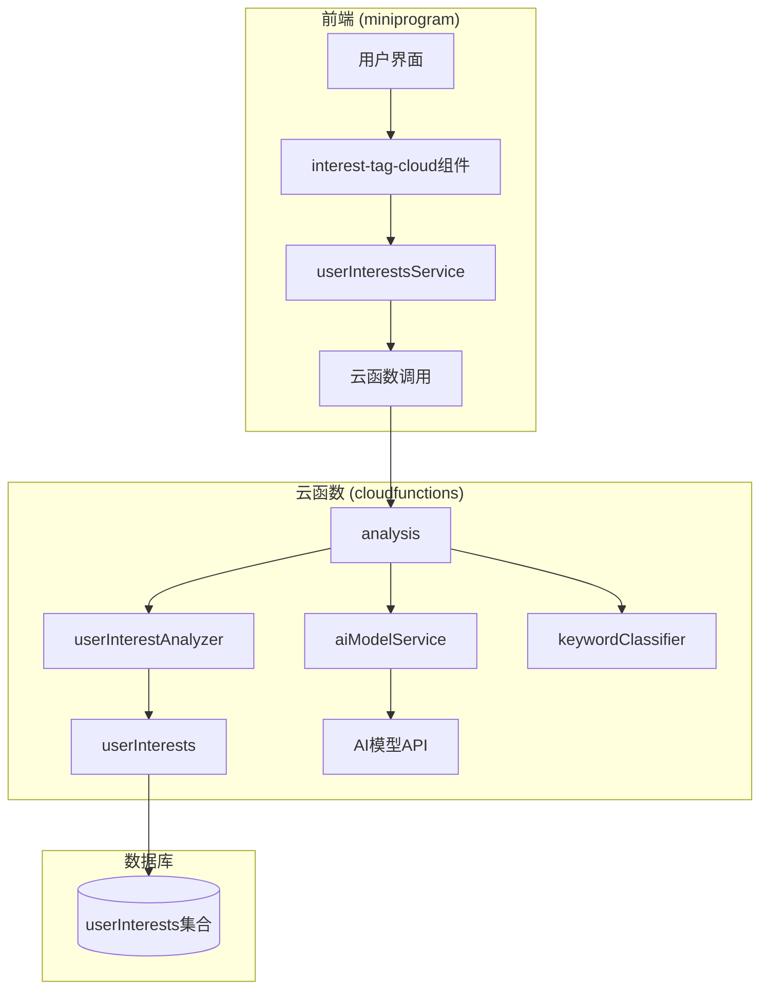
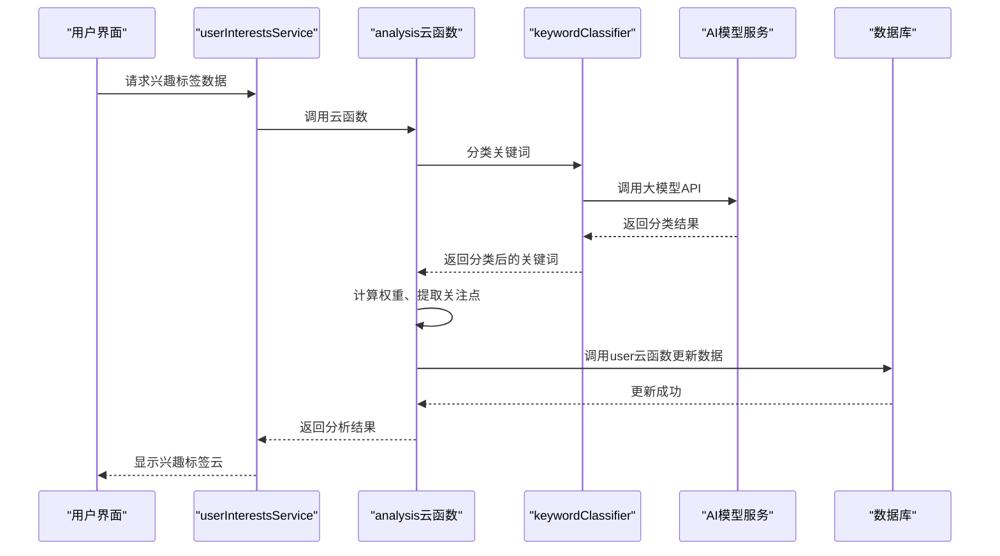
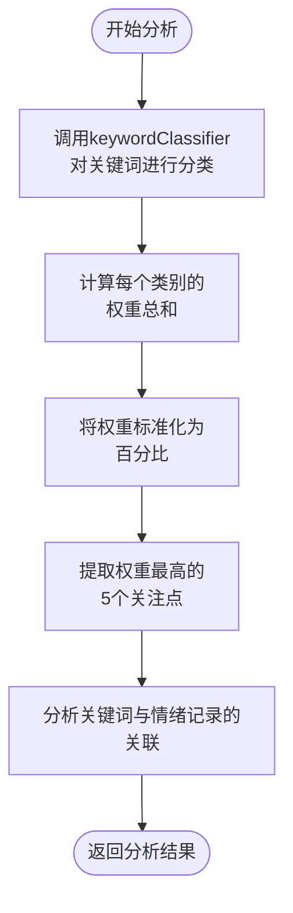
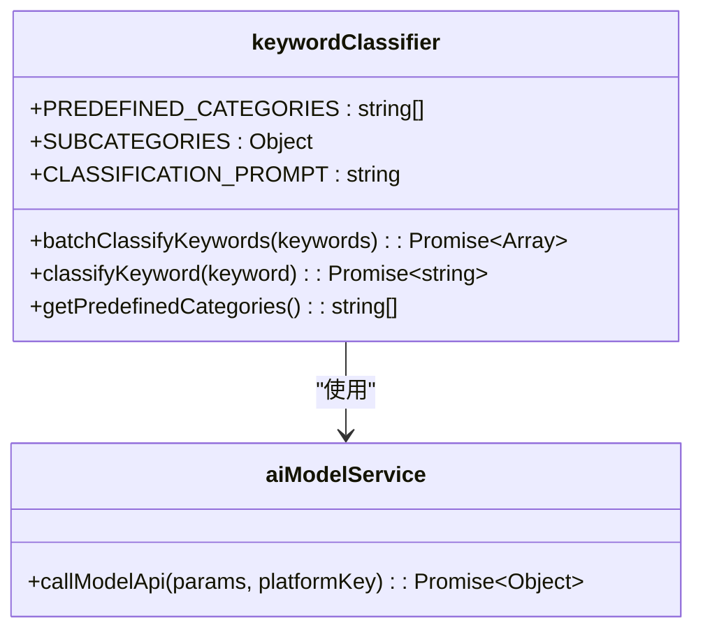
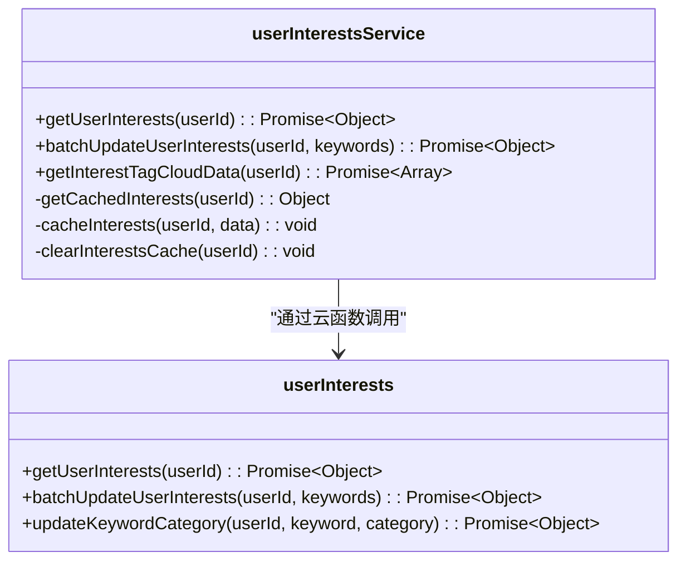
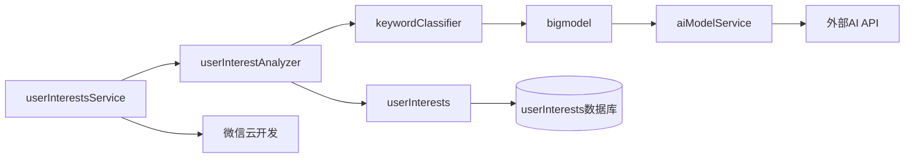

# 用户兴趣分析

<cite>
**本文档引用的文件**  
- [userInterestAnalyzer.js](file://cloudfunctions/analysis/userInterestAnalyzer.js)
- [aiModelService.js](file://cloudfunctions/analysis/aiModelService.js)
- [aiModelService_part3.js](file://cloudfunctions/analysis/aiModelService_part3.js)
- [keywordClassifier.js](file://cloudfunctions/analysis/keywordClassifier.js)
- [userInterests.js](file://cloudfunctions/user/userInterests.js)
- [userInterestsService.js](file://miniprogram/services/userInterestsService.js)
- [interest-tag-cloud.js](file://miniprogram/components/interest-tag-cloud/interest-tag-cloud.js)
- [用户兴趣分类功能说明.md](file://doc/使用文档/用户兴趣分类功能说明.md)
</cite>

## 目录
1. [简介](#简介)
2. [项目结构](#项目结构)
3. [核心组件](#核心组件)
4. [架构概述](#架构概述)
5. [详细组件分析](#详细组件分析)
6. [依赖分析](#依赖分析)
7. [性能考虑](#性能考虑)
8. [故障排除指南](#故障排除指南)
9. [结论](#结论)

## 简介
用户兴趣分析功能是 HeartChat 应用的核心模块之一，旨在通过分析用户的长期对话历史，利用 AI 模型服务提取用户的兴趣标签和关注点。该功能结合关键词提取、主题建模和情感分析，构建用户的兴趣画像，为个性化推荐和用户洞察提供数据支持。兴趣分类体系涵盖生活、学习、情感等多个维度，通过动态权重调整算法反映用户兴趣的演变趋势。分析结果以结构化数据形式存储，并应用于兴趣标签云、每日心情报告等场景。

## 项目结构
HeartChat 项目的用户兴趣分析相关代码主要分布在 `cloudfunctions` 和 `miniprogram` 两个目录下。`cloudfunctions/analysis` 目录包含核心的分析逻辑，如 `userInterestAnalyzer.js` 和 `aiModelService.js`，负责调用 AI 模型进行关键词分类和兴趣分析。`cloudfunctions/user` 目录下的 `userInterests.js` 负责用户兴趣数据的持久化存储。前端部分，`miniprogram/services` 目录的 `userInterestsService.js` 提供了与云函数交互的服务层，而 `miniprogram/components` 目录的 `interest-tag-cloud` 组件则用于可视化展示用户的兴趣标签。

**图表来源**  
- [userInterestAnalyzer.js](file://cloudfunctions/analysis/userInterestAnalyzer.js)
- [userInterestsService.js](file://miniprogram/services/userInterestsService.js)
- [userInterests.js](file://cloudfunctions/user/userInterests.js)

**本节来源**  
- [userInterestAnalyzer.js](file://cloudfunctions/analysis/userInterestAnalyzer.js)
- [userInterestsService.js](file://miniprogram/services/userInterestsService.js)
- [userInterests.js](file://cloudfunctions/user/userInterests.js)

## 核心组件
用户兴趣分析的核心组件包括 `userInterestAnalyzer.js` 和 `aiModelService.js`。`userInterestAnalyzer.js` 是主要的分析入口，它接收关键词和情绪记录，通过调用 `keywordClassifier.js` 对关键词进行分类，计算类别权重，并提取用户关注点。`aiModelService.js` 提供了统一的 AI 模型调用接口，支持智谱AI、Google Gemini 等多种平台，是 `keywordClassifier.js` 背后的大模型调用基础。`userInterests.js` 作为数据访问层，负责将分析结果持久化到数据库的 `userInterests` 集合中。

**本节来源**  
- [userInterestAnalyzer.js](file://cloudfunctions/analysis/userInterestAnalyzer.js)
- [aiModelService.js](file://cloudfunctions/analysis/aiModelService.js)
- [userInterests.js](file://cloudfunctions/user/userInterests.js)

## 架构概述
用户兴趣分析的整体架构遵循分层设计原则，从前端组件到云函数再到数据库，形成清晰的数据流。前端组件通过 `userInterestsService` 发起请求，该服务调用 `analysis` 云函数执行分析。云函数内部，`userInterestAnalyzer` 协调 `keywordClassifier` 进行关键词分类，`keywordClassifier` 则通过 `aiModelService` 调用外部 AI 模型 API。分析完成后，结果通过 `user` 云函数的 `userInterests` 模块写入数据库。这种架构实现了关注点分离，使得分析逻辑、数据访问和前端展示相互独立。

**图表来源**  
- [userInterestsService.js](file://miniprogram/services/userInterestsService.js)
- [userInterestAnalyzer.js](file://cloudfunctions/analysis/userInterestAnalyzer.js)
- [keywordClassifier.js](file://cloudfunctions/analysis/keywordClassifier.js)
- [aiModelService.js](file://cloudfunctions/analysis/aiModelService.js)
- [userInterests.js](file://cloudfunctions/user/userInterests.js)

## 详细组件分析

### 用户兴趣分析器分析
`userInterestAnalyzer.js` 是整个兴趣分析流程的核心。它首先对输入的关键词进行分类，然后计算每个兴趣类别的权重总和，并将其标准化为百分比。接着，它提取权重最高的前五个类别作为用户的关注点，并为每个关注点找出最具代表性的关键词。最后，它结合情绪记录，分析关键词与积极或消极情绪的关联。

**图表来源**  
- [userInterestAnalyzer.js](file://cloudfunctions/analysis/userInterestAnalyzer.js#L1-L288)

**本节来源**  
- [userInterestAnalyzer.js](file://cloudfunctions/analysis/userInterestAnalyzer.js#L1-L288)

### 关键词分类器分析
`keywordClassifier.js` 负责将原始关键词映射到预定义的兴趣类别。它首先检查是否配置了智谱AI的API密钥，如果有，则调用大模型进行分类；如果没有，则使用本地规则进行分类。本地规则基于关键词中是否包含特定子串来判断其类别，例如包含“学”、“考”等字的关键词会被归类为“学习”。

**图表来源**  
- [keywordClassifier.js](file://cloudfunctions/analysis/keywordClassifier.js#L1-L298)
- [aiModelService.js](file://cloudfunctions/analysis/aiModelService.js)

**本节来源**  
- [keywordClassifier.js](file://cloudfunctions/analysis/keywordClassifier.js#L1-L298)

### 数据存储与服务层分析
`userInterests.js` 和 `userInterestsService.js` 共同构成了数据访问和服务层。`userInterests.js` 提供了对数据库 `userInterests` 集合的增删改查操作，而 `userInterestsService.js` 则在前端封装了这些操作，并添加了缓存机制以提高性能。

**图表来源**  
- [userInterestsService.js](file://miniprogram/services/userInterestsService.js#L1-L612)
- [userInterests.js](file://cloudfunctions/user/userInterests.js#L1-L799)

**本节来源**  
- [userInterestsService.js](file://miniprogram/services/userInterestsService.js#L1-L612)
- [userInterests.js](file://cloudfunctions/user/userInterests.js#L1-L799)

## 依赖分析
用户兴趣分析模块依赖于多个其他模块和外部服务。核心依赖包括 `aiModelService.js`，它提供了调用外部 AI 模型的能力。`keywordClassifier.js` 依赖于 `bigmodel.js`，而 `bigmodel.js` 又依赖于 `aiModelService.js`，形成了一个调用链。前端服务 `userInterestsService.js` 依赖于微信小程序的云开发 SDK 来调用云函数。此外，该模块还依赖于数据库 `userInterests` 集合来存储和检索用户兴趣数据。

**图表来源**  
- [userInterestAnalyzer.js](file://cloudfunctions/analysis/userInterestAnalyzer.js)
- [keywordClassifier.js](file://cloudfunctions/analysis/keywordClassifier.js)
- [aiModelService.js](file://cloudfunctions/analysis/aiModelService.js)
- [userInterests.js](file://cloudfunctions/user/userInterests.js)
- [userInterestsService.js](file://miniprogram/services/userInterestsService.js)

**本节来源**  
- [userInterestAnalyzer.js](file://cloudfunctions/analysis/userInterestAnalyzer.js)
- [keywordClassifier.js](file://cloudfunctions/analysis/keywordClassifier.js)
- [aiModelService.js](file://cloudfunctions/analysis/aiModelService.js)
- [userInterests.js](file://cloudfunctions/user/userInterests.js)

## 性能考虑
在处理大规模对话记录时，性能是一个关键考量。`userInterestsService.js` 实现了本地缓存机制，使用 `wx.setStorageSync` 和 `wx.getStorageSync` 将用户兴趣数据缓存30分钟，避免了频繁的云函数调用。`userInterestAnalyzer.js` 在处理关键词时，会先对关键词进行去重，减少不必要的计算。对于分批计算策略，虽然当前代码未直接体现，但可以通过在前端分批调用 `batchUpdateUserInterests` 函数来实现，例如每次处理100条对话记录，以避免单次请求过大。

## 故障排除指南
常见问题包括关键词分类失败和兴趣数据未更新。如果关键词分类失败，首先检查 `ZHIPU_API_KEY` 环境变量是否已正确配置。如果未配置，系统会回退到本地规则分类，但准确性可能较低。如果兴趣数据未更新，检查 `userInterestsService.js` 中的缓存是否过期，可以尝试调用 `clearInterestsCache` 方法清除缓存。此外，查看云函数日志，确认 `userInterestAnalyzer.js` 和 `userInterests.js` 是否有错误输出，例如数据库连接失败或权限问题。

**本节来源**  
- [userInterestsService.js](file://miniprogram/services/userInterestsService.js#L1-L612)
- [userInterests.js](file://cloudfunctions/user/userInterests.js#L1-L799)
- [keywordClassifier.js](file://cloudfunctions/analysis/keywordClassifier.js#L1-L298)

## 结论
用户兴趣分析功能通过整合 AI 模型服务和本地规则，实现了对用户对话历史的深度挖掘。其模块化的设计使得功能易于维护和扩展。兴趣分类体系的多维度设计和动态权重调整算法，能够有效捕捉用户兴趣的演变。分析结果通过结构化的数据模型存储，并通过前端组件进行可视化，为个性化推荐和用户洞察提供了坚实的基础。未来可进一步优化分类算法的准确性，并引入时间衰减机制，使近期的兴趣获得更高的权重。