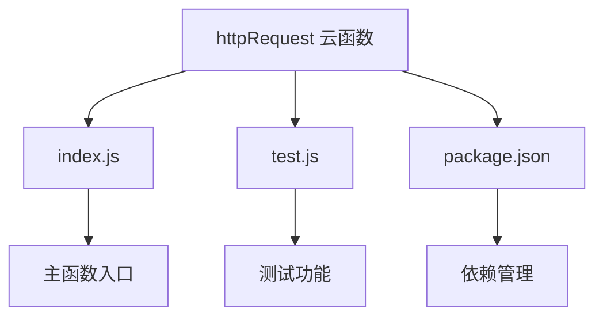
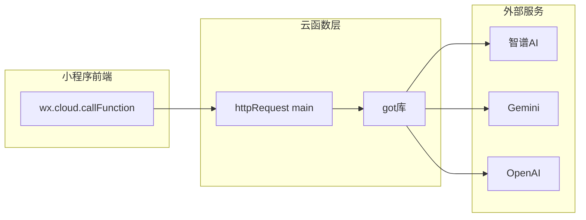
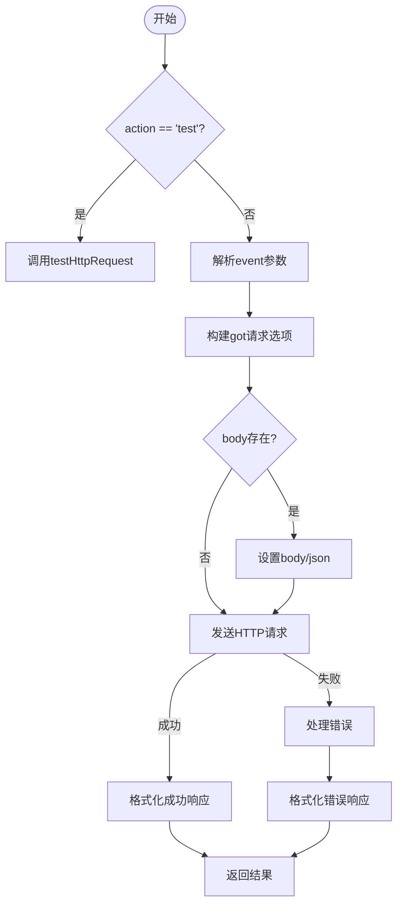
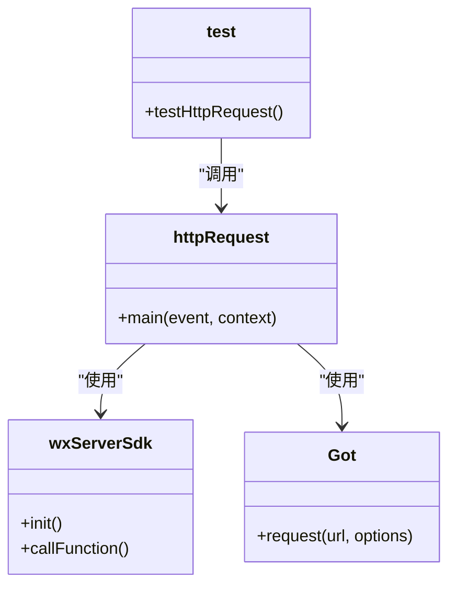

# HTTP请求代理服务

<cite>
**本文档引用文件**   
- [index.js](file://cloudfunctions/httpRequest/index.js)
- [test.js](file://cloudfunctions/httpRequest/test.js)
- [httpRequest.md](file://doc/开发文档/cloudfunctions/httpRequest.md)
- [httpRequest云函数使用文档.md](file://doc/使用文档/httpRequest云函数使用文档.md)
</cite>

## 目录
1. [简介](#简介)
2. [项目结构](#项目结构)
3. [核心组件](#核心组件)
4. [架构概述](#架构概述)
5. [详细组件分析](#详细组件分析)
6. [依赖分析](#依赖分析)
7. [性能考量](#性能考量)
8. [故障排除指南](#故障排除指南)
9. [结论](#结论)

## 简介
`httpRequest` 云函数是HeartChat项目中的一个通用HTTP请求代理服务，旨在为小程序提供统一的外部API网关。该服务通过微信云函数环境中的`got`库，代理转发请求至智谱AI、Gemini、OpenAI等第三方AI服务，解决了小程序前端直接调用外部API时可能遇到的跨域限制问题。云函数支持多种HTTP方法，具备请求头处理、超时配置、错误重试和日志记录等核心功能，是连接小程序与外部AI能力的关键桥梁。

## 项目结构
`httpRequest` 云函数的项目结构简洁明了，主要由主入口文件、测试模块和依赖配置组成。

**图示来源**
- [index.js](file://cloudfunctions/httpRequest/index.js#L1-L62)
- [test.js](file://cloudfunctions/httpRequest/test.js#L1-L50)
- [package.json](file://cloudfunctions/httpRequest/package.json)

**本节来源**
- [httpRequest.md](file://doc/开发文档/cloudfunctions/httpRequest.md#L1-L10)

## 核心组件
`httpRequest` 云函数的核心功能由 `index.js` 文件中的 `main` 函数实现。该函数接收来自小程序前端的请求参数，利用 `got` 库在云函数环境中发起实际的HTTP请求，并将响应结果返回给前端。其核心职责包括请求参数解析、请求选项构建、请求发送、响应处理和错误捕获。`test.js` 文件则提供了一个独立的测试功能，用于验证云函数的可用性，通过调用自身向公共测试API（httpbin.org）发送请求来确认服务状态。

**本节来源**
- [index.js](file://cloudfunctions/httpRequest/index.js#L1-L62)
- [test.js](file://cloudfunctions/httpRequest/test.js#L1-L50)

## 架构概述
`httpRequest` 云函数作为统一的外部API网关，其架构设计遵循简单、可靠的原则。它位于小程序前端与外部AI服务之间，充当代理角色。前端通过 `wx.cloud.callFunction` 调用此云函数，传入目标URL、请求方法、头信息、请求体等参数。云函数在安全的后端环境中执行，规避了前端的跨域限制，并能安全地处理包含API密钥等敏感信息的请求。整个流程清晰，从接收事件到返回结果，确保了外部API调用的稳定性和安全性。

**图示来源**
- [index.js](file://cloudfunctions/httpRequest/index.js#L1-L62)
- [httpRequest.md](file://doc/开发文档/cloudfunctions/httpRequest.md#L1-L10)

## 详细组件分析

### 主函数分析
`index.js` 中的 `main` 函数是整个云函数的核心，负责处理所有传入的请求。

#### 请求处理流程

**图示来源**
- [index.js](file://cloudfunctions/httpRequest/index.js#L15-L62)

#### 请求头与请求体处理
云函数对请求头和请求体的处理非常灵活。`headers` 参数直接传递给 `got` 库，允许前端自定义如 `Content-Type` 和 `Authorization` 等关键头信息，这对于调用需要身份验证的AI服务至关重要。对于 `body` 参数，函数会进行类型判断：如果 `body` 是字符串，则直接作为请求体发送；如果是对象，则自动序列化为JSON并设置 `Content-Type: application/json`，简化了前端的调用逻辑。

**本节来源**
- [index.js](file://cloudfunctions/httpRequest/index.js#L40-L48)

#### 超时配置与错误重试机制
云函数内置了超时保护机制，`timeout` 参数默认设置为30000毫秒（30秒），可由调用方根据目标API的响应时间进行调整。当请求因网络问题或服务器超时而失败时，`got` 库会抛出错误，云函数会捕获该错误，并在返回的响应中包含 `error: true`、具体的 `statusCode` 和 `message`，便于前端进行错误处理。值得注意的是，当前实现中并未包含显式的重试次数和退避策略，错误处理主要依赖于 `got` 库的底层机制和前端的重试逻辑。

**本节来源**
- [index.js](file://cloudfunctions/httpRequest/index.js#L35-L38)
- [index.js](file://cloudfunctions/httpRequest/index.js#L55-L62)

#### 日志记录格式
云函数在关键执行点使用 `console.log` 和 `console.error` 进行日志记录。成功发送请求时，会记录 `发送HTTP请求: ${method} ${url}`；请求失败时，会记录完整的错误对象 `HTTP请求失败:`。这些日志对于在云开发控制台中排查问题、监控服务状态和分析性能瓶颈至关重要。

**本节来源**
- [index.js](file://cloudfunctions/httpRequest/index.js#L34)
- [index.js](file://cloudfunctions/httpRequest/index.js#L55)

### 测试功能分析
`test.js` 模块提供了一个自检功能，通过 `action: 'test'` 参数触发。它会递归地调用 `httpRequest` 云函数自身，向 `https://httpbin.org/get` 发送一个GET请求。这不仅验证了云函数的网络连通性，也验证了其自身的调用链路是否正常。测试结果会以结构化的JSON格式返回，包含 `success`、`message` 和详细的 `result`，为开发者提供了一种便捷的健康检查手段。

**本节来源**
- [test.js](file://cloudfunctions/httpRequest/test.js#L1-L50)

## 依赖分析
`httpRequest` 云函数的依赖关系清晰，主要依赖两个核心模块。

**图示来源**
- [index.js](file://cloudfunctions/httpRequest/index.js#L1-L2)
- [test.js](file://cloudfunctions/httpRequest/test.js#L1-L2)

**本节来源**
- [package.json](file://cloudfunctions/httpRequest/package.json)

## 性能考量
使用 `httpRequest` 云函数时，需关注以下性能指标和限制：
- **响应延迟**：总延迟包括云函数冷启动时间、网络传输时间（从前端到云函数，从云函数到目标服务）和目标服务的处理时间。
- **失败率**：主要受目标服务可用性、网络状况和云函数执行超时的影响。
- **资源限制**：微信云函数有默认20秒的执行时间限制和256MB的内存限制，处理大响应体或长时间运行的请求时需特别注意。
- **安全策略**：云函数本身不主动过滤请求头，因此前端在调用时应避免在URL或请求头中传递敏感信息，API密钥等应通过安全的方式（如环境变量）管理。

## 故障排除指南
以下是一些常见问题及其解决方案：

### 跨域失败
**问题**：在前端直接调用外部API时出现跨域错误。
**解决方案**：这是使用 `httpRequest` 云函数的主要目的。将请求通过 `wx.cloud.callFunction` 发送到云函数，由云函数在后端发起请求，即可规避前端的跨域限制。

### 鉴权错误
**问题**：调用AI服务API时返回401或403错误。
**解决方案**：
- 检查 `Authorization` 请求头中的API密钥是否正确无误。
- 确认密钥未过期或被撤销。
- 确保请求头的格式正确，例如 `Bearer your-api-key`。

### 请求超时
**问题**：云函数返回超时错误。
**解决方案**：
- 增加 `timeout` 参数的值，但需确保不超过云函数20秒的总执行时间限制。
- 检查目标AI服务的响应时间是否过长。
- 优化请求，减少请求体大小或分批处理数据。

### 无法解析响应
**问题**：前端收到响应后，`JSON.parse()` 失败。
**解决方案**：
- 检查响应的 `Content-Type` 头，确认其为 `application/json`。
- 在尝试解析前，先检查 `result.result.error` 字段，避免解析错误响应体。
- 使用 `try...catch` 包裹 `JSON.parse()` 以优雅地处理解析错误。

**本节来源**
- [httpRequest云函数使用文档.md](file://doc/使用文档/httpRequest云函数使用文档.md#L256-L269)

## 结论
`httpRequest` 云函数成功实现了作为统一外部API网关的设计目标。它通过简洁高效的代码，为小程序提供了稳定、安全的HTTP请求能力，有效解决了跨域问题，并支持对智谱AI、Gemini等主流AI服务的代理调用。其清晰的架构、灵活的参数配置和完善的错误处理机制，使其成为项目中不可或缺的基础设施。未来可考虑在云函数内部实现更智能的重试策略和性能监控，以进一步提升服务的健壮性和可观测性。