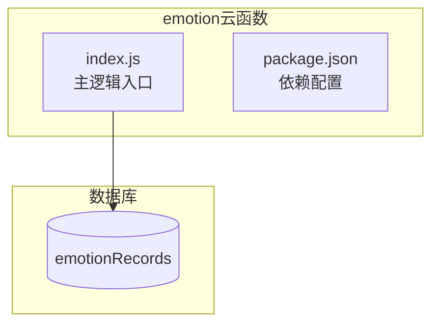
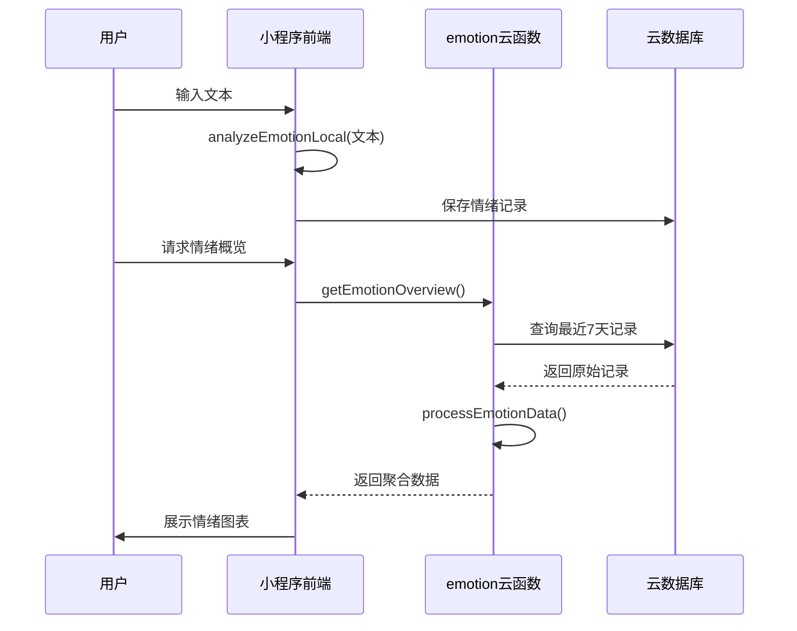
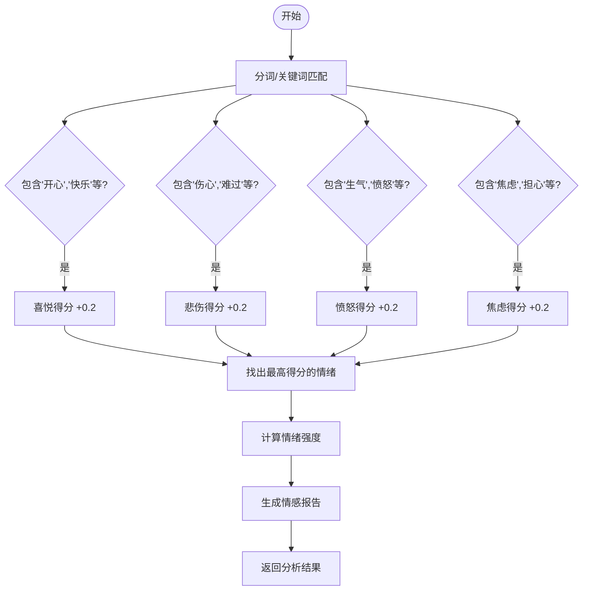
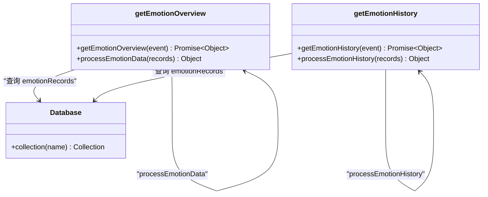
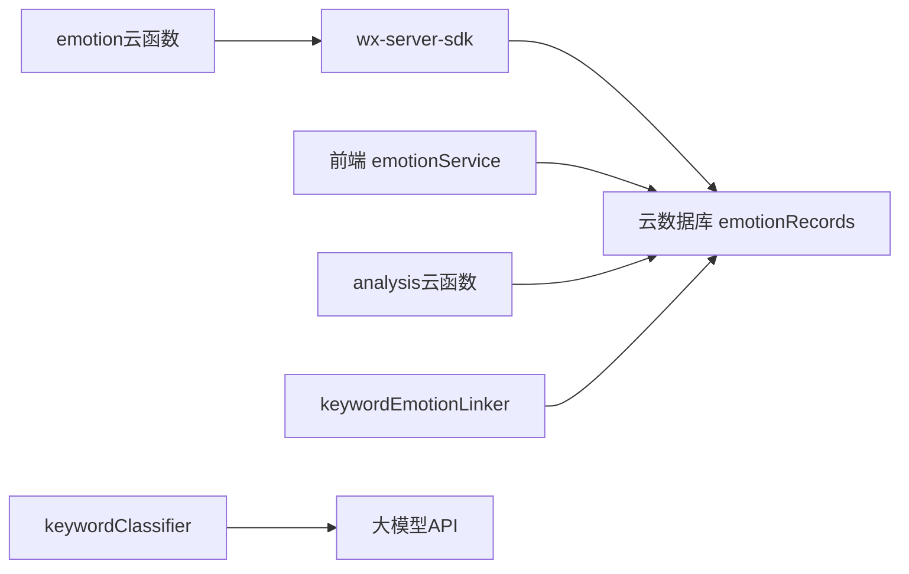

# 基础情绪分析服务

<cite>
**本文档引用文件**  
- [index.js](file://cloudfunctions/emotion/index.js)
- [keywordClassifier.js](file://cloudfunctions/analysis/keywordClassifier.js)
- [keywords.js](file://cloudfunctions/analysis/keywords.js)
- [keywordEmotionLinker.js](file://cloudfunctions/analysis/keywordEmotionLinker.js)
- [emotion.js](file://miniprogram/utils/emotion.js)
- [emotionService.js](file://miniprogram/services/emotionService.js)
</cite>

## 目录
1. [简介](#简介)
2. [项目结构](#项目结构)
3. [核心组件](#核心组件)
4. [架构概览](#架构概览)
5. [详细组件分析](#详细组件分析)
6. [依赖分析](#依赖分析)
7. [性能考量](#性能考量)
8. [故障排查指南](#故障排查指南)
9. [结论](#结论)

## 简介
`emotion`云函数为HeartChat系统提供轻量级情绪识别能力，专注于快速、高效地对用户输入文本进行基础情绪分类。该服务通过规则驱动的方式实现正向、负向和中性情绪的快速打标，适用于需要低延迟响应的场景。与更复杂的`analysis`云函数形成分工协作：`emotion`负责实时、高频的情绪感知，而`analysis`则处理深度语义分析和多维度心理评估。

## 项目结构
`emotion`云函数位于`cloudfunctions/emotion/`目录下，结构简洁，仅包含核心逻辑文件`index.js`和依赖配置`package.json`。其设计目标是提供最小化的情绪识别接口，不依赖外部AI模型，确保执行效率和成本控制。

**Diagram sources**
- [index.js](file://cloudfunctions/emotion/index.js#L1-L265)

**Section sources**
- [index.js](file://cloudfunctions/emotion/index.js#L1-L265)

## 核心组件
`emotion`云函数的核心功能并非直接进行情绪分类，而是提供**情绪数据聚合与历史分析**服务。它不接收原始文本输入进行实时分析，而是从数据库`emotionRecords`中读取已有的情绪记录，并进行统计和可视化处理。真正的基础情绪分析逻辑存在于小程序前端的`utils/emotion.js`中，采用关键词匹配的轻量级规则引擎。

**Section sources**
- [index.js](file://cloudfunctions/emotion/index.js#L1-L265)
- [emotion.js](file://miniprogram/utils/emotion.js#L90-L125)

## 架构概览
整个基础情绪分析流程涉及前端与后端的协同。前端`emotionService`在用户输入后，调用本地`analyzeEmotionLocal`函数进行即时分析，结果存入数据库。`emotion`云函数则作为数据服务层，为情绪概览和历史页面提供聚合数据。

**Diagram sources**
- [index.js](file://cloudfunctions/emotion/index.js#L1-L265)
- [emotion.js](file://miniprogram/utils/emotion.js#L120-L169)
- [emotionService.js](file://miniprogram/services/emotionService.js#L862-L911)

## 详细组件分析

### 情绪分析逻辑分析
前端实现的本地情绪分析采用基于关键词的规则匹配。它预定义了喜悦、悲伤、愤怒、焦虑等情绪类别的关键词库，通过计算文本中各类关键词的出现频率来确定主导情绪。

**Diagram sources**
- [emotion.js](file://miniprogram/utils/emotion.js#L90-L125)

**Section sources**
- [emotion.js](file://miniprogram/utils/emotion.js#L90-L169)

### 情绪数据聚合分析
`emotion`云函数的`getEmotionOverview`和`getEmotionHistory`函数负责数据聚合。它们从`emotionRecords`集合中查询数据，并通过`processEmotionData`和`processEmotionHistory`函数进行统计。

**Diagram sources**
- [index.js](file://cloudfunctions/emotion/index.js#L1-L265)

**Section sources**
- [index.js](file://cloudfunctions/emotion/index.js#L1-L265)

## 依赖分析
`emotion`云函数的依赖关系简单清晰，仅依赖微信云开发的`wx-server-sdk`进行数据库操作。其数据源`emotionRecords`的原始数据由前端或其他云函数（如`analysis`）写入。`analysis`云函数中的`keywordClassifier`和`keywordEmotionLinker`模块则与`emotion`服务形成互补，前者进行关键词分类，后者将情感分数与关键词关联，共同构建用户兴趣画像。

**Diagram sources**
- [index.js](file://cloudfunctions/emotion/index.js#L1-L265)
- [keywordClassifier.js](file://cloudfunctions/analysis/keywordClassifier.js#L1-L298)
- [keywordEmotionLinker.js](file://cloudfunctions/analysis/keywordEmotionLinker.js#L1-L206)

**Section sources**
- [index.js](file://cloudfunctions/emotion/index.js#L1-L265)
- [keywordClassifier.js](file://cloudfunctions/analysis/keywordClassifier.js#L1-L298)
- [keywordEmotionLinker.js](file://cloudfunctions/analysis/keywordEmotionLinker.js#L1-L206)

## 性能考量
`emotion`云函数的设计充分考虑了性能：
1.  **轻量级**：无外部模型调用，执行速度快，冷启动时间短。
2.  **低成本**：计算密集度低，符合云函数按量计费的经济性原则。
3.  **高并发**：逻辑简单，可轻松应对大量并发请求。
4.  **数据聚合**：通过数据库查询和内存计算完成聚合，避免了复杂的实时分析。

其局限性在于分析深度有限，仅能处理预定义的简单情绪类别，无法理解复杂语境或隐喻。

## 故障排查指南
当`emotion`云函数返回失败时，可参考以下步骤：
1.  **检查日志**：查看云开发控制台的日志，定位错误信息。
2.  **验证参数**：确认调用`getEmotionOverview`或`getEmotionHistory`时传递了正确的`userId`或使用了有效的微信上下文。
3.  **检查数据库**：确认`emotionRecords`集合存在，且指定`userId`的记录非空。
4.  **检查权限**：确保云函数有读取`emotionRecords`集合的数据库权限。

**Section sources**
- [index.js](file://cloudfunctions/emotion/index.js#L1-L265)

## 结论
`emotion`云函数是HeartChat系统中负责情绪数据聚合与展示的核心服务。它与前端的轻量级规则分析引擎协同工作，实现了高效、低成本的基础情绪识别功能。其与`analysis`云函数的明确分工，确保了系统既能提供实时的情绪反馈，又能进行深度的用户心理分析，共同构建了一个多层次、立体化的情绪感知体系。