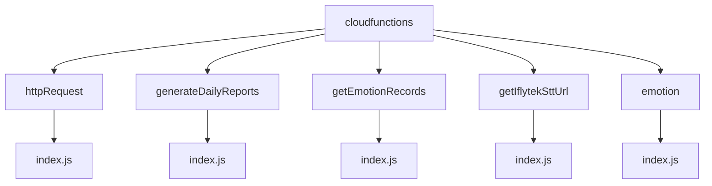
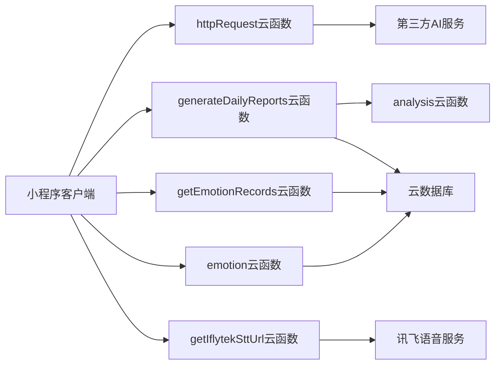
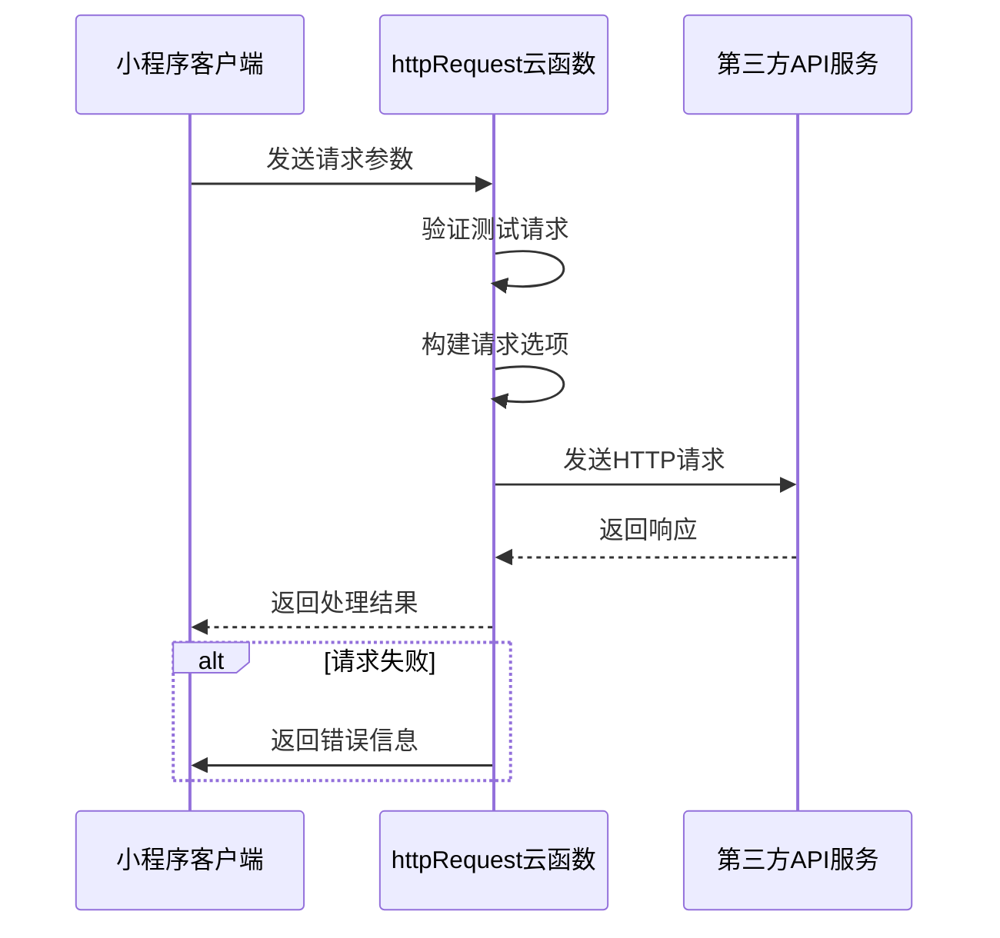
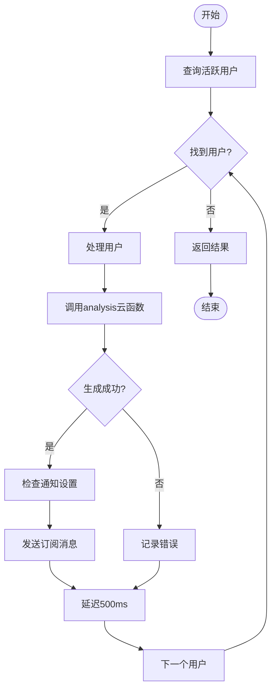
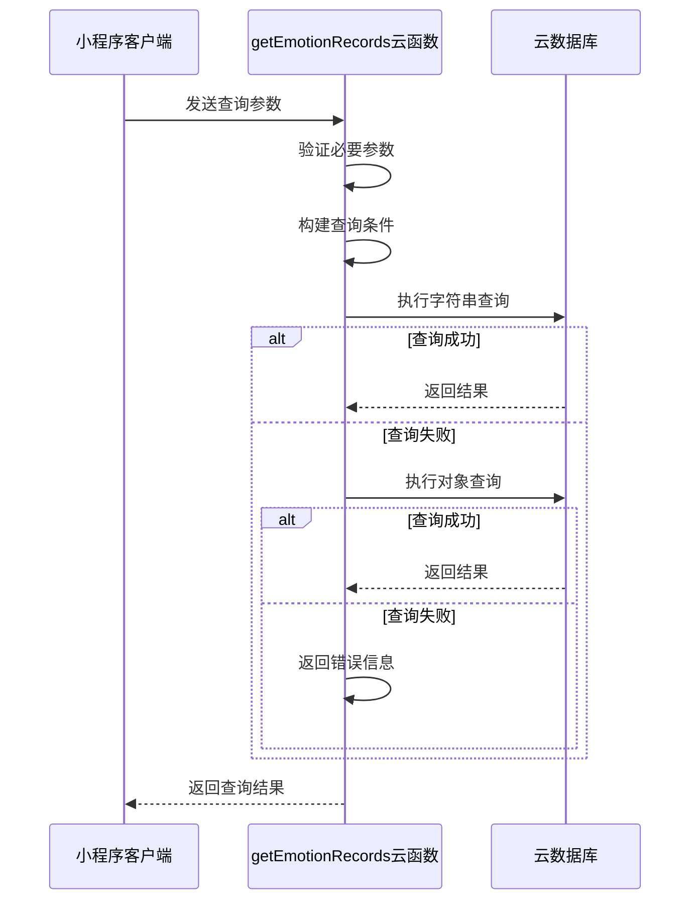
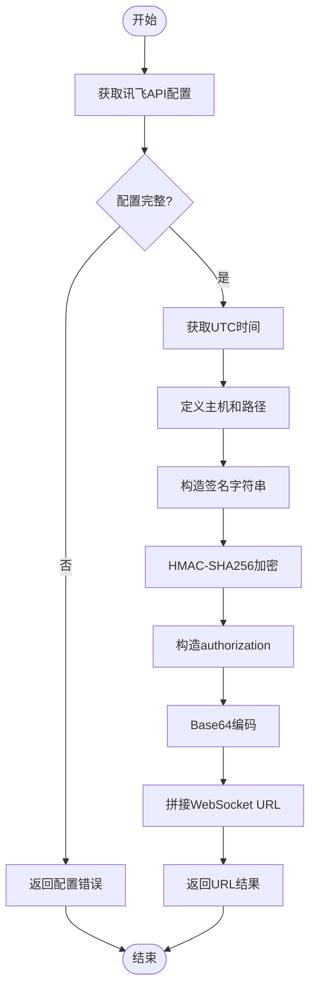
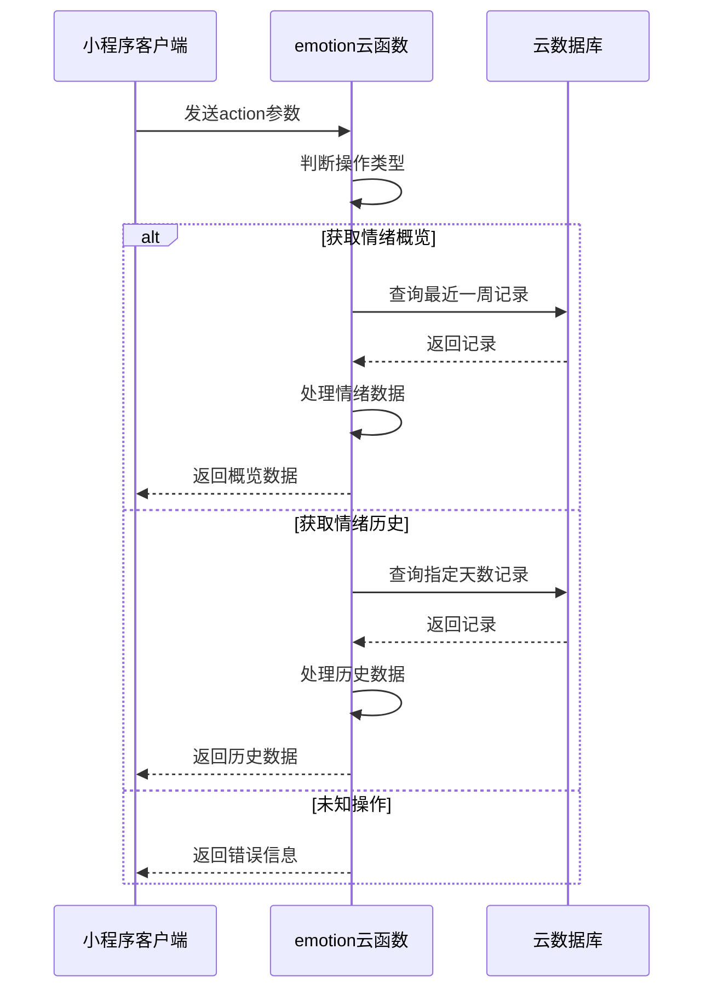
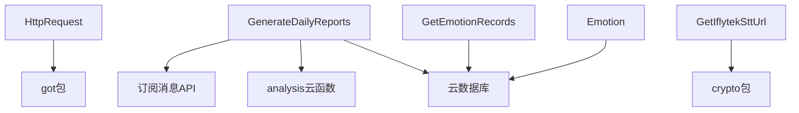

# 工具类服务

<cite>
**本文档引用的文件**
- [httpRequest/index.js](file://cloudfunctions/httpRequest/index.js)
- [generateDailyReports/index.js](file://cloudfunctions/generateDailyReports/index.js)
- [getEmotionRecords/index.js](file://cloudfunctions/getEmotionRecords/index.js)
- [getIflytekSttUrl/index.js](file://cloudfunctions/getIflytekSttUrl/index.js)
- [emotion/index.js](file://cloudfunctions/emotion/index.js)
</cite>

## 目录
1. [简介](#简介)
2. [项目结构](#项目结构)
3. [核心组件](#核心组件)
4. [架构概览](#架构概览)
5. [详细组件分析](#详细组件分析)
6. [依赖分析](#依赖分析)
7. [性能考量](#性能考量)
8. [故障排查指南](#故障排查指南)
9. [结论](#结论)

## 简介
本文档全面介绍HeartChat项目中的工具类云函数服务，涵盖`httpRequest`、`generateDailyReports`、`getEmotionRecords`、`getIflytekSttUrl`和`emotion`等辅助服务。详细说明各服务的功能实现、调用逻辑、性能指标及监控建议，为开发者提供完整的使用和维护指南。

## 项目结构
工具类云函数位于`cloudfunctions`目录下，每个服务独立成子目录，包含`index.js`主逻辑文件和`package.json`依赖配置。这种模块化设计便于独立部署和维护。

**图示来源**
- [httpRequest/index.js](file://cloudfunctions/httpRequest/index.js#L1-L63)
- [generateDailyReports/index.js](file://cloudfunctions/generateDailyReports/index.js#L1-L200)
- [getEmotionRecords/index.js](file://cloudfunctions/getEmotionRecords/index.js#L1-L112)
- [getIflytekSttUrl/index.js](file://cloudfunctions/getIflytekSttUrl/index.js#L1-L69)
- [emotion/index.js](file://cloudfunctions/emotion/index.js#L1-L265)

**本节来源**
- [cloudfunctions](file://cloudfunctions)

## 核心组件
本文档涵盖五个核心工具类云函数：`httpRequest`作为统一网关代理外部API请求；`generateDailyReports`生成个性化心情报告；`getEmotionRecords`查询历史情绪记录；`getIflytekSttUrl`集成讯飞语音听写服务；`emotion`提供基础情绪分析能力。

**本节来源**
- [httpRequest/index.js](file://cloudfunctions/httpRequest/index.js#L1-L63)
- [generateDailyReports/index.js](file://cloudfunctions/generateDailyReports/index.js#L1-L200)
- [getEmotionRecords/index.js](file://cloudfunctions/getEmotionRecords/index.js#L1-L112)
- [getIflytekSttUrl/index.js](file://cloudfunctions/getIflytekSttUrl/index.js#L1-L69)
- [emotion/index.js](file://cloudfunctions/emotion/index.js#L1-L265)

## 架构概览
工具类服务采用微服务架构，各云函数独立运行，通过微信云开发平台提供的API进行数据库访问和外部服务调用。`httpRequest`作为统一出口，代理所有外部API请求，实现请求转发、错误重试和日志记录。

**图示来源**
- [httpRequest/index.js](file://cloudfunctions/httpRequest/index.js#L1-L63)
- [generateDailyReports/index.js](file://cloudfunctions/generateDailyReports/index.js#L1-L200)
- [getEmotionRecords/index.js](file://cloudfunctions/getEmotionRecords/index.js#L1-L112)
- [getIflytekSttUrl/index.js](file://cloudfunctions/getIflytekSttUrl/index.js#L1-L69)
- [emotion/index.js](file://cloudfunctions/emotion/index.js#L1-L265)

## 详细组件分析

### httpRequest云函数分析
`httpRequest`云函数作为统一网关，代理外部API请求，实现请求转发、错误重试和日志记录功能。

#### 功能实现流程

**图示来源**
- [httpRequest/index.js](file://cloudfunctions/httpRequest/index.js#L1-L63)

**本节来源**
- [httpRequest/index.js](file://cloudfunctions/httpRequest/index.js#L1-L63)

### generateDailyReports云函数分析
`generateDailyReports`云函数负责生成个性化心情报告，通过定时任务触发，实现数据聚合和报告生成。

#### 定时任务逻辑

**图示来源**
- [generateDailyReports/index.js](file://cloudfunctions/generateDailyReports/index.js#L1-L200)

**本节来源**
- [generateDailyReports/index.js](file://cloudfunctions/generateDailyReports/index.js#L1-L200)

### getEmotionRecords云函数分析
`getEmotionRecords`云函数提供历史情绪记录查询服务，支持分页和过滤机制。

#### 查询机制流程

**图示来源**
- [getEmotionRecords/index.js](file://cloudfunctions/getEmotionRecords/index.js#L1-L112)

**本节来源**
- [getEmotionRecords/index.js](file://cloudfunctions/getEmotionRecords/index.js#L1-L112)

### getIflytekSttUrl云函数分析
`getIflytekSttUrl`云函数集成讯飞语音听写服务，生成WebSocket连接URL。

#### URL生成逻辑

**图示来源**
- [getIflytekSttUrl/index.js](file://cloudfunctions/getIflytekSttUrl/index.js#L1-L69)

**本节来源**
- [getIflytekSttUrl/index.js](file://cloudfunctions/getIflytekSttUrl/index.js#L1-L69)

### emotion云函数分析
`emotion`云函数提供基础情绪分析能力，支持情绪概览和历史查询。

#### 功能调用流程

**图示来源**
- [emotion/index.js](file://cloudfunctions/emotion/index.js#L1-L265)

**本节来源**
- [emotion/index.js](file://cloudfunctions/emotion/index.js#L1-L265)

## 依赖分析
工具类服务之间存在明确的依赖关系，`generateDailyReports`依赖`analysis`云函数生成报告内容，`httpRequest`作为外部服务调用的统一入口。

**图示来源**
- [httpRequest/index.js](file://cloudfunctions/httpRequest/index.js#L1-L63)
- [generateDailyReports/index.js](file://cloudfunctions/generateDailyReports/index.js#L1-L200)
- [getEmotionRecords/index.js](file://cloudfunctions/getEmotionRecords/index.js#L1-L112)
- [getIflytekSttUrl/index.js](file://cloudfunctions/getIflytekSttUrl/index.js#L1-L69)
- [emotion/index.js](file://cloudfunctions/emotion/index.js#L1-L265)

**本节来源**
- [httpRequest/index.js](file://cloudfunctions/httpRequest/index.js#L1-L63)
- [generateDailyReports/index.js](file://cloudfunctions/generateDailyReports/index.js#L1-L200)
- [getEmotionRecords/index.js](file://cloudfunctions/getEmotionRecords/index.js#L1-L112)
- [getIflytekSttUrl/index.js](file://cloudfunctions/getIflytekSttUrl/index.js#L1-L69)
- [emotion/index.js](file://cloudfunctions/emotion/index.js#L1-L265)

## 性能考量
各工具类服务的性能指标和监控建议如下：

| 服务名称 | 调用频率 | 平均响应时间 | 内存使用 | 监控建议 |
|--------|--------|------------|--------|--------|
| httpRequest | 高 | <500ms | 128MB | 监控外部API调用成功率 |
| generateDailyReports | 低（定时） | <30s | 512MB | 监控任务执行时间和成功率 |
| getEmotionRecords | 中 | <200ms | 128MB | 监控查询性能和错误率 |
| getIflytekSttUrl | 中 | <100ms | 128MB | 监控配置完整性和URL生成成功率 |
| emotion | 高 | <300ms | 256MB | 监控数据处理性能和错误率 |

**本节来源**
- [httpRequest/index.js](file://cloudfunctions/httpRequest/index.js#L1-L63)
- [generateDailyReports/index.js](file://cloudfunctions/generateDailyReports/index.js#L1-L200)
- [getEmotionRecords/index.js](file://cloudfunctions/getEmotionRecords/index.js#L1-L112)
- [getIflytekSttUrl/index.js](file://cloudfunctions/getIflytekSttUrl/index.js#L1-L69)
- [emotion/index.js](file://cloudfunctions/emotion/index.js#L1-L265)

## 故障排查指南
常见问题及解决方案：

1. **httpRequest调用失败**
   - 检查URL格式是否正确
   - 验证请求头和请求体
   - 查看云函数日志中的错误信息

2. **每日报告未生成**
   - 检查定时触发器是否正常
   - 验证analysis云函数是否可用
   - 确认用户是否有情感记录

3. **情绪记录查询为空**
   - 确认userId参数正确
   - 检查数据库中是否存在对应记录
   - 验证时间范围是否合理

4. **讯飞语音URL生成失败**
   - 检查环境变量配置
   - 验证APPID、API_SECRET、API_KEY
   - 确认时间同步是否正常

5. **情绪分析数据异常**
   - 检查emotionRecords表结构
   - 验证数据格式是否符合预期
   - 确认主要情绪字段是否存在

**本节来源**
- [httpRequest/index.js](file://cloudfunctions/httpRequest/index.js#L1-L63)
- [generateDailyReports/index.js](file://cloudfunctions/generateDailyReports/index.js#L1-L200)
- [getEmotionRecords/index.js](file://cloudfunctions/getEmotionRecords/index.js#L1-L112)
- [getIflytekSttUrl/index.js](file://cloudfunctions/getIflytekSttUrl/index.js#L1-L69)
- [emotion/index.js](file://cloudfunctions/emotion/index.js#L1-L265)

## 结论
本文档详细介绍了HeartChat项目中的工具类云函数服务，涵盖了功能实现、架构设计、性能指标和故障排查等方面。这些服务共同构成了应用的核心辅助功能，为用户提供稳定可靠的技术支持。