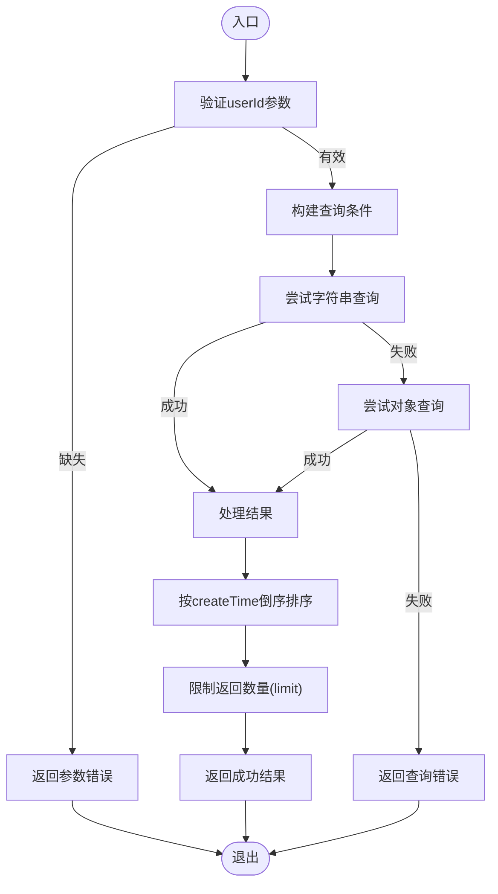
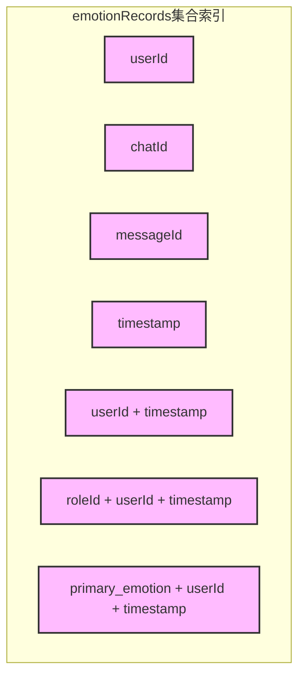
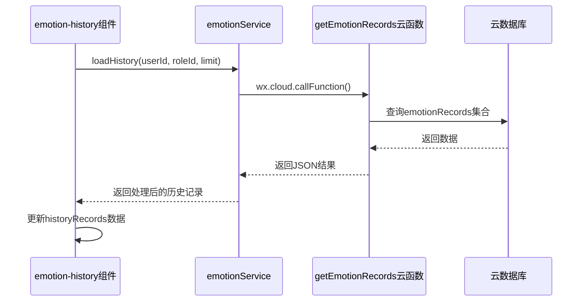
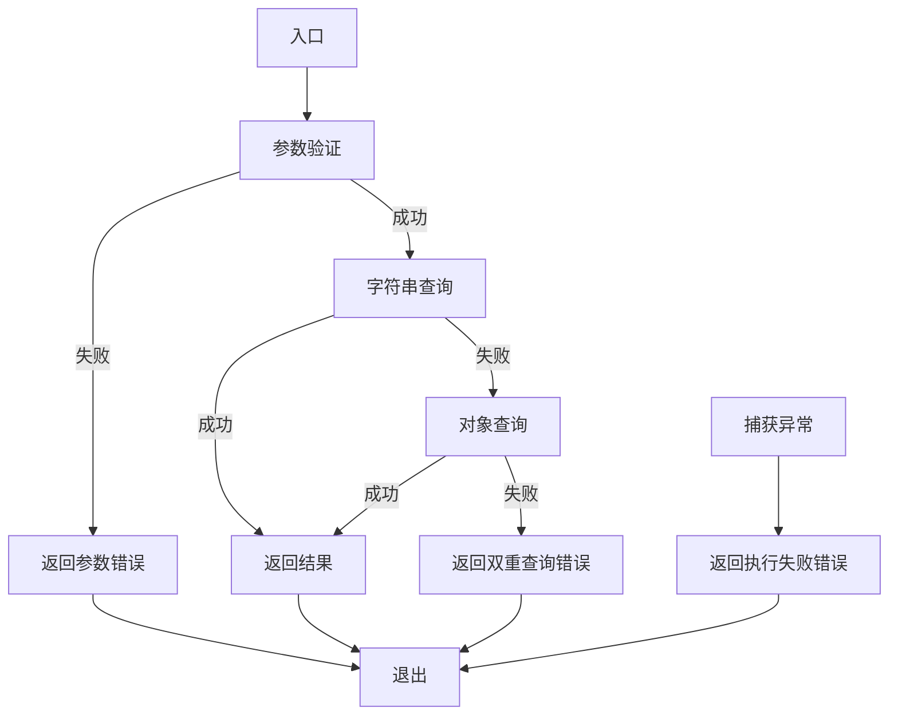

# 情绪记录查询服务

<cite>
**本文档引用文件**  
- [getEmotionRecords/index.js](file://cloudfunctions/getEmotionRecords/index.js)
- [emotionService.js](file://miniprogram/services/emotionService.js)
- [emotion-history.js](file://miniprogram/components/emotion-history/emotion-history.js)
- [emotionRecords.md](file://doc/开发文档/database/emotionRecords.md)
- [createIndexes.js](file://cloudfunctions/user/createIndexes.js)
</cite>

## 目录
1. [简介](#简介)
2. [请求参数说明](#请求参数说明)
3. [返回数据结构](#返回数据结构)
4. [核心实现机制](#核心实现机制)
5. [性能考量与索引优化](#性能考量与索引优化)
6. [前端集成示例](#前端集成示例)
7. [错误处理机制](#错误处理机制)

## 简介
`getEmotionRecords` 云函数为前端情绪历史页面提供分页查询支持，实现基于用户ID、角色ID等条件从云数据库检索 `emotionRecords` 集合数据的功能。该服务支持分页（limit）、排序（按创建时间倒序）和基础过滤功能，是情绪历史追踪与分析的核心数据接口。

**Section sources**
- [getEmotionRecords/index.js](file://cloudfunctions/getEmotionRecords/index.js#L1-L112)

## 请求参数说明
云函数接收以下参数以构建查询条件：

| 参数名 | 类型 | 是否必需 | 默认值 | 说明 |
| :--- | :--- | :--- | :--- | :--- |
| `userId` | String | 是 | 无 | 用户唯一标识，用于定位用户的情绪记录 |
| `roleId` | String | 否 | 无 | 角色ID，用于筛选特定角色下的情绪记录 |
| `limit` | Number | 否 | 20 | 每页返回记录数量，用于实现分页功能 |

**Section sources**
- [getEmotionRecords/index.js](file://cloudfunctions/getEmotionRecords/index.js#L10-L13)

## 返回数据结构
云函数返回标准化的JSON响应，包含查询结果和上下文信息。

### 成功响应
```json
{
  "success": true,
  "data": [
    {
      "_id": "记录ID",
      "userId": "用户ID",
      "roleId": "角色ID",
      "analysis": {
        "type": "情感类型",
        "intensity": 0.8,
        "primary_emotion": "主要情感",
        "topic_keywords": ["关键词1", "关键词2"],
        "summary": "情感总结"
      },
      "originalText": "原始文本",
      "createTime": "创建时间"
    }
  ],
  "openid": "用户openid",
  "appid": "小程序appid",
  "unionid": "用户unionid"
}
```

### 失败响应
```json
{
  "success": false,
  "error": "错误信息",
  "openid": "用户openid"
}
```

**Section sources**
- [getEmotionRecords/index.js](file://cloudfunctions/getEmotionRecords/index.js#L80-L90)
- [getEmotionRecords/index.js](file://cloudfunctions/getEmotionRecords/index.js#L105-L110)

## 核心实现机制
云函数通过双重查询策略确保查询的兼容性和稳定性。



**Diagram sources**
- [getEmotionRecords/index.js](file://cloudfunctions/getEmotionRecords/index.js#L14-L112)

**Section sources**
- [getEmotionRecords/index.js](file://cloudfunctions/getEmotionRecords/index.js#L14-L112)

## 性能考量与索引优化
为确保查询性能，数据库已为 `emotionRecords` 集合创建了多个索引。



**Diagram sources**
- [createIndexes.js](file://cloudfunctions/user/createIndexes.js#L151-L185)
- [emotionRecords.md](file://doc/开发文档/database/emotionRecords.md#L63-L66)

**Section sources**
- [createIndexes.js](file://cloudfunctions/user/createIndexes.js#L151-L185)
- [emotionRecords.md](file://doc/开发文档/database/emotionRecords.md#L63-L66)

## 前端集成示例
前端通过 `emotionService` 服务调用云函数，与 `emotion-history` 组件集成。



**Diagram sources**
- [emotion-history.js](file://miniprogram/components/emotion-history/emotion-history.js#L70-L100)
- [emotionService.js](file://miniprogram/services/emotionService.js#L700-L750)

**Section sources**
- [emotion-history.js](file://miniprogram/components/emotion-history/emotion-history.js#L70-L100)
- [emotionService.js](file://miniprogram/services/emotionService.js#L700-L750)

## 错误处理机制
云函数实现了分层错误处理，确保服务的健壮性。



**Diagram sources**
- [getEmotionRecords/index.js](file://cloudfunctions/getEmotionRecords/index.js#L14-L112)

**Section sources**
- [getEmotionRecords/index.js](file://cloudfunctions/getEmotionRecords/index.js#L14-L112)