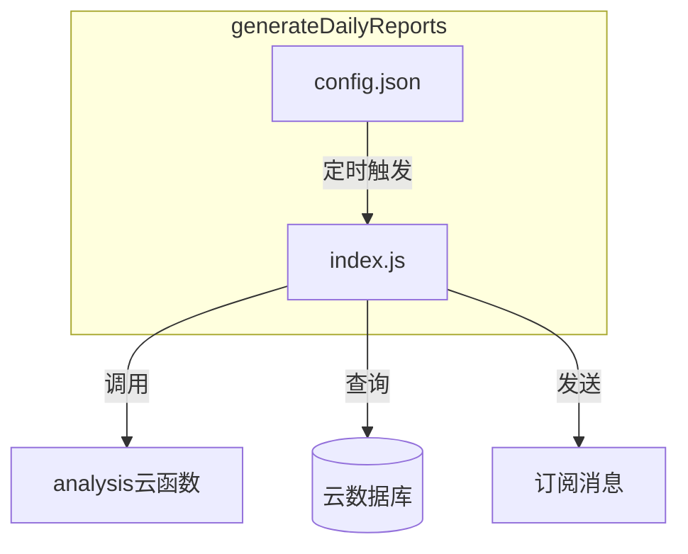
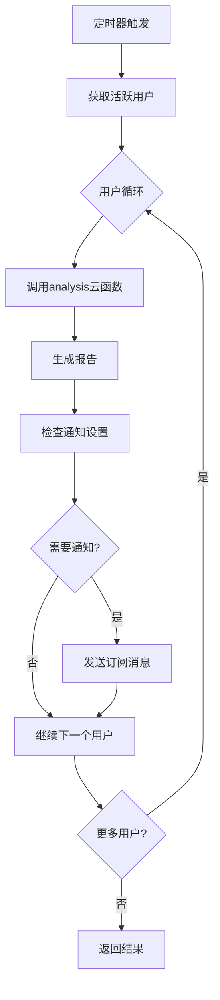
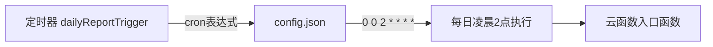
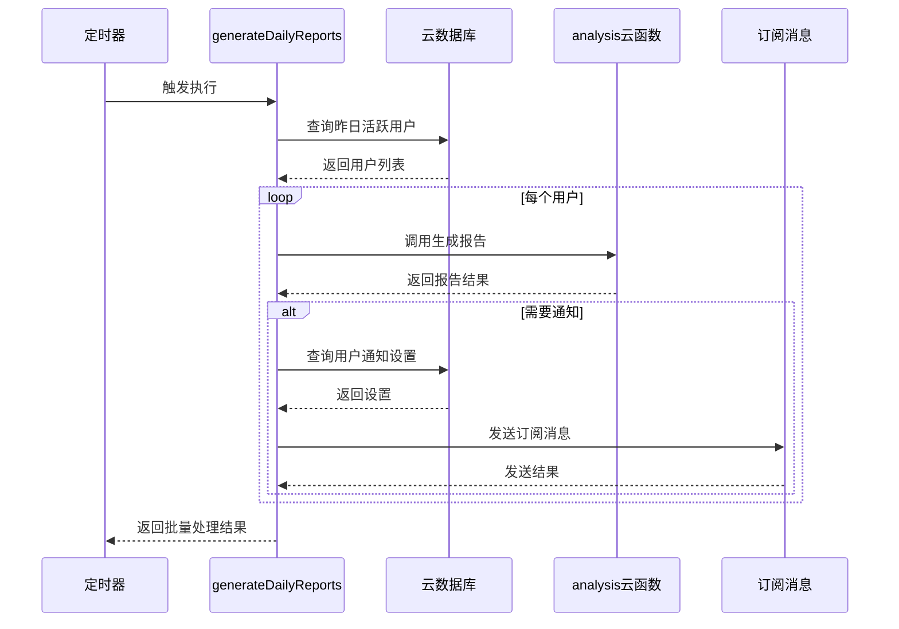
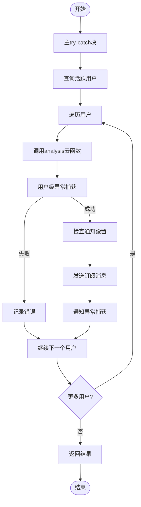
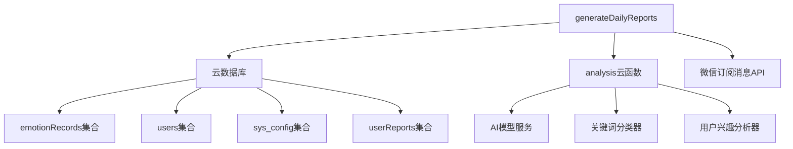

# 每日报告生成服务

<cite>
**本文档引用文件**  
- [index.js](file://cloudfunctions/generateDailyReports/index.js)
- [config.json](file://cloudfunctions/generateDailyReports/config.json)
- [userReports.md](file://doc/开发文档/database/userReports.md)
</cite>

## 目录
1. [简介](#简介)
2. [项目结构](#项目结构)
3. [核心组件](#核心组件)
4. [架构概览](#架构概览)
5. [详细组件分析](#详细组件分析)
6. [依赖分析](#依赖分析)
7. [性能考虑](#性能考虑)
8. [故障排除指南](#故障排除指南)
9. [结论](#结论)

## 简介
本架构文档详细阐述了`generateDailyReports`云函数如何定时为用户生成个性化心情报告的完整流程。该服务通过聚合用户近期聊天记录、情绪分析结果和兴趣标签，结合配置模板生成结构化报告内容。文档涵盖任务触发机制、数据聚合逻辑、异常处理策略、报告存储方案及性能优化建议，并提供实际调用链路示例。

## 项目结构
`generateDailyReports`云函数位于`cloudfunctions/generateDailyReports`目录下，包含核心逻辑文件`index.js`和定时器配置文件`config.json`。该服务作为后台自动化任务，每日凌晨执行，为活跃用户生成前一天的心情报告。

**Diagram sources**
- [config.json](file://cloudfunctions/generateDailyReports/config.json#L1-L9)
- [index.js](file://cloudfunctions/generateDailyReports/index.js#L1-L201)

**Section sources**
- [config.json](file://cloudfunctions/generateDailyReports/config.json#L1-L9)
- [index.js](file://cloudfunctions/generateDailyReports/index.js#L1-L201)

## 核心组件
`generateDailyReports`云函数的核心功能包括：识别活跃用户、调用分析服务生成报告、发送通知提醒。其通过`analysis`云函数完成复杂的数据分析与报告生成逻辑，自身主要负责批量处理调度与通知分发。

**Section sources**
- [index.js](file://cloudfunctions/generateDailyReports/index.js#L25-L150)

## 架构概览
该服务采用分层架构设计，上层为任务调度与协调层（`generateDailyReports`），下层为数据分析与报告生成层（`analysis`）。通过这种职责分离，确保了系统的可维护性和可扩展性。

**Diagram sources**
- [index.js](file://cloudfunctions/generateDailyReports/index.js#L25-L150)

## 详细组件分析

### 任务触发机制分析
`generateDailyReports`云函数通过定时器触发，配置在`config.json`中，使用标准的cron表达式定义执行时间。

**Diagram sources**
- [config.json](file://cloudfunctions/generateDailyReports/config.json#L1-L9)

**Section sources**
- [config.json](file://cloudfunctions/generateDailyReports/config.json#L1-L9)

### 数据聚合与报告生成流程分析
该服务首先查询前一天有情感记录的活跃用户，然后为每个用户调用`analysis`云函数生成报告。数据聚合主要在`analysis`云函数中完成，`generateDailyReports`主要负责协调。

**Diagram sources**
- [index.js](file://cloudfunctions/generateDailyReports/index.js#L25-L150)

**Section sources**
- [index.js](file://cloudfunctions/generateDailyReports/index.js#L25-L150)

### 异常处理机制分析
服务实现了多层次的异常处理机制，包括主流程异常捕获、单个用户处理异常捕获以及通知发送异常捕获，确保部分失败不会影响整体任务执行。

**Diagram sources**
- [index.js](file://cloudfunctions/generateDailyReports/index.js#L25-L150)

**Section sources**
- [index.js](file://cloudfunctions/generateDailyReports/index.js#L25-L150)

## 依赖分析
`generateDailyReports`云函数依赖多个外部组件，包括云数据库、`analysis`云函数和微信订阅消息API。这些依赖关系构成了完整的服务链路。

**Diagram sources**
- [index.js](file://cloudfunctions/generateDailyReports/index.js#L25-L150)
- [config.json](file://cloudfunctions/generateDailyReports/config.json#L1-L9)

**Section sources**
- [index.js](file://cloudfunctions/generateDailyReports/index.js#L25-L150)
- [config.json](file://cloudfunctions/generateDailyReports/config.json#L1-L9)

## 性能考虑
服务在性能方面采取了多项优化措施，包括限制处理用户数量（limit 100）、添加API调用延迟（500ms）以避免频率过高，以及通过聚合查询减少数据库访问次数。

**Section sources**
- [index.js](file://cloudfunctions/generateDailyReports/index.js#L25-L150)

## 故障排除指南
常见问题包括定时器未触发、报告生成失败和通知发送失败。排查时应首先检查定时器配置、云函数日志以及用户通知权限设置。

**Section sources**
- [index.js](file://cloudfunctions/generateDailyReports/index.js#L25-L150)
- [config.json](file://cloudfunctions/generateDailyReports/config.json#L1-L9)

## 结论
`generateDailyReports`云函数作为自动化报告生成系统的核心调度器，通过合理的架构设计和异常处理机制，确保了每日心情报告的稳定生成与推送。其与`analysis`云函数的职责分离设计，为系统的可维护性和可扩展性提供了保障。