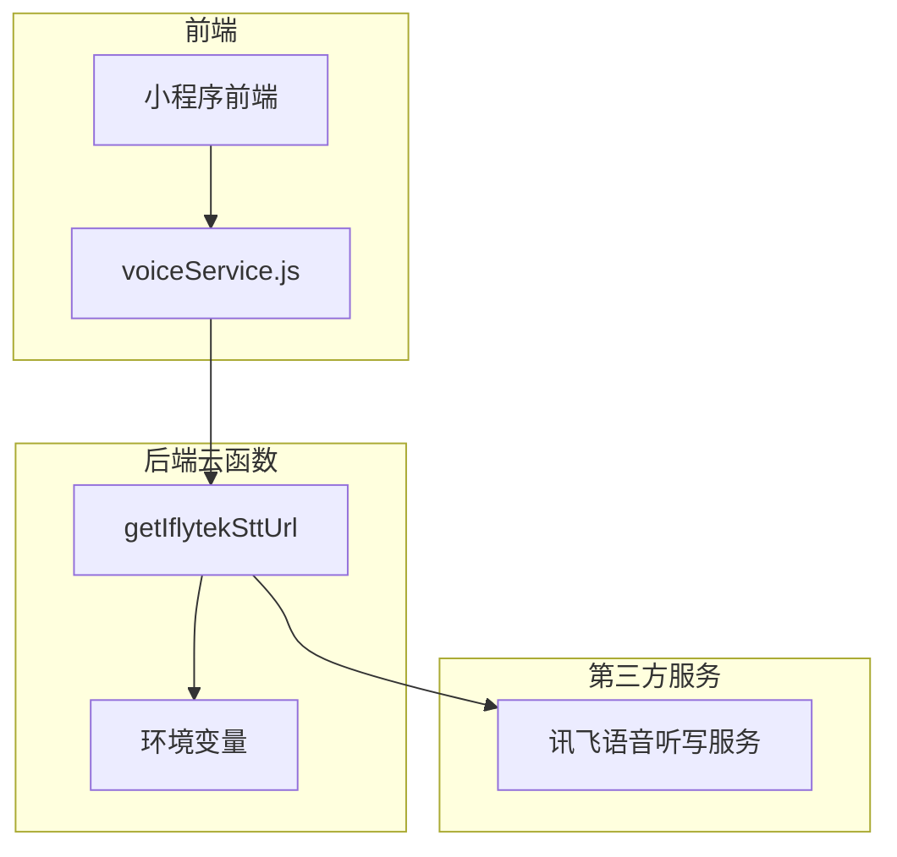
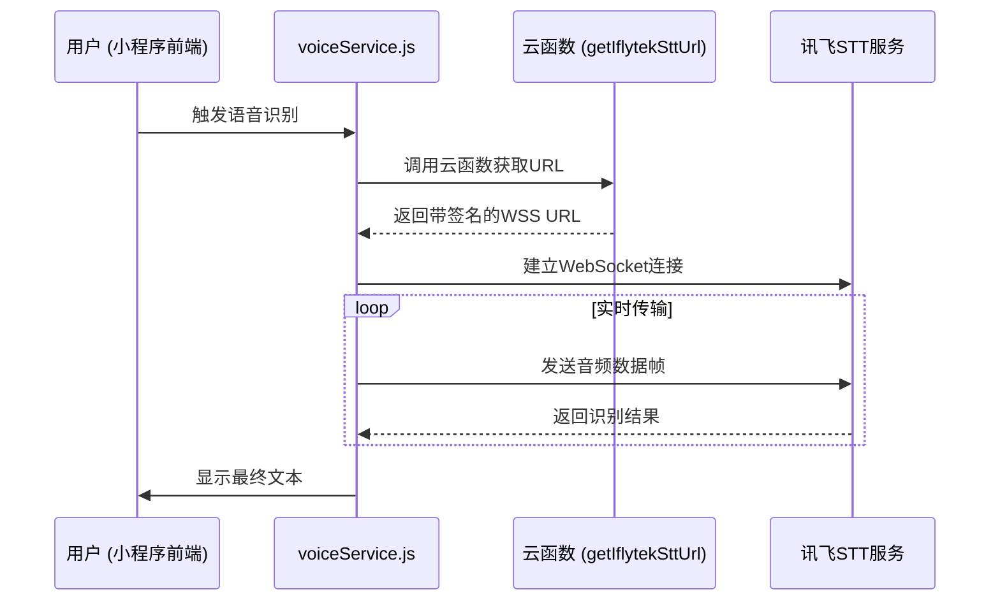
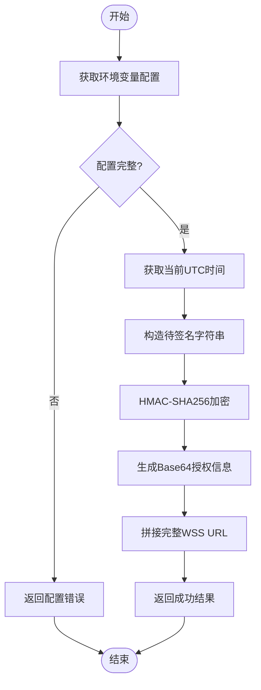
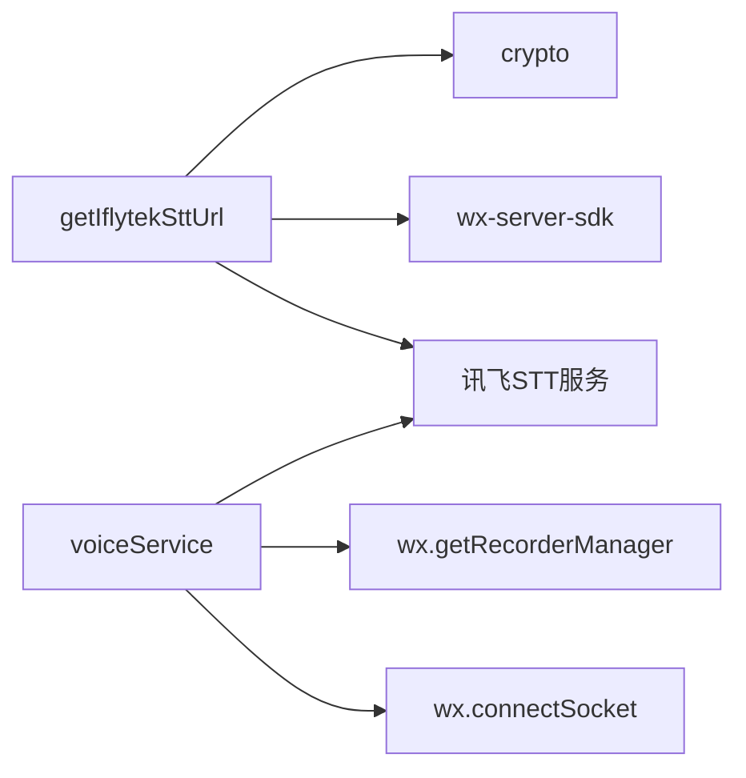

# 讯飞语音听写集成

<cite>
**本文档引用文件**  
- [index.js](file://cloudfunctions/getIflytekSttUrl/index.js)
- [voiceService.js](file://miniprogram/services/voiceService.js)
- [getIflytekSttUrl.md](file://doc/开发文档/cloudfunctions/getIflytekSttUrl.md)
- [HeartChat 语音输入功能 (讯飞语音听写) 开发文档.md](file://doc/开发文档/HeartChat 语音输入功能 (讯飞语音听写) 开发文档.md)
</cite>

## 目录
1. [简介](#简介)
2. [项目结构](#项目结构)
3. [核心组件](#核心组件)
4. [架构概览](#架构概览)
5. [详细组件分析](#详细组件分析)
6. [依赖分析](#依赖分析)
7. [性能考量](#性能考量)
8. [故障排除指南](#故障排除指南)
9. [结论](#结论)

## 简介
本文档详细说明了 `getIflytekSttUrl` 云函数如何为小程序前端生成讯飞语音听写服务的临时 WebSocket URL。该机制通过安全地封装讯飞 API 认证逻辑，实现语音识别功能的集成。文档涵盖密钥管理、URL 签名生成、与前端 `voiceService` 的协作流程、错误处理及安全注意事项。

## 项目结构
`getIflytekSttUrl` 云函数位于 `cloudfunctions/getIflytekSttUrl` 目录下，是整个语音识别功能的核心鉴权模块。其主要职责是为前端提供一个安全、临时的 WebSocket 连接地址，避免将敏感密钥暴露在客户端。

**Diagram sources**
- [index.js](file://cloudfunctions/getIflytekSttUrl/index.js#L1-L70)
- [voiceService.js](file://miniprogram/services/voiceService.js#L1-L486)

**Section sources**
- [index.js](file://cloudfunctions/getIflytekSttUrl/index.js#L1-L70)
- [voiceService.js](file://miniprogram/services/voiceService.js#L1-L486)

## 核心组件
`getIflytekSttUrl` 云函数的核心功能是生成一个带有有效签名的 WebSocket URL。它通过读取环境变量中的 `APPID`、`API_SECRET` 和 `API_KEY`，按照讯飞开放平台的 WebAPI 2.0 协议，构造并返回一个可用于建立安全连接的 WSS 地址。前端 `voiceService` 模块负责调用此云函数，并利用返回的 URL 与讯飞服务器进行实时语音数据传输和识别结果接收。

**Section sources**
- [index.js](file://cloudfunctions/getIflytekSttUrl/index.js#L1-L70)
- [voiceService.js](file://miniprogram/services/voiceService.js#L1-L486)

## 架构概览
整个语音识别流程是一个典型的客户端-服务端-第三方服务的三段式架构。小程序前端发起请求，云函数作为中间层完成鉴权，最终与讯飞的语音识别服务建立 WebSocket 连接。

**Diagram sources**
- [index.js](file://cloudfunctions/getIflytekSttUrl/index.js#L1-L70)
- [voiceService.js](file://miniprogram/services/voiceService.js#L1-L486)

## 详细组件分析

### getIflytekSttUrl 云函数分析
该云函数实现了讯飞 API 的签名认证逻辑，是保障服务安全的关键。

#### 实现机制
云函数通过以下步骤生成有效的 WebSocket URL：
1.  **配置获取**：从环境变量 `IFLYTEK_APPID`、`IFLYTEK_API_SECRET`、`IFLYTEK_API_KEY` 中读取讯飞应用凭证。
2.  **时间生成**：获取当前 UTC 时间并格式化为 RFC1123 格式。
3.  **签名构造**：根据讯飞协议，构造待签名字符串（包含 host、date 和请求行）。
4.  **HMAC-SHA256 加密**：使用 `API_SECRET` 对待签名字符串进行加密，得到 `signature_sha`。
5.  **授权信息生成**：将 `API_KEY`、算法、头部信息和 `signature_sha` 组合成 `authorization_origin` 字符串，并进行 Base64 编码。
6.  **URL 拼接**：将编码后的 `authorization`、`date` 和 `host` 参数拼接到 `wss://iat-api.xfyun.cn/v2/iat` 基础 URL 上，形成最终的连接地址。

**Diagram sources**
- [index.js](file://cloudfunctions/getIflytekSttUrl/index.js#L1-L70)

**Section sources**
- [index.js](file://cloudfunctions/getIflytekSttUrl/index.js#L1-L70)

### 前端 voiceService 模块分析
`voiceService.js` 是前端语音功能的封装，它协调了录音、网络通信和结果处理。

#### 与云函数的协作流程
1.  **初始化**：`startRecognition` 函数被调用。
2.  **获取URL**：调用 `wx.cloud.callFunction('getIflytekSttUrl')` 获取鉴权后的 WSS URL 和 `appid`。
3.  **建立连接**：使用获取的 URL 调用 `wx.connectSocket()` 建立 WebSocket 连接。
4.  **发送首帧**：连接成功后，立即发送包含 `appid` 和业务参数（如语言、领域）的首帧数据。
5.  **流式传输**：通过 `recorderManager.onFrameRecorded` 事件监听录音数据，将 `ArrayBuffer` 转换为 Base64 后，作为音频数据帧（`status=1`）发送给讯飞服务器。
6.  **接收结果**：在 `socketTask.onMessage` 中接收识别结果，解析 JSON 数据并实时更新识别文本。
7.  **结束流程**：用户停止录音后，发送结束帧（`status=2`），接收最终结果后关闭连接。

**Section sources**
- [voiceService.js](file://miniprogram/services/voiceService.js#L1-L486)

## 依赖分析
`getIflytekSttUrl` 云函数依赖于微信云开发的 `wx-server-sdk` 进行初始化，并使用 Node.js 内置的 `crypto` 模块进行 HMAC-SHA256 加密。前端 `voiceService` 依赖微信小程序的 `wx.getRecorderManager()` 和 `wx.connectSocket()` API。整个功能依赖于外部的讯飞语音听写服务。

**Diagram sources**
- [index.js](file://cloudfunctions/getIflytekSttUrl/index.js#L1-L70)
- [package.json](file://cloudfunctions/getIflytekSttUrl/package.json#L1-L8)
- [voiceService.js](file://miniprogram/services/voiceService.js#L1-L486)

**Section sources**
- [package.json](file://cloudfunctions/getIflytekSttUrl/package.json#L1-L8)

## 性能考量
- **延迟优化**：`voiceService` 提前初始化 `recorderManager` 并在连接建立后发送静音帧，以减少首次识别的延迟。
- **流式处理**：采用 WebSocket 实现全双工通信，支持实时流式语音识别，用户体验流畅。
- **资源管理**：及时关闭 WebSocket 连接和录音，避免资源泄露。

## 故障排除指南
云函数和前端模块均实现了完善的错误处理机制。

### 常见错误码及处理
| 错误场景 | 错误码/信息 | 处理建议 |
| :--- | :--- | :--- |
| 云函数配置缺失 | `语音服务配置错误` | 检查云开发控制台环境变量 `IFLYTEK_APPID`, `IFLYTEK_API_SECRET`, `IFLYTEK_API_KEY` 是否已正确设置 |
| WebSocket连接失败 | `WebSocket连接错误` | 检查小程序后台的 `socket合法域名` 是否包含 `wss://iat-api.xfyun.cn` |
| 讯飞服务返回错误 | `code !== 0` | 根据讯飞返回的 `message` 进行排查，如 `invalid appid` 表示 `appid` 无效 |
| 录音权限被拒绝 | `recorderManager.onError` | 引导用户在小程序设置中授权麦克风权限 |

**Section sources**
- [index.js](file://cloudfunctions/getIflytekSttUrl/index.js#L1-L70)
- [voiceService.js](file://miniprogram/services/voiceService.js#L1-L486)

## 结论
`getIflytekSttUrl` 云函数通过将敏感的 API 密钥和复杂的签名逻辑置于服务端，为小程序前端安全地提供了讯飞语音听写服务的接入能力。其与前端 `voiceService` 模块的紧密协作，实现了高效、实时的语音识别功能。该设计遵循了安全最佳实践，确保了密钥安全，并通过清晰的错误处理机制保障了功能的健壮性。