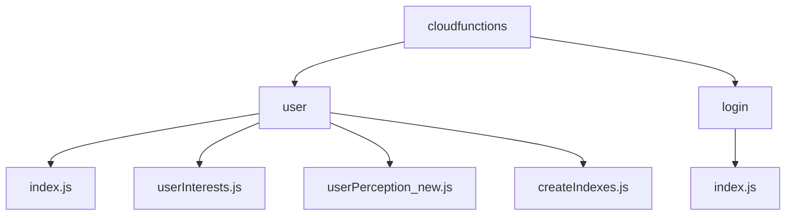
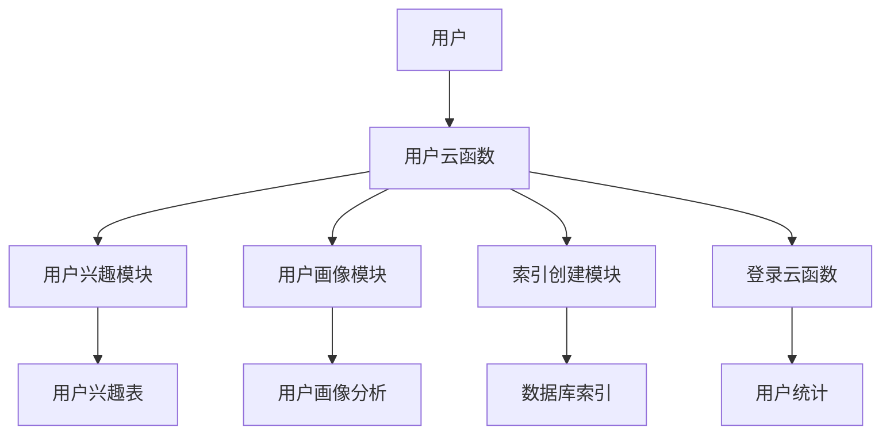
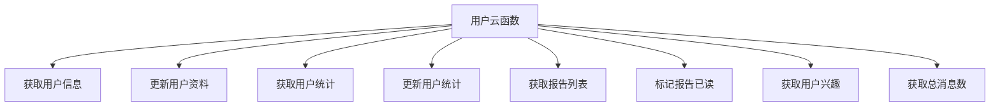
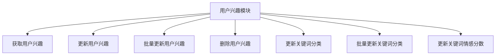
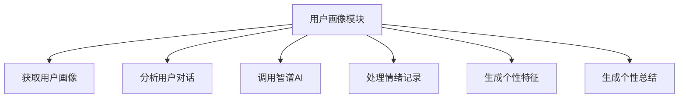
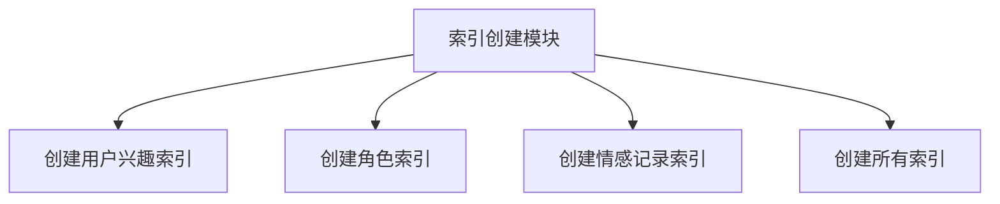
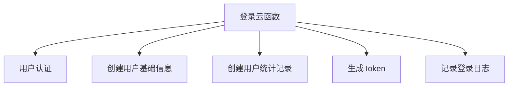
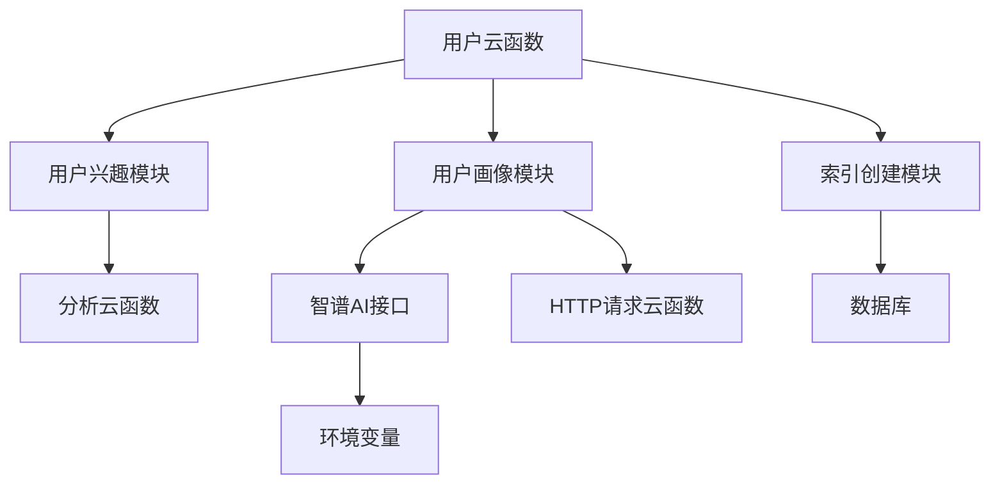

# 用户服务

<cite>
**本文档引用文件**  
- [index.js](file://cloudfunctions/user/index.js)
- [userInterests.js](file://cloudfunctions/user/userInterests.js)
- [userPerception_new.js](file://cloudfunctions/user/userPerception_new.js)
- [createIndexes.js](file://cloudfunctions/user/createIndexes.js)
- [login/index.js](file://cloudfunctions/login/index.js)
- [user_base.md](file://doc/开发文档/database/user_base.md)
- [user_profile.md](file://doc/开发文档/database/user_profile.md)
- [user_config.md](file://doc/开发文档/database/user_config.md)
- [user_stats.md](file://doc/开发文档/database/user_stats.md)
- [userInterests.md](file://doc/开发文档/database/userInterests.md)
</cite>

## 目录
1. [项目结构](#项目结构)
2. [核心组件](#核心组件)
3. [架构概述](#架构概述)
4. [详细组件分析](#详细组件分析)
5. [依赖分析](#依赖分析)
6. [性能考虑](#性能考虑)
7. [故障排除指南](#故障排除指南)

## 项目结构

**图示来源**  
- [index.js](file://cloudfunctions/user/index.js)
- [userInterests.js](file://cloudfunctions/user/userInterests.js)
- [userPerception_new.js](file://cloudfunctions/user/userPerception_new.js)
- [createIndexes.js](file://cloudfunctions/user/createIndexes.js)
- [login/index.js](file://cloudfunctions/login/index.js)

## 核心组件

**组件来源**  
- [index.js](file://cloudfunctions/user/index.js)
- [userInterests.js](file://cloudfunctions/user/userInterests.js)
- [userPerception_new.js](file://cloudfunctions/user/userPerception_new.js)
- [createIndexes.js](file://cloudfunctions/user/createIndexes.js)

## 架构概述

**图示来源**  
- [index.js](file://cloudfunctions/user/index.js)
- [userInterests.js](file://cloudfunctions/user/userInterests.js)
- [userPerception_new.js](file://cloudfunctions/user/userPerception_new.js)
- [createIndexes.js](file://cloudfunctions/user/createIndexes.js)
- [login/index.js](file://cloudfunctions/login/index.js)

## 详细组件分析

### 用户云函数分析

#### 路由设计

**图示来源**  
- [index.js](file://cloudfunctions/user/index.js)

**组件来源**  
- [index.js](file://cloudfunctions/user/index.js)

### 用户兴趣模块分析

#### 兴趣分析与存储

**图示来源**  
- [userInterests.js](file://cloudfunctions/user/userInterests.js)

**组件来源**  
- [userInterests.js](file://cloudfunctions/user/userInterests.js)

### 用户画像模块分析

#### 性格画像算法

**图示来源**  
- [userPerception_new.js](file://cloudfunctions/user/userPerception_new.js)

**组件来源**  
- [userPerception_new.js](file://cloudfunctions/user/userPerception_new.js)

### 索引创建模块分析

#### 数据库索引优化

**图示来源**  
- [createIndexes.js](file://cloudfunctions/user/createIndexes.js)

**组件来源**  
- [createIndexes.js](file://cloudfunctions/user/createIndexes.js)

### 登录云函数分析

#### 协作机制

**图示来源**  
- [login/index.js](file://cloudfunctions/login/index.js)

**组件来源**  
- [login/index.js](file://cloudfunctions/login/index.js)

## 依赖分析

**图示来源**  
- [index.js](file://cloudfunctions/user/index.js)
- [userInterests.js](file://cloudfunctions/user/userInterests.js)
- [userPerception_new.js](file://cloudfunctions/user/userPerception_new.js)
- [createIndexes.js](file://cloudfunctions/user/createIndexes.js)

## 性能考虑

**组件来源**  
- [createIndexes.js](file://cloudfunctions/user/createIndexes.js)
- [userInterests.js](file://cloudfunctions/user/userInterests.js)

## 故障排除指南

**组件来源**  
- [index.js](file://cloudfunctions/user/index.js)
- [userInterests.js](file://cloudfunctions/user/userInterests.js)
- [userPerception_new.js](file://cloudfunctions/user/userPerception_new.js)
- [login/index.js](file://cloudfunctions/login/index.js)